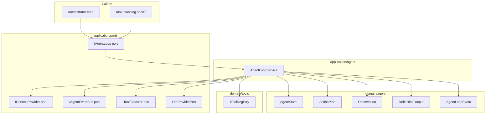
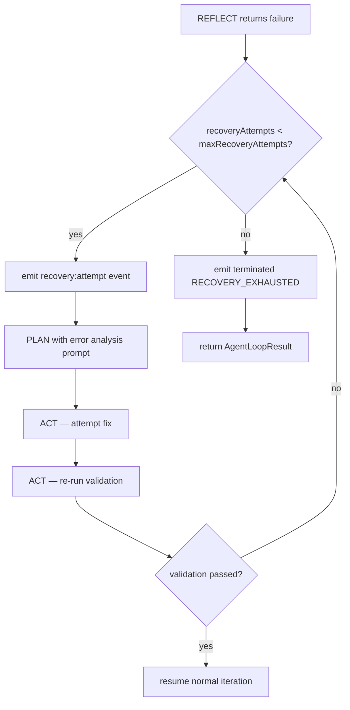
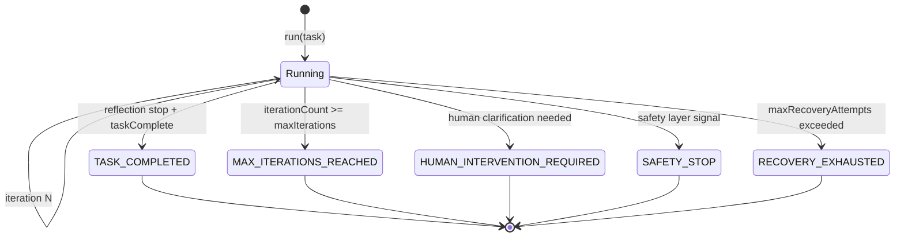
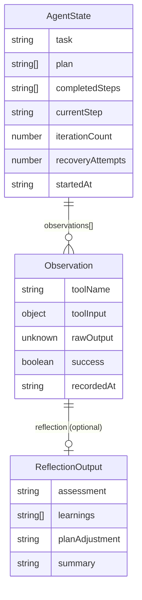

# Design Document — agent-loop

## Overview

The Agent Loop is the cognitive execution core of the AI Dev Agent. It implements a five-step iterative cycle — PLAN → ACT → OBSERVE → REFLECT → UPDATE STATE — that transforms a task description into completed, validated work by coordinating LLM reasoning with deterministic tool invocations through the existing tool system.

This component operates at the application orchestration layer, consuming the established `LlmProviderPort` (spec1) and `IToolExecutor` / `IToolRegistry` (spec2) ports via dependency injection. It introduces no new external library dependencies. The agent loop is a prerequisite for spec7 (task-planning) and spec9 (implementation-loop), which build higher-level planning and review orchestration on top of it.

### Goals

- Implement the five-step PLAN→ACT→OBSERVE→REFLECT→UPDATE loop with configurable iteration and recovery limits.
- Produce structured per-iteration logs and termination events observable by external callers.
- Expose a clean `IAgentLoop` port usable by orchestrator-core and task-planning without coupling to implementation details.
- Maintain full integration with spec2 tool system and spec1 LLM abstraction, with optional spec6 context engine delegation.

### Non-Goals

- Context assembly beyond a minimal fallback (delegated to spec6 `IContextProvider` when available).
- Task decomposition or multi-step planning (spec7 task-planning responsibility).
- Implement→Review→Improve→Commit cycle (spec9 implementation-loop responsibility).
- Persistent storage of `AgentState` across restarts (consumed by spec7/spec5; serialization contract is defined here, not storage).
- Self-healing rule updates (spec10 self-healing-loop responsibility).

---

## Requirements Traceability

| Requirement | Summary | Components | Interfaces | Flows |
|-------------|---------|------------|------------|-------|
| 1.1–1.5 | AgentState structure and lifecycle | `AgentState`, `Observation` types | `IAgentLoop.run()` | Initialization flow |
| 2.1–2.5 | PLAN step — LLM-driven action planning | `AgentLoopService.#planStep()` | `LlmProviderPort.complete()` | Main loop |
| 3.1–3.5 | ACT step — tool execution via ToolExecutor | `AgentLoopService.#actStep()` | `IToolExecutor.invoke()` | Main loop |
| 4.1–4.4 | OBSERVE step — structured observation recording | `AgentLoopService.#observeStep()` | `Observation` type | Main loop |
| 5.1–5.5 | REFLECT step — evaluation and plan adaptation | `AgentLoopService.#reflectStep()` | `LlmProviderPort.complete()` | Main loop |
| 6.1–6.4 | UPDATE STATE step — progress tracking | `AgentLoopService.#updateStateStep()` | `AgentState` type | Main loop |
| 7.1–7.6 | Iteration control and stopping conditions | `AgentLoopService` | `IAgentLoop.stop()`, `AgentLoopEvent` | Termination flow |
| 8.1–8.5 | Error recovery sub-loop | `AgentLoopService.#errorRecovery()` | `AgentLoopEvent` | Error recovery flow |
| 9.1–9.5 | Observability and structured logging | `AgentLoopService`, `IAgentEventBus` | `AgentLoopEvent`, `AgentLoopLogger` | All flows |
| 10.1–10.5 | Integration with tool system | `AgentLoopService` constructor injection | `IToolExecutor`, `IToolRegistry` | Main loop |
| 11.1–11.6 | Integration with orchestrator core | `IAgentLoop` port | `AgentLoopOptions`, `AgentLoopResult`, `LlmProviderPort` | All flows |

---

## Architecture

### Architecture Pattern & Boundary Map

The agent-loop follows the same **Clean Architecture / Hexagonal** layering established by spec1 and spec2:

- **Domain layer** (`domain/agent/`): all domain types — `AgentState`, `ActionPlan`, `Observation`, `ReflectionOutput`, `AgentLoopEvent`, `TerminationCondition`.
- **Application layer** (`application/ports/agent-loop.ts`): port interfaces — `IAgentLoop`, `IContextProvider`, `IAgentEventBus`, `AgentLoopOptions`, `AgentLoopResult`.
- **Application layer** (`application/agent/agent-loop-service.ts`): orchestration service — `AgentLoopService implements IAgentLoop`. All five loop steps are private methods within this class, consistent with the `ToolExecutor` precedent.
- **Infra layer** (`infra/agent/agent-event-bus.ts`): concrete event bus implementation (out of scope for this spec; placeholder interface defined here).



### Technology Stack

| Layer | Choice / Version | Role in Feature | Notes |
|-------|------------------|-----------------|-------|
| Runtime | Bun v1.3.10+ | Executes TypeScript directly | No change from existing stack |
| Language | TypeScript strict mode | All types, interfaces, services | `noUncheckedIndexedAccess`, `exactOptionalPropertyTypes` |
| LLM abstraction | `LlmProviderPort` (spec1) | PLAN and REFLECT step LLM calls | No direct Anthropic SDK imports |
| Tool execution | `IToolExecutor` (spec2) | ACT step tool invocations | Enforces permissions, validation, timeouts |
| Tool discovery | `IToolRegistry` (spec2) | Schema retrieval for PLAN context | `list()` method returns `ToolListEntry[]` |
| Event bus | `IAgentEventBus` (new, spec4) | Per-iteration and termination event emission | Same `emit/on/off` shape as `IWorkflowEventBus` |
| Testing | Bun test runner | Unit and integration tests | Mock injection pattern from existing tests |

---

## System Flows

### Main Loop — PLAN→ACT→OBSERVE→REFLECT→UPDATE

```mermaid
sequenceDiagram
    participant Caller as Caller (orchestrator-core)
    participant Loop as AgentLoopService
    participant LLM as LlmProviderPort
    participant Executor as IToolExecutor
    participant Bus as IAgentEventBus

    Caller->>Loop: run(task, options)
    Loop->>Loop: initState(task)
    loop Each Iteration
        Loop->>Loop: check stopRequested / maxIterations
        Loop->>Bus: emit iteration:start
        Loop->>LLM: complete(planPrompt) [PLAN]
        LLM-->>Loop: LlmResult
        Loop->>Loop: parseActionPlan(response)
        Loop->>Bus: emit step:complete PLAN
        Loop->>Executor: invoke(toolName, input, ctx) [ACT]
        Executor-->>Loop: ToolResult
        Loop->>Bus: emit step:complete ACT
        Loop->>Loop: createObservation(toolResult) [OBSERVE]
        Loop->>LLM: complete(reflectPrompt) [REFLECT]
        LLM-->>Loop: LlmResult
        Loop->>Loop: parseReflection(response)
        Loop->>Loop: updateState(observation, reflection) [UPDATE]
        Loop->>Bus: emit iteration:complete
        alt taskComplete
            Loop->>Bus: emit terminated TASK_COMPLETED
            Loop-->>Caller: AgentLoopResult
        else failure and error recovery
            Loop->>Loop: errorRecovery(observation)
        end
    end
```

Flow-level decisions: the stop-requested flag and `maxIterations` check occur at the start of every iteration (PLAN step boundary), not mid-step. The `errorRecovery` sub-loop is entered only when the REFLECT step returns `assessment: "failure"`. See error recovery flow below.

### Error Recovery Sub-Loop



On exhaustion, the terminal condition is `RECOVERY_EXHAUSTED`, which maps to `HUMAN_INTERVENTION_REQUIRED` in the `AgentLoopResult` (requirement 8.4). The `recoveryAttempts` counter is reset on each new distinct error; repeated-failure detection (requirement 8.5) checks whether the same `ToolError.message` pattern has reached `maxRecoveryAttempts` cumulatively across the task execution.

### Termination Conditions



---

## Components and Interfaces

### Summary Table

| Component | Layer | Intent | Req Coverage | Key Dependencies | Contracts |
|-----------|-------|--------|--------------|-----------------|-----------|
| `AgentState` | domain/agent | Immutable per-iteration loop state | 1.1–1.5, 6.1–6.4 | — | State |
| `ActionPlan` | domain/agent | Parsed LLM output for ACT step | 2.1–2.5 | — | State |
| `Observation` | domain/agent | Structured tool result record | 4.1–4.4 | `ToolError` | State |
| `ReflectionOutput` | domain/agent | Parsed LLM reflection response | 5.1–5.5 | — | State |
| `AgentLoopEvent` | domain/agent | Discriminated union of all loop events | 9.1–9.5 | `TerminationCondition` | Event |
| `IAgentLoop` | application/ports | Public port for run/stop/getState | 11.1–11.6 | `AgentLoopOptions`, `AgentLoopResult` | Service |
| `IContextProvider` | application/ports | Optional context assembly delegation | 11.5, 2.1 | `AgentState`, `ToolListEntry` | Service |
| `IAgentEventBus` | application/ports | Event emission and subscription | 9.1–9.5 | `AgentLoopEvent` | Event |
| `AgentLoopService` | application/agent | Main loop orchestration | All | `IToolExecutor`, `IToolRegistry`, `LlmProviderPort` | Service |

---

### Domain Layer — `domain/agent/`

#### AgentState, ActionPlan, Observation, ReflectionOutput, AgentLoopEvent

| Field | Detail |
|-------|--------|
| Intent | Immutable domain value types for all agent-loop data structures |
| Requirements | 1.1–1.5, 2.1–2.5, 4.1–4.4, 5.1–5.5, 6.1–6.4, 7.1–7.6, 9.1–9.5 |

**Responsibilities & Constraints**
- Plain, serializable records with no class instances, functions, or Symbols.
- All fields are `readonly`; arrays are `ReadonlyArray`.
- `Observation.rawOutput` is `unknown` — callers that persist state are responsible for serialization.
- `AgentState.recoveryAttempts` tracks the running count for the current error recovery cycle; reset when a distinct new error begins.

**Contracts**: State [x]

##### State Management

```typescript
// domain/agent/types.ts

export type ActionCategory =
  | 'Exploration'
  | 'Modification'
  | 'Validation'
  | 'Documentation';

export type TerminationCondition =
  | 'TASK_COMPLETED'
  | 'MAX_ITERATIONS_REACHED'
  | 'HUMAN_INTERVENTION_REQUIRED'
  | 'SAFETY_STOP'
  | 'RECOVERY_EXHAUSTED';

export type ReflectionAssessment = 'expected' | 'unexpected' | 'failure';
export type PlanAdjustment = 'continue' | 'revise' | 'stop';
export type LoopStep = 'PLAN' | 'ACT' | 'OBSERVE' | 'REFLECT' | 'UPDATE_STATE';

export interface ActionPlan {
  readonly category: ActionCategory;
  readonly toolName: string;
  readonly toolInput: Readonly<Record<string, unknown>>;
  readonly rationale: string;
}

export interface ReflectionOutput {
  readonly assessment: ReflectionAssessment;
  readonly learnings: ReadonlyArray<string>;
  readonly planAdjustment: PlanAdjustment;
  readonly revisedPlan?: ReadonlyArray<string>;
  readonly requiresHumanIntervention?: boolean;
  readonly taskComplete?: boolean;
  readonly summary: string;
}

export interface Observation {
  readonly toolName: string;
  readonly toolInput: Readonly<Record<string, unknown>>;
  readonly rawOutput: unknown;
  readonly error?: ToolError;             // imported from domain/tools/types.ts
  readonly success: boolean;
  readonly recordedAt: string;            // ISO 8601
  readonly reflection?: ReflectionOutput; // populated during REFLECT step
}

export interface AgentState {
  readonly task: string;
  readonly plan: ReadonlyArray<string>;
  readonly completedSteps: ReadonlyArray<string>;
  readonly currentStep: string | null;
  readonly iterationCount: number;
  readonly observations: ReadonlyArray<Observation>;
  readonly recoveryAttempts: number;
  readonly startedAt: string; // ISO 8601
}

export type AgentLoopEvent =
  | { readonly type: 'iteration:start';    readonly iteration: number; readonly currentStep: string | null; readonly timestamp: string }
  | { readonly type: 'iteration:complete'; readonly iteration: number; readonly category: ActionCategory; readonly toolName: string; readonly durationMs: number; readonly assessment: ReflectionAssessment }
  | { readonly type: 'step:start';         readonly step: LoopStep; readonly iteration: number; readonly timestamp: string }
  | { readonly type: 'step:complete';      readonly step: LoopStep; readonly iteration: number; readonly durationMs: number }
  | { readonly type: 'recovery:attempt';   readonly attempt: number; readonly maxAttempts: number; readonly errorMessage: string }
  | { readonly type: 'terminated';         readonly condition: TerminationCondition; readonly finalState: AgentState; readonly timestamp: string };
```

- **State model**: Immutable value records; each step returns a new `AgentState` rather than mutating.
- **Persistence & consistency**: `AgentState` is serializable to JSON by consumers (spec5, spec7). The agent-loop service does not persist state directly.
- **Concurrency strategy**: Single-task, single-iteration sequential execution; no concurrent loop iterations.

---

### Application Ports — `application/ports/agent-loop.ts`

#### IAgentLoop, AgentLoopOptions, AgentLoopResult, IContextProvider, IAgentEventBus

| Field | Detail |
|-------|--------|
| Intent | Public contract for callers and optional integration ports |
| Requirements | 7.1–7.6, 9.1–9.5, 10.1–10.5, 11.1–11.6 |

**Responsibilities & Constraints**
- `IAgentLoop` is the sole public API surface — callers never depend on `AgentLoopService` directly.
- `IContextProvider` is optional; when absent the service falls back to inline minimal context building.
- `IAgentEventBus` is optional; when absent events are silently dropped (log-only via `AgentLoopLogger`).
- `AgentLoopOptions` uses `Partial<>` at the `run()` call site; defaults are applied inside the service.

**Dependencies**
- Inbound: orchestrator-core, task-planning — consumers of `IAgentLoop` (P0)
- Outbound: `LlmProviderPort` (application/ports/llm.ts) — injected, P0
- Outbound: `IToolExecutor` (application/tools/executor.ts) — injected, P0
- Outbound: `IToolRegistry` (domain/tools/registry.ts) — injected, P0
- Outbound: `IContextProvider` — optional spec6 integration, P2
- Outbound: `IAgentEventBus` — optional observability, P2

**Contracts**: Service [x] / Event [x]

##### Service Interface

```typescript
// application/ports/agent-loop.ts
import type { AgentState, AgentLoopEvent, TerminationCondition } from '../../domain/agent/types';
import type { ToolListEntry } from '../../domain/tools/registry';

export interface AgentLoopOptions {
  readonly maxIterations: number;           // default: 50
  readonly maxRecoveryAttempts: number;     // default: 3
  readonly maxPlanParseRetries: number;     // default: 2
  readonly contextProvider?: IContextProvider;
  readonly eventBus?: IAgentEventBus;
  readonly logger?: AgentLoopLogger;
  readonly onSafetyStop?: () => void;       // callback registered by safety layer
}

export interface AgentLoopResult {
  readonly terminationCondition: TerminationCondition;
  readonly finalState: AgentState;
  readonly totalIterations: number;
  readonly taskCompleted: boolean;
}

export interface IAgentLoop {
  /** Execute the agent loop for the given task. Never throws — errors surface in AgentLoopResult. */
  run(task: string, options?: Partial<AgentLoopOptions>): Promise<AgentLoopResult>;
  /** Signal graceful stop; the loop halts at the next PLAN step boundary. */
  stop(): void;
  /** Returns current AgentState snapshot, or null if not running. */
  getState(): Readonly<AgentState> | null;
}

export interface IContextProvider {
  /** Assembles the LLM prompt context for the PLAN step. */
  buildContext(state: AgentState, toolSchemas: ReadonlyArray<ToolListEntry>): Promise<string>;
}

export interface IAgentEventBus {
  emit(event: AgentLoopEvent): void;
  on(handler: (event: AgentLoopEvent) => void): void;
  off(handler: (event: AgentLoopEvent) => void): void;
}

export interface AgentLoopLogger {
  info(message: string, data?: Readonly<Record<string, unknown>>): void;
  error(message: string, data?: Readonly<Record<string, unknown>>): void;
}
```

- Preconditions: `task` must be a non-empty string.
- Postconditions: `run()` always returns an `AgentLoopResult` with a valid `TerminationCondition`.
- Invariants: `getState()` returns a snapshot that is never mutated after return.

---

### Application Layer — `application/agent/`

#### AgentLoopService

| Field | Detail |
|-------|--------|
| Intent | Orchestrates the PLAN→ACT→OBSERVE→REFLECT→UPDATE loop and error recovery sub-loop |
| Requirements | 1.1–1.5, 2.1–2.5, 3.1–3.5, 4.1–4.4, 5.1–5.5, 6.1–6.4, 7.1–7.6, 8.1–8.5, 9.1–9.5, 10.1–10.5, 11.1–11.6 |

**Responsibilities & Constraints**
- Implements `IAgentLoop`; all loop steps are private async methods.
- Constructor-injected dependencies: `IToolExecutor`, `IToolRegistry`, `LlmProviderPort`, `ToolContext`, `AgentLoopOptions`.
- No direct imports of tool implementations or the Anthropic SDK.
- Schema validation on each tool invocation is handled by `IToolExecutor` (requirement 10.5).
- All LLM calls go through the injected `LlmProviderPort` (requirement 11.6).
- The stop flag (`#stopRequested`) is checked before every PLAN step entry.

**Dependencies**
- Inbound: `IAgentLoop` callers — orchestrator-core, task-planning (P0)
- Outbound: `IToolExecutor` — ACT step tool invocations (P0)
- Outbound: `IToolRegistry.list()` — tool schema retrieval for PLAN context (P0)
- Outbound: `LlmProviderPort.complete()` — PLAN and REFLECT step LLM calls (P0)
- Outbound: `IContextProvider.buildContext()` — optional spec6 context assembly (P2)
- Outbound: `IAgentEventBus.emit()` — optional event emission (P2)

**Contracts**: Service [x]

##### Service Interface

```typescript
// application/agent/agent-loop-service.ts
import type { IAgentLoop, AgentLoopOptions, AgentLoopResult, IContextProvider, IAgentEventBus, AgentLoopLogger } from '../ports/agent-loop';
import type { IToolExecutor, ToolExecutorConfig } from '../tools/executor';
import type { IToolRegistry } from '../../domain/tools/registry';
import type { LlmProviderPort } from '../ports/llm';
import type { ToolContext } from '../../domain/tools/types';
import type { AgentState, ActionPlan, Observation, ReflectionOutput, TerminationCondition } from '../../domain/agent/types';

export class AgentLoopService implements IAgentLoop {
  constructor(
    executor: IToolExecutor,
    registry: IToolRegistry,
    llm: LlmProviderPort,
    toolContext: ToolContext,
  );

  run(task: string, options?: Partial<AgentLoopOptions>): Promise<AgentLoopResult>;
  stop(): void;
  getState(): Readonly<AgentState> | null;

  // All private — not part of the contract:
  // #planStep(state, opts): Promise<ActionPlan>
  // #actStep(plan, state): Promise<Observation>
  // #observeStep(toolResult, plan): Observation
  // #reflectStep(observation, plan, state, opts): Promise<ReflectionOutput>
  // #updateStateStep(state, observation, reflection): AgentState
  // #errorRecovery(state, observation, opts): Promise<AgentState | TerminationCondition>
  // #buildFallbackContext(state, schemas): string
}
```

**Implementation Notes**
- Integration: `AgentLoopService` is instantiated with pre-constructed `IToolExecutor`, `IToolRegistry`, `LlmProviderPort`, and `ToolContext` instances. All per-run configuration is passed through `run(task, options)`; a private `DEFAULT_OPTIONS` constant inside the service fills any omitted fields.
- Validation: The stop flag is the only mutable state; `AgentState` is replaced (not mutated) on each step return.
- Risks: LLM parse failures require fallback prompting; document retry prompt templates in implementation notes during task phase.

---

## Data Models

### Domain Model

The agent-loop operates on three aggregates per task execution:

- **`AgentState`** — root aggregate for a single loop execution. Owns `plan`, `completedSteps`, `currentStep`, `iterationCount`, `observations`, `recoveryAttempts`.
- **`Observation`** — value object embedded in `AgentState.observations`; captures a single tool invocation result and its associated reflection.
- **`ActionPlan`** — transient value object produced by the PLAN step; consumed by ACT; not stored directly (its data is captured in the resulting `Observation`).
- **`ReflectionOutput`** — transient value object produced by REFLECT; embedded into the latest `Observation` and used to compute the next `AgentState`.



### Logical Data Model

- `AgentState.observations` is an append-only array; older entries are never removed during execution.
- For PLAN context construction, the service uses a sliding window of the most recent N observations (N bounded by token budget via `IContextProvider` or fallback inline budget of ~10 entries).
- `Observation.rawOutput` is `unknown` in memory. Consumers (spec5, spec7) that persist `AgentState` must serialize it; common implementations will `JSON.stringify` with fallback to `String(rawOutput)`.

---

## Error Handling

### Error Strategy

The agent loop applies the same never-throw philosophy as `ToolExecutor`: all step methods return typed results; `run()` always returns `AgentLoopResult`. Errors surface as `TerminationCondition` values rather than thrown exceptions.

### Error Categories and Responses

| Category | Source | Response |
|----------|--------|----------|
| LLM parse failure (PLAN) | Unparseable `ActionPlan` from LLM | Retry up to `maxPlanParseRetries`; then `HUMAN_INTERVENTION_REQUIRED` |
| LLM parse failure (REFLECT) | Unparseable `ReflectionOutput` | Treat as `assessment: "failure"`; enter error recovery sub-loop |
| Tool `validation` error | Schema mismatch | Enter error recovery; agent re-plans with corrected input |
| Tool `runtime` error | Execution failure, timeout | Enter error recovery; agent analyzes error and attempts fix |
| Tool `permission` error | Permission denied | Log and emit `HUMAN_INTERVENTION_REQUIRED` immediately (no recovery) |
| Recovery exhausted | `maxRecoveryAttempts` reached | Emit `RECOVERY_EXHAUSTED`; return result |
| Safety stop | `onSafetyStop` callback invoked | Emit `SAFETY_STOP`; halt immediately after current sub-step |
| Max iterations | `iterationCount >= maxIterations` | Emit `MAX_ITERATIONS_REACHED`; return result |

### Monitoring

- All termination conditions emit a `terminated` `AgentLoopEvent` with `finalState` for downstream consumers.
- Per-iteration `iteration:complete` events carry `durationMs` and `assessment` for performance analysis.
- `AgentLoopLogger` (optional) receives `info` / `error` entries at each step boundary; callers inject their preferred logger implementation.

---

## Testing Strategy

### Unit Tests — `tests/application/agent/agent-loop-service.test.ts`

- PLAN step: LLM mock returns valid JSON → `ActionPlan` is correctly parsed.
- PLAN step retry: LLM mock returns invalid JSON twice then valid JSON → success on third attempt.
- ACT step: `IToolExecutor` mock returns `ok: true` → `Observation.success = true`.
- ACT step failure: mock returns `ok: false, error: { type: "runtime" }` → error recovery entered.
- REFLECT step: LLM mock returns `assessment: "stop", taskComplete: true` → `TASK_COMPLETED` termination.
- UPDATE STATE: step promotion, plan revision, iteration counter increment.
- Stop signal: `stop()` called during async ACT step → loop halts at next PLAN boundary.
- Max iterations: loop terminates with `MAX_ITERATIONS_REACHED` after N iterations.

### Unit Tests — `tests/domain/agent/types.test.ts`

- `AgentState` initialization with empty fields.
- `AgentLoopEvent` discriminated union type narrowing.
- `TerminationCondition` exhaustive switch coverage.

### Integration Tests — `tests/integration/agent-loop.integration.test.ts`

- Full PLAN→ACT→OBSERVE→REFLECT→UPDATE cycle with real `ToolRegistry` and mock `LlmProviderPort`.
- Error recovery: tool returns error on first attempt, succeeds on second → loop continues normally.
- Event bus: all expected `AgentLoopEvent` types are emitted in the correct order across a 3-iteration run.
- `getState()` returns correct snapshot between steps during async execution.
- Serialization round-trip: `AgentState` can be `JSON.stringify` / `JSON.parse` without data loss (for `unknown` rawOutput represented as string).

### Performance Tests

- 50-iteration loop with mock tools and LLM completes within 5 seconds (dominated by async overhead, not logic).
- `getState()` call during active execution does not measurably increase iteration latency.

---

## Security Considerations

- The agent loop itself performs no filesystem, network, or shell operations. All side-effects are mediated by `IToolExecutor`, which enforces the permission system (spec2/spec3).
- `toolInput` values in `ActionPlan` are logged only after passing through `IToolExecutor`'s input sanitizer (same `logMaxInputBytes` truncation applied by `ToolExecutor`).
- `Observation.rawOutput` must not be logged in full; consumers are responsible for truncation before emission.
