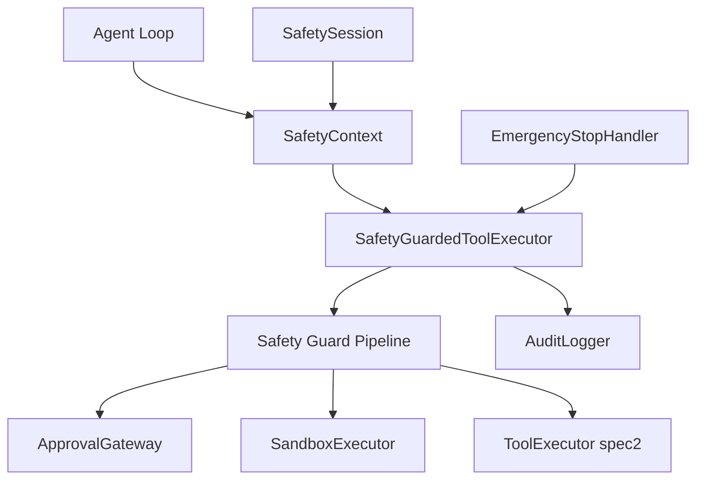
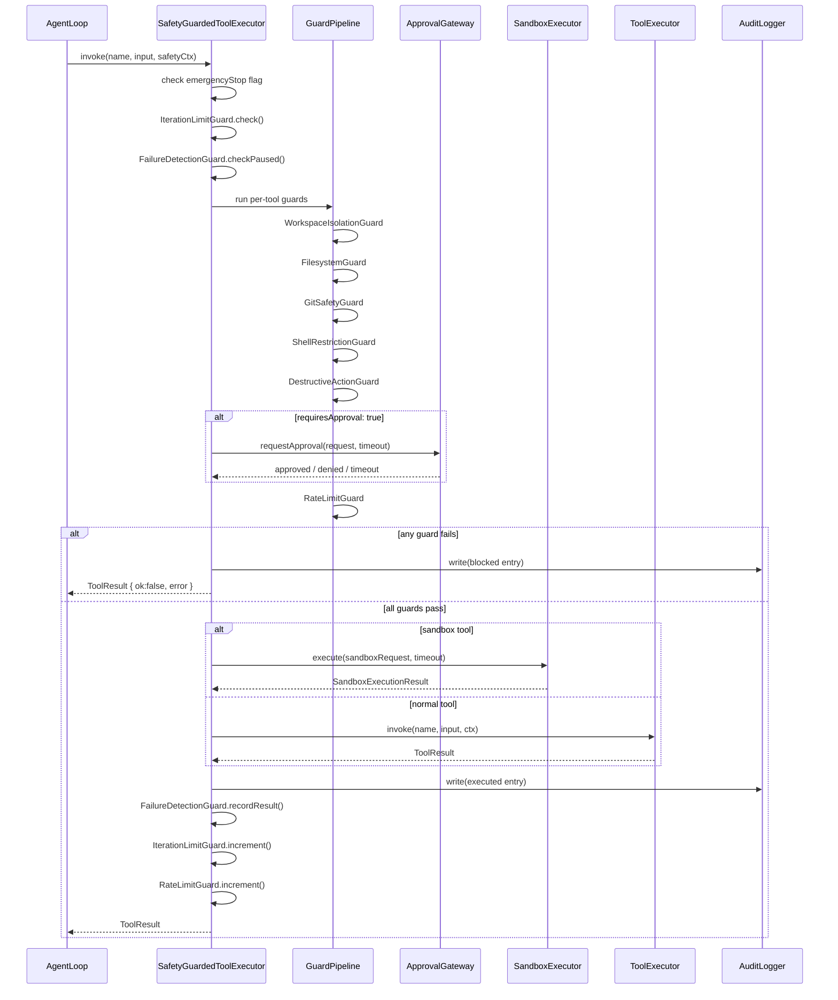
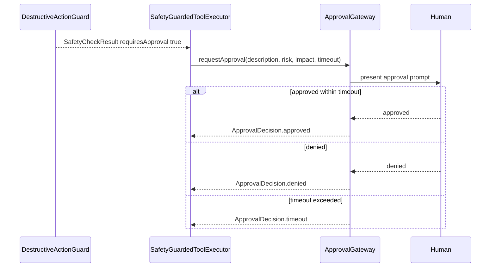
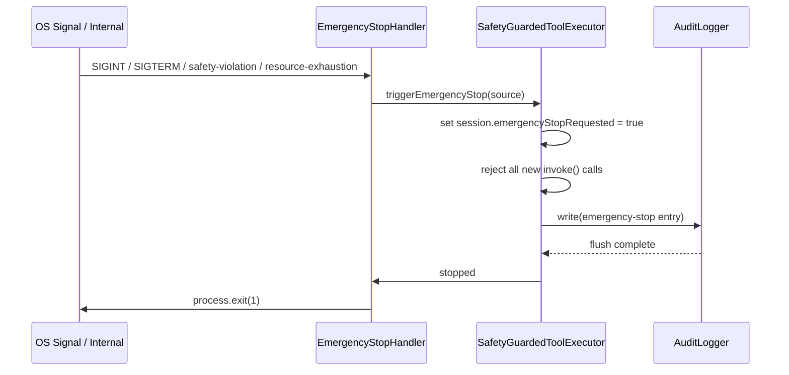
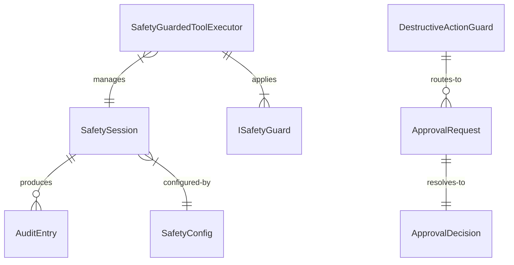

# Design Document — agent-safety

## Overview

The Agent Safety System is an operational safety layer that wraps the existing tool execution pipeline to prevent the AI Dev Agent from causing unintended or destructive changes to the development environment. It introduces a `SafetyGuardedToolExecutor` that intercepts every tool invocation, applies an ordered sequence of safety guards, routes high-risk operations to a human approval workflow, and writes every outcome to an immutable audit log.

The system integrates with the existing `ToolExecutor` (spec2) via the Decorator pattern: `SafetyGuardedToolExecutor` implements the same `IToolExecutor` interface and delegates to the wrapped executor only after all guards pass. `SafetySession` and `SafetyConfig` are injected at construction time, so `invoke()` accepts the standard `ToolContext` — callers require no changes to their call sites.

Session-level state (iteration counter, failure signatures, rate counters, emergency stop flag) is managed in a `SafetySession` object created per agent run and injected through an extended `SafetyContext`. All tool adapters in spec2 remain unchanged.

### Goals

- Enforce workspace isolation, protected file patterns, protected branch policies, shell command restrictions, and destructive action approval for every tool invocation.
- Prevent runaway execution via configurable iteration/runtime limits and repeated-failure detection.
- Provide an immutable, session-traceable audit log for every tool invocation (executed or blocked).
- Support synchronous emergency stop via SIGINT/SIGTERM and programmatic triggers.

### Non-Goals

- Modifying any existing tool adapter from spec2.
- Implementing the sandboxed execution engine beyond the `ISandboxExecutor` port and a temp-directory default adapter.
- Providing a UI or dashboard for audit log review (log is written as NDJSON; tooling deferred).
- Machine-learned risk scoring or dynamic permission adjustment (deferred to future specs).

---

## Architecture

### Existing Architecture Analysis

`ToolExecutor` (spec2) runs a 6-step pipeline: registry lookup → capability permission check → input schema validation → execute with timeout → output schema validation → structured log. It never throws; all paths return `ToolResult<T>`. The existing `Logger` interface records `ToolInvocationLog` entries but is in-memory and not append-only.

`filesystem.ts` already calls `resolveWorkspacePath()` per tool, but git and shell tools have no workspace boundary enforcement. Agent-safety centralizes workspace checks at the executor level, eliminating the coverage gap and treating `resolveWorkspacePath()` in `filesystem.ts` as defense-in-depth only.

### Architecture Pattern & Boundary Map



**Architecture Integration**:
- Selected pattern: **Decorator** — `SafetyGuardedToolExecutor` wraps `IToolExecutor` with zero changes to the existing executor or tool adapters.
- `SafetyContext extends ToolContext` carries a `SafetySession` and `SafetyConfig` alongside the existing fields.
- Safety logic is confined to the `domain/safety/` and `application/safety/` directories; adapters live in `adapters/safety/`.
- Steering compliance: Clean/Hexagonal architecture is preserved — ports (`IAuditLogger`, `IApprovalGateway`, `ISandboxExecutor`, `IEmergencyStopHandler`) are defined in the application layer; adapters implement them.

### Technology Stack

| Layer | Choice / Version | Role in Feature | Notes |
|-------|------------------|-----------------|-------|
| Language | TypeScript (strict) | All safety logic | No `any`; discriminated unions for results |
| Runtime | Bun v1.3.10+ | Process execution, subprocess, file I/O | Existing project runtime |
| Audit log storage | NDJSON append-only file | Immutable audit trail | Default path: `.aes/audit.ndjson` |
| Schema validation | `ajv` (already present) | Input structure checks in guards | Reuse existing dep; no new addition |
| Signal handling | Node.js `process.on('SIGINT'/'SIGTERM')` | Emergency stop | Built-in; no additional library |

---

## System Flows

### Safety Guard Pipeline (per tool invocation)



### Human Approval Flow



### Emergency Stop Flow



---

## Requirements Traceability

| Requirement | Summary | Components | Interfaces | Flows |
|---|---|---|---|---|
| 1.1–1.5 | Workspace boundary enforcement on all filesystem tools | WorkspaceIsolationGuard | `ISafetyGuard` | Guard Pipeline |
| 2.1–2.5 | Protected file pattern matching before any write | FilesystemGuard | `ISafetyGuard` | Guard Pipeline |
| 3.1–3.5 | Protected branch + naming convention enforcement | GitSafetyGuard | `ISafetyGuard` | Guard Pipeline |
| 4.1–4.5 | Shell command blocklist/allowlist validation | ShellRestrictionGuard | `ISafetyGuard` | Guard Pipeline |
| 5.1–5.5 | Sandboxed execution for test/install tools | SandboxExecutor | `ISandboxExecutor` | Guard Pipeline |
| 6.1–6.5 | Per-session iteration count and runtime limit | IterationLimitGuard, SafetySession | `ISafetyGuard` | Guard Pipeline |
| 7.1–7.5 | Consecutive failure detection, pause, resume | FailureDetectionGuard, SafetySession | `ISafetyGuard` | Guard Pipeline |
| 8.1–8.5 | Destructive action classification and approval routing | DestructiveActionGuard | `ISafetyGuard`, `IApprovalGateway` | Guard Pipeline, Approval Flow |
| 9.1–9.5 | Per-category rate limiting with rolling counters | RateLimitGuard, SafetySession | `ISafetyGuard` | Guard Pipeline |
| 10.1–10.5 | Immutable append-only audit log with session/iteration IDs | AuditLogger | `IAuditLogger` | Guard Pipeline |
| 11.1–11.5 | Human approval gate with approved/denied/timeout outcomes | ApprovalGateway | `IApprovalGateway` | Approval Flow |
| 12.1–12.5 | Signal-based and programmatic emergency stop | EmergencyStopHandler | `IEmergencyStopHandler` | Emergency Stop Flow |

---

## Components and Interfaces

### Summary Table

| Component | Layer | Intent | Req Coverage | Key Dependencies | Contracts |
|---|---|---|---|---|---|
| SafetyGuardedToolExecutor | Application | Decorator wrapping IToolExecutor; runs guard pipeline | All | IToolExecutor (P0), IAuditLogger (P0), SafetySession (P0) | Service |
| WorkspaceIsolationGuard | Domain | Path normalization and workspace boundary check | 1.1–1.5 | — | Service |
| FilesystemGuard | Domain | Protected file pattern matching for write ops | 2.1–2.5 | — | Service |
| GitSafetyGuard | Domain | Protected branch + naming convention + file count | 3.1–3.5 | — | Service |
| ShellRestrictionGuard | Domain | Blocklist/allowlist shell command validation | 4.1–4.5 | — | Service |
| DestructiveActionGuard | Domain | Classifies destructive ops and routes to approval | 8.1–8.5 | IApprovalGateway (P0) | Service |
| RateLimitGuard | Domain | Rolling-window rate counter per category | 9.1–9.5 | SafetySession (P0) | Service |
| IterationLimitGuard | Domain | Session iteration count and runtime check | 6.1–6.5 | SafetySession (P0) | Service |
| FailureDetectionGuard | Domain | Consecutive failure signature tracking | 7.1–7.5 | SafetySession (P0) | Service |
| SandboxExecutor | Adapter | Isolated execution for run_test_suite / install_dependencies | 5.1–5.5 | ISandboxExecutor (P0) | Service |
| AuditLogger | Adapter | Append-only NDJSON file writer | 10.1–10.5 | IAuditLogger (P0) | Service |
| ApprovalGateway | Adapter | CLI prompt / webhook for human approval decisions | 11.1–11.5 | IApprovalGateway (P0) | Service |
| EmergencyStopHandler | Application | SIGINT/SIGTERM and programmatic stop registration | 12.1–12.5 | IEmergencyStopHandler (P0) | Service |
| SafetyConfig | Domain | Immutable configuration aggregate | All | — | State |
| SafetySession | Domain | Per-session mutable safety state | 6, 7, 9, 12 | — | State |

---

### Domain Layer

#### SafetyConfig

| Field | Detail |
|---|---|
| Intent | Immutable value object holding all safety policy configuration |
| Requirements | 1.1, 2.1, 3.1, 3.3, 3.4, 4.1, 5.4, 6.1, 6.2, 8.1, 9.1, 9.2, 9.3, 11.3 |

**Responsibilities & Constraints**
- Pure value object; no methods. Validated at construction time.
- Provides defaults for all numeric thresholds.
- All array fields are `ReadonlyArray`; no mutation after construction.

##### State Management

```typescript
interface SafetyConfig {
  readonly workspaceRoot: string;
  readonly protectedFilePatterns: ReadonlyArray<string>;   // default: ['.env', 'secrets.json', '.git/config']
  readonly protectedBranches: ReadonlyArray<string>;       // default: ['main', 'production']
  readonly branchNamePattern: string;                      // default: '^agent\\/.+'
  readonly maxFilesPerCommit: number;                      // default: 50
  readonly shellBlocklist: ReadonlyArray<string>;          // regex patterns; default: ['rm -rf /', 'shutdown', 'reboot']
  readonly shellAllowlist: ReadonlyArray<string> | null;   // null = blocklist-only mode
  readonly maxIterations: number;                          // default: 50
  readonly maxRuntimeMs: number;                           // default: 600_000
  readonly maxFileDeletes: number;                         // default: 10
  readonly rateLimits: SafetyRateLimitConfig;
  readonly approvalTimeoutMs: number;                      // default: 300_000
  readonly sandboxMethod: 'container' | 'restricted-shell' | 'temp-directory';
  readonly containerImage?: string;
}

interface SafetyRateLimitConfig {
  readonly toolInvocationsPerMinute: number;  // default: 60
  readonly repoWritesPerSession: number;       // default: 20
  readonly apiRequestsPerMinute: number;       // default: 30
}
```

---

#### SafetySession

| Field | Detail |
|---|---|
| Intent | Mutable per-session state object tracking counters and flags used by stateful guards |
| Requirements | 6.1, 6.2, 6.5, 7.1, 7.2, 7.4, 7.5, 9.5, 12.1, 12.5 |

**Responsibilities & Constraints**
- Created once per agent run; passed to every `SafetyGuardedToolExecutor.invoke()` via `SafetyContext`.
- All mutations performed by the executor after a guard pipeline result, never inside guards themselves (guards are pure-read).

##### State Management

```typescript
interface SafetySession {
  readonly sessionId: string;
  readonly startedAtMs: number;            // epoch ms
  iterationCount: number;
  repoWriteCount: number;
  toolInvocationTimestamps: number[];      // epoch ms; rolling 60s window
  apiRequestTimestamps: number[];          // epoch ms; rolling 60s window
  consecutiveFailures: Map<string, number>; // signature → consecutive count
  paused: boolean;
  pauseReason: string | undefined;
  emergencyStopRequested: boolean;
  emergencyStopSource: EmergencyStopSource | undefined;
}

type EmergencyStopSource =
  | { kind: 'signal'; signal: 'SIGINT' | 'SIGTERM' }
  | { kind: 'safety-violation'; description: string }
  | { kind: 'resource-exhaustion'; resource: string };
```

---

#### ISafetyGuard

| Field | Detail |
|---|---|
| Intent | Port interface implemented by each guard; returns a `SafetyCheckResult` without side effects |
| Requirements | All guard requirements |

```typescript
interface SafetyCheckResult {
  readonly allowed: boolean;
  readonly error?: ToolError;
  readonly requiresApproval?: boolean;
  readonly approvalRequest?: ApprovalRequest;
}

interface ISafetyGuard {
  readonly name: string;
  check(
    toolName: string,
    rawInput: unknown,
    context: SafetyContext,
  ): Promise<SafetyCheckResult>;
}
```

- Preconditions: `context.session` is non-null; `rawInput` has passed schema validation in `ToolExecutor`.
- Postconditions: Resolves to `allowed: true` or `allowed: false` with a populated `error`; never rejects.
- Invariants: Guards are stateless; all session state is read from `context.session`, never mutated inside `check()`. Guards do not hold injected dependencies — `DestructiveActionGuard` signals `requiresApproval: true` and the executor handles the `IApprovalGateway` call.

---

#### WorkspaceIsolationGuard

| Field | Detail |
|---|---|
| Intent | Normalizes file paths and rejects any path resolving outside `workspaceRoot` |
| Requirements | 1.1, 1.2, 1.3, 1.4, 1.5 |

**Responsibilities & Constraints**
- Applies to tool names: `read_file`, `write_file`, `list_directory`, `search_files`, `git_*`, `run_command`.
- Extracts the relevant path field from `rawInput` based on tool name using a static `PATH_FIELDS` map.
- Calls `path.resolve(workspaceRoot, requestedPath)` and verifies the result starts with `workspaceRoot + '/'`.

**Implementation Notes**
- Integration: Runs as guard #4 in the pipeline (after session-level checks).
- Validation: Uses the same normalization logic as the existing `resolveWorkspacePath()` in `filesystem.ts`. That utility remains as defense-in-depth inside each tool adapter.
- Risks: Tools with multiple path fields (e.g., `git_diff` with `base`/`head`) must have all paths extracted; partial extraction creates bypass risk. Mitigation: `PATH_FIELDS` map is exhaustive and covered by integration tests.

---

#### FilesystemGuard

| Field | Detail |
|---|---|
| Intent | Blocks write operations targeting files that match the configured protected file patterns |
| Requirements | 2.1, 2.2, 2.3, 2.4, 2.5 |

**Responsibilities & Constraints**
- Applies only to write tools: `write_file`.
- Pattern matching uses `micromatch` (already available in the Bun ecosystem) or a simple `endsWith`/`basename` check for v1 without adding dependencies.
- Runs after `WorkspaceIsolationGuard` per req 2.5.

**Implementation Notes**
- Validation: Normalized path (from `resolveWorkspacePath`) is matched against each pattern via `path.basename(normalized)` and a full-path `includes()` check for directory-anchored patterns like `.git/config`.
- Risks: Pattern matching false negatives if paths use symlinks. Mitigation: `path.resolve()` is applied first.

---

#### GitSafetyGuard

| Field | Detail |
|---|---|
| Intent | Enforces protected branch policy, commit file limits, and branch naming conventions |
| Requirements | 3.1, 3.2, 3.3, 3.4, 3.5 |

**Responsibilities & Constraints**
- Applies to tools: `git_commit`, `git_branch_create`, `git_branch_switch`.
- For `git_commit`: reads current branch via `git rev-parse --abbrev-ref HEAD` (synchronous check within guard); rejects if branch is protected; rejects if `git diff --staged --name-only | wc -l` exceeds `maxFilesPerCommit`.
- For `git_branch_create`: validates branch name against `branchNamePattern` regex.
- Returns `"validation"` error for limit/naming violations; `"permission"` error for protected branch violations.

**Implementation Notes**
- The guard performs lightweight git reads (branch name, staged file count) before the tool executes. These reads use `execFile('git', ...)` internally and are not routed through the tool system.
- Risks: Staged file count check via git subprocess adds latency. Acceptable for safety-critical path.

---

#### ShellRestrictionGuard

| Field | Detail |
|---|---|
| Intent | Validates shell commands against blocklist and optional allowlist before execution |
| Requirements | 4.1, 4.2, 4.3, 4.4, 4.5 |

**Responsibilities & Constraints**
- Applies to tools: `run_command`, `run_test_suite`, `install_dependencies`.
- Blocklist patterns are compiled to `RegExp` objects at `SafetyConfig` construction time.
- If `shellAllowlist` is non-null, the command must match at least one allowlist pattern to proceed.
- Matched blocklist pattern name is included in the error message per req 4.5.

---

#### DestructiveActionGuard

| Field | Detail |
|---|---|
| Intent | Classifies operations as destructive and routes them to the human approval workflow |
| Requirements | 8.1, 8.2, 8.3, 8.4, 8.5 |

**Responsibilities & Constraints**
- Applies to: any tool deleting files, `git_commit` (force detection), `write_file` (protected file patterns).
- Classifies as destructive when: bulk delete count > `maxFileDeletes`, force-push flag present, or target file matches a protected pattern.
- Returns `requiresApproval: true` with a populated `approvalRequest` in `SafetyCheckResult`; the `SafetyGuardedToolExecutor` (not this guard) is responsible for calling `IApprovalGateway` and acting on the decision.
- Runs before `RateLimitGuard` per req 8.5.
- Holds no injected dependencies; is stateless like all other guards.

##### Service Interface

```typescript
interface ApprovalRequest {
  readonly description: string;
  readonly riskClassification: 'high' | 'critical';
  readonly expectedImpact: string;
  readonly proposedAction: string;
}
```

---

#### IterationLimitGuard

| Field | Detail |
|---|---|
| Intent | Checks session iteration count and elapsed runtime against configured limits before each invocation |
| Requirements | 6.1, 6.2, 6.3, 6.4, 6.5 |

**Responsibilities & Constraints**
- Reads `session.iterationCount` and `Date.now() - session.startedAtMs` from `SafetyContext`.
- When limit is reached: sets `allowed: false`, includes limit type and current value in error message.
- Graceful stop is distinct from emergency stop: limits result in a structured error with progress summary; the agent loop handles this by wrapping up and reporting.

---

#### FailureDetectionGuard

| Field | Detail |
|---|---|
| Intent | Tracks consecutive failure signatures per session; pauses execution after threshold is reached |
| Requirements | 7.1, 7.2, 7.3, 7.4, 7.5 |

**Responsibilities & Constraints**
- Pre-check: if `session.paused`, returns `allowed: false` with a "paused — human review required" error.
- Post-execution (called by `SafetyGuardedToolExecutor` after each invocation): updates `session.consecutiveFailures` based on the result.
- Failure signature = `toolName + ':' + errorType + ':' + message.slice(0, 120)`.
- Resets a signature's counter when a different result (success or different error) is observed.

---

#### RateLimitGuard

| Field | Detail |
|---|---|
| Intent | Enforces per-category rolling-window rate limits |
| Requirements | 9.1, 9.2, 9.3, 9.4, 9.5 |

**Responsibilities & Constraints**
- Tool invocations: sliding 60s window using `session.toolInvocationTimestamps`.
- Repo writes (commits, branch creates): session-total counter via `session.repoWriteCount`.
- API requests: sliding 60s window via `session.apiRequestTimestamps`.
- Error message includes the exceeded limit category and current count.

---

### Application Layer

#### SafetyGuardedToolExecutor

| Field | Detail |
|---|---|
| Intent | Decorator implementing `IToolExecutor`; applies the ordered guard pipeline and delegates to wrapped executor on pass |
| Requirements | All (coordination component) |

**Responsibilities & Constraints**
- Constructs and holds the ordered guard list at initialization.
- Owns the audit write lifecycle: blocked invocations are logged before error is returned; successful/errored invocations are logged after the result is known.
- Coordinates with `IApprovalGateway` when `DestructiveActionGuard` returns `requiresApproval: true`.
- Coordinates with `ISandboxExecutor` for sandbox-targeted tools instead of delegating to `IToolExecutor`.

**Dependencies**
- Inbound: Agent Loop — tool invocation requests (P0)
- Outbound: `IToolExecutor` — wrapped executor for non-sandbox tools (P0)
- Outbound: `ISandboxExecutor` — isolated execution for sandbox tools (P0)
- Outbound: `IAuditLogger` — audit log writes (P0)
- Outbound: `IApprovalGateway` — approval routing (P0)
- Outbound: `IEmergencyStopHandler` — registration and trigger (P0)

**Contracts**: Service [x]

##### Service Interface

```typescript
interface SafetyContext extends ToolContext {
  readonly session: SafetySession;
  readonly config: SafetyConfig;
}

// SafetyGuardedToolExecutor implements IToolExecutor (same invoke signature).
// SafetySession and SafetyConfig are injected at construction time.
class SafetyGuardedToolExecutor implements IToolExecutor {
  constructor(
    inner: IToolExecutor,
    session: SafetySession,
    config: SafetyConfig,
    auditLogger: IAuditLogger,
    approvalGateway: IApprovalGateway,
    sandboxExecutor: ISandboxExecutor,
  );
  invoke(name: string, rawInput: unknown, context: ToolContext): Promise<ToolResult<unknown>>;
}
```

- Preconditions: `session.emergencyStopRequested` is `false`; `config` is fully validated at construction.
- Postconditions: An `AuditEntry` is written for every call before `invoke()` returns.
- Invariants: Never throws; all error paths return `ToolResult { ok: false }`. Internally constructs `SafetyContext` from `ToolContext + session + config` before running guards.

**Implementation Notes**
- Integration: Replaces bare `ToolExecutor` at the composition root with no changes to call sites — callers pass the same `ToolContext` they always have.
- The executor constructs `SafetyContext` internally: `{ ...toolContext, session, config }`.
- Sandbox tool names are checked against a configurable `SANDBOX_TOOL_NAMES` set (default: `['run_test_suite', 'install_dependencies']`).

---

#### EmergencyStopHandler

| Field | Detail |
|---|---|
| Intent | Registers OS signal handlers and accepts programmatic stop triggers; sets `session.emergencyStopRequested` |
| Requirements | 12.1, 12.2, 12.3, 12.4, 12.5 |

**Responsibilities & Constraints**
- Registers `process.on('SIGINT')` and `process.on('SIGTERM')` at agent session start.
- Exposes `trigger(source: EmergencyStopSource)` for programmatic calls from safety violations and resource exhaustion detection.
- Writes the final audit entry via `IAuditLogger` before setting the stop flag; waits for the flush promise to resolve.

**Contracts**: Service [x]

##### Service Interface

```typescript
interface IEmergencyStopHandler {
  register(session: SafetySession, auditLogger: IAuditLogger): void;
  trigger(source: EmergencyStopSource): Promise<void>;
  deregister(): void;
}
```

---

### Adapter Layer

#### AuditLogger

| Field | Detail |
|---|---|
| Intent | Implements `IAuditLogger` by appending NDJSON entries to `.aes/audit.ndjson` |
| Requirements | 10.1, 10.2, 10.3, 10.4, 10.5 |

**Contracts**: Service [x]

##### Service Interface

```typescript
interface AuditEntry {
  readonly timestamp: string;             // ISO 8601
  readonly sessionId: string;
  readonly iterationNumber: number;
  readonly toolName: string;
  readonly inputSummary: string;          // sanitized, max 512 bytes
  readonly outcome: 'success' | 'blocked' | 'error' | 'emergency-stop';
  readonly blockReason?: string;
  readonly approvalDecision?: 'approved' | 'denied' | 'timeout';
  readonly errorDetails?: string;
}

interface IAuditLogger {
  write(entry: AuditEntry): Promise<void>;
  flush(): Promise<void>;
}
```

- Postconditions: `write()` appends exactly one `JSON.stringify(entry) + '\n'` to the file; the line is `fsync`-ed before resolving.
- Invariants: The log file is opened in append mode (`'a'`); no existing content is ever overwritten.

**Implementation Notes**
- Integration: File path configurable via `SafetyConfig`; directory created on first write if absent.
- Risks: Disk-full condition causes write failure. Mitigation: write errors are surfaced as `console.error` warnings; emergency-stop entries are retried once on a fallback path.

---

#### ApprovalGateway

| Field | Detail |
|---|---|
| Intent | Implements `IApprovalGateway` as a CLI readline prompt with configurable timeout |
| Requirements | 11.1, 11.2, 11.3, 11.4, 11.5 |

**Contracts**: Service [x]

##### Service Interface

```typescript
type ApprovalDecision = 'approved' | 'denied' | 'timeout';

interface IApprovalGateway {
  requestApproval(
    request: ApprovalRequest,
    timeoutMs: number,
  ): Promise<ApprovalDecision>;
}
```

- Preconditions: `timeoutMs > 0`.
- Postconditions: Returns exactly one `ApprovalDecision`; never throws.
- The CLI adapter uses `node:readline` with an `AbortController`-based timeout. On timeout, `'timeout'` is returned without waiting for input.

---

#### SandboxExecutor

| Field | Detail |
|---|---|
| Intent | Implements `ISandboxExecutor` using temp-directory isolation (default) or container (operator-configured) |
| Requirements | 5.1, 5.2, 5.3, 5.4, 5.5 |

**Contracts**: Service [x]

##### Service Interface

```typescript
interface SandboxExecutionRequest {
  readonly command: string;
  readonly args: ReadonlyArray<string>;
  readonly workingDirectory: string;
  readonly method: 'container' | 'restricted-shell' | 'temp-directory';
  readonly containerImage?: string;
}

interface SandboxExecutionResult {
  readonly stdout: string;
  readonly stderr: string;
  readonly exitCode: number;
  readonly durationMs: number;
}

interface ISandboxExecutor {
  execute(
    request: SandboxExecutionRequest,
    timeoutMs: number,
  ): Promise<SandboxExecutionResult>;
}
```

- Postconditions: Temp directory is removed after execution completes or times out.
- Invariants: Process writes are restricted to the temp working directory; the workspace root is not mounted writable for container mode.

---

## Data Models

### Domain Model

- **`SafetyConfig`** — value object; all policy thresholds and lists. Created once per session.
- **`SafetySession`** — session aggregate root; holds all mutable safety state. Lifetime = one agent run.
- **`SafetyCheckResult`** — value object; result of a single guard check.
- **`AuditEntry`** — append-only value object written to persistent storage.
- **`ApprovalRequest`** / **`ApprovalDecision`** — value objects for the approval workflow.
- **`EmergencyStopSource`** — discriminated union value object describing stop trigger.

### Logical Data Model



**Consistency**: `SafetySession` is the transaction boundary; all counter increments are synchronous and in-process. No distributed consistency is required.

**Temporal**: `AuditEntry.timestamp` is ISO 8601 UTC. Rolling-window timestamps in `SafetySession` use epoch milliseconds for fast comparison.

---

## Error Handling

### Error Strategy

Safety errors follow the existing `ToolResult<T>` / `ToolError` discriminated union pattern from spec2. No exceptions cross component boundaries.

### Error Categories and Responses

| Category | Scenarios | `ToolErrorType` | Response |
|---|---|---|---|
| Workspace / permission violation | Path outside workspace, protected file, protected branch | `"permission"` | Reject + audit entry with block reason |
| Policy validation failure | Branch name invalid, commit too large, command blocked | `"validation"` | Reject + audit entry with policy name |
| Limit / rate exceeded | Max iterations, max runtime, rate limit | `"runtime"` | Reject + audit entry with limit details |
| Destructive action denied | Approval denied or timed out | `"permission"` | Reject + audit entry with decision |
| Sandbox setup failure | Temp dir creation failed, container unavailable | `"runtime"` | Reject before execution; surface setup error |
| Audit log write failure | Disk full, permissions | Warning only | Log to `console.error`; do not propagate to caller |
| Emergency stop | SIGINT / safety violation / resource exhaustion | N/A | Set stop flag; write final audit entry; exit |

### Monitoring

- `SafetySession` exposes `iterationCount`, `repoWriteCount`, rolling timestamps, and `paused` flag — available for observability consumers (spec6 context-engine, future dashboards).
- Blocked action counts are derivable from the audit log by filtering `outcome: 'blocked'`.

---

## Testing Strategy

### Unit Tests

- `WorkspaceIsolationGuard`: path traversal sequences (`../../../etc/passwd`), paths exactly at workspace root, paths with symlinks resolved, all filesystem tool names.
- `FilesystemGuard`: each default protected pattern, operator-added patterns, write vs. read tools (read should pass).
- `GitSafetyGuard`: commit on `main` rejected, commit on `agent/foo` accepted, branch name `agent/foo` accepted, branch name `no-prefix` rejected, staged file count at limit, above limit.
- `ShellRestrictionGuard`: blocklist match, blocklist non-match, allowlist present with match, allowlist present with non-match.
- `IterationLimitGuard` / `RateLimitGuard`: at-limit and over-limit for each counter.
- `FailureDetectionGuard`: 1, 2, 3 consecutive identical failures; reset on different result.

### Integration Tests

- `SafetyGuardedToolExecutor` end-to-end: pass all guards → delegate to `ToolExecutor` → audit entry written.
- `SafetyGuardedToolExecutor` with `DestructiveActionGuard` → `ApprovalGateway` stub returning approved/denied/timeout.
- `AuditLogger`: concurrent writes produce valid NDJSON; no interleaving; file survives process restart (entries persist).
- `EmergencyStopHandler`: SIGINT terminates session; final audit entry present; new `invoke()` calls rejected after stop.
- `SandboxExecutor` (temp-directory): process cannot write outside temp dir; temp dir cleaned up after success and timeout.

### Performance

- Guard pipeline overhead for a passing invocation: < 5 ms (all guards synchronous except `GitSafetyGuard` which does one subprocess call; that subprocess should complete < 50 ms).
- `AuditLogger` write latency: < 10 ms per entry under normal I/O conditions.

---

## Security Considerations

- **Path traversal**: `WorkspaceIsolationGuard` uses `path.resolve()` + prefix check; symlinks are resolved before comparison. Defense-in-depth: `resolveWorkspacePath()` in each filesystem tool adapter remains.
- **Shell injection**: `ShellRestrictionGuard` validates the command string before it reaches `execFile`; tools use `execFile` (array args) not `exec` (shell string) to prevent shell metacharacter injection.
- **Audit log integrity**: NDJSON append-only; no agent operation can delete or modify existing entries; emergency-stop entries are written before process termination.
- **Approval timeout**: Defaults to 5 minutes; treated as denial to prevent agents from blocking indefinitely waiting for input.
- **Protected file patterns include `.env*` variants**: The default pattern list should include `.env`, `.env.local`, `.env.production` to cover common secret file naming variants; the `protectedFilePatterns` field is operator-extensible.
