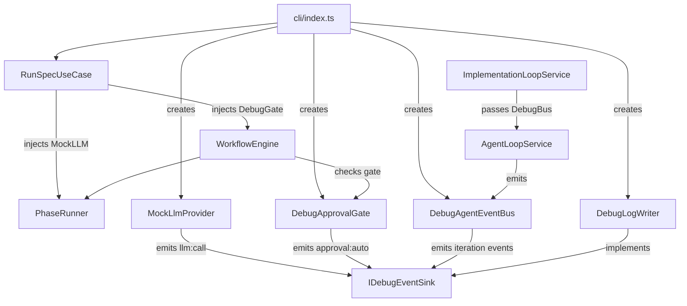
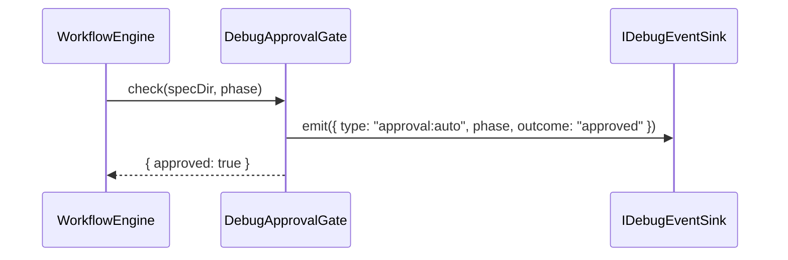

# Design Document: cli-option-debug-workflow

## Overview

This feature adds a `--debug-flow` flag to `aes run` that replaces the real LLM provider with a deterministic `MockLlmProvider`, auto-approves all workflow gates, and emits structured debug events — covering agent loop iterations, LLM prompt/response history, and approval gate decisions — to `stderr` or an NDJSON file.

**Purpose**: Enables developers to validate the full `SPEC_INIT → REQUIREMENTS → DESIGN → ... → PULL_REQUEST` workflow end-to-end without an API key or network access.

**Users**: Developers testing CLI workflow correctness, CI pipelines verifying workflow structure.

**Impact**: Adds new components at the CLI and adapter layers only. No changes to domain logic, `WorkflowEngine`, or `RunSpecUseCase`. One small addition to `ImplementationLoopOptions` threads the agent event bus.

### Goals

- Exercise all workflow phases with a zero-config, offline mock
- Log every LLM call (prompt + response) and every agent loop iteration in real time
- Route debug output to `stderr` by default, or to a dedicated NDJSON file
- Leave the production code path unaffected when `--debug-flow` is absent

### Non-Goals

- Mocking tool execution (filesystem, shell, git) — only LLM calls are mocked
- Providing a scripted multi-response sequence file (`--debug-flow-responses`) — deferred to v2
- Extracting an `IApprovalGate` interface — out of scope; subclassing suffices for this feature

---

## Architecture

### Existing Architecture Analysis

The existing wiring is:

```
cli/index.ts
  → RunSpecUseCase.run()
      → WorkflowEngine.execute(state)
          → PhaseRunner.execute(phase, ctx)           // LLM only via clearContext()
          → ApprovalGate.check(specDir, phase)
      → ImplementationLoopService.run(planId)
          → AgentLoopService.run(task, options)        // LLM.complete() called here
              IAgentEventBus (optional) ← already in AgentLoopOptions
```

Key extension points already in the codebase:
- `RunSpecUseCase.createLlmProvider` factory — provider swap requires no core changes
- `AgentLoopOptions.eventBus?: IAgentEventBus` — iteration events already available
- `ImplementationLoopOptions.logger` / `eventBus` — options-bag pattern established

### Architecture Pattern & Boundary Map



**Architecture Integration**:
- Selected pattern: Dependency injection swap at the CLI entry point — all debug components are wired in `cli/index.ts` when `--debug-flow` is set; the core engine receives them via its existing constructor dependencies
- Existing patterns preserved: options-bag injection (`AgentLoopOptions`, `ImplementationLoopOptions`), `IAgentEventBus`, port/adapter layering
- New components rationale: `MockLlmProvider` (replaces real provider), `DebugApprovalGate` (bypasses gate), `IDebugEventSink` + `DebugLogWriter` (fan-in from multiple sources), `DebugAgentEventBus` (bridges agent loop events to the sink)
- Steering compliance: Hexagonal architecture maintained; debug components live in adapter/infra layers

### Technology Stack

| Layer | Choice / Version | Role in Feature | Notes |
|-------|------------------|-----------------|-------|
| CLI | `citty` (existing) | New flag definitions | Add `debug-flow` boolean, `debug-flow-log` string |
| Adapters / LLM | New `MockLlmProvider` | Replaces `ClaudeProvider` | Lives in `src/adapters/llm/` |
| Application / Workflow | `DebugApprovalGate extends ApprovalGate` | Auto-approval in debug mode | Lives in `src/application/workflow/` |
| Application / Ports | `IDebugEventSink` port | Fan-in contract for all debug events | Lives in `src/application/ports/` |
| Infra / CLI | `DebugLogWriter` | Writes debug events to stderr or NDJSON file | Lives in `src/cli/` |
| Application / Agent | `DebugAgentEventBus` | Bridges `AgentLoopEvent` → `IDebugEventSink` | Lives in `src/application/agent/` |

---

## System Flows

### Debug-Flow Startup Sequence

```mermaid
sequenceDiagram
    participant Dev as Developer
    participant CLI as cli/index.ts
    participant Sink as DebugLogWriter
    participant Core as RunSpecUseCase

    Dev->>CLI: aes run spec --debug-flow
    CLI->>CLI: Parse flags; detect --debug-flow
    CLI->>CLI: Load config; bypass apiKey validation if missing
    CLI->>Sink: new DebugLogWriter(path or stderr)
    CLI->>CLI: new MockLlmProvider(sink, eventBus)
    CLI->>CLI: new DebugApprovalGate(sink)
    CLI->>CLI: new DebugAgentEventBus(sink)
    CLI->>CLI: emit [DEBUG-FLOW MODE] banner to stderr
    CLI->>Core: run(specName, config, { debugFlow: { llm, gate, agentBus } })
    Core-->>CLI: WorkflowResult
    CLI->>Sink: close()
```

### LLM Call Interception

```mermaid
sequenceDiagram
    participant Agent as AgentLoopService
    participant Mock as MockLlmProvider
    participant Sink as IDebugEventSink

    Agent->>Mock: complete(prompt, options)
    Mock->>Mock: increment callIndex; record entry
    Mock->>Sink: emit({ type: "llm:call", callIndex, phase, iteration, prompt, response })
    Mock-->>Agent: { ok: true, value: { content: "[MOCK LLM RESPONSE] ...", usage } }
```

### Approval Gate Auto-Approval



---

## Requirements Traceability

| Requirement | Summary | Components | Interfaces | Flows |
|-------------|---------|------------|------------|-------|
| 1.1 | `--debug-flow` accepted on `aes run` | CLI | citty `defineCommand` | Startup |
| 1.2 | Startup banner on stderr | CLI | — | Startup |
| 1.3 | Compatible with all existing flags | CLI | `RunOptions` | Startup |
| 2.1 | Inject `MockLlmProvider` | CLI, MockLlmProvider | `LlmProviderPort` | LLM call |
| 2.2 | Valid phase-completion mock response | MockLlmProvider | `LlmProviderPort` | LLM call |
| 2.3 | No apiKey required | CLI | `ConfigLoader`, `AesConfig` | Startup |
| 2.4 | Call log in MockLlmProvider | MockLlmProvider | `IDebugEventSink` | LLM call |
| 2.5 | clearContext() preserves call log | MockLlmProvider | `LlmProviderPort` | LLM call |
| 3.1 | Per-iteration structured log | DebugAgentEventBus | `IAgentEventBus`, `IDebugEventSink` | Agent loop |
| 3.2 | Real-time emission | DebugAgentEventBus, DebugLogWriter | `IDebugEventSink` | Agent loop |
| 3.3 | Tool failure logged | DebugAgentEventBus | `IAgentEventBus` | Agent loop |
| 3.4 | No logs when flag absent | DebugAgentEventBus | `AgentLoopOptions.eventBus` | — |
| 4.1 | LLM call log (index, phase, iteration, prompt, response) | MockLlmProvider | `IDebugEventSink` | LLM call |
| 4.2 | LLM error logged | MockLlmProvider | `IDebugEventSink` | LLM call |
| 4.3 | Same output destination as agent logs | DebugLogWriter | `IDebugEventSink` | — |
| 5.1 | Auto-approve gates | DebugApprovalGate | `ApprovalGate` | Approval |
| 5.2 | Gate decisions logged | DebugApprovalGate | `IDebugEventSink` | Approval |
| 5.3 | No auto-approve without flag | DebugApprovalGate | — | — |
| 5.4 | Partial history on early termination | DebugLogWriter | `IDebugEventSink` | — |
| 6.1 | Default output to stderr | DebugLogWriter | `IDebugEventSink` | — |
| 6.2 | `--debug-flow-log` writes NDJSON | DebugLogWriter | `IDebugEventSink` | — |
| 6.3 | File open failure falls back to stderr | DebugLogWriter | `IDebugEventSink` | — |
| 6.4 | Flush and close before exit | DebugLogWriter, CLI | `IDebugEventSink` | — |
| 6.5 | No overlap with `--log-json` | CLI, DebugLogWriter | `IDebugEventSink` | — |

---

## Components and Interfaces

| Component | Layer | Intent | Req Coverage | Key Dependencies | Contracts |
|-----------|-------|--------|--------------|-----------------|-----------|
| `IDebugEventSink` | Application / Port | Fan-in interface for all debug events | 2.4, 3.1, 4.1, 5.2 | — | Service |
| `DebugEvent` | Domain / Types | Discriminated union of all debug event variants | all | — | State |
| `MockLlmProvider` | Adapter / LLM | Intercepts LLM calls; returns mock; records call log | 2.1–2.5, 4.1–4.3 | `IDebugEventSink` (P0) | Service |
| `DebugApprovalGate` | Application / Workflow | Extends `ApprovalGate`; auto-approves; emits events | 5.1–5.4 | `IDebugEventSink` (P0) | Service |
| `DebugAgentEventBus` | Application / Agent | Bridges `IAgentEventBus` to `IDebugEventSink` | 3.1–3.4 | `IDebugEventSink` (P0) | Service, Event |
| `DebugLogWriter` | CLI / Infra | Writes debug events to stderr or NDJSON file | 6.1–6.5 | Node.js `fs` (P0) | Service |
| CLI (`index.ts`) | CLI | Parses new flags; wires debug components | 1.1–1.3, 2.3 | All above (P0) | — |
| `ImplementationLoopOptions` | Application / Port | Add `agentEventBus?` field to thread the bus | 3.1–3.4 | — | State |

---

### Application / Port

#### IDebugEventSink

| Field | Detail |
|-------|--------|
| Intent | Fan-in receiver for all debug events emitted from `MockLlmProvider`, `DebugApprovalGate`, and `DebugAgentEventBus` |
| Requirements | 2.4, 3.1, 4.1, 5.2, 6.1–6.5 |

**Responsibilities & Constraints**
- Single write target; all debug components emit to this interface
- Must be non-throwing; implementations absorb write errors internally

**Contracts**: Service [x]

##### Service Interface

```typescript
export interface IDebugEventSink {
  emit(event: DebugEvent): void;
  close(): Promise<void>;
}
```

- Preconditions: `emit()` is always safe to call; no initialization required
- Postconditions: `close()` flushes all buffered entries and releases file handles
- Invariants: Calls to `emit()` after `close()` are silently dropped

---

### Domain / Types

#### DebugEvent

| Field | Detail |
|-------|--------|
| Intent | Discriminated union covering every category of debug observable |
| Requirements | 3.1, 4.1, 5.2 |

**Contracts**: State [x]

```typescript
export type DebugEvent =
  | {
      readonly type: "llm:call";
      readonly callIndex: number;
      readonly phase: string;
      readonly iterationNumber: number | null;
      readonly prompt: string;
      readonly response: string;
      readonly durationMs: number;
      readonly timestamp: string;
    }
  | {
      readonly type: "llm:error";
      readonly callIndex: number;
      readonly phase: string;
      readonly prompt: string;
      readonly errorCategory: string;
      readonly errorMessage: string;
      readonly durationMs: number;
      readonly timestamp: string;
    }
  | {
      readonly type: "agent:iteration";
      readonly iterationNumber: number;
      readonly phase: string;
      /** Mapped directly from `iteration:complete.category` (ActionCategory). */
      readonly actionCategory: string;
      readonly toolName: string;
      readonly durationMs: number;
      readonly timestamp: string;
    }
  | {
      readonly type: "approval:auto";
      readonly phase: string;
      readonly approvalType: "requirements" | "design" | "tasks";
      readonly outcome: "approved";
      readonly timestamp: string;
    };
```

---

### Adapter / LLM

#### MockLlmProvider

| Field | Detail |
|-------|--------|
| Intent | Implements `LlmProviderPort`; returns a deterministic mock response; records every call to `IDebugEventSink` |
| Requirements | 2.1, 2.2, 2.3, 2.4, 2.5, 4.1, 4.2, 4.3 |

**Responsibilities & Constraints**
- Never makes real network calls
- Default response content must satisfy the phase parser's completion detection (configurable at construction time)
- `clearContext()` resets internal conversation history; does not affect the call index or the sink

**Dependencies**
- Inbound: `PhaseRunner.onEnter()` → `clearContext()` (P1)
- Inbound: `AgentLoopService` → `complete()` (P0)
- Inbound: `WorkflowEventBus` → `phase:start` subscription for phase tracking (P1)
- Outbound: `IDebugEventSink` → `emit()` (P0)

**Contracts**: Service [x]

##### Service Interface

```typescript
export interface MockLlmProviderConfig {
  readonly defaultResponse: string;
  readonly sink: IDebugEventSink;
  /** WorkflowEventBus to subscribe for `phase:start` events; used to track current phase in debug log entries. */
  readonly workflowEventBus: IWorkflowEventBus;
}

export class MockLlmProvider implements LlmProviderPort {
  constructor(config: MockLlmProviderConfig);
  complete(prompt: string, options?: LlmCompleteOptions): Promise<LlmResult>;
  clearContext(): void;
}
```

- Preconditions: `sink` must be open before `complete()` is called; `workflowEventBus` must be the same instance passed to `WorkflowEngine`
- Postconditions: every `complete()` call emits exactly one `llm:call` or `llm:error` event to `sink` with the `phase` field set to the most recently observed `phase:start` value (or `"UNKNOWN"` before the first phase event)
- Invariants: `callIndex` is monotonically increasing across the lifetime of the instance; `clearContext()` does not reset `callIndex` or the current phase

**Implementation Notes**
- `MockLlmProvider` subscribes to `workflowEventBus.on()` in its constructor and updates an internal `#currentPhase` field on each `phase:start` event. This is the only mechanism for phase tracking; no `setPhase()` method is exposed.
- The default response string is `"[MOCK LLM RESPONSE] Task completed successfully."` — designed to pass loose completion checks without triggering retry logic
- Risks: if a phase runner parses the LLM response for structured data, a plain string may fail parsing; phase-specific response overrides are a v2 feature

---

### Application / Workflow

#### DebugApprovalGate

| Field | Detail |
|-------|--------|
| Intent | Subclasses `ApprovalGate`; overrides `check()` to always return approved; emits `approval:auto` events |
| Requirements | 5.1, 5.2, 5.3 |

**Responsibilities & Constraints**
- Must never read `spec.json` from disk (no I/O in debug mode)
- Emit one `approval:auto` event per `check()` call before returning

**Dependencies**
- Inbound: `WorkflowEngine.runPendingPhases()` → `check()` (P0)
- Outbound: `IDebugEventSink` → `emit()` (P0)

**Contracts**: Service [x]

##### Service Interface

```typescript
export class DebugApprovalGate extends ApprovalGate {
  constructor(sink: IDebugEventSink);
  override check(specDir: string, phase: ApprovalPhase): Promise<ApprovalCheckResult>;
}
```

- Postconditions: returns `{ approved: true }` unconditionally; emits `approval:auto` event
- Invariants: does not call `super.check()` — no disk I/O in debug mode

---

### Application / Agent

#### DebugAgentEventBus

| Field | Detail |
|-------|--------|
| Intent | Implements `IAgentEventBus`; translates `AgentLoopEvent` entries into `agent:iteration` debug events and forwards to `IDebugEventSink` |
| Requirements | 3.1, 3.2, 3.3, 3.4 |

**Responsibilities & Constraints**
- Translates `iteration:complete` events to `agent:iteration` debug events
- Passes through `on()` / `off()` subscriptions to allow other subscribers (no break to existing consumers)
- Must not buffer events; emits synchronously to the sink on each `emit()` call

**Dependencies**
- Inbound: `AgentLoopService` → `emit(AgentLoopEvent)` (P0)
- Outbound: `IDebugEventSink` → `emit(DebugEvent)` (P0)

**Contracts**: Service [x], Event [x]

##### Service Interface

```typescript
export class DebugAgentEventBus implements IAgentEventBus {
  constructor(sink: IDebugEventSink);
  emit(event: AgentLoopEvent): void;
  on(handler: (event: AgentLoopEvent) => void): void;
  off(handler: (event: AgentLoopEvent) => void): void;
}
```

- Preconditions: `sink` must be open before `emit()` is called
- Postconditions: for each `iteration:complete` event, exactly one `agent:iteration` debug event is emitted to the sink with `actionCategory` mapped from `iteration:complete.category` and `toolName` from `iteration:complete.toolName`; other event types are silently forwarded to registered `on()` handlers only
- Invariants: the bus is stateless — no cross-event state is accumulated; each `iteration:complete` event is self-contained

**Implementation Notes**
- Only `iteration:complete` maps to a debug event; `step:start/complete` and `iteration:start` are forwarded to `on()` subscribers only (they carry redundant data at higher granularity)
- `actionCategory` is a direct 1:1 mapping from `AgentLoopEvent["iteration:complete"].category`; no statefulness required
- Threading path: `cli/index.ts` creates `DebugAgentEventBus` → passes to `ImplementationLoopOptions.agentEventBus` → `ImplementationLoopService` passes it in `agentLoop.run()` options

---

### CLI / Infra

#### DebugLogWriter

| Field | Detail |
|-------|--------|
| Intent | Implements `IDebugEventSink`; writes debug events as NDJSON to a file or as prefixed text to stderr |
| Requirements | 6.1, 6.2, 6.3, 6.4, 6.5 |

**Responsibilities & Constraints**
- When no file path is given: write each event as `[DEBUG] <JSON>\n` to `process.stderr`
- When a file path is given: write as NDJSON (one JSON object per line) to the specified file
- Absorbs file-open errors; falls back to stderr and emits a warning
- `close()` flushes the stream and resolves only after all pending writes complete

**Dependencies**
- Inbound: `MockLlmProvider`, `DebugApprovalGate`, `DebugAgentEventBus` → `emit()` (P0)
- External: Node.js `fs/promises` (P0)

**Contracts**: Service [x]

##### Service Interface

```typescript
export class DebugLogWriter implements IDebugEventSink {
  constructor(filePath?: string);
  emit(event: DebugEvent): void;
  close(): Promise<void>;
}
```

- Preconditions: constructor may be called before the file is open; `emit()` queues events if the file handle is not yet ready
- Postconditions: `close()` resolves only after all enqueued events are written and the file handle is released
- Invariants: events are written in the order they were received; no interleaving

**Implementation Notes**
- Mirrors the existing `JsonLogWriter` pattern in `src/cli/json-log-writer.ts`
- Integration: instantiated once in `cli/index.ts`; same instance shared across `MockLlmProvider`, `DebugApprovalGate`, `DebugAgentEventBus`
- Risks: high-throughput runs (many iterations) could produce large debug files; no size limit in v1

---

### CLI Layer Changes

#### `cli/index.ts` additions

Two new flags added to `runCommand.args`:

```typescript
"debug-flow": {
  type: "boolean",
  description: "Run with a mock LLM, auto-approve gates, and emit debug logs",
  default: false,
},
"debug-flow-log": {
  type: "string",
  description: "Write debug events as NDJSON to this file (default: stderr)",
},
```

**Wiring logic** (when `--debug-flow` is set):
1. Attempt `configLoader.load()`; catch `ConfigValidationError` for missing `apiKey`; if the only missing field is `apiKey`, synthesize `AesConfig` with `apiKey: "__debug__"` and continue.
2. Emit `[DEBUG-FLOW MODE]` banner to `stderr`.
3. Instantiate `DebugLogWriter(args["debug-flow-log"])`.
4. Instantiate `MockLlmProvider({ defaultResponse: "...", sink: debugWriter, workflowEventBus: eventBus })`.
5. Instantiate `DebugApprovalGate(debugWriter)`.
6. Instantiate `DebugAgentEventBus(debugWriter)`.
7. Pass `MockLlmProvider` via `createLlmProvider` factory (return it regardless of `providerOverride`).
8. Pass `DebugApprovalGate` where `RunSpecUseCase` creates `ApprovalGate` (requires `RunSpecUseCase` to accept an optional `approvalGate` override, or the gate is constructed in the CLI and injected — see Implementation Note).
9. Pass `DebugAgentEventBus` via `ImplementationLoopOptions.agentEventBus`.
10. Call `debugWriter.close()` after `useCase.run()` resolves (in the `finally` block alongside `logWriter.close()`).

**Implementation Note on ApprovalGate injection**: `ApprovalGate` is currently constructed inside `RunSpecUseCase.run()`. To inject a `DebugApprovalGate`, add an optional `approvalGate?: ApprovalGate` field to `RunSpecUseCaseDeps`; when present, it replaces the internally constructed gate. This is the only change to `RunSpecUseCase`.

---

### Port Changes

#### `ImplementationLoopOptions` addition

One new optional field:

```typescript
/**
 * Optional agent event bus forwarded to every AgentLoopService.run() call.
 * Used by debug-flow to capture per-iteration agent loop events.
 * When absent, no IAgentEventBus is passed to the agent loop.
 */
agentEventBus?: IAgentEventBus;
```

`ImplementationLoopService` passes `options.agentEventBus` as `eventBus` in each `agentLoop.run(task, { ..., eventBus: options.agentEventBus })` call.

---

## Data Models

### Domain Model

`DebugEvent` is a value object (immutable discriminated union). No aggregates or persistence outside the `DebugLogWriter` write stream. No entity identity; each event is append-only.

### Logical Data Model

NDJSON file format — one `DebugEvent` JSON object per line:

```
{"type":"llm:call","callIndex":1,"phase":"IMPLEMENTATION","iterationNumber":3,...}
{"type":"agent:iteration","iterationNumber":3,"phase":"IMPLEMENTATION","actionCategory":"Modification","toolName":"write_file",...}
{"type":"approval:auto","phase":"REQUIREMENTS","approvalType":"requirements","outcome":"approved",...}
```

All fields are required per variant (see `DebugEvent` union). No schema versioning in v1.

---

## Error Handling

### Error Strategy

All debug components follow the existing "never-throw" pattern used throughout the codebase.

### Error Categories and Responses

| Error | Component | Response |
|-------|-----------|----------|
| `--debug-flow-log` file cannot be opened | `DebugLogWriter` | Warning to `stderr`; fall back to `stderr` output (req 6.3) |
| Config missing `apiKey` with `--debug-flow` | CLI | Synthesize dummy config; log bypass reason to `stderr` |
| `emit()` called after `close()` | `DebugLogWriter` | Silently dropped; no error thrown |
| `MockLlmProvider` is used in a non-debug path | — | Prevented by wiring; no runtime guard needed |

### Monitoring

All debug events are append-only to `stderr` or a file. No health metrics are emitted; debug-flow is a developer-only mode.

---

## Testing Strategy

### Unit Tests

- `MockLlmProvider`: returns default response; increments `callIndex`; emits `llm:call` event with correct fields; `clearContext()` does not reset `callIndex`; `ok: false` result emits `llm:error` event
- `DebugApprovalGate`: returns `{ approved: true }` for all phases; emits one `approval:auto` event per `check()` call; never reads disk
- `DebugAgentEventBus`: maps `iteration:complete` to `agent:iteration` debug event; passes other event types to `on()` subscribers without emitting to sink; `off()` correctly unregisters handlers
- `DebugLogWriter`: writes events to stderr when no path given; writes NDJSON when path given; falls back to stderr on file-open error; `close()` resolves after flush

### Integration Tests

- CLI startup with `--debug-flow` and no `apiKey` in config: workflow starts without error; banner emitted
- `MockLlmProvider` + `DebugApprovalGate` + `DebugAgentEventBus` + `DebugLogWriter` wired together: a single workflow run produces a valid NDJSON debug log containing `llm:call`, `approval:auto`, and (if agent loop runs) `agent:iteration` entries
- `--debug-flow-log` and `--log-json` supplied simultaneously: no entries overlap between the two files

### E2E Tests

- `aes run <spec> --debug-flow` with a real spec directory: workflow completes with status `"completed"` or `"paused"` (not `"failed"`); debug output contains at least one `approval:auto` event per approval gate phase
- `aes run <spec> --debug-flow --debug-flow-log /tmp/debug.ndjson`: file exists after process exit; each line is valid JSON; `close()` has been called

---

## Supporting References

- `orchestrator-ts/src/cli/json-log-writer.ts` — model for `DebugLogWriter` implementation
- `orchestrator-ts/src/adapters/llm/claude-provider.ts` — interface contract that `MockLlmProvider` must satisfy
- `orchestrator-ts/src/domain/workflow/approval-gate.ts` — base class for `DebugApprovalGate`
- `orchestrator-ts/src/application/ports/agent-loop.ts` — `IAgentEventBus`, `AgentLoopEvent` union
- `.kiro/specs/cli-option-debug-workflow/research.md` — discovery log and decision rationale
