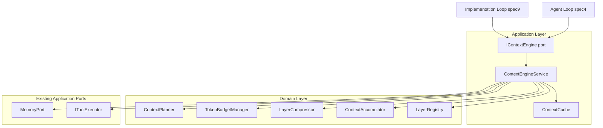
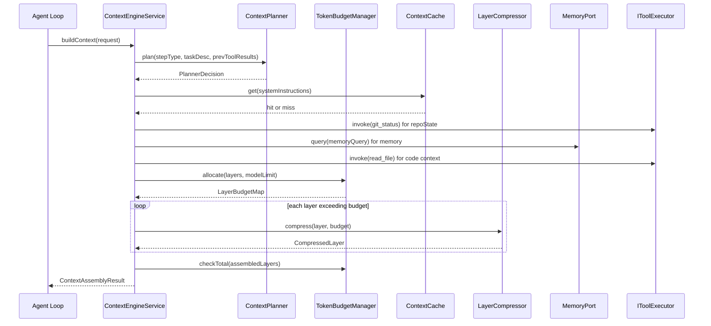
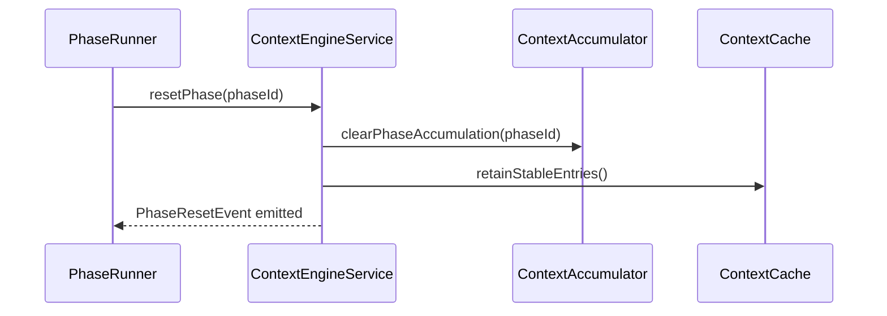
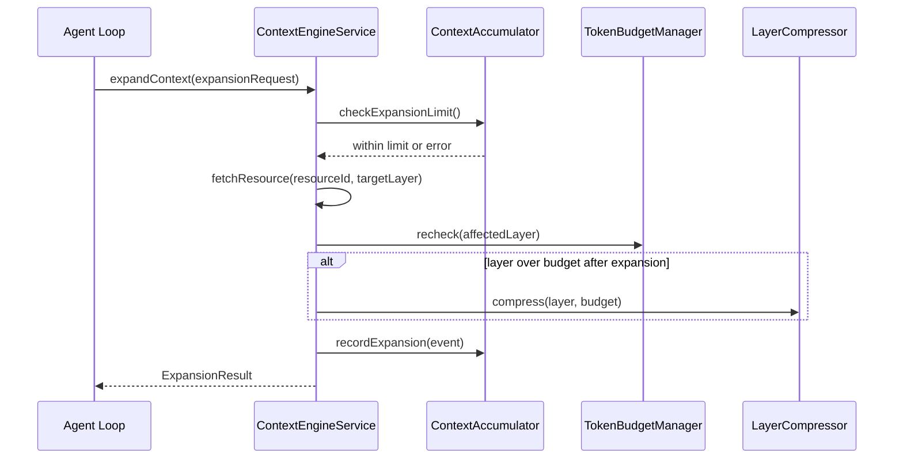

# Design Document — Context Engine

## Overview

The Context Engine is the subsystem responsible for assembling the information provided to the LLM at each reasoning step of the AI Dev Agent. It constructs prompts from seven ordered layers — system instructions, task description, active specification, relevant code context, repository state, memory retrieval, and tool results — while enforcing per-layer token budgets, applying compression when layers exceed budget, caching stable layers, and maintaining strict context isolation across workflow phases and task sections.

**Purpose**: The Context Engine delivers high-quality, token-efficient context to the LLM at every agent reasoning step, enabling accurate code generation and decision-making within the constraints of the model's context window.

**Users**: The agent loop (spec4) and the implementation loop (spec9) consume the Context Engine as the primary means of constructing LLM prompts. The workflow engine (spec1) drives phase transitions that trigger context resets.

**Impact**: Introduces a new domain subsystem (`domain/context/`) and application service (`application/context/`) alongside a new application port (`application/ports/context.ts`). Does not modify existing ports, adapters, or workflow engine code. Wiring into PhaseRunner and the agent loop is deferred to spec4/spec9.

### Goals

- Assemble a 7-layer context for every LLM invocation, respecting token budgets and order
- Plan context retrieval per step type (Exploration, Modification, Validation) before assembly
- Compress over-budget layers deterministically without LLM round-trips
- Cache stable layers (system instructions, steering documents) within a session
- Enforce phase and task isolation — no context leaks across boundaries
- Emit structured observability metadata on every assembly without logging raw content

### Non-Goals

- LLM-based summarization (deferred to v2; v1 uses regex/text extraction only)
- Semantic/vector-based code retrieval (deferred to spec11: codebase-intelligence)
- Persistent cross-session context storage
- Direct modification of the LLM provider port or the workflow engine state machine
- AST-based code analysis (regex extraction is sufficient for v1 budget management)

---

## Requirements Traceability

| Requirement | Summary | Components | Interfaces | Flows |
|-------------|---------|------------|------------|-------|
| 1.1–1.5 | 7-layer ordered context assembly | ContextAssembler, LayerRegistry | IContextEngine.buildContext | Context Assembly Flow |
| 2.1–2.5 | Step-type-aware context planning | ContextPlanner | IContextPlanner | Context Assembly Flow |
| 3.1–3.5 | Per-layer token budgets and total limit | TokenBudgetManager | ITokenBudgetManager | Context Assembly Flow |
| 4.1–4.6 | Layer compression when over budget | LayerCompressor | ILayerCompressor | Compression Flow |
| 5.1–5.5 | Iterative mid-iteration context expansion | ContextAccumulator, IContextEngine.expandContext | IContextEngine | Expansion Flow |
| 6.1–6.5 | Session-scoped caching of stable layers | ContextCache | IContextCache | Context Assembly Flow |
| 7.1–7.5 | Phase isolation and reset | ContextAccumulator, IContextEngine.resetPhase | IContextEngine | Phase Reset Flow |
| 8.1–8.5 | Task section isolation | ContextAccumulator, IContextEngine.resetTask | IContextEngine | Task Reset Flow |
| 9.1–9.5 | Structured observability — no raw content | ContextObservabilityEmitter | ContextAssemblyLog | All Flows |
| 10.1–10.5 | Integration with memory, tool-system, orchestrator | ContextEngineService | MemoryPort, IToolExecutor | Context Assembly Flow |
| 11.1–11.5 | Graceful degradation when upstream fails | ContextEngineService | IContextEngine | Error Handling |

---

## Architecture

### Existing Architecture Analysis

The orchestrator-ts codebase follows Clean/Hexagonal Architecture with this layer hierarchy:

```
CLI → Application (Use Cases + Ports) → Domain → Adapters → External Systems
```

Key constraints that the Context Engine must respect:
- Domain layer contains only pure logic — no I/O, no imports from application or adapter layers
- Application ports define interfaces; adapters implement them
- The agent loop (spec4) will consume the Context Engine through an application port
- Existing ports (`MemoryPort`, `IToolExecutor`) are the authoritative interfaces for memory and tool access

The Context Engine has no predecessor in the codebase. It is a new subsystem placed at the domain + application layers, using existing `MemoryPort` and `IToolExecutor` ports as dependencies.

### Architecture Pattern and Boundary Map



**Architecture Integration**:
- Selected pattern: Hexagonal (Ports and Adapters), consistent with the existing system
- Domain boundary: pure logic in `domain/context/` — ContextPlanner, TokenBudgetManager, LayerCompressor, ContextAccumulator, LayerRegistry; zero I/O
- Application boundary: `ContextEngineService` and `ContextCache` in `application/context/`; `ContextEngineService` orchestrates I/O through existing ports and calls `fs.stat()` before each cache lookup; `IContextEngine` in `application/ports/context.ts` is the interface consumed by callers; `ContextCache` is in the application layer because its mtime-based invalidation requires `fs.stat()` — I/O is not permitted in the domain layer
- No new adapters required for v1; existing `MemoryPort` and `IToolExecutor` adapters are reused as-is
- Steering compliance: domain layer has zero I/O dependencies; dependency inversion through port interfaces throughout

### Technology Stack

| Layer | Choice / Version | Role in Feature | Notes |
|-------|------------------|-----------------|-------|
| Runtime | Bun v1.3.10+ | Execution environment | No change; existing constraint |
| Language | TypeScript strict mode | All implementation | No change; existing constraint |
| Token counting | js-tiktoken (cl100k\_base) | Synchronous pre-assembly token estimation | New dependency; pure JS, no WASM |
| Memory access | MemoryPort (existing port) | Memory retrieval layer population | No new adapter needed |
| Tool access | IToolExecutor (existing port) | Repository state + code context layers | No new adapter needed |
| Caching | In-process Map (standard JS) | ContextCache for stable layers | No external store; session-scoped only |

---

## System Flows

### Context Assembly Flow



### Phase Reset Flow



### Iterative Expansion Flow



---

## Components and Interfaces

### Component Summary

| Component | Domain/Layer | Intent | Req Coverage | Key Dependencies | Contracts |
|-----------|--------------|--------|--------------|------------------|-----------|
| IContextEngine | Application port | Primary interface for callers | 1–11 | — | Service |
| ContextEngineService | Application | Orchestrates I/O and domain services | 1–11 | MemoryPort (P0), IToolExecutor (P0), domain components (P0) | Service |
| ContextPlanner | Domain | Maps step type to retrieval plan | 2.1–2.5 | — | Service |
| TokenBudgetManager | Domain | Enforces per-layer and total budgets | 3.1–3.5 | js-tiktoken (P0) | Service |
| LayerCompressor | Domain | Compresses over-budget layers | 4.1–4.6 | — | Service |
| ContextAccumulator | Domain | Tracks phase/task scope and expansions | 5.1–5.5, 7.1–7.5, 8.1–8.5 | — | State |
| ContextCache | Application | In-process cache for stable layers | 6.1–6.5 | Node fs.stat (P1) | State |
| LayerRegistry | Domain | Ordered layer definitions and metadata | 1.1–1.5 | — | State |

---

### Application Port

#### IContextEngine

| Field | Detail |
|-------|--------|
| Intent | Primary application port consumed by the agent loop and implementation loop |
| Requirements | 1.1–1.5, 2.1–2.5, 3.1–3.5, 4.1–4.6, 5.1–5.5, 6.1–6.5, 7.1–7.5, 8.1–8.5, 9.1–9.5 |

**Contracts**: Service [x]

##### Service Interface

```typescript
export type LayerId =
  | "systemInstructions"
  | "taskDescription"
  | "activeSpecification"
  | "codeContext"
  | "repositoryState"
  | "memoryRetrieval"
  | "toolResults";

export type StepType = "Exploration" | "Modification" | "Validation";

export interface ContextBuildRequest {
  readonly sessionId: string;
  readonly phaseId: string;
  readonly taskId: string;
  readonly stepType: StepType;
  readonly taskDescription: string;
  readonly previousToolResults?: ReadonlyArray<ToolResultEntry>;
  readonly modelTokenLimit?: number;
}

export interface ToolResultEntry {
  readonly toolName: string;
  readonly content: string;
}

export interface LayerTokenUsage {
  readonly layerId: LayerId;
  readonly actualTokens: number;
  readonly budget: number;
  readonly cacheHit: boolean;
  readonly compressed: boolean;
}

export interface ContextAssemblyResult {
  readonly content: string;
  readonly layers: ReadonlyArray<{ readonly layerId: LayerId; readonly content: string }>;
  readonly totalTokens: number;
  readonly layerUsage: ReadonlyArray<LayerTokenUsage>;
  readonly plannerDecision: PlannerDecision;
  readonly degraded: boolean;
  readonly omittedLayers: ReadonlyArray<LayerId>;
}

export interface ExpansionRequest {
  readonly sessionId: string;
  readonly phaseId: string;
  readonly taskId: string;
  readonly resourceId: string;
  readonly targetLayer: "codeContext" | "activeSpecification" | "memoryRetrieval";
}

export interface ExpansionResult {
  readonly ok: boolean;
  readonly updatedTokenCount: number;
  readonly errorReason?: string;
}

export interface IContextEngine {
  /**
   * Build a complete 7-layer context for an LLM invocation.
   * Never throws — errors surface in the result's degraded/omittedLayers fields.
   */
  buildContext(request: ContextBuildRequest): Promise<ContextAssemblyResult>;

  /**
   * Append additional content to an expandable layer mid-iteration.
   * Always resolves — returns a result with `ok: false` when targetLayer is not expandable or max expansions reached.
   */
  expandContext(request: ExpansionRequest): Promise<ExpansionResult>;

  /**
   * Discard all non-cached accumulated context for the given phase.
   * Called by PhaseRunner.onEnter() at every phase transition.
   */
  resetPhase(phaseId: string): void;

  /**
   * Initialize a fresh task-scoped context state.
   * Called by the implementation loop at the start of each task section.
   */
  resetTask(taskId: string): void;
}
```

- Preconditions: `buildContext` requires `sessionId`, `phaseId`, `taskId`, and `taskDescription` to be non-empty strings.
- Postconditions: `buildContext` always returns a result (never rejects); degraded assembly is reflected in the result metadata.
- Invariants: `layerUsage` in the result always contains exactly the assembled layers in the order defined by `LayerRegistry`.

---

### Domain Layer

#### ContextPlanner

| Field | Detail |
|-------|--------|
| Intent | Pure domain function: maps step type and task context to a structured retrieval plan |
| Requirements | 2.1–2.5 |

**Responsibilities & Constraints**
- Determines which layers to populate and with what query parameters, based on step type and task description
- Has no I/O; receives all inputs as arguments and returns a pure data structure
- Does not make retrieval decisions for system instructions or task description (always included)

**Contracts**: Service [x]

##### Service Interface

```typescript
export interface PlannerDecision {
  readonly layersToRetrieve: ReadonlyArray<LayerId>;
  readonly codeContextQuery?: { readonly paths: ReadonlyArray<string>; readonly pattern?: string };
  readonly memoryQuery?: { readonly text: string; readonly topN: number };
  readonly specSections?: ReadonlyArray<string>;
  readonly rationale: string;
}

export interface IContextPlanner {
  plan(
    stepType: StepType,
    taskDescription: string,
    previousToolResults: ReadonlyArray<ToolResultEntry>,
  ): PlannerDecision;
}
```

**Implementation Notes**
- Integration: Exploration → include `codeContext` + `repositoryState`; Modification → include `codeContext` + `activeSpecification`; Validation → include `toolResults` + `activeSpecification`. System instructions and task description are always included regardless.
- Validation: `rationale` field is set to `"stepType:${stepType} taskExcerpt:${taskDescription.slice(0, 100)}"` for log traceability.
- Risks: Over-broad retrieval decisions increase token pressure. Future improvement: task keyword analysis to narrow file paths.

---

#### TokenBudgetManager

| Field | Detail |
|-------|--------|
| Intent | Enforces configurable per-layer and total token budgets; counts tokens using js-tiktoken |
| Requirements | 3.1–3.5 |

**Responsibilities & Constraints**
- Counts tokens for a string using `cl100k_base` encoding
- Returns per-layer budget allocations based on configuration and model limit
- Tracks cumulative token usage during assembly and emits error log when total is exceeded after compression

**Contracts**: Service [x]

##### Service Interface

```typescript
export interface LayerBudgetConfig {
  readonly systemInstructions: number;     // default: 1000
  readonly taskDescription: number;        // default: 500
  readonly activeSpecification: number;    // default: 2000
  readonly codeContext: number;            // default: 4000
  readonly repositoryState: number;        // default: 500
  readonly memoryRetrieval: number;        // default: 1500
  readonly toolResults: number;            // default: 2000
}

export interface TokenBudgetConfig {
  readonly layerBudgets: LayerBudgetConfig;
  readonly modelTokenLimit: number;
  readonly safetyBufferFraction: number;   // default: 0.05 (5%)
}

export interface LayerBudgetMap {
  readonly budgets: Readonly<Record<LayerId, number>>;
  readonly totalBudget: number;
}

export interface ITokenBudgetManager {
  /** Count tokens in text using cl100k_base encoding. */
  countTokens(text: string): number;

  /** Compute per-layer budgets scaled to model limit. */
  allocate(config: TokenBudgetConfig): LayerBudgetMap;

  /** Check if content fits in budget; returns tokens over budget or 0 if within. */
  checkBudget(content: string, budget: number): { tokensUsed: number; overBy: number };

  /** Sum all layer token counts. Returns overage (positive) or headroom (negative). */
  checkTotal(layerTokenCounts: ReadonlyArray<{ layerId: LayerId; tokens: number }>, totalBudget: number): number;
}
```

**Implementation Notes**
- Integration: `js-tiktoken` is initialized once at service construction; the encoder instance is reused across all calls.
- Validation: If `countTokens` throws (e.g., encoding error), return `Math.ceil(text.length / 4)` as a fallback approximation and log a warning.
- Risks: The 5% safety buffer is a static default. If models with different tokenization characteristics are used, this buffer may need adjustment.

---

#### LayerCompressor

| Field | Detail |
|-------|--------|
| Intent | Applies layer-specific compression to reduce token count to within budget |
| Requirements | 4.1–4.6 |

**Responsibilities & Constraints**
- Specification layer: extracts headings and acceptance criteria lines from markdown
- Code context layer: extracts export/function/class/interface/type declaration lines
- Memory retrieval layer: filters entries below a relevance score threshold
- System instructions and task description layers: must never be compressed
- Falls back to truncation if extraction does not achieve target token reduction

**Contracts**: Service [x]

##### Service Interface

```typescript
export type CompressionTechnique =
  | "spec_extraction"
  | "code_skeleton"
  | "memory_score_filter"
  | "truncation";

export interface CompressionResult {
  readonly compressed: string;
  readonly tokenCount: number;
  readonly technique: CompressionTechnique;
  readonly originalTokenCount: number;
}

export interface ILayerCompressor {
  /**
   * Compress `content` to fit within `budget` tokens.
   * Layer type determines which technique is applied.
   * Returns the original content if it already fits.
   */
  compress(
    layerId: LayerId,
    content: string,
    budget: number,
    tokenCounter: (text: string) => number,
  ): CompressionResult;
}
```

**Implementation Notes**
- Integration: Spec extraction uses regex `/^#{1,4}\s.+/gm` for headings and `/^[\s]*[-*]\s.+/gm` within `Acceptance Criteria` sections.
- Code skeleton extraction uses `/^export\s+(function|class|interface|type|const|abstract)/gm` to collect only the export declaration lines (signatures only — no bodies). This is intentionally a signature-extraction approach: it gives the LLM the public API surface (what exists and its type) without the implementation. Multi-line type definitions and generic constraints on a second line are not captured; this limitation is acceptable for v1 token reduction purposes. Upgrade to ts-morph AST extraction in v2 for complete signatures.
- Memory filter: drops entries with `relevanceScore < 0.3` (configurable threshold).
- Validation: After extraction, if `tokenCount > budget` (budget-based check), falls back to `content.slice(0, charBudget)` where `charBudget = budget * 4`.
- Risks: Single-line regex extraction misses multi-line declarations (e.g., generic type parameters spanning multiple lines). Acceptable for v1; upgrade to ts-morph AST extraction in v2 if needed.

---

#### ContextAccumulator

| Field | Detail |
|-------|--------|
| Intent | Tracks phase/task-scoped accumulated context and enforces expansion limits |
| Requirements | 5.1–5.5, 7.1–7.5, 8.1–8.5 |

**Responsibilities & Constraints**
- Maintains separate accumulation scopes per (phaseId, taskId) pair
- Tags every accumulated entry with the phaseId under which it was created; rejects entries from a different phase during assembly
- Tracks expansion event count per iteration and enforces `maxExpansionsPerIteration`
- Discards task-scoped entries when `resetTask()` is called; discards all non-cached phase entries when `resetPhase()` is called

**Contracts**: State [x]

##### State Management

```typescript
export interface AccumulatedEntry {
  readonly layerId: LayerId;
  readonly content: string;
  readonly phaseId: string;
  readonly taskId: string;
  readonly resourceId?: string;
}

export interface ExpansionEvent {
  readonly resourceId: string;
  readonly targetLayer: LayerId;
  readonly addedTokenCount: number;
  readonly newCumulativeTokenCount: number;
  readonly timestamp: string;
}

export interface ContextAccumulatorConfig {
  readonly maxExpansionsPerIteration: number; // default: 10
}

export interface IContextAccumulator {
  /** Add an entry to the current phase/task scope. */
  accumulate(entry: AccumulatedEntry): void;

  /** Return all entries valid for the given phase+task scope. */
  getEntries(phaseId: string, taskId: string): ReadonlyArray<AccumulatedEntry>;

  /** Record an expansion event; returns error if limit exceeded. */
  recordExpansion(event: ExpansionEvent): { ok: boolean; errorReason?: string };

  /** Return expansion events for the current iteration. */
  getExpansionEvents(): ReadonlyArray<ExpansionEvent>;

  /** Discard all entries tagged with phaseId and reset expansion counter. */
  resetPhase(phaseId: string): void;

  /** Discard all entries tagged with taskId and reset expansion counter. */
  resetTask(taskId: string): void;
}
```

**Implementation Notes**
- Invariant: entries from a previous phase must not appear in assembly results. Enforced by filtering on `entry.phaseId === currentPhaseId`.
- The expansion counter resets only when `resetTask()` or `resetPhase()` is called — never on `buildContext()`. This ensures the per-iteration limit in Req 5.5 is enforced across the full lifetime of a task section (Req 8.1–8.5), and callers cannot bypass the limit by making multiple `buildContext()` calls within the same iteration.

---

#### ContextCache

| Field | Detail |
|-------|--------|
| Intent | In-process session-scoped cache for stable context layers (system instructions, steering docs) |
| Requirements | 6.1–6.5 |

**Responsibilities & Constraints**
- Keyed by absolute file path; stores content, token count, and mtime for invalidation
- Maximum 50 entries (LRU eviction on overflow); configurable
- Never caches tool results, repository state, or memory retrieval layers
- Exposes hit/miss statistics for observability

**Contracts**: State [x]

##### State Management

```typescript
export interface CachedEntry {
  readonly filePath: string;
  readonly content: string;
  readonly tokenCount: number;
  readonly mtime: number; // ms since epoch from fs.stat
  readonly cachedAt: string; // ISO 8601
}

export interface CacheStats {
  readonly hits: number;
  readonly misses: number;
  readonly entries: number;
}

export interface IContextCache {
  /** Return cached entry if mtime matches; null on miss or staleness. */
  get(filePath: string, currentMtime: number): CachedEntry | null;

  /** Store entry in cache; evicts LRU entry if capacity exceeded. */
  set(entry: CachedEntry): void;

  /** Invalidate a specific entry. */
  invalidate(filePath: string): void;

  /** Return cumulative hit/miss statistics. */
  stats(): CacheStats;

  /** Reset all cache entries (called at session end, not phase reset). */
  clear(): void;
}
```

**Implementation Notes**
- Integration: `ContextEngineService` calls `fs.stat(filePath)` to get current mtime before each `cache.get()`. On miss, reads file content, counts tokens, and calls `cache.set()`.
- Validation: Files with mtime older than 24 hours are not special-cased; mtime comparison is the sole invalidation signal.
- Risks: mtime false positives (touch without content change) cause one extra unnecessary file read. Cost is low.

---

### Application Layer

#### ContextEngineService

| Field | Detail |
|-------|--------|
| Intent | Orchestrates all domain services and I/O ports to fulfill the IContextEngine contract |
| Requirements | 1.1–1.5, 2.1–2.5, 3.1–3.5, 4.1–4.6, 5.1–5.5, 6.1–6.5, 7.1–7.5, 8.1–8.5, 9.1–9.5, 10.1–10.5, 11.1–11.5 |

**Responsibilities & Constraints**
- Implements `IContextEngine`; single implementation for v1
- Populates each layer by calling `MemoryPort.query()`, `IToolExecutor.invoke()`, or filesystem reads through the cache
- Handles upstream failures by omitting affected layers and setting `degraded: true`
- Emits all observability logs via the structured logger — never logs raw content

**Dependencies**
- Inbound: Agent loop, implementation loop — call `buildContext()` / `expandContext()` / `resetPhase()` / `resetTask()` (P0)
- Outbound: `MemoryPort` — memory retrieval layer population (P0)
- Outbound: `IToolExecutor` — repository state (`git_status`) and code context (`read_file`, `search_files`) (P0)
- Outbound: `IContextPlanner` — retrieval planning (P0)
- Outbound: `ITokenBudgetManager` — token counting and budget enforcement (P0)
- Outbound: `ILayerCompressor` — compression when layers exceed budget (P0)
- Outbound: `IContextAccumulator` — phase/task scope management and expansion tracking (P0)
- Outbound: `IContextCache` — stable layer caching (P1)
- External: `fs.stat` — mtime for cache invalidation (P1)

**Contracts**: Service [x]

**Implementation Notes**
- Integration: `ContextEngineService` is instantiated at the composition root alongside `PhaseRunner`. `PhaseRunner.onEnter()` is extended (in spec4) to call `contextEngine.resetPhase(phaseId)`.
- Validation: Each layer population is wrapped in a try/catch; on failure, the layer is omitted with a warning log entry.
- Risks: Tool executor calls for code context may be slow if many files are requested. Mitigate by applying the planner's file list constraint before invoking tools.

---

## Data Models

### Domain Model

**Aggregates and boundaries**:
- `ContextAccumulator` is the aggregate root for accumulated context state. It owns the phase/task scope, accumulated entries, and expansion event log. It enforces all phase/task isolation invariants.
- `ContextCache` is an application-layer state object (in-process Map); it is not part of the domain because its mtime-based invalidation requires `fs.stat()` I/O.
- `PlannerDecision` is an immutable value object produced by `ContextPlanner`.
- `ContextAssemblyResult` is an immutable value object returned from `buildContext()`.

**Domain Events**:
- `PhaseResetEvent`: emitted when `resetPhase()` is called — `{ phaseId, timestamp }`
- `TaskResetEvent`: emitted when `resetTask()` is called — `{ taskId, timestamp }`
- `ExpansionEvent`: recorded on each `expandContext()` call — see `IContextAccumulator`

**Invariants**:
- Layer ordering is fixed: systemInstructions < taskDescription < activeSpecification < codeContext < repositoryState < memoryRetrieval < toolResults
- System instructions and task description layers are never compressed
- Accumulated entries from a previous phase are never included in a new phase's assembly

### Logical Data Model

The primary runtime data structures (all in-memory, no persistence):

```
ContextAssemblyResult
  ├── content: string                          (concatenated layer content for LLM)
  ├── layers: { layerId, content }[]           (per-layer content for programmatic access)
  ├── totalTokens: number
  ├── layerUsage: LayerTokenUsage[]            (one per assembled layer)
  ├── plannerDecision: PlannerDecision
  ├── degraded: boolean
  └── omittedLayers: LayerId[]

ContextAccumulator (aggregate)
  ├── entries: Map<string, AccumulatedEntry[]>  (keyed by "phaseId:taskId")
  ├── expansionEvents: ExpansionEvent[]
  └── expansionCount: number

ContextCache (value object)
  ├── store: Map<string, CachedEntry>   (keyed by filePath)
  ├── accessOrder: string[]             (LRU tracking)
  └── stats: { hits, misses }
```

### Data Contracts and Integration

**Context Assembly Output** (consumed by agent loop and implementation loop):

The `content` field of `ContextAssemblyResult` is a formatted string suitable for passing directly to `LlmProviderPort.complete()`. Layer boundaries are separated by a standardized header:

```
=== [LAYER: systemInstructions] ===
<content>

=== [LAYER: taskDescription] ===
<content>
...
```

**Memory Integration** (Requirement 10.1):
- Input: `MemoryQuery { text: taskDescription, topN: 5 }`
- Output: `MemoryQueryResult.entries` → each `RankedMemoryEntry.entry.description` formatted as memory layer content

**Tool Integration** (Requirements 10.2, 10.4):
- `git_status` invocation returns `GitStatusOutput`; the formatted repository state layer is: `Branch: <branch>\nStaged: <files>\nUnstaged: <files>`
- `read_file` / `search_files` invocations return file content / paths for code context layer

---

## Error Handling

### Error Strategy

All errors in the Context Engine follow the graceful degradation pattern (Requirement 11). No error causes `buildContext()` to throw; all errors surface in the result metadata. The caller (agent loop) decides whether to proceed with degraded context or abort.

### Error Categories and Responses

| Error Type | Source | Response | Log Level |
|------------|--------|----------|-----------|
| Memory system unavailable | `MemoryPort.query()` throws | Omit `memoryRetrieval` layer, set `degraded: true` | warn |
| Tool executor failure | `IToolExecutor.invoke()` returns `{ ok: false }` | Omit affected layer, set `degraded: true` | error |
| Spec file not found | filesystem read fails | Omit `activeSpecification` layer, set `degraded: true` | warn |
| Layer exceeds budget after compression | `TokenBudgetManager.checkTotal()` > 0 | Truncate lowest-priority layer, emit error log with overage | error |
| Expansion limit reached | `ContextAccumulator.recordExpansion()` returns not ok | Return `ExpansionResult { ok: false }` with error reason | warn |
| Token counter failure | `js-tiktoken` encode throws | Fallback to `Math.ceil(text.length / 4)`, continue | warn |

### Monitoring

Observability is implemented through the `ContextAssemblyLog` structured log type, emitted on every `buildContext()` call:

```typescript
export interface ContextAssemblyLog {
  readonly sessionId: string;
  readonly phaseId: string;
  readonly taskId: string;
  readonly stepType: StepType;
  readonly layersAssembled: ReadonlyArray<LayerId>;
  readonly layerTokenCounts: ReadonlyArray<{ layerId: LayerId; tokens: number; budget: number }>;
  readonly cacheHits: ReadonlyArray<LayerId>;
  readonly cacheMisses: ReadonlyArray<LayerId>;
  readonly totalTokens: number;
  readonly compressed: ReadonlyArray<{ layerId: LayerId; original: number; compressed: number; technique: CompressionTechnique }>;
  readonly omittedLayers: ReadonlyArray<LayerId>;
  readonly degraded: boolean;
  readonly durationMs: number;
}
```

Raw context content is never included in this log (Requirement 9.5).

---

## Testing Strategy

### Unit Tests

- `ContextPlanner`: verify that each `StepType` produces the correct set of `layersToRetrieve`; verify `rationale` field is populated
- `TokenBudgetManager`: verify token counts for known strings match expected values; verify `allocate()` returns budgets that sum to ≤ model limit; verify safety buffer applied correctly
- `LayerCompressor`: verify spec extraction retains headings and acceptance criteria; verify code skeleton extraction retains `export` declarations; verify memory score filter drops below-threshold entries; verify fallback to truncation when extraction leaves content over budget
- `ContextAccumulator`: verify phase isolation (entries from prior phase rejected); verify expansion counter rejects on limit; verify `resetPhase()` clears only tagged entries; verify `resetTask()` clears only task-tagged entries
- `ContextCache`: verify hit returns cached entry when mtime matches; verify miss when mtime differs; verify LRU eviction on capacity overflow; verify stats increment correctly

### Integration Tests

- `ContextEngineService.buildContext()` with mock `MemoryPort` and `IToolExecutor`: verify a full Exploration step produces all expected layers; verify `degraded: true` when `MemoryPort` throws; verify compression applied when mock returns oversized content
- `ContextEngineService.expandContext()`: verify expansion adds content to correct layer and re-runs budget check; verify rejection when `targetLayer` is `systemInstructions`; verify rejection when expansion limit reached
- `ContextEngineService.resetPhase()`: verify subsequent `buildContext()` does not include entries from the previous phase
- Phase isolation end-to-end: simulate two sequential phases; verify no tool results or memory entries from phase 1 appear in phase 2 assembly

### Performance Tests

- Token counting throughput: verify `countTokens()` for a 4000-token code file completes in < 10ms
- Assembly latency: verify `buildContext()` with all layers populated completes in < 200ms (excluding I/O mock latency) for a total context of 10,000 tokens
- Cache hit performance: verify cached system instructions retrieval adds < 1ms overhead vs. cold read

---

## Security Considerations

- Raw context content must never appear in logs (Requirement 9.5). The `ContextAssemblyLog` type contains only metadata fields; the implementation must enforce this at the logging call site.
- File path inputs from the planner (file paths for code context) are passed to `IToolExecutor.invoke("read_file", ...)`, which enforces workspace path traversal checks internally. The Context Engine does not need to re-validate paths.
- Memory query inputs (task description text) are passed to `MemoryPort.query()`. No sanitization required as memory queries are not evaluated as code.

## Performance and Scalability

- **Token counting**: `js-tiktoken` with `cl100k_base` is synchronous and fast (< 1ms per 1000 tokens typical). The encoder is initialized once at service construction.
- **Cache effectiveness**: System instructions and steering documents are typically 500–2000 tokens. A session-scoped cache with mtime invalidation eliminates redundant reads across hundreds of iterations.
- **Expansion cap**: `maxExpansionsPerIteration` (default 10) prevents unbounded context growth. Each expansion re-runs budget checks, keeping total tokens bounded.
- **Compression fallback**: Regex extraction is O(n) on content length. For files up to 100KB this completes in < 5ms.
