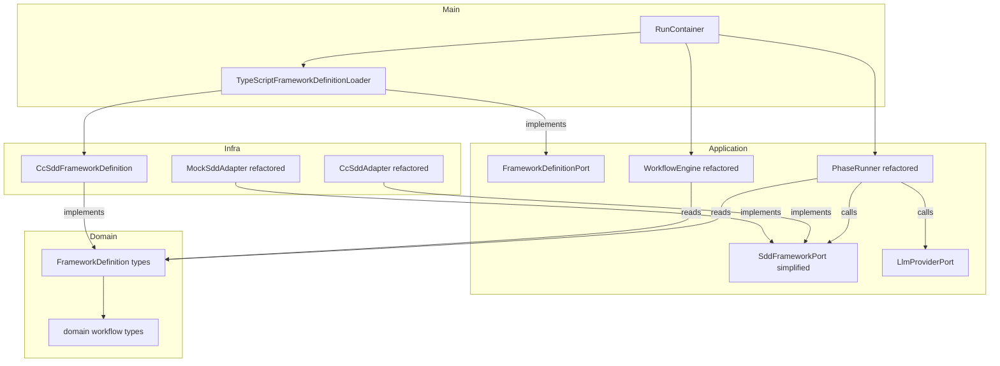
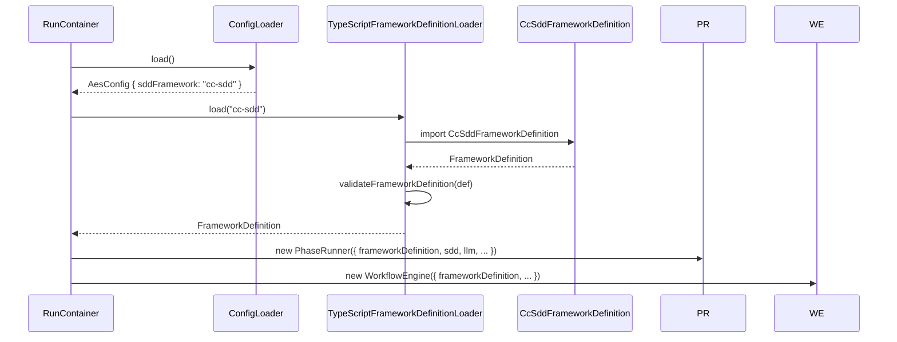
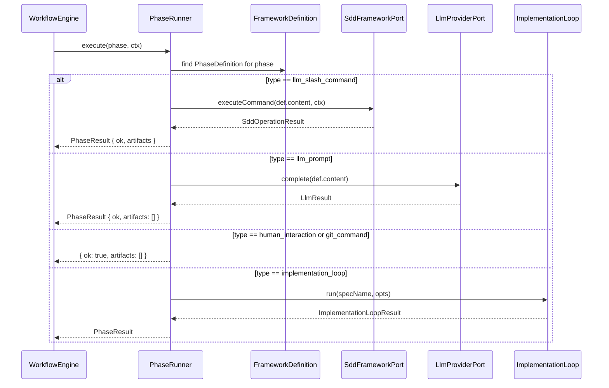
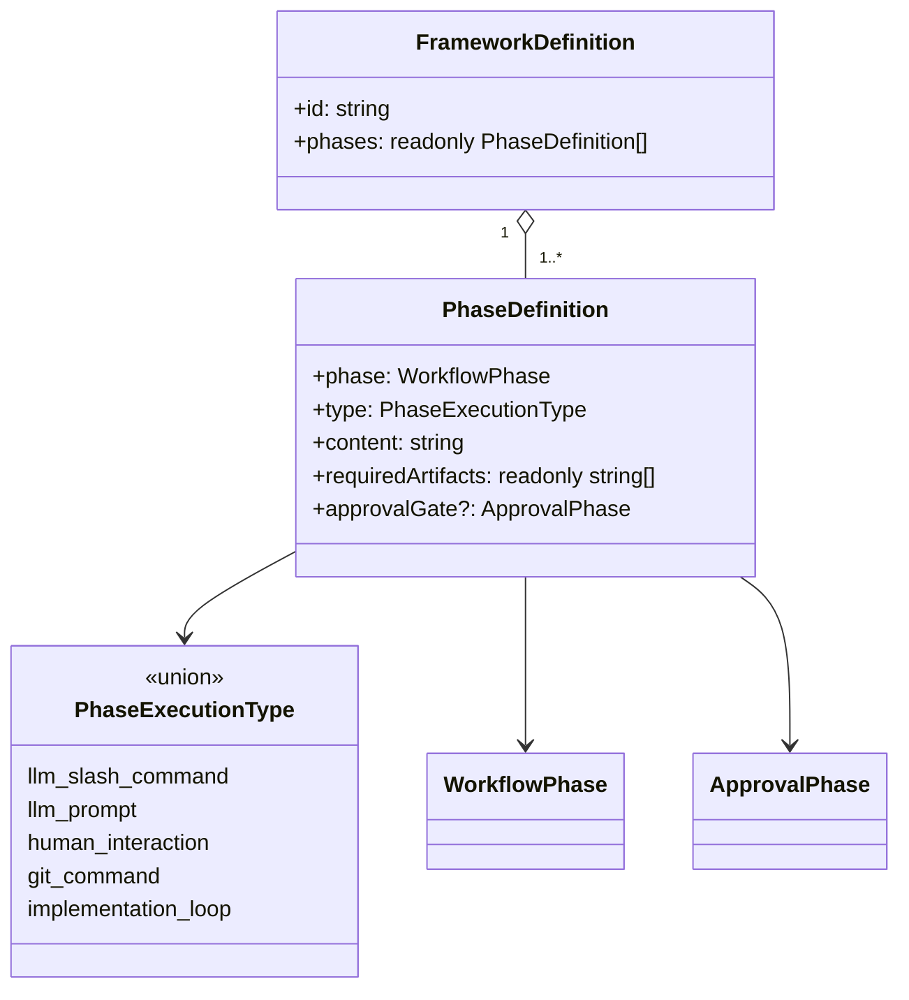

# Technical Design: Custom SDD Framework Flow Management

## Overview

This feature replaces hardcoded phase dispatch logic in the workflow orchestrator with a data-driven, per-framework definition system. The orchestrator currently embeds cc-sdd-specific behavior across four files; this change extracts that behavior into a `FrameworkDefinition` type that any SDD framework can instantiate without modifying orchestrator source.

**Purpose**: Enable multi-framework SDD support by making phase order, execution type, command content, required artifacts, and approval gates co-located in a single framework definition object.

**Users**: Orchestrator developers and operators. Developers add new SDD frameworks by writing a definition file; operators switch frameworks via `aes.config.json`.

**Impact**: Replaces the `SddFrameworkPort` named-method interface with `executeCommand`, removes `REQUIRED_ARTIFACTS` and `APPROVAL_GATE_PHASES` constants from `WorkflowEngine`, replaces the `PhaseRunner` switch statement with type-based dispatch, and activates the currently no-op LLM prompt phases.

### Goals

- All 14 cc-sdd phase behaviors defined as data in a single TypeScript file
- `PhaseRunner` dispatches based on phase type from the loaded `FrameworkDefinition`, with no hardcoded phase names
- `WorkflowEngine` derives phase order, required artifacts, and approval gates from `FrameworkDefinition`
- Five previously no-op LLM prompt phases call `LlmProviderPort.complete(promptText)` with defined inline prompts
- Framework selection controlled by `aes.config.json` `sddFramework` field (already loaded; not yet wired)

### Non-Goals

- Dynamic loading of user-supplied framework definition files from arbitrary disk paths
- Non-TypeScript definition formats (JSON, YAML)
- Framework versioning or schema evolution for framework definition files
- Real cc-sdd binary execution (the adapter's subprocess behavior is unchanged; only the interface contract changes)

---

## Requirements Traceability

| Requirement | Summary | Components | Interfaces | Flows |
|-------------|---------|------------|------------|-------|
| 1.1–1.6 | FrameworkDefinition schema with validation | `FrameworkDefinition` types, `validateFrameworkDefinition` | `FrameworkDefinition`, `PhaseDefinition`, `PhaseExecutionType` | Definition Load Flow |
| 2.1–2.9 | cc-sdd framework definition file with all 14 phases | `CcSddFrameworkDefinition` | `FrameworkDefinition` | Definition Load Flow |
| 3.1–3.9 | Data-driven PhaseRunner | `PhaseRunner` (refactored) | `PhaseRunnerDeps` | Phase Dispatch Flow |
| 4.1–4.5 | WorkflowEngine reads from FrameworkDefinition | `WorkflowEngine` (refactored) | `WorkflowEngineDeps` | Phase Execution Flow |
| 5.1–5.5 | FrameworkDefinitionPort and TypeScript loader | `FrameworkDefinitionPort`, `TypeScriptFrameworkDefinitionLoader` | `FrameworkDefinitionPort` | Definition Load Flow |
| 6.1–6.5 | Updated test doubles for two execution types | `MockSddAdapter` (refactored), `MockLlmProvider` | `SddFrameworkPort` | — |
| 7.1–7.5 | Multi-framework config-driven selection | `RunContainer` (updated), `ConfigLoader` | `AesConfig.sddFramework` | Startup Flow |
| 8.1–8.4 | Documentation updates | `docs/_partials/`, `docs/architecture/`, `.kiro/steering/` | — | — |

---

## Architecture

### Existing Architecture Analysis

The four affected files establish the current shape:

- **`domain/workflow/types.ts`**: `WORKFLOW_PHASES` frozen array drives phase order; `WorkflowPhase` type is derived from it
- **`workflow-engine.ts`**: `REQUIRED_ARTIFACTS` and `APPROVAL_GATE_PHASES` constants; `pendingPhases()` and `advancePausedPhase()` index into `WORKFLOW_PHASES`
- **`phase-runner.ts`**: 11-branch switch maps `WorkflowPhase` → `SddFrameworkPort` named method; `HUMAN_INTERACTION`, `PULL_REQUEST`, `IMPLEMENTATION` handled inline
- **`cc-sdd-adapter.ts`**: 11 named methods each calling `this.run(subcommand, ctx, artifactFile)` with cc-sdd-specific subcommand names

The `SddFrameworkPort` interface has 11 named methods that map 1:1 to cc-sdd. No `LlmProviderPort.complete()` call exists in the phase execution path today.

### Architecture Pattern & Boundary Map



**Key decisions**:
- `FrameworkDefinition` types live in `domain/workflow/` — no imports from application or infra (1.2)
- `FrameworkDefinitionPort` lives in `application/ports/` — consumed by DI container only; `PhaseRunner` and `WorkflowEngine` receive the loaded value, not the port
- `CcSddFrameworkDefinition` is a typed constant in `infra/sdd/` — concrete knowledge of cc-sdd belongs in infra
- `SddFrameworkPort` shrinks to one method; the named-method model is removed entirely

### Technology Stack

| Layer | Choice | Role in Feature | Notes |
|-------|--------|-----------------|-------|
| Language | TypeScript strict mode | All new types and interfaces | Discriminated unions for `PhaseExecutionType`; no `any` |
| Runtime | Bun v1.3.10+ | Native TypeScript execution for definition files | No build step needed for definition imports |
| Config | `aes.config.json` + env var `AES_SDD_FRAMEWORK` | Framework identifier selection at startup | Already loaded by `ConfigLoader`; wiring is the missing piece |

---

## System Flows

### Definition Load Flow (Startup)



### Phase Dispatch Flow (Runtime)



Key dispatch decisions: if `phase` is not found in `frameworkDefinition.phases`, `PhaseRunner` throws an explicit error with the unregistered phase name (3.8). `WorkflowEngine` treats this as a phase failure.

---

## Components and Interfaces

### Summary

| Component | Layer | Intent | Req Coverage | Key Dependencies | Contracts |
|-----------|-------|--------|--------------|-----------------|-----------|
| FrameworkDefinition types | Domain | Typed schema for per-phase behavior | 1.1–1.6 | `WorkflowPhase`, `ApprovalPhase` | Type |
| FrameworkDefinitionPort | Application/Ports | Load framework definition by ID | 5.1–5.3 | `FrameworkDefinition` | Service |
| PhaseRunner (refactored) | Application/Services | Data-driven phase dispatch | 3.1–3.9 | `SddFrameworkPort`, `LlmProviderPort`, `FrameworkDefinition` | Service |
| WorkflowEngine (refactored) | Application/Services | Framework-neutral workflow execution | 4.1–4.5 | `FrameworkDefinition`, `PhaseRunner` | Service |
| SddFrameworkPort (simplified) | Application/Ports | Generic SDD command execution | 3.4, 6.1–6.5 | `SpecContext`, `SddOperationResult` | Service |
| CcSddFrameworkDefinition | Infra/SDD | Concrete 14-phase cc-sdd definition | 2.1–2.9 | `FrameworkDefinition` | Type/Data |
| TypeScriptFrameworkDefinitionLoader | Infra/Config | Built-in registry loader | 5.4–5.5, 7.1–7.5 | `FrameworkDefinitionPort` | Service |
| CcSddAdapter (refactored) | Infra/SDD | Execute cc-sdd commands by name | 2.1, 3.4 | `SddFrameworkPort` | Service |
| MockSddAdapter (refactored) | Infra/SDD | Test double for llm_slash_command phases | 6.1–6.5 | `SddFrameworkPort` | Service |

---

### Domain Layer

#### FrameworkDefinition Types

| Field | Detail |
|-------|--------|
| Intent | Define the schema for a complete SDD framework: phase order, execution type, command content, artifact requirements, and approval gates |
| Requirements | 1.1, 1.2, 1.3, 1.4, 1.5, 1.6 |

**Responsibilities & Constraints**
- Lives in `src/domain/workflow/framework-definition.ts`; zero imports from application or infra layers (1.2)
- `PhaseExecutionType` is a discriminated literal union covering all five execution modes
- `PhaseDefinition.content` is always a `string`; semantic meaning differs by type (command name vs. prompt text)
- A framework definition is valid when: all `phase` values are distinct `WorkflowPhase` values, and `content` is non-empty for `llm_slash_command` and `llm_prompt` types

**Contracts**: Type [x] / Service [ ] / API [ ] / Event [ ] / Batch [ ] / State [ ]

##### Type Definitions

```typescript
// src/domain/workflow/framework-definition.ts

import type { ApprovalPhase } from "@/domain/workflow/approval-gate";
import type { WorkflowPhase } from "@/domain/workflow/types";

export type PhaseExecutionType =
  | "llm_slash_command"
  | "llm_prompt"
  | "human_interaction"
  | "git_command"
  | "implementation_loop";

export interface PhaseDefinition {
  /** The workflow phase this definition covers. Must be a valid WorkflowPhase. */
  readonly phase: WorkflowPhase;
  /** How this phase is executed. */
  readonly type: PhaseExecutionType;
  /**
   * For llm_slash_command: the command identifier passed to SddFrameworkPort.executeCommand().
   * For llm_prompt: the inline prompt text passed to LlmProviderPort.complete().
   * For other types: empty string or operational metadata (not interpreted by PhaseRunner).
   */
  readonly content: string;
  /** Filenames (relative to specDir) that must exist before this phase begins. */
  readonly requiredArtifacts: readonly string[];
  /** If set, an approval gate check occurs after this phase completes successfully. */
  readonly approvalGate?: ApprovalPhase;
}

export interface FrameworkDefinition {
  /** Unique identifier matching the value in AesConfig.sddFramework. */
  readonly id: string;
  /** Ordered list of phases. The workflow executes phases in this order. */
  readonly phases: readonly PhaseDefinition[];
}
```

- Preconditions for `FrameworkDefinition`: `phases` must contain no duplicate `phase` values; `content` must be non-empty when `type` is `llm_slash_command` or `llm_prompt`
- Postconditions: A valid `FrameworkDefinition` fully determines all runtime behavior of `PhaseRunner` and `WorkflowEngine` for a given run

**Implementation Notes**
- Integration: `validateFrameworkDefinition(def: FrameworkDefinition): void` — exported from this file; throws on constraint violations; called by `TypeScriptFrameworkDefinitionLoader` at load time
- Validation: Runtime validation at load time only; no runtime checks during phase execution (fail-fast at startup)
- Risks: If cc-sdd adds a new phase in the future, the framework definition file must be updated; the type system catches missing phases at compile time when the `WorkflowPhase` union changes

---

### Application Layer

#### FrameworkDefinitionPort

| Field | Detail |
|-------|--------|
| Intent | Abstract the mechanism for loading a `FrameworkDefinition` by framework identifier |
| Requirements | 5.1, 5.2, 5.3 |

**Contracts**: Service [x]

##### Service Interface

```typescript
// src/application/ports/framework-definition.ts

import type { FrameworkDefinition } from "@/domain/workflow/framework-definition";

export interface FrameworkDefinitionPort {
  /**
   * Load the FrameworkDefinition for the given framework identifier.
   * @throws Error if no definition is found for the identifier.
   */
  load(frameworkId: string): Promise<FrameworkDefinition>;
}
```

- Preconditions: `frameworkId` is non-empty
- Postconditions: Returns a fully-hydrated `FrameworkDefinition`; throws with a message identifying the unknown framework name if not found

---

#### SddFrameworkPort (simplified)

| Field | Detail |
|-------|--------|
| Intent | Generic interface for executing SDD slash commands by name, decoupled from cc-sdd method names |
| Requirements | 3.4, 6.1, 6.3, 6.5 |

**Contracts**: Service [x]

##### Service Interface

```typescript
// src/application/ports/sdd.ts (updated)

export interface SddFrameworkPort {
  /**
   * Execute a named SDD command. The commandName comes from PhaseDefinition.content
   * for llm_slash_command phases. The adapter maps it to the actual subprocess or operation.
   */
  executeCommand(commandName: string, ctx: SpecContext): Promise<SddOperationResult>;
}
```

- `SpecContext` and `SddOperationResult` types remain unchanged
- All 11 named methods (`initSpec`, `generateRequirements`, etc.) are removed (3.9)
- Preconditions: `commandName` matches a command the adapter knows; `ctx` contains valid spec context
- Postconditions: Returns `SddOperationResult`; never throws — errors in the `{ ok: false }` branch

---

#### PhaseRunner (refactored)

| Field | Detail |
|-------|--------|
| Intent | Execute individual workflow phases based on the type declared in the loaded `FrameworkDefinition` |
| Requirements | 3.1, 3.2, 3.3, 3.4, 3.5, 3.6, 3.7, 3.8, 3.9 |

**Dependencies**
- Inbound: `WorkflowEngine` — calls `execute(phase, ctx)` (P0)
- Outbound: `SddFrameworkPort.executeCommand()` — for `llm_slash_command` phases (P0)
- Outbound: `LlmProviderPort.complete()` — for `llm_prompt` phases (P0)
- Outbound: `IImplementationLoop.run()` — for `implementation_loop` phase (P1)

**Contracts**: Service [x]

##### Service Interface

```typescript
// src/application/services/workflow/phase-runner.ts (updated deps shape)

import type { FrameworkDefinition } from "@/domain/workflow/framework-definition";

export interface PhaseRunnerDeps {
  readonly sdd: SddFrameworkPort;
  readonly llm: LlmProviderPort;
  /** Framework definition loaded at startup; determines dispatch behavior per phase. */
  readonly frameworkDefinition: FrameworkDefinition;
  readonly implementationLoop?: IImplementationLoop;
  readonly implementationLoopOptions?: Partial<ImplementationLoopOptions>;
}
```

Dispatch logic (replaces switch statement):
1. Look up `PhaseDefinition` for `phase` in `frameworkDefinition.phases`; throw if not found (3.8)
2. `llm_slash_command` → `sdd.executeCommand(def.content, ctx)` → `mapSddResult()`
3. `llm_prompt` → interpolate `def.content` with `ctx` fields → `llm.complete(interpolatedPrompt)` → `{ ok: true, artifacts: [] }` on success, `{ ok: false, error: llmError.message }` on failure (3.2, 3.3)
4. `human_interaction` → `{ ok: true, artifacts: [] }` (3.5)
5. `implementation_loop` → delegate or stub (3.6)
6. `git_command` → `{ ok: true, artifacts: [] }` stub (3.7)

**SpecContext Interpolation for `llm_prompt` phases**

Inline prompt text in `CcSddFrameworkDefinition` may reference runtime values via `{specDir}`, `{specName}`, and `{language}` placeholders. Before calling `llm.complete()`, `PhaseRunner` applies lightweight string interpolation:

```typescript
function interpolatePrompt(template: string, ctx: SpecContext): string {
  return template
    .replace(/\{specDir\}/g, ctx.specDir)
    .replace(/\{specName\}/g, ctx.specName)
    .replace(/\{language\}/g, ctx.language);
}
```

This is a private helper in `PhaseRunner` with no external dependencies. The `CcSddFrameworkDefinition` inline prompts use these placeholders wherever file paths or spec identity are needed (e.g. `"Verify that {specDir}/requirements.md exists and is non-empty."`).

**Implementation Notes**
- The hardcoded switch statement is removed; no phase name appears in the dispatch logic (3.9)
- `onEnter()` continues to call `llm.clearContext()` — unchanged
- The private `mapSddResult()` helper maps `SddOperationResult` to `PhaseResult`; its parameter type changes from `Awaited<ReturnType<SddFrameworkPort["generateRequirements"]>>` to `SddOperationResult` (required after all named methods are removed from `SddFrameworkPort` in Phase 3)

---

#### WorkflowEngine (refactored)

| Field | Detail |
|-------|--------|
| Intent | Execute the full workflow using phase order, artifact requirements, and approval gates from `FrameworkDefinition` |
| Requirements | 4.1, 4.2, 4.3, 4.4, 4.5 |

**Dependencies**
- Inbound: `RunSpecUseCase` — calls `execute(state)` (P0)
- Outbound: `FrameworkDefinition` — phase order, `requiredArtifacts`, `approvalGate` (P0)
- Outbound: `PhaseRunner` — phase execution (P0)

**Contracts**: Service [x]

##### Service Interface

```typescript
// src/application/services/workflow/workflow-engine.ts (updated deps shape)

import type { FrameworkDefinition } from "@/domain/workflow/framework-definition";

export interface WorkflowEngineDeps {
  readonly stateStore: IWorkflowStateStore;
  readonly eventBus: IWorkflowEventBus;
  readonly phaseRunner: PhaseRunner;
  readonly approvalGate: ApprovalGate;
  readonly specDir: string;
  readonly language: string;
  /** Framework definition loaded at startup; replaces REQUIRED_ARTIFACTS, APPROVAL_GATE_PHASES, and WORKFLOW_PHASES. */
  readonly frameworkDefinition: FrameworkDefinition;
}
```

Migration points:
- `pendingPhases()`: replace `WORKFLOW_PHASES.filter(...)` with `frameworkDefinition.phases.map(p => p.phase).filter(...)`
- `checkRequiredArtifacts(phase)`: replace `REQUIRED_ARTIFACTS[phase]` with `frameworkDefinition.phases.find(p => p.phase === phase)?.requiredArtifacts ?? []`
- Approval gate lookup: replace `APPROVAL_GATE_PHASES[phase]` with `frameworkDefinition.phases.find(p => p.phase === phase)?.approvalGate`
- `advancePausedPhase()`: replace `WORKFLOW_PHASES.indexOf(pausedPhase)` with `frameworkDefinition.phases.findIndex(p => p.phase === pausedPhase)` and access `frameworkDefinition.phases[idx + 1]?.phase`
- Remove `REQUIRED_ARTIFACTS` and `APPROVAL_GATE_PHASES` constants from the file (4.4)

**Implementation Notes**
- `WORKFLOW_PHASES` constant in `domain/workflow/types.ts` is retained — it is the source of the `WorkflowPhase` type (4.5)
- Integration: `WorkflowEngine` no longer imports `WORKFLOW_PHASES` for iteration; the domain type is still imported for typing only

---

### Infrastructure Layer

#### CcSddFrameworkDefinition

| Field | Detail |
|-------|--------|
| Intent | Single-source-of-truth definition of all 14 cc-sdd workflow phases with correct types, command names, prompt text, artifacts, and approval gates |
| Requirements | 2.1, 2.2, 2.3, 2.4, 2.5, 2.6, 2.7, 2.8, 2.9 |

**Contracts**: Type [x]

**Phase Classification** (from 2.2):

| Phase | Type | Content |
|-------|------|---------|
| SPEC_INIT | `llm_slash_command` | `kiro:spec-init` |
| HUMAN_INTERACTION | `human_interaction` | `""` |
| VALIDATE_PREREQUISITES | `llm_prompt` | Inline prompt: verify `requirements.md` exists and is non-empty |
| SPEC_REQUIREMENTS | `llm_slash_command` | `kiro:spec-requirements` |
| VALIDATE_REQUIREMENTS | `llm_prompt` | Inline prompt: review `requirements.md` for completeness and testability |
| REFLECT_BEFORE_DESIGN | `llm_prompt` | Inline prompt: synthesize key constraints and open questions from `requirements.md` |
| VALIDATE_GAP | `llm_slash_command` | `kiro:validate-gap` |
| SPEC_DESIGN | `llm_slash_command` | `kiro:spec-design` |
| VALIDATE_DESIGN | `llm_slash_command` | `kiro:validate-design` |
| REFLECT_BEFORE_TASKS | `llm_prompt` | Inline prompt: synthesize design decisions and patterns from `design.md` |
| SPEC_TASKS | `llm_slash_command` | `kiro:spec-tasks` |
| VALIDATE_TASKS | `llm_prompt` | Inline prompt: review `tasks.md` for completeness and implementation readiness |
| IMPLEMENTATION | `implementation_loop` | `""` |
| PULL_REQUEST | `git_command` | `""` |

`requiredArtifacts` and `approvalGate` values mirror the current `REQUIRED_ARTIFACTS` and `APPROVAL_GATE_PHASES` constants in `workflow-engine.ts` (2.9).

**Implementation Notes**
- File location: `orchestrator-ts/src/infra/sdd/cc-sdd-framework-definition.ts`
- Exported as `export const CC_SDD_FRAMEWORK_DEFINITION: FrameworkDefinition`
- Inline prompt text for each `llm_prompt` phase is defined directly in `content` (no external files)

---

#### TypeScriptFrameworkDefinitionLoader

| Field | Detail |
|-------|--------|
| Intent | Implement `FrameworkDefinitionPort` as a static registry of built-in framework definitions |
| Requirements | 5.4, 5.5, 7.1, 7.2, 7.3, 7.4, 7.5 |

**Dependencies**
- Inbound: `RunContainer` — calls `load(frameworkId)` at startup (P0)
- Outbound: `CC_SDD_FRAMEWORK_DEFINITION` (and future definitions) — static imports (P0)

**Contracts**: Service [x]

##### Service Interface

```typescript
// src/infra/config/ts-framework-definition-loader.ts

import type { FrameworkDefinitionPort } from "@/application/ports/framework-definition";
import type { FrameworkDefinition } from "@/domain/workflow/framework-definition";
import { validateFrameworkDefinition } from "@/domain/workflow/framework-definition";
import { CC_SDD_FRAMEWORK_DEFINITION } from "@/infra/sdd/cc-sdd-framework-definition";

export class TypeScriptFrameworkDefinitionLoader implements FrameworkDefinitionPort {
  private readonly registry: ReadonlyMap<string, FrameworkDefinition>;

  constructor() {
    this.registry = new Map([
      ["cc-sdd", CC_SDD_FRAMEWORK_DEFINITION],
      // Future: ["open-spec", OPEN_SPEC_FRAMEWORK_DEFINITION]
    ]);
  }

  async load(frameworkId: string): Promise<FrameworkDefinition> {
    const def = this.registry.get(frameworkId);
    if (def === undefined) {
      const available = [...this.registry.keys()].join(", ");
      throw new Error(
        `Unknown SDD framework: "${frameworkId}". Available frameworks: ${available}`
      );
    }
    validateFrameworkDefinition(def);
    return def;
  }
}
```

- Preconditions: `frameworkId` matches a key in the registry
- Postconditions: Returns a validated `FrameworkDefinition`; throws with available framework list if unknown (5.3, 7.4)

**Requirement 7.3 clarification**: Req 7.3 states that a second framework "shall load without modifying any orchestrator source files." This is satisfied at the layer that matters: adding `open-spec` requires only (a) creating a new `infra/sdd/open-spec-framework-definition.ts` file and (b) adding one entry to the registry `Map` in this loader. No changes are needed to `PhaseRunner`, `WorkflowEngine`, `CcSddAdapter`, or any other orchestrator core file. The registry entry in `TypeScriptFrameworkDefinitionLoader` is the designed extension point — equivalent to registering a plugin. Dynamic loading from arbitrary disk paths (which would allow framework installation without any repo change) is explicitly out of scope per the Non-Goals.

---

#### CcSddAdapter (refactored)

| Field | Detail |
|-------|--------|
| Intent | Execute cc-sdd subcommands by mapping framework command names to binary subcommands and artifact paths |
| Requirements | 2.1, 3.4 |

**Contracts**: Service [x]

##### Service Interface

```typescript
// src/infra/sdd/cc-sdd-adapter.ts (updated interface)

export class CcSddAdapter implements SddFrameworkPort {
  async executeCommand(commandName: string, ctx: SpecContext): Promise<SddOperationResult>;
}
```

Internal mapping (private): `commandName → { subcommand: string; artifactFile: string }`:

| commandName | subcommand | artifactFile |
|-------------|------------|--------------|
| `kiro:spec-init` | `spec-init` | `spec.json` |
| `kiro:spec-requirements` | `requirements` | `requirements.md` |
| `kiro:validate-gap` | `validate-gap` | `requirements.md` |
| `kiro:spec-design` | `design` | `design.md` |
| `kiro:validate-design` | `validate-design` | `design.md` |
| `kiro:spec-tasks` | `tasks` | `tasks.md` |

All 11 named methods are removed. An unknown `commandName` returns `{ ok: false, error: { exitCode: 1, stderr: "Unknown command: <name>" } }`.

**Implementation Notes**
- The existing `private run(subcommand, ctx, artifactFile)` method is retained as the execution primitive
- Integration: Only `executeCommand` is exposed; the adapter's subprocess logic is unchanged

---

#### MockSddAdapter (refactored)

| Field | Detail |
|-------|--------|
| Intent | Test double for `llm_slash_command` phases; stubs artifact creation without invoking any subprocess |
| Requirements | 6.1, 6.2, 6.3, 6.4, 6.5 |

**Contracts**: Service [x]

Internal command mapping: same 6-entry map as `CcSddAdapter`, each pointing to `{ filename, stubContent }`. Commands that write content (`spec-requirements`, `spec-design`, `spec-tasks`) include stub text; commands that only validate use `content: undefined` (no-write).

`sdd:operation` debug events are emitted only from `executeCommand` — never from `LlmProviderPort.complete()` calls (6.5).

**Implementation Notes**
- `MockLlmProvider` (unchanged) handles `llm_prompt` phases in debug mode — `PhaseRunner` routes to LLM for those phases; `MockSddAdapter` is never called for them
- Integration: Existing `setReadyForImplementation()` and `writeStubTaskPlan()` helpers are retained; they are called when `generateTasks` command completes

---

### Main / DI

#### RunContainer (updated)

| Field | Detail |
|-------|--------|
| Intent | Wire `TypeScriptFrameworkDefinitionLoader`, load `FrameworkDefinition` at startup, and inject into `PhaseRunner` and `WorkflowEngine` |
| Requirements | 7.1, 7.2, 7.3, 7.4, 7.5 |

New lazy getters added:
- `frameworkDefinitionLoader`: `TypeScriptFrameworkDefinitionLoader`
- `frameworkDefinition`: `FrameworkDefinition` (loaded from `config.sddFramework`, cached after first load)

`build()` becomes async to accommodate `frameworkDefinitionLoader.load()`. The `PhaseRunner` and `WorkflowEngine` constructors receive the loaded `FrameworkDefinition`.

**Implementation Notes**
- In `debug` mode, `config.sddFramework` still selects the framework (the mock adapters implement the simplified `SddFrameworkPort`)
- If `config.sddFramework` is unknown, startup fails with `TypeScriptFrameworkDefinitionLoader`'s error listing available frameworks (7.4)
- Default remains `cc-sdd` if `sddFramework` is absent from config (7.5, already enforced by `ConfigLoader.parseSddFramework`)

---

## Data Models

### Domain Model



Invariants:
- All `PhaseDefinition.phase` values within a `FrameworkDefinition` are distinct
- `content` is non-empty when `type` is `llm_slash_command` or `llm_prompt`
- `approvalGate` is present only for phases that pause for human review (HUMAN_INTERACTION, SPEC_REQUIREMENTS, VALIDATE_DESIGN, SPEC_TASKS in cc-sdd)

---

## Error Handling

### Error Strategy

All errors in the dispatch path use the existing `{ ok: false }` discriminated union pattern. No exceptions propagate outside `PhaseRunner.execute()` — errors become `PhaseResult { ok: false, error: string }`.

### Error Categories and Responses

**Unregistered Phase**
- Trigger: `frameworkDefinition.phases` has no entry for the requested `WorkflowPhase`
- Response: Throw `Error("Unregistered workflow phase: ${phase} in framework ${frameworkDefinition.id}")` — treated by `WorkflowEngine` as a phase failure
- This represents a misconfigured framework definition, caught at startup via `validateFrameworkDefinition` in normal operation; this throw is a safeguard

**Unknown Framework ID**
- Trigger: `config.sddFramework` has a value not in the loader's registry
- Response: Throw at startup in `TypeScriptFrameworkDefinitionLoader.load()` with a message listing available frameworks — the process exits before any phase runs

**LLM Prompt Failure**
- Trigger: `llm.complete()` returns `{ ok: false, error: LlmError }`
- Response: `PhaseResult { ok: false, error: error.message }` — `WorkflowEngine` emits `phase:error` and transitions to `failed` state

**SDD Command Failure**
- Trigger: `sdd.executeCommand()` returns `{ ok: false, error: { exitCode, stderr } }`
- Response: Existing `mapSddResult()` logic unchanged — `"${stderr} (exit ${exitCode})"` or `"SDD adapter failed (exit ${exitCode})"` for empty stderr

### Monitoring

`phase:error` events are emitted by `WorkflowEngine` for all phase failures, including the new `llm_prompt` failure path. No new event types are introduced.

---

## Testing Strategy

### Unit Tests — PhaseRunner

- `execute(phase, ctx)` for each `llm_slash_command` phase: verify `sdd.executeCommand()` called with correct command name from `FrameworkDefinition`
- `execute(phase, ctx)` for each `llm_prompt` phase: verify `llm.complete()` called with correct prompt text from `FrameworkDefinition`
- `execute(phase, ctx)` for `llm_prompt` phase when `llm.complete()` returns `{ ok: false }`: verify `PhaseResult { ok: false, error: ... }`
- `execute()` for unregistered phase: verify throws with phase name in message
- `execute()` for `human_interaction`, `git_command`: verify `{ ok: true, artifacts: [] }` and no calls to sdd or llm
- Existing `implementation_loop` tests: update `PhaseRunner` constructor to include a stub `frameworkDefinition`

### Unit Tests — WorkflowEngine

- `pendingPhases()` returns phases in `frameworkDefinition.phases` order
- `checkRequiredArtifacts()` reads from `phaseDefinition.requiredArtifacts`
- Approval gate check reads `phaseDefinition.approvalGate`
- `advancePausedPhase()` uses framework definition index for next-phase lookup
- No references to `REQUIRED_ARTIFACTS` or `APPROVAL_GATE_PHASES` remain

### Unit Tests — TypeScriptFrameworkDefinitionLoader

- `load("cc-sdd")` returns a validated `FrameworkDefinition` with 14 phases
- `load("unknown-fw")` throws with a message containing `"cc-sdd"` in the available list
- `load("open-spec")` throws when not yet registered

### Unit Tests — CcSddAdapter

- `executeCommand("kiro:spec-requirements", ctx)` spawns `cc-sdd requirements ...` and returns correct `artifactPath`
- `executeCommand("unknown-command", ctx)` returns `{ ok: false }` without spawning

### Integration Tests

- Full workflow run with `cc-sdd` framework definition and mock adapters completes all 14 phases in correct order
- `llm_prompt` phases call `MockLlmProvider.complete()` with non-empty prompt text from the cc-sdd definition

---

## Migration Strategy

The migration is a refactoring with no change to external behavior. Phases execute in the same order; artifacts and approval gates are unchanged.

**Phase 1**: Add domain types and application port
- Create `src/domain/workflow/framework-definition.ts` with `FrameworkDefinition`, `PhaseDefinition`, `PhaseExecutionType`, `validateFrameworkDefinition`
- Create `src/application/ports/framework-definition.ts` with `FrameworkDefinitionPort`

**Phase 2**: Create cc-sdd framework definition and loader
- Create `src/infra/sdd/cc-sdd-framework-definition.ts` with all 14 phases, verified against existing `REQUIRED_ARTIFACTS` and `APPROVAL_GATE_PHASES` constants
- Create `src/infra/config/ts-framework-definition-loader.ts`

**Phase 3**: Simplify `SddFrameworkPort` and update adapters
- Replace 11 named methods with `executeCommand` in `src/application/ports/sdd.ts`
- Update `CcSddAdapter` to implement `executeCommand` with internal command map
- Update `MockSddAdapter` to implement `executeCommand` with stub behavior

**Phase 4**: Refactor `PhaseRunner`
- Add `frameworkDefinition: FrameworkDefinition` to `PhaseRunnerDeps`
- Replace switch statement with type-based dispatch
- Update all test mocks in `tests/domain/phase-runner.test.ts`

**Phase 5**: Refactor `WorkflowEngine`
- Add `frameworkDefinition: FrameworkDefinition` to `WorkflowEngineDeps`
- Replace `WORKFLOW_PHASES`, `REQUIRED_ARTIFACTS`, `APPROVAL_GATE_PHASES` usages
- Remove the two constants from the file

**Phase 6**: Update DI container and documentation
- Update `RunContainer` to load `FrameworkDefinition` and inject into `PhaseRunner` and `WorkflowEngine`
- Update documentation per Requirement 8

Each phase is independently testable. Rollback is a revert to the previous commit since no schema or state format changes are introduced.
