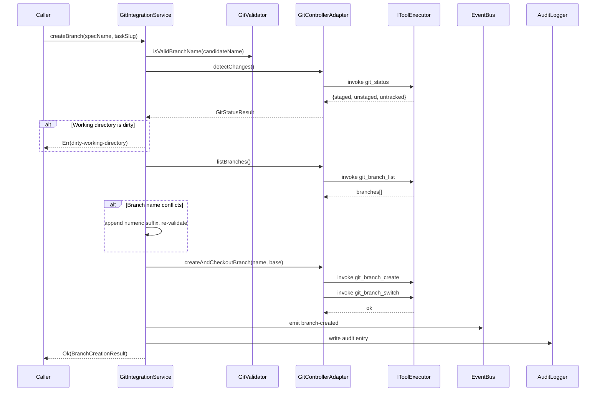
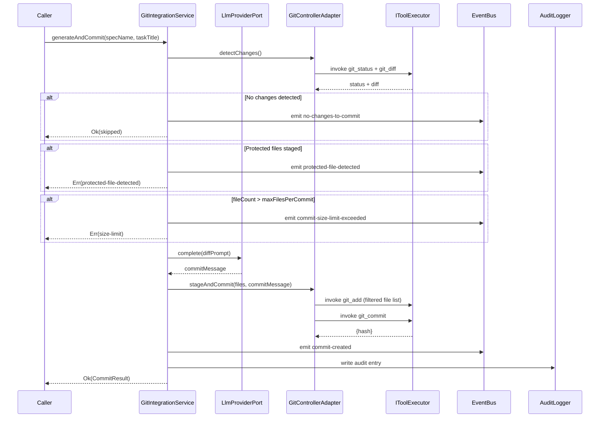
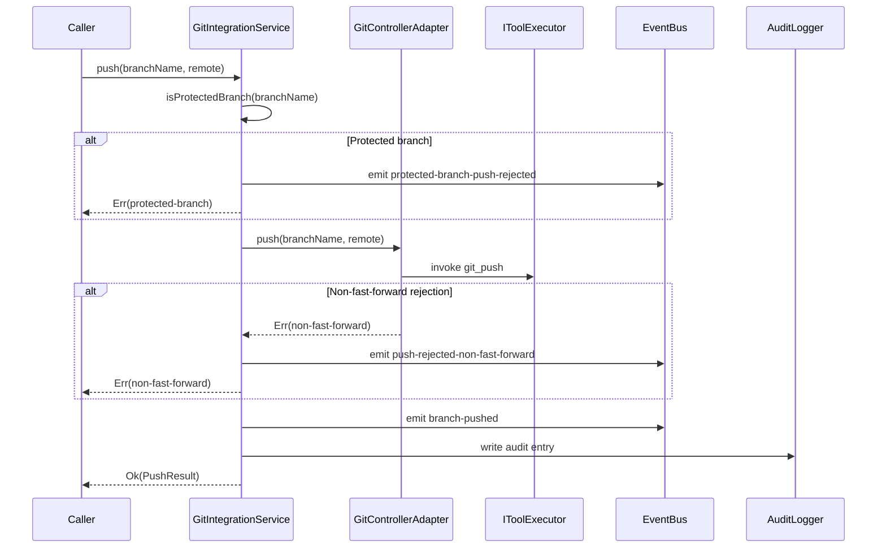
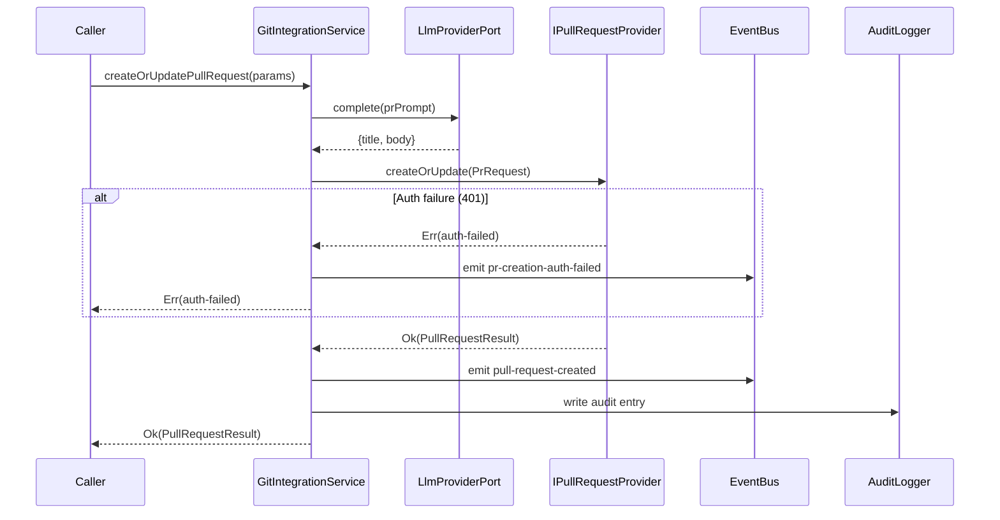

# Design Document: Git Integration

## Overview

The git-integration feature delivers a Git Controller that encapsulates all repository operations required to carry a specification from initial implementation through to a reviewable pull request. It is consumed exclusively by the autonomous development pipeline — specifically the implementation engine and task-planning components — which interact with Git through the `IGitController` port rather than invoking CLI tools or hosting APIs directly.

The feature introduces a `GitIntegrationService` in the application layer that orchestrates four sequential workflow stages: feature branch creation, commit automation (change detection → LLM-generated message → protected-file filtering → commit), remote push with safety checks, and PR creation or update via a hosting-provider adapter. All local git CLI operations route through the existing tool-system (`IToolExecutor`); all remote PR operations route through a provider-specific `IPullRequestProvider` adapter.

**Impact**: Adds three new directories (`domain/git/`, `application/git/`, `adapters/git/`) and two new tool definitions to `adapters/tools/git.ts`. No existing files require structural changes beyond the addition of new tool registrations.

### Goals

- Automate branch creation, commit, push, and PR creation with no manual git interaction.
- Enforce safety invariants: protected-branch push rejection, force-push prohibition, protected-file exclusion, workspace isolation, and per-operation consecutive-failure escalation.
- Decouple core logic from GitHub/GitLab implementation details via the `IPullRequestProvider` port.

### Non-Goals

- Git rebase, merge, or conflict resolution workflows.
- Multi-remote configurations (single remote per workspace).
- GitLab adapter implementation (port is defined; adapter is deferred to a future spec).
- CI/CD pipeline integration beyond PR creation.

---

## Requirements Traceability

| Requirement | Summary | Components | Interfaces | Flows |
|-------------|---------|------------|------------|-------|
| 1.1 | Create branch from base branch | GitIntegrationService, GitControllerAdapter | IGitController.createBranch | Branch Creation Flow |
| 1.2 | Derive branch name from spec/task metadata | GitIntegrationService | IGitController.createBranch | Branch Creation Flow |
| 1.3 | Append numeric suffix on name collision | GitIntegrationService, GitControllerAdapter | IGitController.createBranch | Branch Creation Flow |
| 1.4 | Error when base branch missing in remote | GitControllerAdapter | IGitController.createBranch | Branch Creation Flow |
| 1.5 | Verify clean working directory before branch | GitControllerAdapter | IGitController.detectChanges | Branch Creation Flow |
| 1.6 | Emit `branch-created` event | GitIntegrationService | IGitEventBus.emit | Branch Creation Flow |
| 2.1 | Detect staged and unstaged changes | GitControllerAdapter | IGitController.detectChanges | Commit Automation Flow |
| 2.2 | Invoke LLM to generate commit message | GitIntegrationService | LlmProviderPort.complete | Commit Automation Flow |
| 2.3 | Validate commit against maxFilesPerCommit | GitIntegrationService | — | Commit Automation Flow |
| 2.4 | Reject and emit event when limit exceeded | GitIntegrationService | IGitEventBus.emit | Commit Automation Flow |
| 2.5 | Stage files excluding protected patterns, then commit | GitControllerAdapter | IGitController.stageAndCommit | Commit Automation Flow |
| 2.6 | Skip commit and warn when no changes | GitIntegrationService | IGitEventBus.emit | Commit Automation Flow |
| 2.7 | Reject and emit error for protected files | GitControllerAdapter | IGitController.stageAndCommit | Commit Automation Flow |
| 2.8 | Emit `commit-created` event on success | GitIntegrationService | IGitEventBus.emit | Commit Automation Flow |
| 3.1 | Push feature branch to configured remote | GitControllerAdapter | IGitController.push | Push Flow |
| 3.2 | Reject push to protected branch, emit error | GitIntegrationService | IGitEventBus.emit | Push Flow |
| 3.3 | Prohibit force push by default | GitIntegrationService | — | Push Flow |
| 3.4 | Reject on non-fast-forward, emit error | GitControllerAdapter | IGitController.push | Push Flow |
| 3.5 | Emit `branch-pushed` event on success | GitIntegrationService | IGitEventBus.emit | Push Flow |
| 4.1 | Create PR via hosting API after push | GitHubPrAdapter | IPullRequestProvider.createOrUpdate | PR Creation Flow |
| 4.2 | LLM-generated PR title and body | GitIntegrationService | LlmProviderPort.complete | PR Creation Flow |
| 4.3 | Include spec name, artifact link, task summary | GitIntegrationService | — | PR Creation Flow |
| 4.4 | Emit `pr-creation-auth-failed` on 401 | GitHubPrAdapter | IPullRequestProvider.createOrUpdate | PR Creation Flow |
| 4.5 | Update existing PR instead of duplicating | GitHubPrAdapter | IPullRequestProvider.createOrUpdate | PR Creation Flow |
| 4.6 | Emit `pull-request-created` event on success | GitIntegrationService | IGitEventBus.emit | PR Creation Flow |
| 4.7 | Set draft status when implementation incomplete | GitHubPrAdapter | IPullRequestProvider.createOrUpdate | PR Creation Flow |
| 5.1 | Expose all operations via IGitController port | IGitController | application/ports/git-controller.ts | — |
| 5.2 | Implement port in adapter, replaceable without core changes | GitControllerAdapter | IGitController | — |
| 5.3 | Provider-specific PR adapters share IPullRequestProvider | GitHubPrAdapter, GitLabPrAdapter | IPullRequestProvider | — |
| 5.4 | Use tool-system git tools for all local CLI ops | GitControllerAdapter | IToolExecutor | — |
| 5.5 | No direct git SDK imports in application/domain layers | All | Architecture rule | — |
| 6.1 | Workspace isolation: reject paths outside workspace root | GitValidator | GitValidator.isWithinWorkspace | — |
| 6.2 | Audit log entry for every git operation | GitIntegrationService | IAuditLogger.write | — |
| 6.3 | Permission denied → ToolError with category "permission" | GitControllerAdapter | IGitController | — |
| 6.4 | Respect gitWrite PermissionSet flag | GitControllerAdapter, tool executor | PermissionSet | — |
| 6.5 | Pause and escalate after 3 consecutive identical failures | GitIntegrationService | IGitEventBus.emit | — |
| 6.6 | Validate branch names against Git ref-name rules | GitValidator | GitValidator.isValidBranchName | — |

---

## Architecture

### Existing Architecture Analysis

The project follows hexagonal (ports & adapters) clean architecture with the dependency flow: Domain → Application (ports) → Adapters → Infrastructure. Key existing patterns relevant to this feature:

- **Tool system**: `IToolExecutor` in `application/tools/executor.ts` is the gateway for all external CLI operations. All git tools live in `adapters/tools/git.ts`.
- **Port interfaces**: Defined in `application/ports/`; implemented in `adapters/`. The application layer depends only on port interfaces.
- **Event bus**: `IWorkflowEventBus` / `WorkflowEvent` discriminated union in `application/ports/workflow.ts` and `infra/events/workflow-event-bus.ts`. The git-integration event bus mirrors this pattern.
- **LLM provider**: `LlmProviderPort` in `application/ports/llm.ts` — injected into services needing text generation.
- **Audit logger**: `IAuditLogger` / `AuditEntry` in `application/safety/ports.ts` — used by services for immutable operation logs.
- **Permission system**: `PermissionSet` flags (`gitWrite`, `networkAccess`) enforced by `ToolExecutor` at tool invocation time.

### Architecture Pattern & Boundary Map

```mermaid
graph TB
    subgraph Domain
        GitTypes[domain/git/types.ts]
        GitValidator[domain/git/git-validator.ts]
    end

    subgraph Application
        GitService[application/git/git-integration-service.ts]
        GitControllerPort[application/ports/git-controller.ts]
        PrProviderPort[application/ports/pr-provider.ts]
        LlmPort[application/ports/llm.ts]
        AuditPort[application/safety/ports.ts]
    end

    subgraph Adapters
        GitCtrlAdapter[adapters/git/git-controller-adapter.ts]
        GithubAdapter[adapters/git/github-pr-adapter.ts]
        GitlabAdapter[adapters/git/gitlab-pr-adapter.ts]
        GitTools[adapters/tools/git.ts]
        AuditLogger[adapters/safety/audit-logger.ts]
    end

    subgraph Infra
        ToolExecutor[infra/tools/executor.ts]
        EventBus[infra/events/git-event-bus.ts]
    end

    GitService --> GitControllerPort
    GitService --> PrProviderPort
    GitService --> LlmPort
    GitService --> AuditPort
    GitService --> GitValidator
    GitService --> GitTypes

    GitCtrlAdapter --> GitControllerPort
    GitCtrlAdapter --> ToolExecutor
    GitCtrlAdapter --> GitValidator
    GitCtrlAdapter --> GitTools

    GithubAdapter --> PrProviderPort
    GitlabAdapter --> PrProviderPort
```



**Key decisions**:
- `GitIntegrationService` holds all orchestration logic and never references `child_process`, git SDKs, or HTTP clients directly.
- `GitControllerAdapter` is the only component that calls `IToolExecutor.invoke` for git CLI operations.
- `GitHubPrAdapter` and `GitLabPrAdapter` are provider-specific; both implement `IPullRequestProvider`.
- Domain layer (`GitValidator`) enforces pure business rules (branch name validation, workspace path containment, protected pattern matching) with no I/O.

### Technology Stack

| Layer | Choice / Version | Role in Feature | Notes |
|-------|------------------|-----------------|-------|
| Backend / Services | TypeScript (strict), Bun v1.3.10+ | Service implementation | Existing stack |
| Git CLI | `git` via new `git_add` / `git_push` tools | Local repository operations | Added to `adapters/tools/git.ts` as part of this feature |
| GitHub API | GitHub REST API v2022-11-28 via native `fetch` | PR creation / update | No SDK; Bun includes `fetch` |
| GitLab API | GitLab REST API v4 via native `fetch` (deferred) | MR creation (future) | Same `IPullRequestProvider` contract |
| Messaging / Events | `IGitEventBus` (sync, in-process) | Git operation observability | Mirrors `IWorkflowEventBus` pattern |
| Infrastructure / Runtime | Bun runtime, existing `IAuditLogger` | Audit persistence | Existing infra |

---

## System Flows

### Branch Creation Flow



### Commit Automation Flow



**Flow-level decisions**: Protected file detection and file-count validation occur before the LLM call to avoid wasting tokens on commits that will be rejected. The git diff is truncated to `maxDiffTokens` before prompt construction.

### Push Flow



### PR Creation Flow



---

## Components and Interfaces

### Summary Table

| Component | Domain/Layer | Intent | Req Coverage | Key Dependencies (P0/P1) | Contracts |
|-----------|--------------|--------|--------------|--------------------------|-----------|
| GitIntegrationService | Application | Orchestrates branch, commit, push, PR workflow | 1.1–6.6 | IGitController (P0), IPullRequestProvider (P0), LlmProviderPort (P0), IGitEventBus (P0), IAuditLogger (P1) | Service |
| IGitController | Application Port | Contract for local git CLI operations | 5.1, 5.2 | — | Service |
| IPullRequestProvider | Application Port | Contract for PR/MR creation on hosting providers | 5.3 | — | Service |
| IGitEventBus | Application Port | Typed event bus for git-specific events | 1.6, 2.4, 2.6–2.8, 3.2, 3.4–3.5, 4.4, 4.6, 6.5 | — | Event |
| GitControllerAdapter | Adapter | IGitController implementation via IToolExecutor | 5.2, 5.4, 5.5 | IToolExecutor (P0), GitValidator (P0) | Service |
| GitHubPrAdapter | Adapter | IPullRequestProvider implementation for GitHub REST API | 4.1, 4.4, 4.5, 4.7 | networkAccess permission (P0) | Service |
| GitLabPrAdapter | Adapter | IPullRequestProvider implementation for GitLab REST API | 4.1 (deferred) | networkAccess permission (P0) | Service |
| GitValidator | Domain | Branch name validation, protected pattern matching, workspace isolation | 1.3, 6.1, 6.6 | — | Service |
| git_add tool | Adapter/Tool | Stage specified files via git add | 2.5, 5.4 | gitWrite permission (P0) | — |
| git_push tool | Adapter/Tool | Push branch to remote with rejection detection | 3.1, 3.4, 5.4 | gitWrite permission (P0) | — |

---

### Domain Layer

#### GitTypes (`domain/git/types.ts`)

| Field | Detail |
|-------|--------|
| Intent | Define all Git domain value types, aggregates, event union, and configuration |
| Requirements | 1.1–1.6, 2.1–2.8, 3.1–3.5, 4.1–4.7, 6.1–6.6 |

**Responsibilities & Constraints**
- Defines immutable value types; no I/O or mutable state.
- `GitEvent` is the canonical discriminated union for all emittable git events.
- All configuration types are `Readonly<>` to prevent accidental mutation.

**Contracts**: State [x]

##### State Management

```typescript
// domain/git/types.ts

export interface GitIntegrationConfig {
  readonly baseBranch: string;
  readonly remote: string;
  readonly maxFilesPerCommit: number;
  readonly maxDiffTokens: number;
  readonly protectedBranches: ReadonlyArray<string>;
  readonly protectedFilePatterns: ReadonlyArray<string>;
  readonly forcePushEnabled: boolean;
  readonly workspaceRoot: string;
  readonly isDraft: boolean;
}

export interface GitChangesResult {
  readonly staged: ReadonlyArray<string>;
  readonly unstaged: ReadonlyArray<string>;
  readonly untracked: ReadonlyArray<string>;
}

export interface BranchCreationResult {
  readonly branchName: string;
  readonly baseBranch: string;
  readonly conflictResolved: boolean;
}

export interface CommitResult {
  readonly hash: string;
  readonly message: string;
  readonly fileCount: number;
}

export interface PushResult {
  readonly remote: string;
  readonly branchName: string;
  readonly commitHash: string;
}

export interface PullRequestResult {
  readonly url: string;
  readonly title: string;
  readonly targetBranch: string;
  readonly isDraft: boolean;
}

export interface PullRequestParams {
  readonly specName: string;
  readonly branchName: string;
  readonly targetBranch: string;
  readonly title: string;
  readonly body: string;
  readonly isDraft: boolean;
  readonly specArtifactPath: string;
  readonly completedTasks: ReadonlyArray<string>;
}

export type GitEvent =
  | { readonly type: "branch-created"; readonly branchName: string; readonly baseBranch: string; readonly timestamp: string }
  | { readonly type: "commit-created"; readonly hash: string; readonly message: string; readonly fileCount: number; readonly timestamp: string }
  | { readonly type: "branch-pushed"; readonly remote: string; readonly branchName: string; readonly commitHash: string; readonly timestamp: string }
  | { readonly type: "pull-request-created"; readonly url: string; readonly title: string; readonly targetBranch: string; readonly timestamp: string }
  | { readonly type: "commit-size-limit-exceeded"; readonly fileCount: number; readonly maxAllowed: number; readonly timestamp: string }
  | { readonly type: "no-changes-to-commit"; readonly timestamp: string }
  | { readonly type: "protected-file-detected"; readonly files: ReadonlyArray<string>; readonly timestamp: string }
  | { readonly type: "protected-branch-push-rejected"; readonly branchName: string; readonly timestamp: string }
  | { readonly type: "push-rejected-non-fast-forward"; readonly remote: string; readonly branchName: string; readonly timestamp: string }
  | { readonly type: "pr-creation-auth-failed"; readonly provider: string; readonly guidance: string; readonly timestamp: string }
  | { readonly type: "repeated-git-failure"; readonly operation: string; readonly attemptCount: number; readonly timestamp: string };
```

**Implementation Notes**
- All `timestamp` fields use ISO 8601 UTC strings.
- `GitEvent` must remain exhaustive; add new variants here when requirements expand.

---

#### GitValidator (`domain/git/git-validator.ts`)

| Field | Detail |
|-------|--------|
| Intent | Pure validation logic for branch names, protected patterns, and workspace paths |
| Requirements | 1.3, 6.1, 6.6 |

**Responsibilities & Constraints**
- All methods are pure functions (no I/O, no side effects).
- `isValidBranchName` implements Git ref-name rules per `git-check-ref-format` specification.
- `matchesProtectedPattern` supports glob-style patterns (e.g., `release/*`) without external libraries.
- `isWithinWorkspace` uses `path.resolve` normalization to prevent path traversal bypasses.

**Contracts**: Service [x]

##### Service Interface

```typescript
// domain/git/git-validator.ts

export interface IGitValidator {
  isValidBranchName(name: string): boolean;
  matchesProtectedPattern(branchName: string, patterns: ReadonlyArray<string>): boolean;
  isWithinWorkspace(filePath: string, workspaceRoot: string): boolean;
  filterProtectedFiles(
    files: ReadonlyArray<string>,
    patterns: ReadonlyArray<string>,
  ): { readonly safe: ReadonlyArray<string>; readonly blocked: ReadonlyArray<string> };
}
```

- Preconditions: `workspaceRoot` must be an absolute path.
- Postconditions: `isValidBranchName` returns `false` for names containing `~`, `^`, `:`, `?`, `*`, `[`, `\`, `..`, `@{`, control characters, or names starting/ending with `.` or `/` or ending with `.lock`.
- Invariants: Pure; no mutation.

**Implementation Notes**
- Integration: Injected into `GitIntegrationService` and `GitControllerAdapter`.
- Risks: Glob matching must handle `**` correctly; if complexity grows, consider a single-dependency microlibrary (e.g., `picomatch`) in the adapter layer only.

---

### Application Layer

#### IGitController (`application/ports/git-controller.ts`)

| Field | Detail |
|-------|--------|
| Intent | Port contract defining all local git CLI operations |
| Requirements | 5.1, 5.2, 5.4 |

**Contracts**: Service [x]

##### Service Interface

```typescript
// application/ports/git-controller.ts

import type { ToolError } from "../../domain/tools/types";
import type {
  BranchCreationResult,
  CommitResult,
  GitChangesResult,
  PushResult,
} from "../../domain/git/types";

export type GitResult<T> =
  | { readonly ok: true; readonly value: T }
  | { readonly ok: false; readonly error: ToolError };

export interface IGitController {
  /**
   * List existing local branches.
   */
  listBranches(): Promise<GitResult<ReadonlyArray<string>>>;

  /**
   * Check for staged/unstaged/untracked changes in the working directory.
   */
  detectChanges(): Promise<GitResult<GitChangesResult>>;

  /**
   * Create a new branch from baseBranch and check it out.
   * Preconditions: branchName passes GitValidator.isValidBranchName; working directory is clean.
   */
  createAndCheckoutBranch(branchName: string, baseBranch: string): Promise<GitResult<BranchCreationResult>>;

  /**
   * Stage the given files and create a commit with the provided message.
   * Protected files must be excluded by the caller before invoking this method.
   * Preconditions: files is non-empty; all paths are within workspaceRoot.
   */
  stageAndCommit(files: ReadonlyArray<string>, message: string): Promise<GitResult<CommitResult>>;

  /**
   * Push the local branch to the named remote.
   * Force push is never performed; non-fast-forward is surfaced as an error.
   */
  push(branchName: string, remote: string): Promise<GitResult<PushResult>>;
}
```

---

#### IPullRequestProvider (`application/ports/pr-provider.ts`)

| Field | Detail |
|-------|--------|
| Intent | Port contract for creating or updating pull/merge requests on a hosting provider |
| Requirements | 5.3, 4.1, 4.4, 4.5, 4.7 |

**Contracts**: Service [x]

##### Service Interface

```typescript
// application/ports/pr-provider.ts

import type { PullRequestParams, PullRequestResult } from "../../domain/git/types";

export type PrErrorCategory = "auth" | "conflict" | "network" | "api";

export interface PrError {
  readonly category: PrErrorCategory;
  readonly message: string;
  readonly statusCode?: number;
}

export type PrResult =
  | { readonly ok: true; readonly value: PullRequestResult }
  | { readonly ok: false; readonly error: PrError };

export interface IPullRequestProvider {
  /**
   * Create a new pull request, or update the existing one if the branch already has an open PR.
   * Postconditions: On success, returns the PR URL. On 401, error.category === "auth".
   */
  createOrUpdate(params: PullRequestParams): Promise<PrResult>;
}
```

---

#### IGitEventBus (`application/ports/git-event-bus.ts`)

Defined in its own file for separation of concerns.

**Contracts**: Event [x]

##### Event Contract

```typescript
export interface IGitEventBus {
  emit(event: GitEvent): void;
  on(handler: (event: GitEvent) => void): void;
  off(handler: (event: GitEvent) => void): void;
}
```

- Published events: all 11 variants of `GitEvent` (see Data Models).
- Ordering / delivery guarantees: Synchronous, in-process delivery; handlers are invoked in registration order.

---

#### GitIntegrationService (`application/git/git-integration-service.ts`)

| Field | Detail |
|-------|--------|
| Intent | Orchestrate the full git workflow: branch → commit → push → PR |
| Requirements | 1.1–1.6, 2.1–2.8, 3.1–3.5, 4.1–4.7, 6.2, 6.5 |

**Responsibilities & Constraints**
- Primary responsibility: coordinate `IGitController`, `IPullRequestProvider`, `LlmProviderPort`, `IGitEventBus`, and `IAuditLogger` to implement the four-stage workflow.
- Tracks consecutive failure counts per operation type (`Map<string, number>`); pauses and emits `repeated-git-failure` after 3 consecutive failures of the same operation type (e.g., 3 failed `commit` calls), regardless of the operation's parameters.
- Does not call `child_process`, `fetch`, or any external SDK directly.

**Dependencies**
- Inbound: Workflow engine / implementation engine — initiates each workflow stage (P0).
- Outbound: `IGitController` — local git operations (P0); `IPullRequestProvider` — PR creation (P0); `LlmProviderPort` — message generation (P0); `IGitEventBus` — event emission (P0); `IAuditLogger` — audit persistence (P1); `IGitValidator` — validation (P0).

**Contracts**: Service [x]

##### Service Interface

```typescript
// application/git/git-integration-service.ts

import type { GitIntegrationConfig, BranchCreationResult, CommitResult, PushResult, PullRequestResult } from "../../domain/git/types";
import type { GitResult } from "../ports/git-controller";
import type { ToolError } from "../../domain/tools/types";

export interface GitWorkflowParams {
  readonly specName: string;
  readonly taskTitle: string;
  readonly taskSlug: string;
  readonly specArtifactPath: string;
  readonly completedTasks: ReadonlyArray<string>;
  readonly isDraft: boolean;
}

export interface IGitIntegrationService {
  /**
   * Create an isolated feature branch for the given spec.
   * Appends a numeric suffix if the derived branch name already exists.
   * Preconditions: working directory is clean.
   */
  createBranch(specName: string, taskSlug: string): Promise<GitResult<BranchCreationResult>>;

  /**
   * Detect changes, generate a commit message via LLM, and commit after safety checks.
   */
  generateAndCommit(specName: string, taskTitle: string): Promise<GitResult<CommitResult>>;

  /**
   * Push the current branch to the configured remote, enforcing protected-branch and force-push rules.
   */
  push(branchName: string): Promise<GitResult<PushResult>>;

  /**
   * Create or update a pull request for the feature branch.
   * Preconditions: permissions.networkAccess must be true; returns ToolError { type: "permission" } otherwise.
   */
  createOrUpdatePullRequest(params: GitWorkflowParams): Promise<GitResult<PullRequestResult>>;

  /**
   * Execute the full workflow: createBranch → generateAndCommit → push → createOrUpdatePullRequest.
   * Halts and returns the first error encountered.
   */
  runFullWorkflow(params: GitWorkflowParams): Promise<GitResult<PullRequestResult>>;
}
```

- Preconditions: `config.workspaceRoot` must be an absolute path; `config.baseBranch` must exist locally; `permissions.networkAccess` must be `true` before calling `createOrUpdatePullRequest` — returns `ToolError { type: "permission" }` if `false`.
- Postconditions: On `runFullWorkflow` success, a PR URL is returned. On any stage failure, the error is returned and subsequent stages are skipped.
- Invariants: `consecutiveFailureCounts` resets to 0 on each successful operation of that type.

**Implementation Notes**
- Integration: Constructed at the composition root with all six injected interface dependencies and config.
- Validation: Branch name derived as `agent/<specName>` or `agent/<taskSlug>`; validated before every attempt; suffix `-N` appended (N = 2..99) on collision.
- Risks: LLM-generated commit messages may occasionally exceed subject-line length guidelines; truncation at 72 characters for the title is enforced in the service before calling `stageAndCommit`.

---

### Adapter Layer

#### GitControllerAdapter (`adapters/git/git-controller-adapter.ts`)

| Field | Detail |
|-------|--------|
| Intent | Implement IGitController by delegating all local git operations to IToolExecutor |
| Requirements | 5.2, 5.4, 5.5, 1.4, 1.5, 2.5, 2.7, 3.1, 3.4, 6.3, 6.4 |

**Responsibilities & Constraints**
- Calls `IToolExecutor.invoke` for each git tool; never calls `child_process` or git SDKs directly.
- Performs protected-file filtering before calling `git_add` (via `IGitValidator.filterProtectedFiles`).
- Maps tool-level `ToolError` (type `"permission"`) directly to `GitResult` errors.

**Dependencies**
- Outbound: `IToolExecutor` — tool invocation (P0); `IGitValidator` — file filtering (P0).
- External: `adapters/tools/git.ts` tool names (`git_status`, `git_diff`, `git_add`, `git_commit`, `git_branch_list`, `git_branch_create`, `git_branch_switch`, `git_push`) — via string names passed to `IToolExecutor.invoke`.

**Contracts**: Service [x]

**Implementation Notes**
- Integration: Implements `IGitController`; constructed with `IToolExecutor`, `IGitValidator`, and `ToolContext`.
- Validation: Non-fast-forward push rejections cause `git push` to exit non-zero; `ToolExecutor` returns `{ ok: false, error: { type: "runtime", message: "..." } }`. `GitControllerAdapter` inspects `error.message.includes("[rejected]")` in the error branch to classify the failure as non-fast-forward before returning it to `GitIntegrationService`.
- Risks: `git_branch_list` returns local branches only; base-branch existence in remote is verified using `git ls-remote --heads <remote> <branch>` before branch creation — this avoids relying on locale-sensitive push error messages.

---

#### GitHubPrAdapter (`adapters/git/github-pr-adapter.ts`)

| Field | Detail |
|-------|--------|
| Intent | Implement IPullRequestProvider using the GitHub REST API via native fetch |
| Requirements | 4.1, 4.4, 4.5, 4.7 |

**Responsibilities & Constraints**
- Uses native `fetch` (Bun built-in); no third-party GitHub SDK.
- Checks for an existing open PR (`GET /repos/{owner}/{repo}/pulls?head={branch}`) before creating; uses `PATCH` to update if found.
- Maps HTTP 401 to `PrError { category: "auth" }`.

**Dependencies**
- Inbound: `GitIntegrationService` — invokes `createOrUpdate` (P0).
- External: GitHub REST API v2022-11-28 (`/repos/{owner}/{repo}/pulls`) — PR CRUD (P0).

**Contracts**: Service [x]

##### Service Interface

```typescript
// adapters/git/github-pr-adapter.ts

export interface GitHubPrAdapterConfig {
  readonly apiBaseUrl: string;      // default: "https://api.github.com"
  readonly owner: string;
  readonly repo: string;
  readonly token: string;           // Bearer token for Authorization header
}
```

**Implementation Notes**
- Integration: Constructed at composition root with `GitHubPrAdapterConfig`. The `token` is read from environment variable or config file in the composition root; never hardcoded.
- Validation: `title` is capped at 72 characters before submission.
- Risks: GitHub API rate limit is 5,000 requests/hour for authenticated requests; PR creation/update is well within limits per session.

---

#### New Git Tools (`adapters/tools/git.ts` extensions)

Two new tool definitions are added to the existing `adapters/tools/git.ts` file following the established `Tool<Input, Output>` pattern.

**`git_add` tool**

```typescript
export interface GitAddInput {
  readonly files: ReadonlyArray<string>;  // relative paths from workingDirectory
}
export interface GitAddOutput {
  readonly staged: ReadonlyArray<string>;
}

// requiredPermissions: ["gitWrite"]
// Executes: git add -- <files...>
```

**`git_push` tool**

```typescript
export interface GitPushInput {
  readonly remote: string;
  readonly branch: string;
}
export interface GitPushOutput {
  readonly remote: string;
  readonly branch: string;
}

// requiredPermissions: ["gitWrite"]
// Executes: git push <remote> <branch>
// Never adds --force flag
```

**Implementation Notes**
- Both tools follow existing `runGit` helper pattern; `GitError` is used for non-zero exit codes.
- Non-fast-forward push failures cause a non-zero exit code: `runGit` throws `GitError` (which carries the raw stderr), `ToolExecutor` returns `{ ok: false, error: { type: "runtime", message: "..." } }`. `GitControllerAdapter` detects non-fast-forward by checking `error.message.includes("[rejected]")` in the `{ ok: false }` result branch. **Risk**: this string match is locale-sensitive and may break on non-English git installations or future git versions; a more robust alternative (e.g., `git push --porcelain` output parsing) should be evaluated during implementation if locale-sensitivity is a concern.

---

## Data Models

### Domain Model

The git-integration domain is stateless at the domain layer. `GitIntegrationService` holds one piece of transient runtime state:

```
GitIntegrationService
  └── consecutiveFailureCounts: Map<GitOperationType, number>
        GitOperationType: "create-branch" | "commit" | "push" | "create-pr"
```

All other data is passed as parameters or returned as results; no aggregate root maintains long-lived mutable state.

### Logical Data Model

**GitEvent** (see `domain/git/types.ts`): 11-variant discriminated union with `type` as discriminant and `timestamp: string` on every variant. No persistence; events are in-memory only.

**AuditEntry** (existing `IAuditLogger` contract): Each git operation writes one entry with `toolName` set to the git operation type (e.g., `"create-branch"`, `"commit"`, `"push"`, `"create-pr"`).

**GitIntegrationConfig**: Loaded from `infra/config/config-loader.ts`; injected into `GitIntegrationService` at construction time.

### Data Contracts & Integration

**Commit Message Prompt**

```
Generate a concise git commit message for the following changes.
Spec: {specName}
Task: {taskTitle}
Diff (truncated to {maxDiffTokens} tokens):
{diff}

Output only the commit message, no other text. Subject line must be ≤72 characters.
```

**PR Body Prompt**

```
Generate a GitHub pull request title (≤72 characters) and body for:
Spec: {specName}
Completed tasks: {completedTasks}
Spec artifact path: {specArtifactPath}
Implementation summary (from commit messages): {commitMessages}

Output JSON: {"title": "...", "body": "..."}
```

**GitHub API Payloads** (detailed in `research.md`):
- Create PR: `POST /repos/{owner}/{repo}/pulls` — `{ title, body, head, base, draft }`
- Check existing: `GET /repos/{owner}/{repo}/pulls?head={owner}:{branch}&state=open`
- Update PR: `PATCH /repos/{owner}/{repo}/pulls/{number}` — `{ title, body }`

---

## Error Handling

### Error Strategy

Errors follow the existing `ToolResult` / `GitResult` discriminated union pattern. No exceptions propagate across component boundaries. All errors are returned as `{ ok: false, error: ... }` values.

### Error Categories and Responses

| Error Event | Category | Response |
|-------------|----------|----------|
| `protected-file-detected` | Business | Reject commit; emit event; return `Err`; require human review |
| `commit-size-limit-exceeded` | Business | Reject commit; emit event; return `Err`; require human review |
| `protected-branch-push-rejected` | Business | Abort push; emit event; return `Err` |
| `push-rejected-non-fast-forward` | Business | Abort push; emit event; return `Err`; require human intervention |
| `pr-creation-auth-failed` | System | Emit event with guidance; return `Err` |
| `repeated-git-failure` | System | Pause after 3 attempts; emit event; return `Err`; escalate to human review |
| Permission denied | System | `ToolError { type: "permission" }`; halt operation |
| LLM failure | System | Return `Err`; retry is caller's responsibility |

### Monitoring

- Every git operation writes an `AuditEntry` via `IAuditLogger.write` (pre- and post-operation).
- All `GitEvent` emissions are observable by subscribers; the workflow engine subscribes to route events to the CLI renderer.
- `consecutiveFailureCounts` provides an in-memory failure rate signal; a `repeated-git-failure` event at count=3 is the external escalation signal.

---

## Testing Strategy

### Unit Tests

- `GitValidator`: branch name validation edge cases (invalid characters, `.lock` suffix, length), protected pattern glob matching (`release/*`), workspace path containment (path traversal attempts).
- `GitIntegrationService`: protected-file detection pre-commit, file-count limit enforcement, consecutive-failure counter increments and reset, branch name collision suffix logic, LLM prompt construction with diff truncation.
- `GitHubPrAdapter`: HTTP 401 → `PrError { category: "auth" }` mapping, existing-PR detection → `PATCH` path, draft flag propagation.

### Integration Tests

- `GitControllerAdapter` + real `ToolExecutor` (in-process git repository): branch creation collision resolution, protected-file staging rejection via `git_add`, push non-fast-forward error detection.
- `GitIntegrationService` full workflow with stub `IGitController` + stub `IPullRequestProvider`: end-to-end event sequence validation (`branch-created` → `commit-created` → `branch-pushed` → `pull-request-created`).
- Retry escalation: three identical stub failures → `repeated-git-failure` event emission.

### Performance

- Commit message generation: LLM call must complete within `defaultTimeoutMs` (tool executor enforced). Diff truncation at `maxDiffTokens` prevents prompt bloat.
- GitHub API: one PR creation call per workflow run; no performance concern at current scale.

---

## Security Considerations

- **Token storage**: `GitHubPrAdapterConfig.token` is injected from the composition root (environment variable or config file); it must never appear in logs, audit entries, or events. The `IAuditLogger` `inputSummary` field is sanitized at the `ToolExecutor` level.
- **Workspace isolation**: `GitValidator.isWithinWorkspace` uses `path.resolve` normalization; all file paths passed to `git_add` are validated before the tool call.
- **Force push prohibition**: `git_push` tool never adds `--force`; the configuration flag `forcePushEnabled` adds an additional service-level gate (even when `true`, force push is only permitted if explicitly set — default is `false`).
- **Protected branch list**: Includes `main`, `master`, `production`, `release/*` by default. The list is configurable; it may be set to an empty array to disable branch protection entirely, but this is an explicit opt-in and the field must not be `null` or `undefined` — the configuration loader validates that the field is always a defined array.
