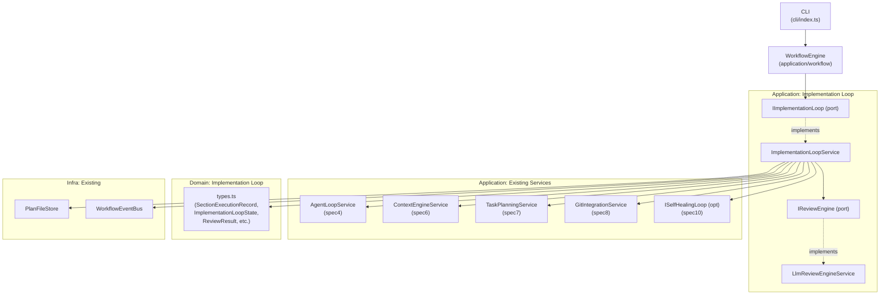
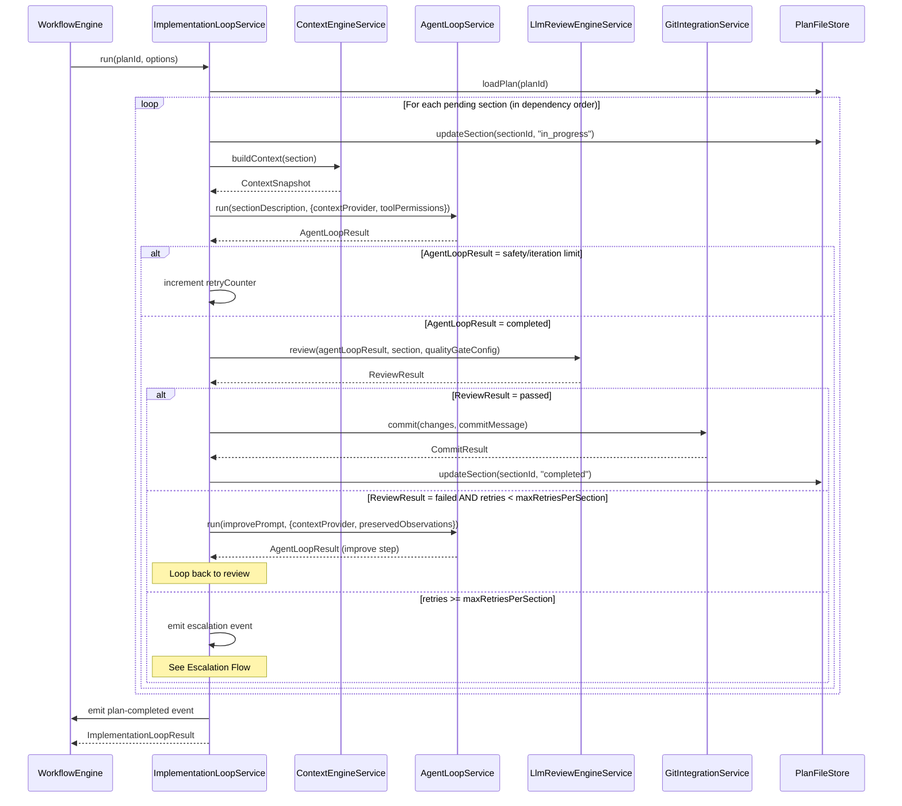
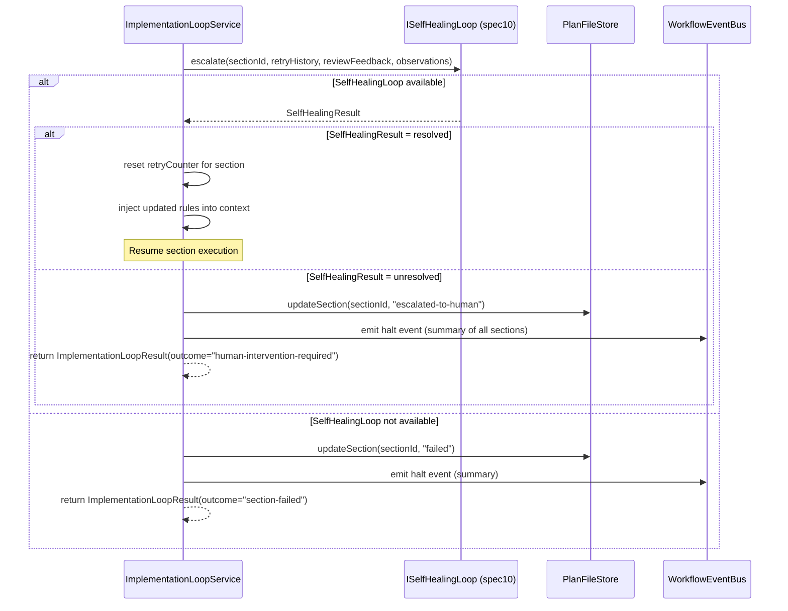
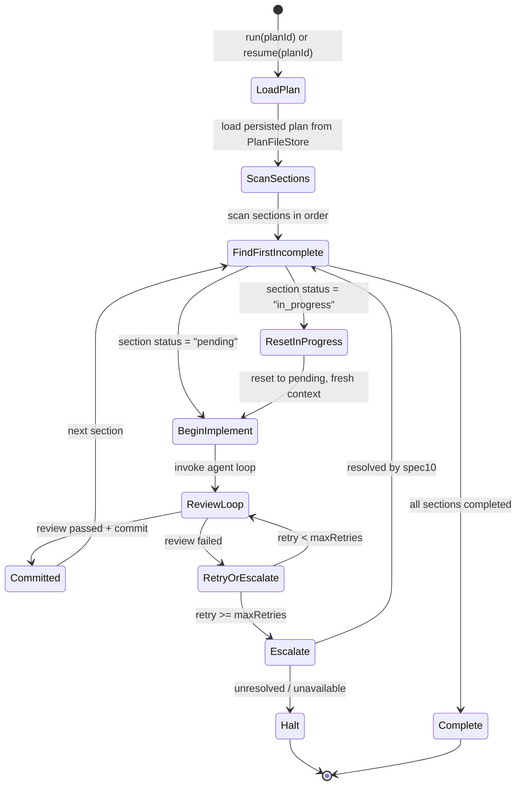

# Design Document: Implementation Loop (spec9)

## Overview

The Implementation Loop (spec9) is a new application-layer orchestration service that drives autonomous code production for each task section in a development plan. It wraps the four existing services — agent loop (spec4), context engine (spec6), task planning (spec7), and git integration (spec8) — into a structured **Implement → Review → Improve → Commit** cycle.

**Purpose**: This feature delivers fully automated, quality-gated section execution to the autonomous engineering system, enabling it to produce and commit code for every task section in a plan without manual intervention.

**Users**: The workflow engine and CLI (`aes run`) invoke this service after a task plan has been approved. The self-healing loop (spec10) also interacts with it during escalated recovery.

**Impact**: Introduces a new orchestration tier between the workflow engine and the agent loop. The workflow engine delegates implementation-phase execution entirely to `ImplementationLoopService`, which returns a structured `ImplementationLoopResult` summarizing all section outcomes.

### Goals

- Execute all task sections in dependency order, gated by quality review before each commit
- Provide a configurable retry budget (`maxRetriesPerSection`) to prevent runaway loops
- Support resumption from persisted plan state after crash or restart
- Emit structured, machine-parseable logs per section iteration
- Escalate exhausted sections to the self-healing loop (spec10) when available

### Non-Goals

- Does not generate or modify task plans (delegated to spec7 TaskPlanningService)
- Does not implement the self-healing loop itself (spec10 is a separate specification)
- Does not provide a human-in-the-loop approval gate during section execution (that is spec7's responsibility)
- Does not implement LLM tooling or context management internals (spec4, spec6)

---

## Architecture

### Existing Architecture Analysis

The codebase uses Clean Architecture (Hexagonal / Ports-and-Adapters) with four layers:

- **Domain**: Pure business types and logic with no external dependencies
- **Application**: Use cases, services, and port interfaces
- **Adapters**: Concrete implementations of ports (LLM providers, git, tools)
- **Infra**: Runtime wiring, config loading, event buses, storage

Two existing orchestration precedents govern the implementation-loop design:

- `AgentLoopService` (`application/agent/`) — cognitive PLAN→ACT→OBSERVE→REFLECT→UPDATE cycle; immutable state, stop flag, discriminated result type
- `TaskPlanningService` (`application/planning/`) — plan generation + execution with per-step retry and LLM-driven revision

The implementation loop sits **one level above** these services. It must:
- Follow the same constructor-injection pattern for all dependencies
- Return discriminated union result types; never throw from public methods
- Support graceful stop via a private `#stopRequested` flag
- Persist section execution state to the existing `PlanFileStore` after every section transition

### Architecture Pattern & Boundary Map



**Architecture Integration**:

- **Selected pattern**: Application Service + Port (consistent with `AgentLoopService`, `TaskPlanningService`)
- **Domain boundaries**: `domain/implementation-loop/` owns execution-state types; does not import from `domain/planning/` to prevent coupling
- **Existing patterns preserved**: Port-first design, immutable state objects, discriminated unions, structured event emission
- **New components**: `IImplementationLoop` (port), `ImplementationLoopService` (service), `IReviewEngine` (port), `LlmReviewEngineService` (service), `domain/implementation-loop/types.ts`
- **Steering compliance**: TypeScript strict mode, no `any`, custom lightweight agent architecture, no external AI frameworks

### Workflow Engine Integration

The implementation loop is inserted as a new `"implementation"` phase in the workflow engine, executing after the `"planning"` phase completes.

**Changes to `application/ports/workflow.ts`**: Add `"implementation"` to the `WorkflowPhase` union and two new `WorkflowEvent` variants:

```typescript
// Extend existing WorkflowPhase union:
type WorkflowPhase = "requirements" | "design" | "planning" | "implementation" | "review";

// Add to existing WorkflowEvent discriminated union:
type WorkflowEvent =
  // ... existing variants ...
  | { type: "phase:start"; phase: "implementation"; timestamp: string }
  | { type: "phase:complete"; phase: "implementation"; durationMs: number; artifacts: string[] }
  | { type: "phase:error"; phase: "implementation"; operation: string; error: string };
```

**Changes to `application/usecases/run-spec.ts`**: After `TaskPlanningService.run()` returns a completed plan, invoke `IImplementationLoop.run(planId)`. The use case receives `IImplementationLoop` as a constructor dependency alongside the existing services:

```typescript
// run-spec.ts addition (constructor injection):
constructor(
  // ... existing dependencies ...
  private readonly implementationLoop: IImplementationLoop,
) {}

// Execution order in run():
// 1. workflowEngine.startPhase("planning") → taskPlanner.run(goal) → workflowEngine.completePhase("planning")
// 2. workflowEngine.startPhase("implementation") → implementationLoop.run(planId) → workflowEngine.completePhase("implementation")
```

`WorkflowEngine` itself requires no structural changes — it already supports dynamic phase sequencing via `phase-runner.ts`.

### Technology Stack

| Layer | Choice / Version | Role in Feature | Notes |
|-------|-----------------|-----------------|-------|
| Runtime | Bun v1.3.10+ | Service execution, file I/O | Consistent with existing project toolchain |
| Language | TypeScript (strict) | All source code | `noUncheckedIndexedAccess`, no `any` |
| Services | Existing application services | Agent loop, context, git, task planning | Injected as port interfaces |
| Persistence | PlanFileStore (existing) | Section state persistence | JSON files under `.aes/plans/` |
| Events | WorkflowEventBus (existing) | `plan-completed`, escalation, halt events | Existing event infrastructure |
| Linting / Quality | Biome (existing) | Code quality gate check | Invoked via `IToolExecutor` shell tool |
| Testing | Bun test (existing) | Test coverage gate check | Invoked via `IToolExecutor` shell tool |

---

## System Flows

### Primary Flow: Section Execution Cycle



### Escalation Flow



### Plan Resumption Flow



> **Flow decisions**: The review loop check runs _inside_ the section loop — each section iterates until it passes or exhausts retries. Context isolation is enforced at section boundaries (new `ContextSnapshot` per section entry); context is preserved _within_ a section across implement and improve steps.

---

## Requirements Traceability

| Requirement | Summary | Components | Interfaces | Flows |
|-------------|---------|------------|------------|-------|
| 1.1 | Iterate sections in plan order | ImplementationLoopService | IImplementationLoop | Primary Flow |
| 1.2 | Fresh context per section | ImplementationLoopService → ContextEngineService | IContextProvider | Primary Flow |
| 1.3 | Mark section completed after success | ImplementationLoopService → PlanFileStore | IPlanStore | Primary Flow |
| 1.4 | Defer section with unresolved dependencies | ImplementationLoopService | IImplementationLoop | Primary Flow |
| 1.5 | Record section outcome in execution log | ImplementationLoopService | IImplementationLoopLogger | Primary Flow |
| 1.6 | Emit plan-completed event | ImplementationLoopService → WorkflowEventBus | IWorkflowEventBus | Primary Flow |
| 2.1 | Invoke agent loop with section context and tool permissions | ImplementationLoopService → AgentLoopService | IAgentLoop | Primary Flow |
| 2.2 | Do not modify context while agent loop runs | ImplementationLoopService | — | Primary Flow |
| 2.3 | Capture full agent loop result for review | ImplementationLoopService → LlmReviewEngineService | IReviewEngine | Primary Flow |
| 2.4 | Treat safety/iteration limit as section failure | ImplementationLoopService | IImplementationLoop | Primary Flow |
| 3.1 | Invoke review engine after agent loop completes | ImplementationLoopService → LlmReviewEngineService | IReviewEngine | Primary Flow |
| 3.2 | Review: requirement alignment check | LlmReviewEngineService | IReviewEngine | Primary Flow |
| 3.3 | Review: design consistency check | LlmReviewEngineService | IReviewEngine | Primary Flow |
| 3.4 | Review: code quality check (lint, tests, naming) | LlmReviewEngineService + QualityGate | IReviewEngine, IToolExecutor | Primary Flow |
| 3.5 | Structure feedback as actionable items | LlmReviewEngineService | IReviewEngine | Primary Flow |
| 3.6 | Emit review-passed / review-failed signal | LlmReviewEngineService | IReviewEngine | Primary Flow |
| 4.1 | Commit after review-passed | ImplementationLoopService → GitIntegrationService | IGitIntegration | Primary Flow |
| 4.2 | Re-invoke agent loop with feedback after review-failed | ImplementationLoopService → AgentLoopService | IAgentLoop | Primary Flow |
| 4.3 | Preserve previous observations during improve step | ImplementationLoopService | IImplementationLoop | Primary Flow |
| 4.4 | Descriptive commit message referencing section | ImplementationLoopService | IImplementationLoop | Primary Flow |
| 4.5 | No commit without review-passed | ImplementationLoopService | IImplementationLoop | Primary Flow |
| 5.1 | Per-section retry counter | SectionExecutionRecord | — | Primary Flow |
| 5.2 | Configurable maxRetriesPerSection (default 3) | ImplementationLoopOptions | IImplementationLoop | Primary Flow |
| 5.3 | Stop retrying at maxRetriesPerSection | ImplementationLoopService | IImplementationLoop | Primary Flow |
| 5.4 | Emit escalation event with section ID, retry history, feedback | ImplementationLoopService | IImplementationLoopEventBus | Escalation Flow |
| 5.5 | Log iteration number, feedback, outcome per retry | ImplementationLoopService | IImplementationLoopLogger | Primary Flow |
| 6.1 | Define quality gate as named check set | QualityGateConfig, QualityGateRunner | IQualityGate | Primary Flow |
| 6.2 | Block commit on any required check failure | ImplementationLoopService | IQualityGate | Primary Flow |
| 6.3 | Configure required vs advisory checks | QualityGateConfig | IQualityGate | Primary Flow |
| 6.4 | Run lint/test via tool executor for required gate checks | QualityGateRunner → IToolExecutor | IQualityGate, IToolExecutor | Primary Flow |
| 6.5 | Record each gate check result in log | ImplementationLoopService | IImplementationLoopLogger | Primary Flow |
| 7.1 | Transfer section data to self-healing loop | ImplementationLoopService → ISelfHealingLoop | ISelfHealingLoop | Escalation Flow |
| 7.2 | Resume section with updated rules on resolved | ImplementationLoopService | IImplementationLoop | Escalation Flow |
| 7.3 | Mark escalated-to-human on unresolved | ImplementationLoopService → PlanFileStore | IPlanStore | Escalation Flow |
| 7.4 | Fall back to failed + halt if spec10 unavailable | ImplementationLoopService | IImplementationLoop | Escalation Flow |
| 7.5 | Emit human-readable halt summary | ImplementationLoopService | IImplementationLoopLogger | Escalation Flow |
| 8.1 | Fresh context snapshot at each section start | ImplementationLoopService → ContextEngineService | IContextProvider | Primary Flow |
| 8.2 | Retain plan, summaries, branch name across sections | ImplementationLoopState | — | Primary Flow |
| 8.3 | Accept compressed context from context-engine | ImplementationLoopService | IContextProvider | Primary Flow |
| 8.4 | Accumulate context within improve step | ImplementationLoopService | IAgentLoop | Primary Flow |
| 9.1 | Resume from first non-completed section | ImplementationLoopService | IImplementationLoop | Resumption Flow |
| 9.2 | Re-initialize context on resume | ImplementationLoopService | IContextProvider | Resumption Flow |
| 9.3 | Treat in_progress as incomplete on resume | ImplementationLoopService | IImplementationLoop | Resumption Flow |
| 9.4 | Read plan state from PlanFileStore only at startup | ImplementationLoopService | IPlanStore | Resumption Flow |
| 10.1 | Structured log entry per iteration | ImplementationLoopService | IImplementationLoopLogger | All Flows |
| 10.2 | Consolidated execution report on escalation/halt | ImplementationLoopService | IImplementationLoopLogger | Escalation Flow |
| 10.3 | Machine-parseable JSON logs to memory-accessible path | ImplementationLoopService | IImplementationLoopLogger | All Flows |
| 10.4 | Measure and log elapsed time per section | ImplementationLoopService | IImplementationLoopLogger | All Flows |

---

## Components and Interfaces

### Summary

| Component | Domain/Layer | Intent | Req Coverage | Key Dependencies | Contracts |
|-----------|-------------|--------|--------------|-----------------|-----------|
| `IImplementationLoop` | Application/Port | Public contract for the implementation loop service | 1–10 | — | Service |
| `IReviewEngine` | Application/Port | Contract for evaluating agent output quality | 3, 6 | IAgentLoop, IToolExecutor | Service |
| `ISelfHealingLoop` | Application/Port | Optional contract for spec10 escalation | 7 | — | Service |
| `IPlanStore` | Application/Port | Read/write section execution state (phase-partitioned with spec7) | 1.3, 7.3, 9.4 | — | Service |
| `IImplementationLoopLogger` | Application/Port | Structured per-iteration and per-section logging | 5.5, 10.1–10.4 | — | Service |
| `IImplementationLoopEventBus` | Application/Port | Lifecycle event emission to workflow engine | 1.6, 5.4, 7.5 | — | Event |
| `ImplementationLoopService` | Application/Service | Core orchestration: section iteration, retry, escalation | 1–10 | IAgentLoop, IContextProvider, IReviewEngine, IGitIntegration, IPlanStore, ISelfHealingLoop | Service, Event |
| `LlmReviewEngineService` | Application/Service | LLM-based review + tool-based quality gate | 3, 6 | LlmProviderPort, IToolExecutor | Service |
| `QualityGateRunner` | Application/Service | Executes named gate checks (lint, test, naming) | 6 | IToolExecutor | Service |
| `SectionExecutionRecord` | Domain/Type | Immutable per-section execution state snapshot | 5, 10 | — | State |
| `ImplementationLoopState` | Domain/Type | Cross-section persistent state (plan, summaries, branch) | 8.2 | — | State |
| `ImplementationLoopEvent` | Domain/Type | Discriminated union of all emitted events | 1.6, 5.4, 7.5, 10 | — | Event |

---

### Application/Port

#### `IImplementationLoop`

| Field | Detail |
|-------|--------|
| Intent | Public contract for running and resuming the implementation loop |
| Requirements | 1.1, 1.4, 1.6, 2.1–2.4, 4.1–4.5, 5.1–5.3, 8.1–8.4, 9.1–9.4 |

**Responsibilities & Constraints**
- Exposes `run(planId, options?)` and `resume(planId, options?)` as top-level entry points
- Exposes `stop()` for graceful cancellation
- Never throws; surfaces all errors as `ImplementationLoopResult` outcome variants

**Dependencies**
- Outbound: `ImplementationLoopService` — implementation (P0)

**Contracts**: Service [x]

##### Service Interface
```typescript
interface IImplementationLoop {
  run(planId: string, options?: Partial<ImplementationLoopOptions>): Promise<ImplementationLoopResult>;
  resume(planId: string, options?: Partial<ImplementationLoopOptions>): Promise<ImplementationLoopResult>;
  stop(): void;
}

interface ImplementationLoopOptions {
  maxRetriesPerSection: number;       // default: 3
  qualityGateConfig: QualityGateConfig;
  selfHealingLoop?: ISelfHealingLoop; // optional; null if spec10 unavailable
  eventBus?: IImplementationLoopEventBus;
  logger?: IImplementationLoopLogger;
}

type ImplementationLoopOutcome =
  | "completed"
  | "section-failed"
  | "human-intervention-required"
  | "stopped"
  | "plan-not-found";

type ImplementationLoopResult = {
  outcome: ImplementationLoopOutcome;
  planId: string;
  sections: ReadonlyArray<SectionExecutionRecord>;
  durationMs: number;
  haltReason?: string;
};
```

- Preconditions: `planId` must reference a plan persisted by `PlanFileStore`
- Postconditions: All reachable sections are in a terminal state (`completed`, `failed`, or `escalated-to-human`); plan state is persisted
- Invariants: A `review-passed` signal is required before any commit; retry counter is non-decreasing per section

---

#### `IReviewEngine`

| Field | Detail |
|-------|--------|
| Intent | Evaluate agent loop output against quality criteria and emit pass/fail |
| Requirements | 3.1–3.6, 6.1–6.5 |

**Responsibilities & Constraints**
- Accepts the full `AgentLoopResult` and the current task section as inputs
- Returns a `ReviewResult` containing pass/fail per check and structured feedback items
- Must not commit side effects; review is a read-only evaluation

**Dependencies**
- Inbound: `ImplementationLoopService` — invokes after each implement/improve step (P0)
- Outbound: `LlmProviderPort` — requirement alignment and design consistency analysis (P0)
- Outbound: `IToolExecutor` — lint and test runner invocation (P1)

**Contracts**: Service [x]

##### Service Interface
```typescript
interface IReviewEngine {
  review(
    result: AgentLoopResult,
    section: TaskSection,
    config: QualityGateConfig
  ): Promise<ReviewResult>;
}

type ReviewOutcome = "passed" | "failed";

type ReviewCheckResult = {
  checkName: string;
  outcome: ReviewOutcome;
  required: boolean;
  details: string;
};

type ReviewFeedbackItem = {
  category: "requirement-alignment" | "design-consistency" | "code-quality";
  description: string;
  severity: "blocking" | "advisory";
};

type ReviewResult = {
  outcome: ReviewOutcome;
  checks: ReadonlyArray<ReviewCheckResult>;
  feedback: ReadonlyArray<ReviewFeedbackItem>;
  durationMs: number;
};
```

- Preconditions: `AgentLoopResult` must be a completed (non-error) result
- Postconditions: `outcome` is `"passed"` only if all `required` checks emit `"passed"`
- Invariants: Advisory check failures do not change `outcome` to `"failed"`

---

#### `ISelfHealingLoop`

| Field | Detail |
|-------|--------|
| Intent | Optional port for escalating exhausted sections to the spec10 self-healing loop |
| Requirements | 7.1–7.4 |

**Contracts**: Service [x]

##### Service Interface
```typescript
interface ISelfHealingLoop {
  escalate(escalation: SectionEscalation): Promise<SelfHealingResult>;
}

type SectionEscalation = {
  sectionId: string;
  planId: string;
  retryHistory: ReadonlyArray<SectionIterationRecord>;
  reviewFeedback: ReadonlyArray<ReviewFeedbackItem>;
  agentObservations: ReadonlyArray<Observation>; // from AgentLoopResult
};

type SelfHealingOutcome = "resolved" | "unresolved";

type SelfHealingResult = {
  outcome: SelfHealingOutcome;
  updatedRules?: ReadonlyArray<string>; // injected into context on resolved
  summary: string;
};
```

---

#### `IPlanStore`

| Field | Detail |
|-------|--------|
| Intent | Read and write section execution state to persisted plan store |
| Requirements | 1.3, 7.3, 9.1, 9.4 |

**Contracts**: Service [x]

##### Service Interface
```typescript
interface IPlanStore {
  loadPlan(planId: string): Promise<TaskPlan | null>;
  updateSectionStatus(
    planId: string,
    sectionId: string,
    status: SectionPersistenceStatus
  ): Promise<void>;
}

type SectionPersistenceStatus =
  | "pending"
  | "in_progress"
  | "completed"
  | "failed"
  | "escalated-to-human";
```

**Write Ownership Protocol**:
`PlanFileStore` is the single physical writer for plan JSON files. Write access is partitioned by execution phase — `TaskPlanningService` (spec7) writes during the `"planning"` phase; `ImplementationLoopService` writes during the `"implementation"` phase. These phases are never concurrent within a single `aes run` invocation, so no locking is required.

`PlanFileStore`'s deserialization must tolerate the `"escalated-to-human"` status value introduced by this spec. Unknown status values should be preserved as-is rather than coerced, so that `TaskPlanningService` does not corrupt implementation-loop state if it ever re-reads a plan after the implementation phase.

**Implementation Notes**
- Integration: Adapts the existing `PlanFileStore` (`infra/planning/plan-file-store.ts`); no new storage infrastructure required.
- `ITaskPlanner` (spec7 port) is **not** extended with `updateSectionStatus` — plan-state writes during the implementation phase belong to `IPlanStore`, not to the task-planning concern.

---

#### `IImplementationLoopLogger`

| Field | Detail |
|-------|--------|
| Intent | Structured logging contract for per-iteration and per-section execution records |
| Requirements | 5.5, 10.1–10.4 |

**Contracts**: Service [x]

##### Service Interface
```typescript
interface IImplementationLoopLogger {
  logIteration(entry: SectionIterationLogEntry): void;
  logSectionComplete(record: SectionExecutionRecord): void;
  logHaltSummary(summary: ExecutionHaltSummary): void;
}

type SectionIterationLogEntry = Readonly<{
  planId: string;
  sectionId: string;
  iterationNumber: number;
  reviewOutcome: ReviewOutcome;
  gateCheckResults: ReadonlyArray<ReviewCheckResult>;
  commitSha?: string;
  durationMs: number;
  timestamp: string;        // ISO 8601
}>;

type ExecutionHaltSummary = Readonly<{
  planId: string;
  completedSections: ReadonlyArray<string>;
  committedSections: ReadonlyArray<string>;
  haltingSectionId: string;
  reason: string;
  timestamp: string;
}>;
```

- Preconditions: none; logger is always safe to call
- Invariants: All entries must be serializable to JSON (no circular references, no functions)
- Implementation Notes: Default implementation writes NDJSON to `.aes/logs/implementation-loop-<planId>.ndjson` (Req 10.3); a no-op implementation is provided for tests.

---

#### `IImplementationLoopEventBus`

| Field | Detail |
|-------|--------|
| Intent | Event emission contract for publishing implementation-loop lifecycle events to the workflow engine |
| Requirements | 1.6, 5.4, 7.5 |

**Contracts**: Event [x]

##### Service Interface
```typescript
interface IImplementationLoopEventBus {
  emit(event: ImplementationLoopEvent): void;
}
```

- Published events: `ImplementationLoopEvent` discriminated union (see Data Models section)
- Consumed by: `WorkflowEngine` — subscribes to `plan:completed` and `plan:halted` to advance or terminate workflow phase
- Ordering guarantee: Events are emitted synchronously; the bus must not buffer or drop events
- Implementation Notes: Adapts the existing `WorkflowEventBus` (`infra/events/workflow-event-bus.ts`); no new event infrastructure required.

---

### Application/Service

#### `ImplementationLoopService`

| Field | Detail |
|-------|--------|
| Intent | Orchestrates section iteration, review, retry, commit, and escalation |
| Requirements | 1.1–1.6, 2.1–2.4, 4.1–4.5, 5.1–5.5, 7.1–7.5, 8.1–8.4, 9.1–9.4, 10.1–10.4 |

**Responsibilities & Constraints**
- Owns the main `Implement → Review → Improve → Commit` loop
- Reads plan state exclusively from `IPlanStore` at startup (Req 9.4)
- Executes sections in topological dependency order
- Emits structured events via `IImplementationLoopEventBus` at each major transition
- Never mutates state objects in place — creates new `SectionExecutionRecord` snapshots at each transition

**Dependencies**
- Inbound: `WorkflowEngine` / CLI — invokes `run()` or `resume()` (P0)
- Outbound: `IAgentLoop` — section implementation and improvement (P0)
- Outbound: `IContextProvider` — per-section context snapshots (P0)
- Outbound: `IReviewEngine` — quality evaluation (P0)
- Outbound: `IGitIntegration` — commit after review passes (P0)
- Outbound: `IPlanStore` — plan state persistence (P0)
- Outbound: `ISelfHealingLoop` — escalation (P1, optional)
- Outbound: `IImplementationLoopEventBus` — event emission (P1)
- Outbound: `IImplementationLoopLogger` — structured logging (P1)

**Contracts**: Service [x] / Event [x] / State [x]

##### Service Interface
See `IImplementationLoop` port above.

##### Event Contract
- Published events: see `ImplementationLoopEvent` in Domain Types section
  - `section:start`, `section:completed`, `section:review-passed`, `section:review-failed`, `section:improve-start`, `section:committed`, `section:escalated`, `plan:completed`, `plan:halted`
- Subscribed events: none (invoked directly by workflow engine)
- Ordering: Events are emitted synchronously before and after each state transition; no cross-process delivery guarantees required

##### State Management
- State model: `ImplementationLoopState` (cross-section) + `SectionExecutionRecord` (per-section)
- Persistence: Section status written to `IPlanStore` after every terminal transition; in-memory state is ephemeral
- Concurrency: Single-threaded (Bun event loop); no concurrent section execution within one plan

**Implementation Notes**
- Integration: Wire in `run-spec.ts` use case after `TaskPlanningService` completes
- Validation: Validate `planId` exists in `IPlanStore` before starting; emit `plan-not-found` result if missing
- Risks: If the process is killed mid-commit, the section may remain `in_progress` in the store; resumption resets `in_progress` sections to pending (Req 9.3)

---

#### `LlmReviewEngineService`

| Field | Detail |
|-------|--------|
| Intent | Default implementation of `IReviewEngine` using LLM for alignment/consistency and tools for code quality |
| Requirements | 3.1–3.6, 6.1–6.5 |

**Responsibilities & Constraints**
- Runs three check categories in parallel where possible: requirement alignment, design consistency, code quality
- Delegates tool-based checks (lint, test) to `QualityGateRunner`
- Constructs structured `ReviewFeedbackItem[]` from LLM output and tool exit codes
- Must be stateless; no mutable instance variables

**Dependencies**
- Inbound: `ImplementationLoopService` (P0)
- Outbound: `LlmProviderPort` — LLM inference for alignment + consistency (P0)
- Outbound: `QualityGateRunner` — lint + test execution (P0)

---

#### `QualityGateRunner`

| Field | Detail |
|-------|--------|
| Intent | Executes configured named checks (lint, test, naming) via `IToolExecutor` and returns pass/fail per check |
| Requirements | 6.1–6.5 |

**Responsibilities & Constraints**
- Reads `QualityGateConfig` to determine which checks to run and whether each is required or advisory
- Invokes shell commands via `IToolExecutor` (e.g., `bun run lint`, `bun test`)
- Parses exit codes and stdout to determine pass/fail; does not interpret output beyond exit code

**Dependencies**
- Inbound: `LlmReviewEngineService` (P0)
- Outbound: `IToolExecutor` — shell command execution (P0)

##### Service Interface
```typescript
interface IQualityGate {
  run(config: QualityGateConfig): Promise<ReadonlyArray<ReviewCheckResult>>;
}

type QualityGateCheck = {
  name: string;
  command: string;       // e.g., "bun run lint"
  required: boolean;
  workingDirectory?: string;
};

type QualityGateConfig = {
  checks: ReadonlyArray<QualityGateCheck>;
};
```

---

### Domain

#### `domain/implementation-loop/types.ts`

| Field | Detail |
|-------|--------|
| Intent | Pure domain types for implementation-loop execution state; no external dependencies |
| Requirements | 5.1, 8.2, 10.1 |

**Implementation Notes**
- Does not import from `domain/planning/types.ts` to avoid coupling; uses `string` sectionId references
- All state types are `Readonly<>` or use `ReadonlyArray<>`

---

## Data Models

### Domain Model

**Aggregates**:
- `ImplementationLoopState` — cross-section state; owned exclusively by `ImplementationLoopService` during execution
- `SectionExecutionRecord` — per-section snapshot; immutable after creation; appended to the execution log

**Value Objects**:
- `ReviewResult` — output of a single review invocation
- `SectionIterationRecord` — log of a single implement-review-improve attempt
- `ImplementationLoopEvent` — domain event emitted at each major transition

**Domain Events** (subset, see full type below): `section:committed`, `section:escalated`, `plan:completed`, `plan:halted`

**Business Rules**:
- A commit may only occur after a `review-passed` signal (enforced in `ImplementationLoopService`)
- The retry counter for a section is monotonically increasing and resets only on self-healing resolution
- A section may not begin until all sections listed in its `dependsOn` array are `completed`

### Logical Data Model

#### `ImplementationLoopState`
```typescript
type ImplementationLoopState = Readonly<{
  planId: string;
  featureBranchName: string;
  completedSectionSummaries: ReadonlyArray<SectionSummary>;
  startedAt: string;         // ISO 8601
}>;

type SectionSummary = Readonly<{
  sectionId: string;
  title: string;
  commitSha?: string;
}>;
```

#### `SectionExecutionRecord`
```typescript
type SectionExecutionRecord = Readonly<{
  sectionId: string;
  planId: string;
  title: string;
  status: SectionExecutionStatus;
  retryCount: number;
  iterations: ReadonlyArray<SectionIterationRecord>;
  startedAt: string;
  completedAt?: string;
  commitSha?: string;
  escalationSummary?: string;
}>;

type SectionExecutionStatus =
  | "pending"
  | "in_progress"
  | "completed"
  | "failed"
  | "escalated-to-human";

type SectionIterationRecord = Readonly<{
  iterationNumber: number;
  // Note: agentLoopResult is intentionally omitted from the persisted record.
  // AgentLoopResult contains Observation[] with arbitrary rawOutput values that are
  // not guaranteed to be JSON-serializable. Observations needed for escalation are
  // accumulated separately in ImplementationLoopService and passed to ISelfHealingLoop.
  reviewResult: ReviewResult;
  improvePrompt?: string;
  durationMs: number;
  timestamp: string;
}>;
```

#### `ImplementationLoopEvent`
```typescript
type ImplementationLoopEvent =
  | { type: "section:start"; sectionId: string; timestamp: string }
  | { type: "section:completed"; sectionId: string; commitSha: string; durationMs: number }
  | { type: "section:review-passed"; sectionId: string; iteration: number }
  | { type: "section:review-failed"; sectionId: string; iteration: number; feedback: ReadonlyArray<ReviewFeedbackItem> }
  | { type: "section:improve-start"; sectionId: string; iteration: number }
  | { type: "section:escalated"; sectionId: string; retryCount: number; reason: string }
  | { type: "plan:completed"; planId: string; completedSections: ReadonlyArray<string>; durationMs: number }
  | { type: "plan:halted"; planId: string; haltingSectionId: string; summary: string };
```

### Physical Data Model

**For Event Stores / Log Files**:
- Execution logs written as newline-delimited JSON (NDJSON) to `.aes/logs/implementation-loop-<planId>.ndjson`
- Each log entry is a `SectionIterationRecord` serialized as JSON
- Plan section status persisted to existing plan JSON files under `.aes/plans/<planId>.json` via `PlanFileStore`

### Data Contracts & Integration

**Event Schemas**:
- `ImplementationLoopEvent` emitted to `IImplementationLoopEventBus`; consumed by `WorkflowEngine` for `plan:completed` and `plan:halted`
- Log entries written as NDJSON; consumed by spec10 (self-healing loop) and human reviewers

**Cross-Service Data Management**:
- `IPlanStore` reads/writes existing plan JSON files; no new storage format introduced
- `ISelfHealingLoop.escalate()` receives `SectionEscalation` — a snapshot value object, not a reference; no shared mutable state

---

## Error Handling

### Error Strategy

All public methods return discriminated union result types. No exceptions cross service boundaries. Tool execution failures (lint/test) are treated as check failures, not exceptions.

### Error Categories and Responses

**Agent Loop Failures**:
- Safety stop or iteration limit → `SectionExecutionStatus: "in_progress"` + increment retry counter → route to improve step or escalation if retries exhausted
- Agent loop throws unexpectedly → catch, log, increment retry counter, treat as section failure

**Review Engine Failures**:
- LLM call failure → mark review as failed with error feedback; increment retry counter
- Tool executor failure (lint/test process crash) → mark check as `"failed"` with error details; do not propagate exception

**Git Integration Failures**:
- Commit fails → log error; mark section as `"failed"`; emit `plan:halted` event
- Do not retry git failures automatically (potential for duplicate commits)

**Plan Store Failures**:
- Load failure → return `ImplementationLoopResult(outcome: "plan-not-found")`
- Write failure → log error; continue execution; log that persistence may be inconsistent

**Self-Healing Loop Failures**:
- Not configured → fall back to `"failed"` section status + halt (Req 7.4)
- Call throws → treat as `"unresolved"` outcome; mark `"escalated-to-human"` (Req 7.3)

### Monitoring

- Each `SectionIterationRecord` contains `durationMs`; slow sections are identifiable from logs (Req 10.4)
- `plan:halted` event carries a human-readable summary for operator notification (Req 7.5)
- JSON log files under `.aes/logs/` are accessible to the memory system (spec5) and self-healing loop (spec10) (Req 10.3)

---

## Testing Strategy

### Unit Tests

- `ImplementationLoopService`: section iteration order (including dependency skipping), retry counter increments, stop-signal handling, result type mapping
- `LlmReviewEngineService`: `ReviewResult` construction from LLM output, advisory-vs-required check logic, feedback item categorization
- `QualityGateRunner`: pass/fail parsing from tool exit codes, required vs advisory check dispatch, config-driven check selection
- `SectionExecutionRecord` domain type: immutability invariants, status transition validity
- `ImplementationLoopEvent` discriminated union: exhaustive match correctness

### Integration Tests

- `ImplementationLoopService` + `AgentLoopService` stub: full implement→review→commit cycle with a mock review engine returning `"passed"` on first attempt
- `ImplementationLoopService` + retry flow: mock review engine returns `"failed"` twice then `"passed"`; assert retry counter, improve prompt injection, final commit
- `ImplementationLoopService` + escalation: mock review always fails; assert escalation event emission, `ISelfHealingLoop` invocation, and halt behavior when `"unresolved"`
- `ImplementationLoopService` + resumption: simulate a persisted plan with one `"in_progress"` section; assert it is reset and re-executed from scratch
- `QualityGateRunner` + `IToolExecutor` stub: assert lint command invocation and exit code parsing

### E2E Tests

- Full `aes run` execution with a minimal real task plan (one section); assert a git commit is produced and plan state transitions to `"completed"`
- Resumption test: interrupt execution (stop signal) during section 2 of 3; restart; assert section 2 re-executes and section 1 is not re-run

### Performance

- Measure elapsed time per section for a 5-section plan; assert that the `SectionIterationRecord.durationMs` fields are populated and accurate
- Assert that context isolation (fresh snapshot per section) does not cause measurable memory growth across 10 sequential sections

---

## Supporting References

- `orchestrator-ts/src/application/agent/agent-loop-service.ts` — orchestration and stop-signal pattern
- `orchestrator-ts/src/application/planning/task-planning-service.ts` — retry and plan-resume pattern
- `orchestrator-ts/src/application/ports/agent-loop.ts` — `IAgentLoop`, `AgentLoopResult`, `AgentLoopOptions`
- `orchestrator-ts/src/application/ports/task-planning.ts` — `ITaskPlanner`, `TaskPlanResult`
- `orchestrator-ts/src/domain/planning/types.ts` — `TaskPlan`, `Step`, `StepStatus`
- `orchestrator-ts/src/domain/agent/types.ts` — `AgentState`, `Observation`, `TerminationCondition`
- `orchestrator-ts/src/infra/planning/plan-file-store.ts` — existing plan persistence implementation
- `.kiro/specs/implementation-loop/research.md` — discovery notes, architecture evaluation, risk register
