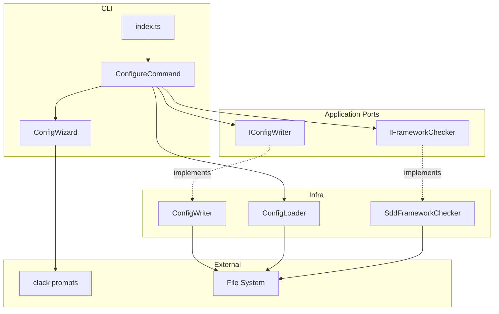
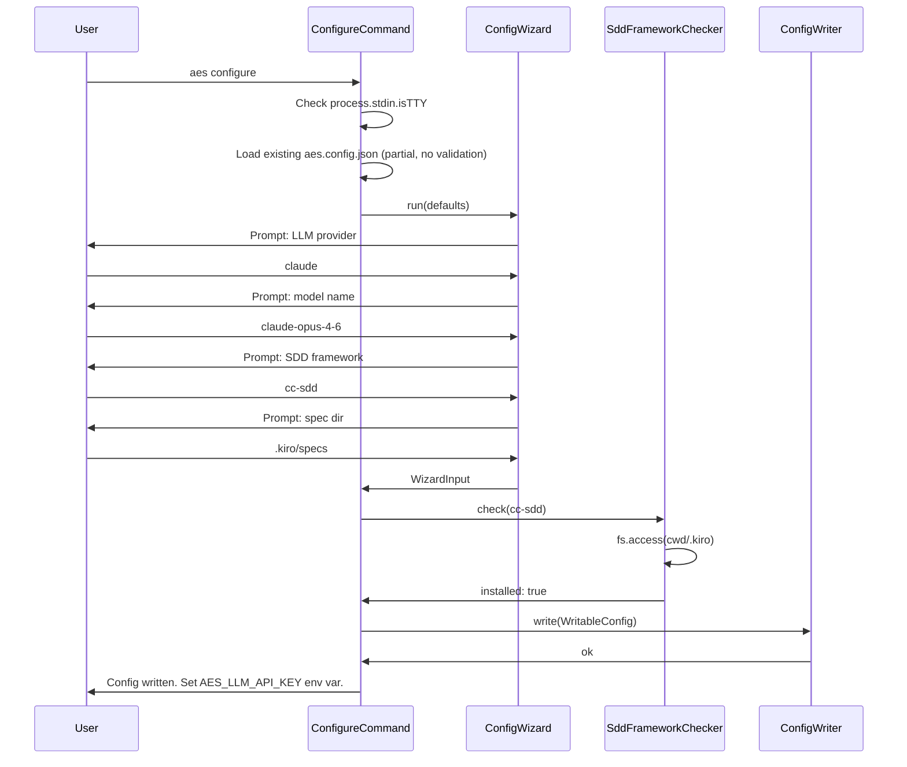
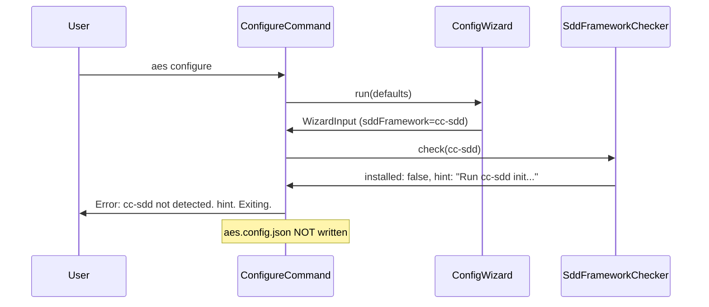

# Design Document: initial-configuration-interaction

## Overview

This feature adds an `aes configure` subcommand that guides users through an interactive wizard to create `aes.config.json`. It also sharpens the error message produced by `aes run` when configuration is missing, directing users to `aes configure` for first-time setup.

**Purpose**: Enables new users to set up `aes` interactively without manually editing JSON files, and provides existing users a reliable reconfiguration path.

**Users**: All `aes` CLI users — both first-time installers and users needing to update settings.

**Impact**: Adds one new subcommand (`configure`) to the existing CLI. The `run` subcommand receives a minor change to its missing-config error message.

### Goals

- Provide a guided interactive wizard for creating and updating `aes.config.json`
- Verify the selected SDD framework is set up in the current project before persisting config
- Ensure the LLM API key is never written to disk; instruct users to use env vars
- Produce a clear, actionable error when `aes run` is invoked without configuration

### Non-Goals

- Automatic installation of SDD frameworks
- Storing the LLM API key in any file
- Supporting `aes configure` in non-TTY / CI environments (exits with error)
- Defining `openspec`/`speckit` installation checks (left to future iterations)

---

## Architecture

### Existing Architecture Analysis

The CLI entry point (`src/cli/index.ts`) registers subcommands using `citty`. Currently only `run` is registered. The `ConfigLoader` in `src/infra/config/` reads `aes.config.json` and merges with environment variables; it has no write path. The `CcSddAdapter` calls the `cc-sdd` binary; SDD framework setup is out-of-band.

The project follows **Clean Architecture**: dependencies point inward (CLI → Application Ports → Domain; Infra implements Ports). The `configure` workflow has no domain logic (no LLM, no workflow state), so it lives in the CLI layer with infra-layer helpers behind application-level port interfaces.

### Architecture Pattern & Boundary Map



**Architecture Integration**:
- Selected pattern: CLI-layer orchestration with Infra adapters behind application ports
- Domain boundary: `configure` touches no domain logic; the wizard is a pure CLI concern
- Existing patterns preserved: Port interfaces in `src/application/ports/`, Infra implementations in `src/infra/config/`
- New components rationale: `ConfigWizard` (UI isolation), `ConfigWriter` (write path mirror of `ConfigLoader`), `SddFrameworkChecker` (env detection with pluggable strategy)
- Steering compliance: Clean Architecture dependency direction maintained; no external framework added to domain

### Technology Stack

| Layer | Choice / Version | Role in Feature | Notes |
|-------|-----------------|-----------------|-------|
| CLI | `citty` ^0.2.1 (existing) | Subcommand registration for `configure` | No version change |
| CLI / UI | `@clack/prompts` ^0.7.x (new) | Interactive select, text, confirm prompts | Lightweight ESM, Bun-compatible; see `research.md` for selection rationale |
| Infra / Storage | `node:fs/promises` (built-in) | Write `aes.config.json`, check `.kiro/` dir | Already used by `ConfigLoader` |

---

## System Flows

### `aes configure` — Happy Path



### `aes configure` — Framework Not Installed



---

## Requirements Traceability

| Requirement | Summary | Components | Interfaces | Flows |
|-------------|---------|------------|------------|-------|
| 1.1 | Missing config error on `aes run` | `index.ts` run command | `ConfigValidationError` | — |
| 1.2 | Skip wizard when config is present | `index.ts` run command | `ConfigLoader` | — |
| 1.3 | No interactive prompts from `aes run` | `index.ts` run command | — | — |
| 2.1 | `aes configure` launches wizard | `ConfigureCommand` | `IConfigWizard` | Happy path flow |
| 2.2 | Pre-populate from existing config | `ConfigureCommand`, `ConfigWizard` | `ConfigLoader`, `WizardInput` | Happy path flow |
| 2.3 | Defaults on first run | `ConfigWizard` | `WizardInput` | Happy path flow |
| 2.4 | Ctrl+C discards changes | `ConfigWizard`, `ConfigureCommand` | `isCancel` | — |
| 2.5 | Non-TTY exits with error | `ConfigureCommand` | `process.stdin.isTTY` | — |
| 3.1 | Framework check on selection | `ConfigureCommand`, `SddFrameworkChecker` | `IFrameworkChecker` | Both flows |
| 3.2 | cc-sdd check = `.kiro/` exists | `SddFrameworkChecker` | `FrameworkCheckResult` | Framework not installed flow |
| 3.3 | Display hint and exit if not installed | `ConfigureCommand` | `FrameworkCheckResult.hint` | Framework not installed flow |
| 3.4 | No auto-install | `ConfigureCommand` | — | — |
| 3.5 | Continue if installed | `ConfigureCommand` | — | Happy path flow |
| 4.1 | Write `aes.config.json` after wizard | `ConfigWriter` | `IConfigWriter` | Happy path flow |
| 4.2 | Confirmation message | `ConfigureCommand` | — | Happy path flow |
| 4.3 | Write failure exits with error | `ConfigWriter`, `ConfigureCommand` | `IConfigWriter` | — |
| 4.4 | API key never written to file | `ConfigWriter` | `WritableConfig` | All flows |
| 5.6 | API key guidance post-wizard | `ConfigureCommand` | — | Happy path flow |

---

## Components and Interfaces

### Summary Table

| Component | Layer | Intent | Req Coverage | Key Dependencies | Contracts |
|-----------|-------|--------|--------------|------------------|-----------|
| `ConfigureCommand` | CLI | Orchestrates configure wizard end-to-end | 2.1–2.5, 3.1, 3.3–3.5, 4.2–4.4 | `ConfigWizard` (P0), `IConfigWriter` (P0), `IFrameworkChecker` (P0), `ConfigLoader` (P1) | Service |
| `ConfigWizard` | CLI | Interactive prompt session | 2.1–2.4, 3.1, 5.6 | `@clack/prompts` (P0) | Service |
| `ConfigWriter` | Infra | Writes `aes.config.json` without API key | 4.1–4.4 | `node:fs/promises` (P0) | Service |
| `SddFrameworkChecker` | Infra | Checks SDD framework installation per strategy | 3.1–3.3 | `node:fs/promises` (P0) | Service |
| `index.ts` (modified) | CLI | Registers `configure`; improves `run` error | 1.1–1.3 | `ConfigureCommand` (P0), `ConfigValidationError` (P0) | — |
| Application ports (modified) | App | `WritableConfig`, `IConfigWriter`, `IFrameworkChecker` types | All | — | — |

---

### CLI Layer

#### ConfigureCommand

| Field | Detail |
|-------|--------|
| Intent | Orchestrates the configure wizard: load defaults, run prompts, check framework, write config |
| Requirements | 2.1, 2.2, 2.3, 2.4, 2.5, 3.1, 3.3, 3.4, 3.5, 4.2, 4.3, 4.4 |

**Responsibilities & Constraints**
- Entry point for `aes configure` subcommand (registered via `citty`)
- Guards against non-TTY execution before starting the wizard (2.5)
- Loads `aes.config.json` partially (ignoring validation errors) to provide pre-population defaults
- Delegates prompt UI to `ConfigWizard` and handles `"cancelled"` result by exiting cleanly without writing
- Calls `IFrameworkChecker` after wizard returns; exits without writing if framework is not installed
- Calls `IConfigWriter` only after all checks pass; displays confirmation and API key guidance

**Dependencies**
- Inbound: `index.ts` — subcommand registration (P0)
- Outbound: `ConfigWizard` — interactive prompts (P0)
- Outbound: `IFrameworkChecker` — framework installation check (P0)
- Outbound: `IConfigWriter` — config file write (P0)
- Outbound: `ConfigLoader` — partial load for pre-population (P1)

**Contracts**: Service [x]

##### Service Interface
```typescript
interface ConfigureCommandOptions {
  readonly configWriter: IConfigWriter;
  readonly frameworkChecker: IFrameworkChecker;
  readonly configLoader: ConfigLoader;
  readonly wizard: IConfigWizard;
  readonly cwd?: string;
}

interface IConfigureCommand {
  run(): Promise<void>;
}
```
- Preconditions: `process.stdin.isTTY` must be true; checked before wizard starts
- Postconditions: On success, `aes.config.json` written and user informed of `AES_LLM_API_KEY`; on cancel/error, file unchanged
- Invariants: `aes.config.json` is never written if framework check fails or wizard is cancelled

**Implementation Notes**
- Integration: Instantiated in `index.ts` `configure` subcommand handler with concrete infra implementations
- Validation: Non-TTY guard via `process.stdin.isTTY`; wizard handles field-level validation; framework check is a post-wizard step
- Risks: Partial config pre-population reads `aes.config.json` with a raw `JSON.parse`; malformed file should be caught and treated as "no defaults"

---

#### ConfigWizard

| Field | Detail |
|-------|--------|
| Intent | Interactive step-by-step prompt session collecting all non-secret config values |
| Requirements | 2.1, 2.2, 2.3, 2.4, 3.1 |

**Responsibilities & Constraints**
- Presents prompts in sequence: provider → modelName → sddFramework → specDir
- Accepts `defaults` to pre-populate answers from existing config (2.2)
- Re-prompts on empty required fields (2.4 validation)
- Returns `"cancelled"` if user hits Ctrl+C at any step
- Does NOT prompt for API key (per Req 4.4 and user decision)

**Dependencies**
- External: `@clack/prompts` ^0.7.x — select, text, isCancel (P0)

**Contracts**: Service [x]

##### Service Interface
```typescript
interface WizardDefaults {
  readonly provider?: string;
  readonly modelName?: string;
  readonly sddFramework?: "cc-sdd" | "openspec" | "speckit";
  readonly specDir?: string;
}

interface WizardInput {
  readonly provider: string;
  readonly modelName: string;
  readonly sddFramework: "cc-sdd" | "openspec" | "speckit";
  readonly specDir: string;
}

interface IConfigWizard {
  run(defaults?: WizardDefaults): Promise<WizardInput | "cancelled">;
}
```
- Preconditions: Terminal must be interactive (TTY guard is in `ConfigureCommand`)
- Postconditions: Returns `WizardInput` with all fields populated, or `"cancelled"`
- Invariants: No file I/O performed; pure prompt interaction

**Implementation Notes**
- Integration: Uses `@clack/prompts` `intro`/`outro`/`select`/`text`; wraps each call with `isCancel` check
- Validation: Empty string check for text fields; `sddFramework` is select-only (no free-text)
- Risks: `@clack/prompts` exits process on non-TTY by default; the TTY guard in `ConfigureCommand` provides a cleaner message

---

### Infra Layer

#### ConfigWriter

| Field | Detail |
|-------|--------|
| Intent | Writes `aes.config.json` from `WritableConfig` (no API key) |
| Requirements | 4.1, 4.2, 4.3, 4.4 |

**Responsibilities & Constraints**
- Serializes `WritableConfig` to JSON and writes `aes.config.json` in `cwd`
- Never writes `llm.apiKey` (enforced by `WritableConfig` type which omits it)
- Propagates write errors for the caller to handle

**Dependencies**
- External: `node:fs/promises` `writeFile` (P0)

**Contracts**: Service [x]

##### Service Interface
```typescript
interface IConfigWriter {
  write(config: WritableConfig, cwd?: string): Promise<void>;
}
```
- Preconditions: `cwd` is a valid, writable directory; defaults to `process.cwd()`
- Postconditions: `aes.config.json` exists at `cwd/aes.config.json` with JSON matching `WritableConfig` shape
- Invariants: File is either written completely or not at all (atomic at OS level via `writeFile`)

---

#### SddFrameworkChecker

| Field | Detail |
|-------|--------|
| Intent | Checks whether a given SDD framework is set up in the current project |
| Requirements | 3.1, 3.2, 3.3, 3.5 |

**Responsibilities & Constraints**
- Dispatches to a per-framework check strategy
- For `cc-sdd`: checks whether `.kiro/` directory exists in `cwd`
- For `openspec` and `speckit`: returns `installed: true` (check undefined; safe default until specified)
- Returns a `hint` string when not installed, to be displayed by the caller

**Dependencies**
- External: `node:fs/promises` `access` (P0)

**Contracts**: Service [x]

##### Service Interface
```typescript
type FrameworkCheckResult =
  | { readonly installed: true }
  | { readonly installed: false; readonly hint: string };

interface IFrameworkChecker {
  check(
    framework: "cc-sdd" | "openspec" | "speckit",
    cwd?: string,
  ): Promise<FrameworkCheckResult>;
}
```
- Preconditions: `cwd` defaults to `process.cwd()`
- Postconditions: Returns result with `installed: true` or `installed: false` with `hint`
- Invariants: Does not modify the filesystem; read-only check

**Implementation Notes**
- Integration: `cc-sdd` check uses `fs.access(join(cwd, '.kiro'))` — success → installed, ENOENT → not installed
- Risks: The cc-sdd check condition is explicitly noted as subject to change (see `research.md`). The strategy pattern ensures adding new check logic requires no changes to callers.

---

### Application Ports (modified)

**File**: `src/application/ports/config.ts`

Additions to the existing file:

```typescript
// Config shape written to aes.config.json — API key intentionally excluded
export interface WritableConfig {
  readonly llm: {
    readonly provider: string;
    readonly modelName: string;
  };
  readonly specDir: string;
  readonly sddFramework: "cc-sdd" | "openspec" | "speckit";
}

export type FrameworkCheckResult =
  | { readonly installed: true }
  | { readonly installed: false; readonly hint: string };

export interface IConfigWriter {
  write(config: WritableConfig, cwd?: string): Promise<void>;
}

export interface IFrameworkChecker {
  check(
    framework: "cc-sdd" | "openspec" | "speckit",
    cwd?: string,
  ): Promise<FrameworkCheckResult>;
}
```

---

### CLI Entry Point (`index.ts`) — Modified

**Changes**:
1. Import and register `ConfigureCommand` as the `configure` subcommand
2. In the `run` command's `ConfigValidationError` branch: append `"Run 'aes configure' to set up your configuration."` to the error output (Req 1.1)

---

## Data Models

### Domain Model

No domain entities. The sole persistent artifact is `aes.config.json`.

### Logical Data Model

**`aes.config.json` schema (written by `ConfigWriter`)**:

```jsonc
{
  "llm": {
    "provider": "claude",       // required string
    "modelName": "..."          // required string
  },
  "specDir": ".kiro/specs",     // optional, default .kiro/specs
  "sddFramework": "cc-sdd"      // optional, default cc-sdd
}
```

`llm.apiKey` is explicitly absent. It is managed via `AES_LLM_API_KEY` environment variable.

This schema is fully compatible with the existing `RawConfig` interface in `ConfigLoader`.

---

## Error Handling

### Error Categories and Responses

| Scenario | Category | Response |
|----------|----------|----------|
| `aes run` with missing config | User Error | Exit 1 + field list + "Run `aes configure`" instruction |
| `aes configure` in non-TTY | User Error | Exit 1 + "interactive configuration not supported in non-TTY environments" |
| Wizard cancelled (Ctrl+C) | User Action | Exit 0 + "Configuration cancelled. No changes saved." |
| SDD framework not installed | User Error | Exit 1 + framework name + `hint` from `FrameworkCheckResult` |
| `aes.config.json` write failure | System Error | Exit 1 + error message with file path and OS error reason |
| Malformed existing `aes.config.json` on pre-population | System (recoverable) | Log warning, treat as "no defaults", continue wizard |

### Monitoring

No telemetry or logging beyond stderr output. Configuration wizard is a one-shot interactive operation.

---

## Testing Strategy

### Unit Tests

- `ConfigWizard`: mock `@clack/prompts`; verify correct prompts emitted, defaults applied, cancel returns `"cancelled"`, empty input re-prompts
- `ConfigWriter`: mock `node:fs/promises`; verify JSON shape written, `apiKey` absent, write error propagated
- `SddFrameworkChecker`: mock `fs.access`; verify cc-sdd returns `installed:true` when `.kiro/` exists, `installed:false` with hint otherwise; verify unknown frameworks return `installed:true`
- `ConfigureCommand`: mock all dependencies; verify non-TTY guard, cancel flow (no write), framework-fail flow (no write), happy path (write + message)

### Integration Tests

- `aes configure` end-to-end with a real temp directory: wizard inputs piped via stdin mock, verify `aes.config.json` written with correct content and no `apiKey` field
- `aes run` missing-config error message: verify stderr contains "aes configure" in the error output

### E2E / Manual Tests

- Run `aes configure` in a fresh directory with `.kiro/` present; verify file created and API key guidance displayed
- Run `aes configure` in a directory without `.kiro/`; verify error and no file written
- Run `aes configure` twice; verify second run pre-populates from first run values

---

## Security Considerations

- **API key never persisted to disk**: enforced structurally via the `WritableConfig` type, which omits `llm.apiKey`. `ConfigWriter` accepts only `WritableConfig`, making accidental key write a type error.
- **No secrets in process args**: API key is read from env var only, never passed as CLI args.
