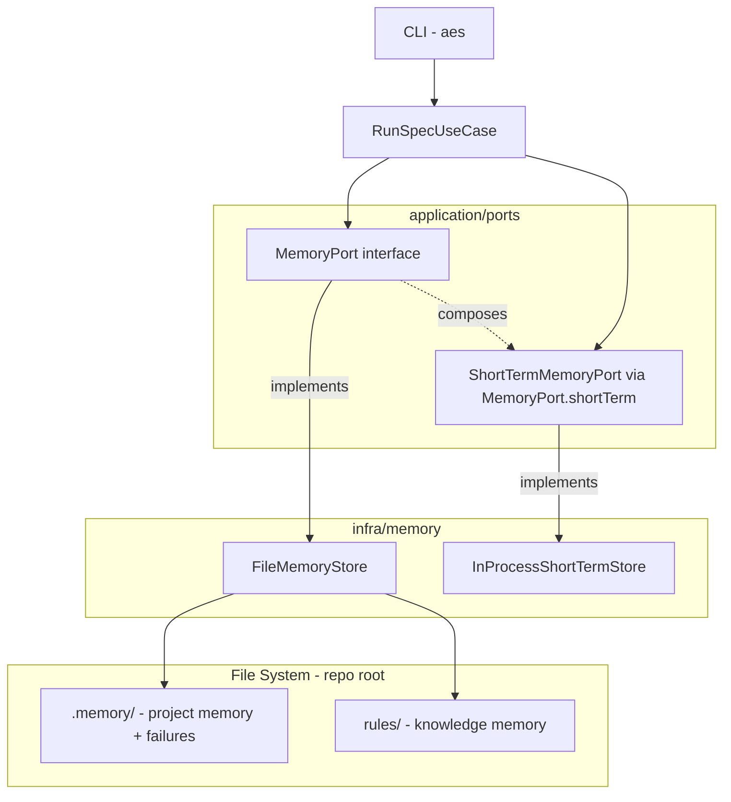
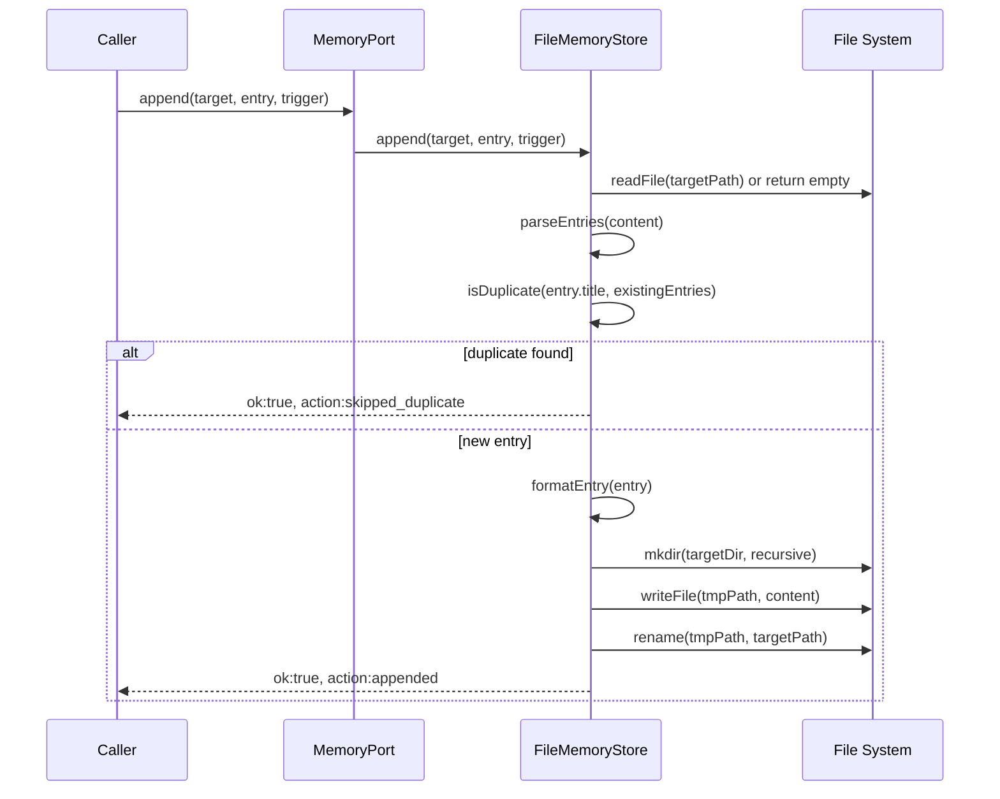
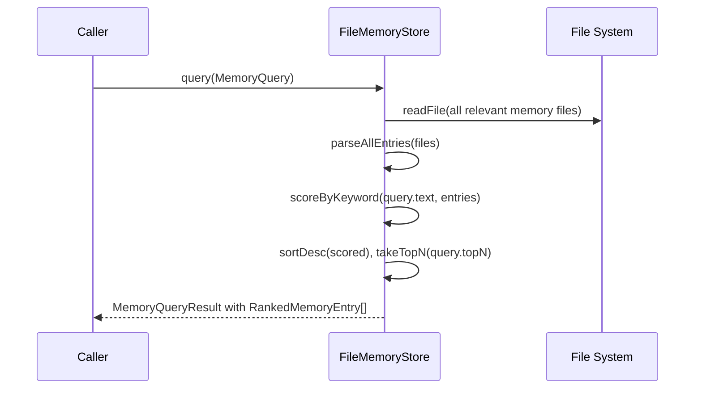

# Design Document: memory-system

## Overview

The Memory System provides the Autonomous Engineer agent with persistent, structured knowledge storage across workflow sessions. It enables the agent to accumulate project rules, coding patterns, review feedback, and failure records that inform future development — transforming the system from a stateless executor into a learning agent.

The system introduces two port interfaces: `ShortTermMemoryPort` (in-process, ephemeral) and `MemoryPort` (file-based, persistent), following the hexagonal architecture already established in `orchestrator-ts/`. Both ports are implemented in the infrastructure layer and injected into the use-case layer. All persistent storage uses human-readable Markdown files version-controlled by Git, with JSON only for structured failure records.

This spec (spec5) is a prerequisite for spec6 (context-engine), which reads memory via `MemoryPort.query()` to inject relevant knowledge into LLM prompts.

### Goals

- Provide a `MemoryPort` interface that covers query, append, update, and failure record operations for all persistent memory types
- Provide a `ShortTermMemoryPort` interface for synchronous in-process workflow context storage
- Implement file-based persistence in `infra/memory/` with atomic writes and title-based deduplication
- Enable keyword-based retrieval returning ranked, metadata-annotated results for token-budget-aware context injection
- Maintain strict Clean Architecture layer boundaries: ports in `application/ports/`, implementations in `infra/memory/`

### Non-Goals

- Vector/semantic search (deferred to memory-rs Rust engine, future spec)
- Cross-project knowledge sharing (future)
- Concurrent multi-process write safety (v1 is single-process)
- Memory file pruning or compaction (manual Git-based management for v1)
- Integration with spec6 context-engine (context-engine owns its consumption logic)

---

## Requirements Traceability

| Requirement | Summary | Components | Interfaces | Flows |
|-------------|---------|------------|------------|-------|
| 1.1–1.4 | In-process short-term store, reset on start, discarded on end | `InProcessShortTermStore` | `ShortTermMemoryPort` | — |
| 2.1–2.6 | `.memory/` file-based project knowledge; create-if-missing | `FileMemoryStore` | `MemoryPort.append`, `MemoryPort.query` | Write Flow |
| 3.1–3.5 | `rules/` append-only knowledge store; self-healing edits allowed | `FileMemoryStore` | `MemoryPort.append`, `MemoryPort.update` | Write Flow |
| 4.1–4.5 | JSON failure records at `.memory/failures/`; filtered retrieval | `FileMemoryStore` | `MemoryPort.writeFailure`, `MemoryPort.getFailures` | Failure Write Flow |
| 5.1–5.7 | Keyword-ranked retrieval with source metadata | `FileMemoryStore` | `MemoryPort.query` | Query Flow |
| 6.1–6.6 | Write-only-on-trigger; deduplication; atomic writes; dry-run mode | `FileMemoryStore` | `MemoryPort.append`, `MemoryPort.update` | Write Flow |
| 7.1–7.5 | `MemoryPort` in `application/ports/`; infra impl; DI into `RunSpecUseCase` | `FileMemoryStore`, `RunSpecUseCase` | `MemoryPort` | — |

---

## Architecture

### Existing Architecture Analysis

`orchestrator-ts/` follows hexagonal (ports & adapters) + Clean Architecture:
- **Domain layer** (`domain/`): pure business logic, no I/O
- **Application layer** (`application/ports/`, `application/usecases/`): port interfaces + use-case orchestration
- **Infrastructure layer** (`infra/`): concrete I/O implementations that satisfy port interfaces
- **Adapter layer** (`adapters/`): external system bridges (LLM, SDD frameworks)
- **CLI layer** (`cli/`): entry point

All existing ports (`IWorkflowStateStore`, `LlmProviderPort`, `SddFrameworkPort`) follow the same pattern: pure TypeScript interface in `application/ports/`, injected via constructor. Error envelopes use `{ ok: true; value: T } | { ok: false; error: E }` discriminated unions. Infrastructure implementations receive `cwd: string = process.cwd()` for testability.

### Architecture Pattern & Boundary Map



**Architecture Integration**:
- Selected pattern: Hexagonal (Ports & Adapters) — consistent with all existing specs
- `MemoryPort` is the single injection point; `ShortTermMemoryPort` is accessed via `MemoryPort.shortTerm`
- Persistent storage at repo root (`.memory/`, `rules/`) resolved relative to configurable `baseDir`
- New components: `FileMemoryStore`, `InProcessShortTermStore` in `infra/memory/`; `MemoryPort`, `ShortTermMemoryPort` in `application/ports/memory.ts`
- Steering compliance: no framework lock-in, no `any` types, dependency flow inward only

### Technology Stack

| Layer | Choice / Version | Role in Feature | Notes |
|-------|-----------------|-----------------|-------|
| Runtime | Bun v1.3.10+ | File I/O via `node:fs/promises` | Same as existing infra |
| Language | TypeScript strict | Port interfaces and implementations | `noUncheckedIndexedAccess`, `exactOptionalPropertyTypes` |
| Storage | Markdown files + JSON | Project/knowledge memory (Markdown); failure records (JSON) | Human-readable, Git-versioned |
| I/O | `node:fs/promises` | `readFile`, `writeFile`, `mkdir`, `rename`, `readdir` | No additional libraries |

---

## System Flows

### Memory Write Flow (Append)



### Memory Query Flow



---

## Components and Interfaces

### Component Summary

| Component | Layer | Intent | Req Coverage | Key Dependencies | Contracts |
|-----------|-------|--------|--------------|-----------------|-----------|
| `MemoryPort` | application/ports | Unified persistent memory interface | 2–7 | `ShortTermMemoryPort` (composes) | Service |
| `ShortTermMemoryPort` | application/ports | Synchronous in-process ephemeral store interface | 1 | — | Service |
| `FileMemoryStore` | infra/memory | File-based implementation of `MemoryPort` | 2–7 | `node:fs/promises` (P0) | Service, State |
| `InProcessShortTermStore` | infra/memory | In-memory implementation of `ShortTermMemoryPort` | 1 | — | State |

---

### Application / Ports

#### `MemoryPort` and `ShortTermMemoryPort`

| Field | Detail |
|-------|--------|
| Intent | Define the complete contract for memory read, write, query, and ephemeral state operations |
| Requirements | 1.1–1.4, 2.1–2.6, 3.1–3.5, 4.1–4.5, 5.1–5.7, 6.1–6.6, 7.1–7.5 |

**Responsibilities & Constraints**
- `ShortTermMemoryPort`: synchronous only; no file I/O; holds typed workflow context for one run
- `MemoryPort`: async file I/O for all persistent stores; composes `ShortTermMemoryPort` via `shortTerm` property
- Never import from domain or use-case layers (dependency inversion enforced)
- All methods return result types — no throws across port boundary

**Dependencies**
- Inbound: `RunSpecUseCase` — injects and calls (P0)
- Outbound: none (pure interface)

**Contracts**: Service [x]

##### Service Interface

```typescript
// application/ports/memory.ts
import type { WorkflowPhase } from '../../domain/workflow/types';

export type MemoryErrorCategory = 'io_error' | 'invalid_entry' | 'not_found' | 'readonly_mode';

export interface MemoryError {
  readonly category: MemoryErrorCategory;
  readonly message: string;
}

export type MemoryWriteAction = 'appended' | 'skipped_duplicate';

export type MemoryWriteResult =
  | { readonly ok: true;  readonly action: MemoryWriteAction }
  | { readonly ok: false; readonly error: MemoryError };

// --- Short-Term Memory ---

export interface ShortTermState {
  readonly currentSpec?: string | undefined;
  readonly currentPhase?: WorkflowPhase | undefined;
  readonly taskProgress?: TaskProgress | undefined;
  readonly recentFiles: readonly string[];
}

export interface TaskProgress {
  readonly taskId: string;
  readonly completedSteps: readonly string[];
  readonly currentStep?: string | undefined;
}

export interface ShortTermMemoryPort {
  /** Return current ephemeral state (never throws). */
  read(): ShortTermState;
  /** Merge update into current state (partial update semantics). */
  write(update: Partial<ShortTermState>): void;
  /** Reset all state to initial empty values. */
  clear(): void;
}

// --- Persistent Memory Types ---

export type ProjectMemoryFile =
  | 'project_rules'
  | 'coding_patterns'
  | 'review_feedback'
  | 'architecture_notes';

export type KnowledgeMemoryFile =
  | 'coding_rules'
  | 'review_rules'
  | 'implementation_patterns'
  | 'debugging_patterns';

export type MemoryTarget =
  | { readonly type: 'project';   readonly file: ProjectMemoryFile }
  | { readonly type: 'knowledge'; readonly file: KnowledgeMemoryFile };

export type MemoryWriteTrigger =
  | 'implementation_pattern'
  | 'review_feedback'
  | 'debugging_discovery'
  | 'self_healing';

export interface MemoryEntry {
  readonly title: string;
  readonly context: string;
  readonly description: string;
  readonly date: string; // ISO 8601
}

// --- Query ---

export interface MemoryQuery {
  readonly text: string;
  /** Filter to specific memory layer types. Defaults to both if omitted. */
  readonly memoryTypes?: ReadonlyArray<'project' | 'knowledge'>;
  /** Maximum results to return. Defaults to 5. */
  readonly topN?: number;
}

export interface RankedMemoryEntry {
  readonly entry: MemoryEntry;
  readonly sourceFile: string;
  readonly relevanceScore: number;
}

export interface MemoryQueryResult {
  readonly entries: readonly RankedMemoryEntry[];
}

// --- Failure Records ---

export interface FailureRecord {
  readonly taskId: string;
  readonly specName: string;
  readonly phase: string;
  readonly attempted: string;
  readonly errors: readonly string[];
  readonly rootCause: string;
  readonly ruleUpdate?: string | undefined;
  readonly timestamp: string; // ISO 8601
}

export interface FailureFilter {
  readonly specName?: string | undefined;
  readonly taskId?: string | undefined;
}

// --- Unified Port ---

export interface MemoryPort {
  /** Access synchronous in-process short-term memory. */
  readonly shortTerm: ShortTermMemoryPort;

  /** Keyword-ranked retrieval from project and/or knowledge memory. */
  query(query: MemoryQuery): Promise<MemoryQueryResult>;

  /**
   * Append a new entry to the target memory file.
   * Deduplicates by title (case-insensitive). Returns skipped_duplicate if already present.
   * Skips write and returns readonly_mode error in dry-run mode.
   */
  append(
    target: MemoryTarget,
    entry: MemoryEntry,
    trigger: MemoryWriteTrigger,
  ): Promise<MemoryWriteResult>;

  /**
   * Update an existing entry by title in the target file.
   * Used exclusively by the self-healing rule update path.
   * Returns not_found error if entry title does not exist; io_error only for OS-level failures.
   */
  update(
    target: MemoryTarget,
    entryTitle: string,
    entry: MemoryEntry,
  ): Promise<MemoryWriteResult>;

  /** Write a structured failure record atomically to .memory/failures/. */
  writeFailure(record: FailureRecord): Promise<MemoryWriteResult>;

  /** Return all failure records, optionally filtered. Never throws. */
  getFailures(filter?: FailureFilter): Promise<readonly FailureRecord[]>;
}
```

- Preconditions: `append` and `update` — `entry.title` must be non-empty; `entry.date` must be a valid ISO 8601 string.
- Postconditions: `append` (non-duplicate) — target file contains a new Markdown entry parseable by `parseEntries()`.
- Invariants: Existing entries are never deleted by `append`; only `update` modifies in-place (self-healing path only).

**Implementation Notes**
- Integration: `RunSpecUseCase.deps` gains a `memory: MemoryPort` field; `FileMemoryStore` and `InProcessShortTermStore` are wired in `cli/index.ts`.
- Validation: `append` validates `entry.title` non-empty and rejects with `invalid_entry` before attempting I/O.
- Risks: `update` requires parsing and rewriting the full file — keep files small; alert if file exceeds 200 entries (future).

---

### Infrastructure / Memory

#### `FileMemoryStore`

| Field | Detail |
|-------|--------|
| Intent | File-based implementation of `MemoryPort` with atomic writes, deduplication, and keyword retrieval |
| Requirements | 2.1–2.6, 3.1–3.5, 4.1–4.5, 5.1–5.7, 6.1–6.6, 7.4 |

**Responsibilities & Constraints**
- Resolves all paths relative to `baseDir` (default: `process.cwd()`)
- Maps `MemoryTarget` to file paths: `project` → `{baseDir}/.memory/{file}.md`; `knowledge` → `{baseDir}/rules/{file}.md`
- Failure records written to `{baseDir}/.memory/failures/failure_{timestamp}_{taskId}.json`
- Creates directories with `mkdir({ recursive: true })` on first write
- All file writes use atomic temp-file + rename pattern (same as `WorkflowStateStore`)
- Dry-run protection is the caller's responsibility (use-case layer); `FileMemoryStore` has no execution-mode awareness

**Dependencies**
- Inbound: `MemoryPort` interface (P0)
- External: `node:fs/promises` — `readFile`, `writeFile`, `mkdir`, `rename`, `readdir`, `open` (P0)

**Contracts**: Service [x], State [x]

##### Service Interface

```typescript
// infra/memory/file-memory-store.ts

export interface FileMemoryStoreOptions {
  readonly baseDir?: string;   // defaults to process.cwd()
}

export class FileMemoryStore implements MemoryPort {
  readonly shortTerm: ShortTermMemoryPort;
  constructor(options?: FileMemoryStoreOptions);

  query(query: MemoryQuery): Promise<MemoryQueryResult>;
  append(target: MemoryTarget, entry: MemoryEntry, trigger: MemoryWriteTrigger): Promise<MemoryWriteResult>;
  update(target: MemoryTarget, entryTitle: string, entry: MemoryEntry): Promise<MemoryWriteResult>;
  writeFailure(record: FailureRecord): Promise<MemoryWriteResult>;
  getFailures(filter?: FailureFilter): Promise<readonly FailureRecord[]>;
}
```

**Implementation Notes**
- Integration: Constructed in `cli/index.ts`; `baseDir` set to config's working directory or `process.cwd()`.
- `shortTerm` is initialized as `new InProcessShortTermStore()` in the constructor.
- Validation: `readFile` on missing file returns empty string (not an error); `getFailures` on missing `.memory/failures/` returns `[]`.
- Risks: Large memory files slow keyword scan; monitor file size; future Rust engine will replace the scan.

---

#### `InProcessShortTermStore`

| Field | Detail |
|-------|--------|
| Intent | Synchronous in-process implementation of `ShortTermMemoryPort`; zero disk I/O |
| Requirements | 1.1–1.4 |

**Responsibilities & Constraints**
- Maintains a single `ShortTermState` object in process memory
- `clear()` resets to `{ recentFiles: [] }` with all optional fields undefined
- All methods are synchronous; no async/await
- Lifecycle tied to one `FileMemoryStore` instance — created on store construction, cleared when `RunSpecUseCase` initializes a new workflow run

**Dependencies**
- Inbound: `ShortTermMemoryPort` interface (P0)
- Outbound: none

**Contracts**: State [x]

##### State Management

```typescript
// infra/memory/short-term-store.ts

export class InProcessShortTermStore implements ShortTermMemoryPort {
  private state: ShortTermState = { recentFiles: [] };

  read(): ShortTermState;
  write(update: Partial<ShortTermState>): void;  // merges update into this.state
  clear(): void;  // resets to { recentFiles: [] }
}
```

- State model: Single `ShortTermState` value object; replaced (not mutated) on each `write()`.
- Persistence & consistency: No persistence; initial state is `{ recentFiles: [] }`.
- Concurrency strategy: Single-threaded Bun process; no synchronization needed.

---

## Data Models

### Domain Model

Memory entries are value objects — they have no identity beyond their title within a target file. `FailureRecord` is an entity with a natural key of `(timestamp, taskId)`.

**Aggregates**:
- `MemoryFile` — a single `.md` file containing 0..N `MemoryEntry` items
- `FailureLog` — the `.memory/failures/` directory containing 0..N `FailureRecord` items

**Invariants**:
- Within a `MemoryFile`, no two entries share the same title (case-insensitive)
- `FailureRecord.timestamp` + `FailureRecord.taskId` uniquely identifies a failure record on disk
- `MemoryEntry.date` is always a valid ISO 8601 string

### Logical Data Model

**MemoryEntry (Markdown representation)**:

```
## {entry.title}

- **Date**: {entry.date}
- **Context**: {entry.context}

{entry.description}
```

Entries are separated by `---` horizontal rules within a file. `parseEntries()` splits on `## ` headings.

**FailureRecord (JSON representation)**:

```typescript
{
  taskId: string,
  specName: string,
  phase: string,
  attempted: string,
  errors: string[],
  rootCause: string,
  ruleUpdate?: string,
  timestamp: string   // ISO 8601, also part of filename
}
```

**File path resolution**:

| Memory Type | Target Enum | File Path |
|-------------|-------------|-----------|
| Project | `project_rules` | `{baseDir}/.memory/project_rules.md` |
| Project | `coding_patterns` | `{baseDir}/.memory/coding_patterns.md` |
| Project | `review_feedback` | `{baseDir}/.memory/review_feedback.md` |
| Project | `architecture_notes` | `{baseDir}/.memory/architecture_notes.md` |
| Knowledge | `coding_rules` | `{baseDir}/rules/coding_rules.md` |
| Knowledge | `review_rules` | `{baseDir}/rules/review_rules.md` |
| Knowledge | `implementation_patterns` | `{baseDir}/rules/implementation_patterns.md` |
| Knowledge | `debugging_patterns` | `{baseDir}/rules/debugging_patterns.md` |
| Failure | — | `{baseDir}/.memory/failures/failure_{ts}_{taskId}.json` |

### Data Contracts & Integration

**`MemoryPort.query()` result** — consumed by spec6 (context-engine):

```typescript
MemoryQueryResult {
  entries: Array<{
    entry: MemoryEntry,
    sourceFile: string,     // e.g. "coding_patterns"
    relevanceScore: number  // 0.0–1.0 normalized TF score
  }>
}
```

Callers use `relevanceScore` to truncate low-relevance entries when under token budget pressure.

---

## Error Handling

### Error Strategy

All errors are returned as structured values inside `MemoryWriteResult` — no exceptions cross the port boundary. Failures are logged and the workflow continues (graceful degradation per Req 4.4).

### Error Categories and Responses

| Category | Trigger | Response |
|----------|---------|----------|
| `io_error` | OS-level file read/write error | Log + return `{ ok: false, error: { category: 'io_error', message } }`; workflow continues |
| `invalid_entry` | Empty title or invalid date on `append` | Return `{ ok: false, error: { category: 'invalid_entry', message } }`; caller should fix input |
| `not_found` | Entry title not found in file on `update` | Return `{ ok: false, error: { category: 'not_found', message } }`; self-healing loop should verify title before calling |

**Failure record write failure**: If `writeFailure()` encounters an `io_error`, log to stderr and return `{ ok: false }` — the workflow must not crash (Req 4.4).

**Missing files on read**: `query()` and `getFailures()` return empty results (not errors) when memory files or directories do not exist (Req 2.6, 4.3).

### Monitoring

- Log each `append` / `update` / `writeFailure` call at DEBUG level with target file and entry title.
- Log `skipped_duplicate` at INFO level (useful for observing memory growth patterns).
- Log `io_error` at WARN level with full file path and OS error code.

---

## Testing Strategy

### Unit Tests (`tests/infra/memory/`)

- `InProcessShortTermStore`: read/write/clear lifecycle; partial update merge semantics; isolation between instances.
- `FileMemoryStore.append`: new entry written; duplicate skipped (title match, case-insensitive); atomic write confirmed via temp file; `invalid_entry` returned on empty title.
- `FileMemoryStore.query`: returns empty list on missing files; keyword matching returns ranked results; topN limit respected; type filter restricts to correct file set.
- `FileMemoryStore.writeFailure`: JSON file created at correct path; failure on directory missing is handled gracefully.
- `FileMemoryStore.getFailures`: filter by specName; filter by taskId; empty on missing directory.
- `FileMemoryStore.update`: entry replaced in-place; error returned when title not found.

### Integration Tests (`tests/integration/memory/`)

- Full append → query → retrieve cycle using a temp directory.
- `RunSpecUseCase` dry-run with `MemoryPort` injected: no files written, workflow completes.
- Failure write → `getFailures` retrieval with specName filter: records retrieved correctly after restart simulation (new store instance, same baseDir).
- Self-healing update path: `update()` modifies only the target entry, leaving others intact.

### Performance (Informational)

- `query()` over 50 entries across 8 files should complete in < 50 ms on a standard dev machine (Bun file I/O). No benchmark enforcement in v1; Rust engine will handle growth.
