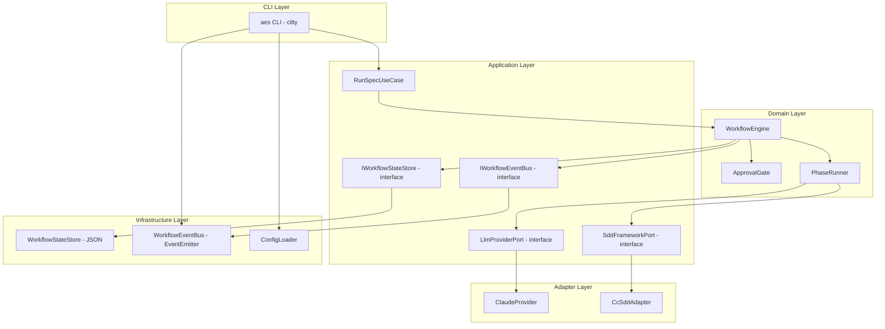
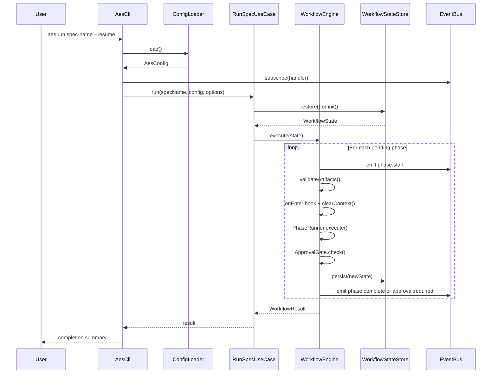
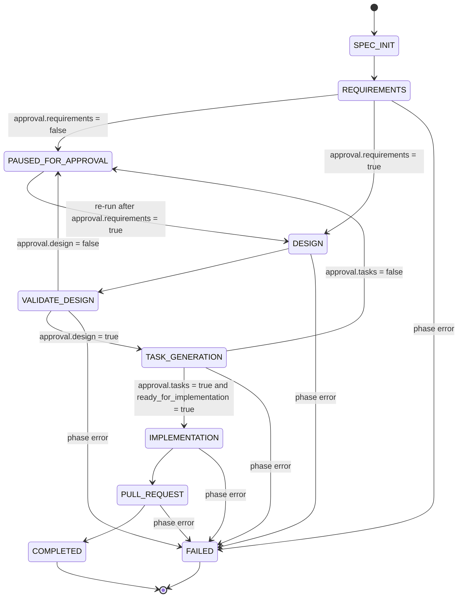
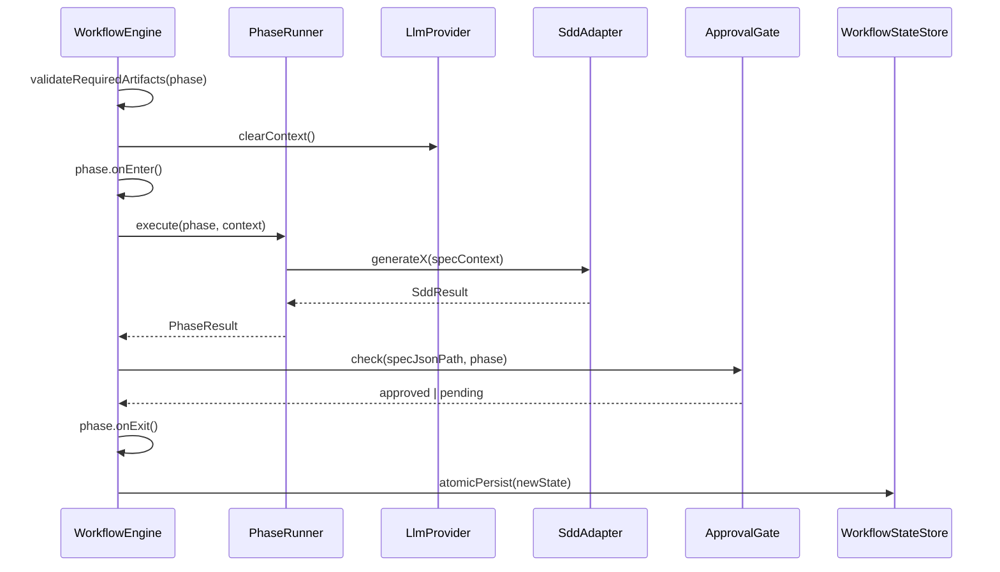
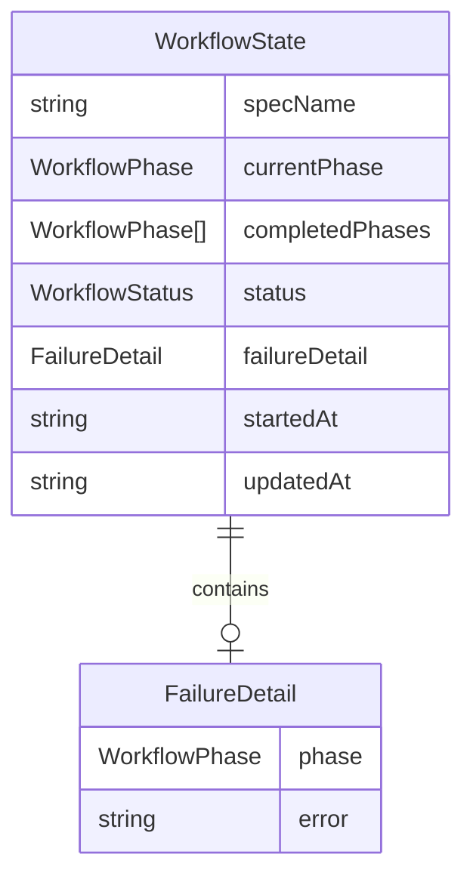

# Design Document: orchestrator-core

## Overview

The orchestrator-core is the foundational subsystem of the Autonomous Engineer System (AES). It provides the runnable skeleton that all other specs depend on: the `aes` CLI entry point, the 7-phase workflow state machine, human approval gates, an SDD framework adapter for cc-sdd, an LLM provider abstraction with a Claude implementation, and structured progress event reporting.

**Purpose**: Enable `aes run <spec-name>` to execute a complete spec-driven development lifecycle from SPEC_INIT through PULL_REQUEST, coordinating phase transitions, artifact validation, human approval gates, and LLM context resets at each phase boundary.

**Users**: Developers invoking the `aes` CLI directly, and CI/CD pipelines consuming structured JSON log output.

**Impact**: Establishes the foundational layer; all subsequent specs (tool-system, agent-loop, memory-system, etc.) plug into the workflow engine and LLM abstraction defined here.

### Goals

- Implement `aes run <spec-name>` with dry-run, resume, and JSON log flags
- Provide a deterministic, crash-recoverable 7-phase workflow state machine
- Gate phase advancement on human approval via `spec.json`
- Abstract LLM access behind a provider interface with a Claude implementation
- Implement a cc-sdd adapter behind the `SddFrameworkPort` interface
- Emit structured progress events to the CLI and JSON log

### Non-Goals

- Agent loop (PLAN→ACT→OBSERVE→REFLECT→UPDATE) — covered by spec4
- Tool system (filesystem, git, shell tools) — covered by spec2
- Memory system — covered by spec5
- Context engine (token budget, compression) — covered by spec6
- Other SDD framework adapters (OpenSpec, SpecKit) — adapter shells only; implementations deferred
- Streaming LLM responses in the CLI output — deferred to spec4

---

## Architecture

### Architecture Pattern & Boundary Map

This spec follows the Clean + Hexagonal Architecture mandated by project steering: dependencies flow inward (CLI → Use Case → Domain), and external systems are reached through ports implemented by adapters.



**Architecture Integration**:
- Selected pattern: Clean + Hexagonal — ports defined at application layer, adapters in adapter layer; domain never imports from adapters
- Domain boundaries: `WorkflowEngine` owns phase sequencing; `PhaseRunner` owns per-phase execution; `ApprovalGate` owns spec.json approval checks
- Existing patterns preserved: none (greenfield)
- Steering compliance: no monolithic AI frameworks; custom lightweight architecture; TypeScript strict mode; Bun runtime

### Technology Stack

| Layer | Choice / Version | Role | Notes |
|-------|-----------------|------|-------|
| CLI | citty 0.2.1 | `aes` entry point, subcommand parsing, flag handling | Zero-dep, ESM-native, Bun-compatible via `node:util.parseArgs` |
| Runtime | Bun v1.3.10+ | Process execution, file I/O, subprocess spawning | Required by project steering |
| Language | TypeScript (strict) | All source; no `any` | `noUncheckedIndexedAccess`, `exactOptionalPropertyTypes` |
| LLM SDK | @anthropic-ai/sdk 0.78.0 | Claude API access inside `ClaudeProvider` | Explicit Bun 1.0+ support; peer dep `zod ^3.25.0` |
| Events | node:events (built-in) | `WorkflowEventBus` | 100% Bun compatible; no additional library |
| State Persistence | node:fs (built-in) | Atomic JSON write via write-then-rename | `Bun.write()` alone is not crash-atomic; use `rename()` |
| SDD Framework | cc-sdd (subprocess) | Spec artifact generation via shell invocation | Wrapped entirely in `CcSddAdapter` |

---

## System Flows

### Main Execution Flow



### Workflow State Machine



Key decisions: `PAUSED_FOR_APPROVAL` is a persisted state; the workflow halts the process. The next `aes run` reads fresh `spec.json`, sees approval, and advances to the next phase without re-executing the approved phase.

### Phase Transition Sequence



---

## Requirements Traceability

| Requirement | Summary | Components | Interfaces | Flows |
|-------------|---------|------------|------------|-------|
| 1.1–1.8 | CLI commands and flags | AesCli | — | Main execution flow |
| 2.1–2.5 | Configuration loading | ConfigLoader | — | Main execution flow |
| 3.1–3.6 | 7-phase state machine | WorkflowEngine, WorkflowStateStore | — | State machine diagram |
| 4.1–4.6 | Phase transitions and context isolation | WorkflowEngine, PhaseRunner | LlmProviderPort | Phase transition sequence |
| 5.1–5.6 | Human approval gates | ApprovalGate | — | State machine diagram |
| 6.1–6.7 | cc-sdd adapter | CcSddAdapter | SddFrameworkPort | Phase transition sequence |
| 7.1–7.7 | LLM provider abstraction | ClaudeProvider | LlmProviderPort | Phase transition sequence |
| 8.1–8.6 | Progress reporting | WorkflowEventBus, AesCli | — | Main execution flow |

---

## Components and Interfaces

### Component Summary

| Component | Layer | Intent | Req Coverage | Key Dependencies | Contracts |
|-----------|-------|--------|--------------|-----------------|-----------|
| AesCli | CLI | `aes` entry point; parses commands and flags | 1.1–1.8, 8.4–8.6 | citty, RunSpecUseCase, WorkflowEventBus, ConfigLoader | Service |
| ConfigLoader | Infrastructure | Loads and merges `aes.config.json` + env vars | 2.1–2.5 | node:fs, node:process | Service |
| RunSpecUseCase | Application | Orchestrates workflow execution for one spec | 1.1, 3.1 | WorkflowEngine, WorkflowStateStore, ConfigLoader | Service |
| WorkflowEngine | Domain | Drives 7-phase state machine with transitions | 3.1–3.6, 4.1–4.6 | PhaseRunner, ApprovalGate, IWorkflowStateStore, IWorkflowEventBus | Service, State |
| PhaseRunner | Domain | Executes one phase via SDD adapter and LLM | 4.1–4.3, 6.1–6.4 | LlmProviderPort, SddFrameworkPort | Service |
| ApprovalGate | Domain | Reads spec.json to check approval status | 5.1–5.6 | node:fs | Service |
| IWorkflowStateStore | Application (Port) | Port interface for state persistence; isolates domain from file I/O | 3.2, 3.3, 3.6 | — | Service |
| IWorkflowEventBus | Application (Port) | Port interface for event emission; isolates domain from EventEmitter | 8.1–8.3 | — | Event |
| WorkflowStateStore | Infrastructure | Implements IWorkflowStateStore; atomic JSON write-then-rename | 3.2, 3.3, 3.6 | node:fs (write-then-rename) | State |
| WorkflowEventBus | Infrastructure | Implements IWorkflowEventBus via node:events EventEmitter | 8.1–8.6 | node:events EventEmitter | Event |
| LlmProviderPort | Application (Port) | Defines LLM abstraction interface | 7.1–7.7 | — | Service |
| ClaudeProvider | Adapter | Claude API implementation of LlmProviderPort | 7.3–7.7 | @anthropic-ai/sdk | Service |
| SddFrameworkPort | Application (Port) | Defines SDD adapter interface | 6.5–6.7 | — | Service |
| CcSddAdapter | Adapter | cc-sdd subprocess implementation of SddFrameworkPort | 6.1–6.7 | Bun.spawn / node:child_process | Service |

---

### CLI Layer

#### AesCli

| Field | Detail |
|-------|--------|
| Intent | Entry point; parses `aes run <spec> [flags]` via citty and delegates to RunSpecUseCase |
| Requirements | 1.1, 1.2, 1.3, 1.4, 1.5, 1.6, 1.7, 1.8, 8.4, 8.5, 8.6 |

**Responsibilities & Constraints**
- Defines the `run` subcommand with flags: `--provider`, `--dry-run`, `--resume`, `--log-json <file>`
- Subscribes to `WorkflowEventBus` and renders events as terminal output (phase headers, elapsed time, errors)
- Writes events to JSON log file when `--log-json` is provided
- Does not contain workflow logic; delegates entirely to `RunSpecUseCase`

**Dependencies**
- Outbound: `ConfigLoader` — load configuration before initializing use case (P0)
- Outbound: `RunSpecUseCase` — execute workflow (P0)
- Outbound: `WorkflowEventBus` — subscribe to events for terminal rendering (P1)

**Contracts**: Service [x]

##### Service Interface
```typescript
// citty command definition — not an interface but the public contract of the CLI
// Subcommand: aes run
type RunCommandArgs = {
  specName: string;           // positional
  provider?: string;          // --provider
  dryRun?: boolean;           // --dry-run
  resume?: boolean;           // --resume
  logJson?: string;           // --log-json <file>
};
```

**Implementation Notes**
- Integration: Use `citty` `defineCommand` with `args` typed by `RunCommandArgs`; pass parsed args to `RunSpecUseCase.run()`
- Validation: Exit with code 1 and descriptive message if spec name is missing or config load fails before calling use case
- Risks: citty is pre-1.0; pin to `0.2.1`

---

### Application Layer

#### ConfigLoader

| Field | Detail |
|-------|--------|
| Intent | Load `aes.config.json` from project root, merge environment variables, validate required fields |
| Requirements | 2.1, 2.2, 2.3, 2.4, 2.5 |

**Responsibilities & Constraints**
- Reads `aes.config.json` from `process.cwd()`
- Merges `process.env` (env vars take precedence over file values)
- Validates required fields: `llm.provider`, `llm.modelName`, `llm.apiKey`
- Returns an immutable `AesConfig`

**Dependencies**
- External: `node:fs`, `node:process` (P0)

**Contracts**: Service [x]

##### Service Interface
```typescript
interface AesConfig {
  readonly llm: {
    readonly provider: string;
    readonly modelName: string;
    readonly apiKey: string;
  };
  readonly specDir: string;
  readonly sddFramework: 'cc-sdd' | 'openspec' | 'speckit';
}

interface ConfigLoader {
  load(): Promise<AesConfig>;
  // throws ConfigValidationError if required fields are absent
}

class ConfigValidationError extends Error {
  readonly missingFields: readonly string[];
}
```

---

#### RunSpecUseCase

| Field | Detail |
|-------|--------|
| Intent | Orchestrate a single spec's workflow: initialize or restore state, then delegate to WorkflowEngine |
| Requirements | 1.1, 3.1, 3.6 |

**Responsibilities & Constraints**
- Entry point for workflow execution after CLI arg parsing
- Constructs `WorkflowEngine` with injected ports and infrastructure
- On `--resume`: calls `WorkflowStateStore.restore(specName)` before delegating
- On `--dry-run`: validates spec existence and config; exits without calling WorkflowEngine

**Dependencies**
- Outbound: `WorkflowEngine` — execute workflow (P0)
- Outbound: `WorkflowStateStore` — restore persisted state (P1)
- Outbound: `LlmProviderPort`, `SddFrameworkPort` — injected into WorkflowEngine (P0)

**Contracts**: Service [x]

##### Service Interface
```typescript
type RunOptions = {
  resume: boolean;
  dryRun: boolean;
  providerOverride?: string;
  logJsonPath?: string;
};

type WorkflowResult =
  | { status: 'completed'; completedPhases: readonly WorkflowPhase[] }
  | { status: 'paused'; phase: WorkflowPhase; reason: 'approval_required' }
  | { status: 'failed'; phase: WorkflowPhase; error: string };

interface RunSpecUseCase {
  run(specName: string, config: AesConfig, options: RunOptions): Promise<WorkflowResult>;
}
```

---

#### LlmProviderPort

| Field | Detail |
|-------|--------|
| Intent | Abstraction boundary between domain and LLM infrastructure |
| Requirements | 7.1, 7.2, 7.4, 7.5, 7.6, 7.7 |

**Contracts**: Service [x]

##### Service Interface
```typescript
type LlmErrorCategory = 'network' | 'rate_limit' | 'api_error';

type LlmResult =
  | { ok: true; value: LlmResponse }
  | { ok: false; error: LlmError };

interface LlmResponse {
  readonly content: string;
  readonly usage: { readonly inputTokens: number; readonly outputTokens: number };
}

interface LlmError {
  readonly category: LlmErrorCategory;
  readonly message: string;
  readonly originalError: unknown;
}

interface LlmCompleteOptions {
  readonly maxTokens?: number;
}

interface LlmProviderPort {
  complete(prompt: string, options?: LlmCompleteOptions): Promise<LlmResult>;
  clearContext(): void;
}
```
- Preconditions: `prompt` is non-empty string
- Postconditions: returns `LlmResult`; never throws; errors are encoded in the `{ ok: false }` branch
- Invariants: after `clearContext()`, subsequent `complete()` calls must not include prior conversation history

---

#### IWorkflowStateStore

| Field | Detail |
|-------|--------|
| Intent | Port interface for workflow state persistence; isolates WorkflowEngine from file I/O infrastructure |
| Requirements | 3.2, 3.3, 3.6 |

**Contracts**: Service [x]

##### Service Interface
```typescript
interface IWorkflowStateStore {
  persist(state: WorkflowState): Promise<void>;
  restore(specName: string): Promise<WorkflowState | null>;
  init(specName: string): WorkflowState;
}
```

---

#### IWorkflowEventBus

| Field | Detail |
|-------|--------|
| Intent | Port interface for workflow event emission; isolates WorkflowEngine from EventEmitter infrastructure |
| Requirements | 8.1, 8.2, 8.3 |

**Contracts**: Event [x]

##### Event Contract
```typescript
interface IWorkflowEventBus {
  emit(event: WorkflowEvent): void;
  on(handler: (event: WorkflowEvent) => void): void;
  off(handler: (event: WorkflowEvent) => void): void;
}
```

---

#### SddFrameworkPort

| Field | Detail |
|-------|--------|
| Intent | Abstraction boundary between domain and SDD framework CLI tools |
| Requirements | 6.5, 6.6, 6.7 |

**Contracts**: Service [x]

##### Service Interface
```typescript
interface SpecContext {
  readonly specName: string;
  readonly specDir: string;
  readonly language: string;
}

type SddOperationResult =
  | { ok: true; artifactPath: string }
  | { ok: false; error: { exitCode: number; stderr: string } };

interface SddFrameworkPort {
  generateRequirements(ctx: SpecContext): Promise<SddOperationResult>;
  generateDesign(ctx: SpecContext): Promise<SddOperationResult>;
  validateDesign(ctx: SpecContext): Promise<SddOperationResult>;
  generateTasks(ctx: SpecContext): Promise<SddOperationResult>;
}
```
- Preconditions: `specDir` directory exists and is writable
- Postconditions: on `ok: true`, `artifactPath` refers to an existing file on disk
- Invariants: each method must not modify workflow state; side effects are limited to the spec directory

---

### Domain Layer

#### WorkflowEngine

| Field | Detail |
|-------|--------|
| Intent | Execute the 7-phase workflow state machine; manage transitions, artifact validation, context resets, and approval gates |
| Requirements | 3.1–3.6, 4.1–4.6, 5.1–5.6 |

**Responsibilities & Constraints**
- Maintains `WorkflowState` as a discriminated union (see Data Models)
- Sequences phases in fixed order: SPEC_INIT → REQUIREMENTS → DESIGN → VALIDATE_DESIGN → TASK_GENERATION → IMPLEMENTATION → PULL_REQUEST
- Before each transition: validates required artifacts on disk; calls `LlmProviderPort.clearContext()`; invokes phase lifecycle hooks
- After each phase: checks approval gate; persists state atomically; emits event
- Prevents concurrent phase execution (single-process, synchronous phase loop)
- On failure: persists FAILED state; emits error event; returns to caller

**Dependencies**
- Outbound: `PhaseRunner` — executes each phase (P0)
- Outbound: `ApprovalGate` — checks spec.json after approval-gated phases (P0)
- Outbound: `IWorkflowStateStore` *(port)* — persist/restore state (P0)
- Outbound: `IWorkflowEventBus` *(port)* — emit events (P1)
- Outbound: `LlmProviderPort` — `clearContext()` on transition (P0)

**Contracts**: Service [x], State [x]

##### Service Interface
```typescript
type WorkflowPhase =
  | 'SPEC_INIT'
  | 'REQUIREMENTS'
  | 'DESIGN'
  | 'VALIDATE_DESIGN'
  | 'TASK_GENERATION'
  | 'IMPLEMENTATION'
  | 'PULL_REQUEST';

type WorkflowStatus = 'running' | 'paused_for_approval' | 'completed' | 'failed';

interface WorkflowState {
  readonly specName: string;
  readonly currentPhase: WorkflowPhase;
  readonly completedPhases: readonly WorkflowPhase[];
  readonly status: WorkflowStatus;
  readonly failureDetail?: { readonly phase: WorkflowPhase; readonly error: string };
  readonly startedAt: string;   // ISO 8601
  readonly updatedAt: string;   // ISO 8601
}

interface WorkflowEngine {
  execute(state: WorkflowState): Promise<WorkflowResult>;
  getState(): WorkflowState;
}
```

##### State Management
- State model: `WorkflowState` discriminated by `status` + `currentPhase`
- Persistence: atomic JSON write-then-rename to `.aes/state/<specName>.json`
- Concurrency strategy: single-threaded execution; no concurrent access expected in v1

**Implementation Notes**
- Integration: inject all dependencies via constructor; WorkflowEngine has no direct imports from adapter or infra packages
- Validation: use a static `PHASE_SEQUENCE` array and `REQUIRED_ARTIFACTS` map keyed by phase name to validate before each transition
- Risks: if `spec.json` is malformed (invalid JSON) at approval check, the gate must fail closed (treat as not approved)

---

#### PhaseRunner

| Field | Detail |
|-------|--------|
| Intent | Execute a single workflow phase by dispatching to the appropriate SddFrameworkPort operation or LLM call |
| Requirements | 4.1, 4.2, 4.3, 6.1, 6.2, 6.3, 6.4 |

**Contracts**: Service [x]

##### Service Interface
```typescript
type PhaseResult =
  | { ok: true; artifacts: readonly string[] }
  | { ok: false; error: string };

interface PhaseRunner {
  execute(phase: WorkflowPhase, ctx: SpecContext): Promise<PhaseResult>;
  onEnter(phase: WorkflowPhase): Promise<void>;
  onExit(phase: WorkflowPhase): Promise<void>;
}
```

**Implementation Notes**
- The `execute` method dispatches on `phase` to the appropriate `SddFrameworkPort` method (REQUIREMENTS → `generateRequirements`, DESIGN → `generateDesign`, VALIDATE_DESIGN → `validateDesign`, TASK_GENERATION → `generateTasks`); SPEC_INIT, IMPLEMENTATION, and PULL_REQUEST invoke LLM or git operations (stubbed in this spec; wired in spec4, spec8)
- Risks: IMPLEMENTATION and PULL_REQUEST phases have no SDD adapter mapping; they must be no-ops or stubs until spec4/spec8 are integrated

---

#### ApprovalGate

| Field | Detail |
|-------|--------|
| Intent | Read `spec.json` and determine whether the approval for a given phase is granted |
| Requirements | 5.1–5.6 |

**Contracts**: Service [x]

##### Service Interface
```typescript
type ApprovalPhase = 'requirements' | 'design' | 'tasks';

type ApprovalCheckResult =
  | { approved: true }
  | { approved: false; artifactPath: string; instruction: string };

interface ApprovalGate {
  check(specDir: string, phase: ApprovalPhase): Promise<ApprovalCheckResult>;
}
```
- Reads `<specDir>/spec.json` fresh on every call (no caching)
- Returns `approved: false` if `spec.json` is missing, malformed, or the relevant approval field is absent or `false`
- `instruction` is a human-readable message shown by the CLI

---

### Infrastructure Layer

#### WorkflowStateStore

| Field | Detail |
|-------|--------|
| Intent | Atomically persist and restore `WorkflowState` as JSON |
| Requirements | 3.2, 3.3, 3.6 |

**Contracts**: State [x]

##### State Management
- State model: `WorkflowState` serialized as JSON at `.aes/state/<specName>.json`
- Persistence: write-then-rename (`Bun.write(tmp)` + `fd.datasync()` + `fs.rename(tmp, dest)`) — crash-atomic
- Concurrency strategy: single writer (the workflow engine); readers (CLI status) tolerate eventual consistency

##### Service Interface
```typescript
interface WorkflowStateStore {
  persist(state: WorkflowState): Promise<void>;
  restore(specName: string): Promise<WorkflowState | null>;
  init(specName: string): WorkflowState;
}
```

---

#### WorkflowEventBus

| Field | Detail |
|-------|--------|
| Intent | Typed event emitter for workflow lifecycle events; decouples WorkflowEngine from CLI rendering |
| Requirements | 8.1, 8.2, 8.3, 8.4, 8.5, 8.6 |

**Contracts**: Event [x]

##### Event Contract

```typescript
type WorkflowEvent =
  | { type: 'phase:start';    phase: WorkflowPhase; timestamp: string }
  | { type: 'phase:complete'; phase: WorkflowPhase; durationMs: number; artifacts: readonly string[] }
  | { type: 'phase:error';    phase: WorkflowPhase; operation: string; error: string }
  | { type: 'approval:required'; phase: WorkflowPhase; artifactPath: string; instruction: string }
  | { type: 'workflow:complete'; completedPhases: readonly WorkflowPhase[] }
  | { type: 'workflow:failed';   phase: WorkflowPhase; error: string };

interface WorkflowEventBus {
  emit(event: WorkflowEvent): void;
  on(handler: (event: WorkflowEvent) => void): void;
  off(handler: (event: WorkflowEvent) => void): void;
}
```
- Delivery: synchronous (Node.js `EventEmitter`); handlers called in subscription order
- Ordering guarantee: events are emitted in phase execution order; no buffering

**Implementation Notes**
- Integration: implement via `node:events` `EventEmitter` with typed wrapper; AesCli subscribes before calling `RunSpecUseCase.run()`
- JSON log: CLI handler writes `JSON.stringify(event) + '\n'` to `--log-json` file path when flag is provided

---

### Adapter Layer

#### ClaudeProvider

| Field | Detail |
|-------|--------|
| Intent | `LlmProviderPort` implementation using `@anthropic-ai/sdk` to call the Anthropic Claude API |
| Requirements | 7.3, 7.4, 7.5, 7.6, 7.7 |

**Dependencies**
- External: `@anthropic-ai/sdk 0.78.0` — Claude API client (P0)

**Contracts**: Service [x]

##### Service Interface
```typescript
interface ClaudeProviderConfig {
  readonly apiKey: string;
  readonly modelName: string; // e.g. 'claude-sonnet-4-6'
}

// Implements LlmProviderPort
class ClaudeProvider implements LlmProviderPort {
  constructor(config: ClaudeProviderConfig);
  complete(prompt: string, options?: LlmCompleteOptions): Promise<LlmResult>;
  clearContext(): void; // resets internal message history to []
}
```
- Preconditions: `apiKey` is non-empty; `modelName` is a valid Claude model identifier
- Postconditions: maps `@anthropic-ai/sdk` errors to `LlmError` with correct `category`; never throws
- Error mapping: `APIConnectionError` → `network`; `RateLimitError` → `rate_limit`; all others → `api_error`

**Implementation Notes**
- Integration: instantiate `new Anthropic({ apiKey })` in constructor; `clearContext()` resets the internal `messages: Message[]` array; `complete()` appends the prompt as a user message and calls `client.messages.create()`
- Risks: Claude API rate limits are not auto-retried by the SDK; `rate_limit` errors propagate to WorkflowEngine as phase failures in v1; retry logic is deferred to spec4

---

#### CcSddAdapter

| Field | Detail |
|-------|--------|
| Intent | `SddFrameworkPort` implementation that shells out to the `cc-sdd` CLI for spec artifact generation |
| Requirements | 6.1, 6.2, 6.3, 6.4, 6.5, 6.6, 6.7 |

**Dependencies**
- External: `cc-sdd` CLI (installed as a dev dependency or globally) — invoked via subprocess (P0)

**Contracts**: Service [x]

##### Service Interface
```typescript
// Implements SddFrameworkPort
class CcSddAdapter implements SddFrameworkPort {
  generateRequirements(ctx: SpecContext): Promise<SddOperationResult>;
  generateDesign(ctx: SpecContext): Promise<SddOperationResult>;
  validateDesign(ctx: SpecContext): Promise<SddOperationResult>;
  generateTasks(ctx: SpecContext): Promise<SddOperationResult>;
}
```
- Each method spawns a cc-sdd subprocess with `ctx.specName`, `ctx.language`, and `ctx.specDir` as arguments
- Captures stdout and stderr; maps non-zero exit codes to `{ ok: false, error: { exitCode, stderr } }`
- Does not modify any state outside the spec directory

**Implementation Notes**
- Integration: use `Bun.spawn` for subprocess execution; capture stdout/stderr via piped streams; await process exit
- Risks: cc-sdd CLI command flags may change; all invocation details are isolated inside this adapter class; integration-tested against the real cc-sdd binary

---

## Data Models

### Domain Model

**WorkflowState** is the root aggregate. It is owned exclusively by `WorkflowEngine` and persisted by `WorkflowStateStore`.



**Invariants**:
- `completedPhases` never contains `currentPhase`
- `failureDetail` is non-null only when `status = 'failed'`
- `updatedAt` is always ≥ `startedAt`
- Phase transitions may only advance forward in `PHASE_SEQUENCE`; no backward transitions
- When `status = 'paused_for_approval'`, `currentPhase` holds the phase that triggered the pause (the just-completed SDD phase). On resume, `WorkflowEngine` re-checks the approval gate for `currentPhase` via `ApprovalGate.check()` before advancing to the next phase; it does not re-execute the phase.

### Logical Data Model

**WorkflowState JSON** (persisted at `.aes/state/<specName>.json`):
```
{
  specName: string
  currentPhase: WorkflowPhase
  completedPhases: WorkflowPhase[]
  status: "running" | "paused_for_approval" | "completed" | "failed"
  failureDetail?: { phase: WorkflowPhase, error: string }
  startedAt: ISO8601
  updatedAt: ISO8601
}
```

**AesConfig JSON** (read-only at `aes.config.json`):
```
{
  llm: { provider: string, modelName: string, apiKey: string }
  specDir: string        // default: ".kiro/specs"
  sddFramework: "cc-sdd" | "openspec" | "speckit"   // default: "cc-sdd"
}
```

### Data Contracts & Integration

**WorkflowEvent** (emitted to subscribers; serialized to JSON log):
- All events include `type` discriminant (string literal)
- `timestamp` is ISO 8601; `durationMs` is integer milliseconds
- JSON serialization: `JSON.stringify(event)` — no custom serializer needed

---

## Error Handling

### Error Strategy

Fail fast at boundaries: validate configuration before starting the workflow; validate artifacts before each transition; propagate structured errors without swallowing.

### Error Categories and Responses

**Configuration Errors** (startup):
- Missing required config fields → `ConfigValidationError` with `missingFields[]`; CLI exits with code 1 and lists each missing field by name

**Phase Execution Errors**:
- `SddOperationResult { ok: false }` → WorkflowEngine transitions to FAILED; emits `workflow:failed` event with phase name and stderr excerpt
- `LlmResult { ok: false }` → same treatment; `category` is included in the error event for observability

**Artifact Validation Errors**:
- Missing required artifact before transition → WorkflowEngine emits `phase:error` event; remains in current phase; halts

**State Persistence Errors**:
- `WorkflowStateStore.persist()` failure → logged as critical; workflow halts (unsafe to continue without persisted state)

**Approval Gate Errors**:
- Malformed `spec.json` → ApprovalGate returns `approved: false`; treated as pending approval (fail closed)

### Monitoring

- All `WorkflowEvent` emissions serve as the primary observability channel
- `phase:error` events include `operation` name for tracing which sub-operation failed
- `--log-json` output enables structured log ingestion in CI/CD (e.g., Datadog, CloudWatch)

---

## Testing Strategy

### Unit Tests

- `WorkflowEngine.execute()` — test each phase transition with stub `PhaseRunner`; verify state mutations, event emissions, and approval gate behavior for each gated phase
- `ApprovalGate.check()` — test approved/pending/malformed spec.json scenarios; verify fail-closed behavior
- `ConfigLoader.load()` — test env var precedence, missing required field reporting, malformed JSON handling
- `WorkflowStateStore.persist()` / `restore()` — test write-then-rename atomicity simulation; test restoration of each `WorkflowStatus` variant
- `ClaudeProvider` — mock `@anthropic-ai/sdk`; test error category mapping for `APIConnectionError`, `RateLimitError`, and generic API errors

### Integration Tests

- `CcSddAdapter` — spawn real `cc-sdd` binary in a temp spec directory; verify artifact creation and non-zero exit handling for each of the four operations
- `WorkflowEngine` + `WorkflowStateStore` — run a 3-phase sub-sequence (SPEC_INIT → REQUIREMENTS → DESIGN) with stub adapters; assert state file contents after each phase
- `AesCli` → `RunSpecUseCase` → `WorkflowEngine` — end-to-end dry-run flag; assert no file writes occur; assert exit code 0

### E2E Tests

- `aes run <spec>` against a real spec directory with cc-sdd installed; verify workflow advances through all 7 phases and produces artifacts at each gated boundary
- `--resume` flag: interrupt after REQUIREMENTS, then resume; assert SPEC_INIT is not re-executed

---

## Security Considerations

- **API key protection**: `AesConfig.llm.apiKey` is loaded from `process.env` or `aes.config.json`; `aes.config.json` must be listed in `.gitignore`; the CLI must never log the API key value
- **Subprocess injection**: `CcSddAdapter` must not interpolate `specName` directly into shell command strings; use argument arrays with `Bun.spawn([cmd, ...args])` to prevent command injection
- **Spec directory boundary**: `WorkflowStateStore` writes only to `.aes/state/`; `CcSddAdapter` writes only to the configured `specDir`; neither component accepts paths from user-controlled input

---

## Performance & Scalability

- **Startup time**: citty + Bun startup target < 100 ms for `aes --help` (Bun's fast cold start)
- **State file writes**: write-then-rename adds ~1–5 ms overhead per phase transition — acceptable for a workflow that runs minutes to hours
- **LLM latency**: Claude API round-trips dominate execution time; no buffering or parallelism needed at this layer (handled in spec4/spec6)
- **Scaling**: v1 is single-spec, single-process; multi-spec parallelism deferred to future multi-agent architecture
