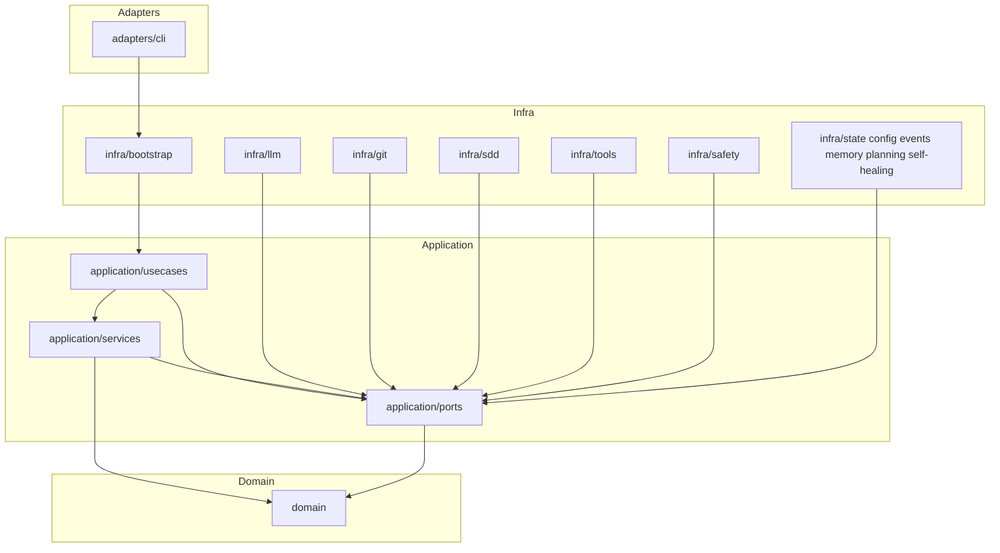
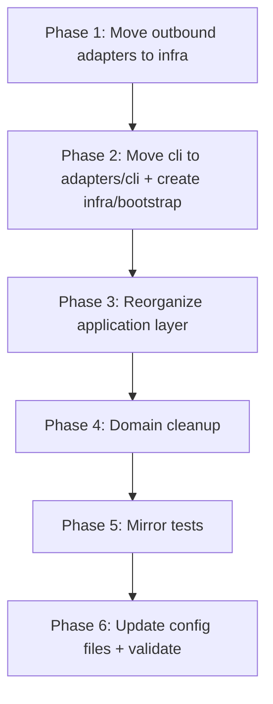

# Design Document: refactor-directory-structure

## Overview

This refactoring realigns `orchestrator-ts/src/` with Clean Architecture / Hexagonal Architecture principles by reorganizing three structural problems in the current layout: (1) outbound adapters living in `src/adapters/` alongside CLI, (2) the CLI module sitting outside the adapters layer, and (3) the application layer lacking explicit `usecases/`, `services/`, and `ports/` sub-groupings. The refactoring is purely structural — zero runtime behavior changes.

**Purpose**: Deliver a directory structure where each layer's role is immediately legible from path alone, and where dependency direction violations are structurally impossible to overlook.

**Users**: Developers reading, navigating, and extending the `orchestrator-ts` codebase will benefit from clear, predictable module locations.

**Impact**: Changes source paths, import statements, test directory paths, `package.json` bin/script paths, and `tsconfig.json` includes. Public CLI behavior and all test assertions remain identical.

### Goals

- Move all outbound adapters (LLM, Git, SDD, tools, safety) from `src/adapters/` to `src/infra/`
- Move `src/cli/` into `src/adapters/cli/` as the sole inbound adapter
- Introduce `src/application/services/` and keep `src/application/usecases/` and `src/application/ports/` for clear application layer roles
- Move DI wiring from `src/cli/index.ts` into `src/infra/bootstrap/`
- Mirror all source moves in `tests/` to maintain 1:1 structure
- Eliminate the empty `src/domain/engines/` directory

### Non-Goals

- Changing any domain logic, service logic, or adapter behavior
- Renaming TypeScript classes or exported symbols
- Changing the `aes` CLI command interface or output format
- Adding new features or capabilities
- Modifying linting or formatting configuration

---

## Requirements Traceability

| Requirement | Summary | Components | Key Interfaces | Notes |
|-------------|---------|------------|----------------|-------|
| 1.1–1.4 | Move `src/cli/` → `src/adapters/cli/`; only inbound adapters in `adapters/` | `adapters/cli/` | CLI entry, renderer | Update `package.json` bin path |
| 2.1–2.8 | Move outbound adapters to `src/infra/` sub-directories | `infra/llm/`, `infra/git/`, `infra/sdd/`, `infra/tools/`, `infra/safety/` | Port implementations | Mock files follow their domain |
| 3.1–3.5 | Reorganize `application/` into `usecases/`, `services/`, `ports/` | `application/services/`, `application/usecases/`, `application/ports/` | Safety ports merged into `ports/safety.ts` | Safety services → `services/safety/` |
| 4.1–4.3 | `domain/` unchanged; remove empty `engines/` | `domain/` (untouched) | — | Remove empty directory only |
| 5.1–5.4 | `infra/` = single composition root; add `bootstrap/` | `infra/bootstrap/` | Bootstrap factory | DI wiring moves from `cli/index.ts` |
| 6.1–6.5 | `tests/` mirrors refactored `src/` | All test directories | — | No test logic changes |
| 7.1–7.5 | Zero behavioral change; all tests pass | — | — | `bun test` + `bun run typecheck` must pass |
| 8.1–8.5 | Enforce inward dependency rule | Dependency audit | — | Fix `quality-gate-runner.ts` import |

---

## Architecture

### Existing Architecture Analysis

The current `src/` has six top-level directories, but two of them violate the intended layer semantics:

- `src/adapters/` contains only **outbound** adapters (LLM, Git, SDD, tools, safety) — these are infrastructure concerns, not delivery mechanisms.
- `src/cli/` is an **inbound** adapter (delivery mechanism) but lives outside `adapters/`, giving it no clear architectural home.
- `src/application/safety/` holds both port interfaces (`ports.ts`) and service orchestration (`emergency-stop-handler.ts`, `guarded-executor.ts`) mixed in one directory without the `services/` vs `ports/` separation used elsewhere.
- One known dependency violation: `src/application/implementation-loop/quality-gate-runner.ts` imports `runCommandTool` from `@/adapters/tools/shell`, crossing the application→infrastructure boundary.
- `src/domain/engines/` is an empty directory with no files.

### Target Architecture



### Target Directory Structure

```
src/
├── adapters/
│   └── cli/                          # Inbound: CLI entry point and terminal rendering
│       ├── index.ts                  # Entry point — argument parsing + delegates to infra/bootstrap
│       ├── renderer.ts
│       ├── config-wizard.ts
│       ├── configure-command.ts
│       ├── debug-log-writer.ts
│       └── json-log-writer.ts
├── application/
│   ├── usecases/                     # Top-level application actions (unchanged)
│   │   └── run-spec.ts
│   ├── services/                     # Reusable orchestration logic (renamed from domain-named dirs)
│   │   ├── agent/
│   │   ├── context/
│   │   ├── git/
│   │   ├── implementation-loop/
│   │   ├── planning/
│   │   ├── safety/                   # emergency-stop-handler.ts, guarded-executor.ts
│   │   ├── self-healing-loop/
│   │   ├── tools/
│   │   └── workflow/
│   └── ports/                        # Abstract capability contracts (add safety.ts, logging.ts)
│       ├── agent-loop.ts
│       ├── config.ts
│       ├── context.ts
│       ├── debug.ts
│       ├── git-controller.ts
│       ├── git-event-bus.ts
│       ├── implementation-loop.ts
│       ├── llm.ts
│       ├── logging.ts                # NEW: IJsonLogWriter interface
│       ├── memory.ts
│       ├── pr-provider.ts
│       ├── safety.ts                 # Moved from application/safety/ports.ts
│       ├── sdd.ts
│       ├── self-healing-loop-logger.ts
│       ├── task-planning.ts
│       └── workflow.ts
├── domain/                           # Unchanged (remove empty engines/ dir)
│   ├── agent/
│   ├── context/
│   ├── debug/
│   ├── git/
│   ├── implementation-loop/
│   ├── planning/
│   ├── safety/
│   ├── self-healing/
│   ├── tools/
│   └── workflow/
└── infra/                            # Concrete implementations + composition root
    ├── bootstrap/                    # NEW: composition root (DI wiring from cli/index.ts)
    │   └── create-run-dependencies.ts
    ├── config/
    ├── events/
    ├── git/                          # Existing factory + moved git adapters
    │   ├── create-git-integration-service.ts
    │   ├── git-controller-adapter.ts  # Moved from adapters/git/
    │   └── github-pr-adapter.ts       # Moved from adapters/git/
    ├── implementation-loop/
    ├── llm/                          # Moved from adapters/llm/
    │   ├── claude-provider.ts
    │   └── mock-llm-provider.ts
    ├── memory/
    ├── planning/
    ├── safety/                       # Existing factory + moved safety adapters
    │   ├── create-safety-executor.ts
    │   ├── approval-gateway.ts        # Moved from adapters/safety/
    │   ├── audit-logger.ts            # Moved from adapters/safety/
    │   └── sandbox-executor.ts        # Moved from adapters/safety/
    ├── sdd/                          # Moved from adapters/sdd/
    │   ├── cc-sdd-adapter.ts
    │   └── mock-sdd-adapter.ts
    ├── self-healing/
    ├── state/
    └── tools/                        # Moved from adapters/tools/
        ├── code-analysis.ts
        ├── filesystem.ts
        ├── git.ts
        ├── knowledge.ts
        └── shell.ts
```

### Architecture Integration

- **Pattern**: Clean Architecture + Hexagonal (Ports & Adapters). Inbound adapters (CLI) in `adapters/`; outbound adapters (concrete port implementations) in `infra/`; composition root in `infra/bootstrap/`.
- **Domain boundaries**: `domain/` remains fully isolated with no external imports.
- **Dependency rule enforced**: `application/` imports only `domain/` and `application/` sub-modules. `infra/` implements `application/ports/`. `adapters/cli/` delegates DI to `infra/bootstrap/`.
- **Existing patterns preserved**: Factory pattern in `infra/` (e.g., `create-git-integration-service.ts`), NDJSON loggers, state store, event bus — all untouched.
- **Steering compliance**: Aligns with `tech.md` Clean Architecture principle and `structure.md` code organization principles.

### Technology Stack

| Layer | Choice | Role in Feature |
|-------|--------|-----------------|
| Language | TypeScript 5.x strict | All file content unchanged; only paths change |
| Runtime / Build | Bun v1.3.10+ | `bun test` and `bun run typecheck` are the validation gates |
| Path aliases | `@/*` → `src/*` (tsconfig.json) | All moved imports use `@/` prefix; aliases require no change |
| Config files | `package.json`, `tsconfig.json` | `bin` path and `include` array updated for CLI relocation |

---

## System Flows

### Migration Sequence

The refactoring is executed in phases to keep the codebase in a compilable state after each phase:



Each phase ends with a typecheck pass. The full test suite runs only after Phase 6.

---

## Components and Interfaces

### Summary Table

| Component | Layer | Intent | Req Coverage | Key Change |
|-----------|-------|--------|--------------|------------|
| `adapters/cli/` | Inbound Adapter | CLI entry point, argument parsing, rendering | 1.1–1.4, 8.3 | Relocated from `src/cli/`; index.ts delegates DI to bootstrap |
| `infra/llm/` | Infrastructure | LLM provider implementations | 2.1, 2.8, 5.1 | Relocated from `src/adapters/llm/` |
| `infra/git/` | Infrastructure | Git adapter + factory | 2.2, 2.7, 5.1 | Merges moved adapters with existing factory file |
| `infra/sdd/` | Infrastructure | SDD adapter implementations | 2.3, 2.8, 5.1 | Relocated from `src/adapters/sdd/` |
| `infra/tools/` | Infrastructure | Tool implementations | 2.4, 5.1 | Relocated from `src/adapters/tools/` |
| `infra/safety/` | Infrastructure | Safety adapter implementations | 2.5, 5.1 | Merges moved adapters with existing factory file |
| `infra/bootstrap/` | Infrastructure | Composition root (DI wiring) | 5.3, 8.3 | New directory; extracts DI wiring from `cli/index.ts` |
| `application/services/` | Application | Reusable orchestration services | 3.1–3.5 | Renamed from domain-named dirs under `application/` |
| `application/services/safety/` | Application | Safety orchestration services | 3.4 | Moved from `application/safety/` |
| `application/ports/safety.ts` | Application | Safety port interfaces | 3.4 | Moved from `application/safety/ports.ts` |
| `application/ports/logging.ts` | Application | Log writer port interfaces (`IJsonLogWriter`, `IDebugEventSink` already in `debug.ts`) | 3.5, 8.3 | NEW file; `JsonLogWriter` in `adapters/cli/` implements it |
| `domain/` | Domain | Business rules (untouched) | 4.1–4.3 | Only `engines/` empty dir removed |

---

### Infra Layer

#### `infra/bootstrap/`

| Field | Detail |
|-------|--------|
| Intent | Single composition root that wires all concrete dependencies and returns ready-to-use application objects |
| Requirements | 5.3, 8.3 |

**Responsibilities & Constraints**
- Instantiates all infrastructure implementations (`ClaudeProvider`, `MockLlmProvider`, `CcSddAdapter`, `MockSddAdapter`, `FileMemoryStore`, `WorkflowStateStore`, `WorkflowEventBus`, `createImplementationLoopService`)
- Assembles and returns a configured `RunSpecUseCase` and its event bus
- Must not contain any CLI argument parsing or process lifecycle logic
- Is the only location permitted to import directly from both `infra/` and `application/`

**Dependencies**
- Inbound: `adapters/cli/index.ts` — calls bootstrap factory (P0)
- Outbound: `infra/llm/`, `infra/sdd/`, `infra/git/`, `infra/tools/`, `infra/safety/`, `infra/state/`, `infra/memory/`, `infra/events/`, `infra/implementation-loop/` (P0)
- Outbound: `application/usecases/run-spec.ts` (P0)

**Contracts**: Service [x]

##### Service Interface

```typescript
interface RunDependencies {
  readonly useCase: RunSpecUseCase;
  readonly eventBus: WorkflowEventBus;
  readonly logWriter: IJsonLogWriter | null;    // interface from application/ports/logging.ts
  readonly debugWriter: IDebugEventSink | null; // interface from application/ports/debug.ts
}

function createRunDependencies(
  config: AesConfig,
  options: {
    debugFlow: boolean;
    debugFlowLog?: string;
    logJsonPath?: string;
    providerOverride?: string;
  }
): RunDependencies;
```

**Implementation Notes**
- Integration: `adapters/cli/index.ts` imports only this factory and CLI-local helpers (renderer, clack prompts). All other imports move to bootstrap.
- Validation: After extracting wiring, run `bun run typecheck` to confirm no import breakage.
- Risks: If any debug-flow conditional logic is tightly coupled to CLI argument parsing, it must be disentangled; the bootstrap receives parsed boolean flags as parameters.

---

#### `infra/git/` (merged)

| Field | Detail |
|-------|--------|
| Intent | All git-related infrastructure: factory, controller adapter, PR adapter |
| Requirements | 2.2, 2.7 |

**Responsibilities & Constraints**
- Contains `create-git-integration-service.ts` (existing factory), `git-controller-adapter.ts`, `github-pr-adapter.ts` (moved from `adapters/git/`)
- No naming conflict exists between factory and adapter files
- `git-controller-adapter.ts` imports from `@/infra/tools/git` after tool relocation

**Contracts**: Service [x]

**Implementation Notes**
- Integration: `infra/git/create-git-integration-service.ts` currently imports `@/adapters/git/...` — update to `@/infra/git/...`
- Risks: Cross-directory import within `infra/git/` (factory importing adapter in same dir) is acceptable since both are infrastructure.

---

#### `infra/safety/` (merged)

| Field | Detail |
|-------|--------|
| Intent | Safety executor factory plus concrete approval, audit, and sandbox implementations |
| Requirements | 2.5 |

**Implementation Notes**
- `create-safety-executor.ts` imports from `@/adapters/safety/...` — update to `@/infra/safety/...`
- All three adapters (`approval-gateway.ts`, `audit-logger.ts`, `sandbox-executor.ts`) implement interfaces defined in `application/ports/safety.ts`

---

### Application Layer

#### `application/services/` (reorganized)

| Field | Detail |
|-------|--------|
| Intent | Houses all reusable orchestration logic previously spread across domain-named `application/` subdirectories |
| Requirements | 3.1–3.5 |

**Responsibilities & Constraints**
- Each sub-directory (`agent/`, `context/`, `git/`, `implementation-loop/`, `planning/`, `safety/`, `self-healing-loop/`, `tools/`, `workflow/`) maps 1:1 to the existing subdirectory under `application/`
- Only the prefix `services/` is added; no files are renamed

**Implementation Notes**
- All imports of the form `@/application/agent/...` become `@/application/services/agent/...` across the entire codebase.
- The `quality-gate-runner.ts` violation (`import from "@/adapters/tools/shell"`) is fixed: update to `@/infra/tools/shell` after tools relocation.

---

#### `application/ports/safety.ts`

| Field | Detail |
|-------|--------|
| Intent | Port interfaces for safety subsystem (audit logger, approval gateway, sandbox executor, emergency stop handler) |
| Requirements | 3.4 |

**Responsibilities & Constraints**
- Content is identical to current `application/safety/ports.ts` — file is moved, not modified
- All imports referencing `@/application/safety/ports` update to `@/application/ports/safety`

**Contracts**: Service [x]

---

#### `application/ports/logging.ts` (new)

| Field | Detail |
|-------|--------|
| Intent | Port interfaces for workflow event logging, enabling `infra/bootstrap/` to return typed log writer contracts without depending on `adapters/cli/` |
| Requirements | 3.5, 8.3, 8.4 |

**Responsibilities & Constraints**
- Defines `IJsonLogWriter` (write + close for `WorkflowEvent` NDJSON output)
- `IDebugEventSink` already exists in `application/ports/debug.ts` — no duplication; `debugWriter` in `RunDependencies` uses that existing interface
- `JsonLogWriter` in `adapters/cli/` implements `IJsonLogWriter`
- `infra/bootstrap/RunDependencies` uses `IJsonLogWriter | null` and `IDebugEventSink | null`, never importing concrete classes

**Contracts**: Service [x]

```typescript
// application/ports/logging.ts
import type { WorkflowEvent } from "@/application/ports/workflow";

export interface IJsonLogWriter {
  write(event: WorkflowEvent): Promise<void>;
  close(): Promise<void>;
}
```

---

### Adapters Layer

#### `adapters/cli/`

| Field | Detail |
|-------|--------|
| Intent | Inbound delivery mechanism: CLI argument parsing, terminal rendering, and process lifecycle management |
| Requirements | 1.1–1.4, 8.3 |

**Responsibilities & Constraints**
- `index.ts` handles only: argument/flag parsing, calling `infra/bootstrap/createRunDependencies`, attaching renderer to event bus, and process exit logic
- `renderer.ts`, `config-wizard.ts`, `configure-command.ts`, `debug-log-writer.ts`, `json-log-writer.ts` move unchanged
- Must not import from `infra/` directly except via the bootstrap factory call in `index.ts`
- `configure-command.ts` imports `config-wizard.ts` via relative path — after move, relative imports within `adapters/cli/` remain valid

**Implementation Notes**
- Integration: `package.json` `bin.aes` path updated from `./src/cli/index.ts` to `./src/adapters/cli/index.ts`; same for `scripts.aes`, `scripts.aes:dev`, `scripts.build`
- Validation: `tsconfig.json` `include` already covers `src/adapters/**/*` — verify this covers the new CLI location (currently only `src/cli/**/*` is listed; the include must be updated)

---

## Error Handling

### Error Strategy

This refactoring introduces no new error cases. The primary risk is broken import paths resulting in TypeScript compilation errors. All errors are detectable at compile time via `bun run typecheck`.

### Error Categories

**Compile-Time Errors**: Missing or incorrect import paths after file moves. Detected by `tsc --noEmit`; each task phase ends with a typecheck run before proceeding.

**Test Failures**: If test files reference old import paths. Detected by `bun test`; the test mirror phase (Phase 5) updates test file import paths in lockstep with source moves.

**Runtime Errors**: None expected since no logic changes. The `bin` path update in `package.json` is the only runtime-visible change; verified by `bun run aes --help` smoke test.

---

## Testing Strategy

### Validation Checkpoints

After each phase, run:
- `bun run typecheck` — zero errors required before proceeding
- `bun test` — full suite run after Phase 6 (final validation)

### Test Directory Mirror

| Source Move | Corresponding Test Move |
|-------------|------------------------|
| `src/cli/` → `src/adapters/cli/` | `tests/cli/` → `tests/adapters/cli/` |
| `src/adapters/llm/` → `src/infra/llm/` | `tests/adapters/claude-provider.test.ts`, `tests/adapters/mock-llm-provider.test.ts` → `tests/infra/llm/` |
| `src/adapters/git/` → `src/infra/git/` | `tests/adapters/git/` → `tests/infra/git/` |
| `src/adapters/sdd/` → `src/infra/sdd/` | `tests/adapters/cc-sdd-adapter.test.ts` → `tests/infra/sdd/` |
| `src/adapters/tools/` → `src/infra/tools/` | `tests/adapters/tools/` → `tests/infra/tools/` |
| `src/adapters/safety/` → `src/infra/safety/` | `tests/adapters/safety/` → `tests/infra/safety/` |
| `src/application/safety/` → `src/application/services/safety/` + `ports/safety.ts` | `tests/application/safety/` → `tests/application/services/safety/` |
| `src/application/agent/`, `context/`, etc. → `src/application/services/*/` | `tests/application/agent/`, etc. → `tests/application/services/*/` |

### Orphan Prevention

After Phase 5, verify no test files remain under `tests/adapters/` (except `tests/adapters/cli/`) and no test files remain under old `tests/cli/`.

---

## Migration Strategy

### Phase Breakdown

**Phase 1 — Outbound Adapters to Infra**
1. Create `src/infra/llm/`, `src/infra/sdd/`, `src/infra/tools/` directories
2. Move all files from `src/adapters/llm/`, `src/adapters/sdd/`, `src/adapters/tools/`
3. Move `src/adapters/git/` files into `src/infra/git/` (alongside existing factory)
4. Move `src/adapters/safety/` files into `src/infra/safety/` (alongside existing factory)
5. Update all import paths across codebase from `@/adapters/llm/...` → `@/infra/llm/...` etc.
6. Fix `quality-gate-runner.ts`: `@/adapters/tools/shell` → `@/infra/tools/shell`
7. Run `bun run typecheck` — must pass with 0 errors

**Phase 2 — CLI to Adapters + Bootstrap**
1. Create `src/adapters/cli/` directory and `src/infra/bootstrap/` directory
2. Move all files from `src/cli/` to `src/adapters/cli/`
3. Create `src/infra/bootstrap/create-run-dependencies.ts` with extracted DI wiring
4. Slim `src/adapters/cli/index.ts` to call bootstrap factory
5. Update relative imports within `adapters/cli/` (e.g., `configure-command.ts` imports `config-wizard.ts`)
6. Update `package.json` bin/script paths
7. Update `tsconfig.json` include: replace `src/cli/**/*` with `src/adapters/**/*`
8. Run `bun run typecheck` — must pass

**Phase 3 — Application Layer Reorganization**

*Directories moving to `services/`* (9 total — exhaustive list):
`agent/`, `context/`, `git/`, `implementation-loop/`, `planning/`, `safety/` (services only), `self-healing-loop/`, `tools/`, `workflow/`

*Directories staying in place*: `ports/`, `usecases/`

Steps:
1. **Audit scope first**: Run `grep -r "@/application/" src/ tests/ --include="*.ts" -l` to produce a complete file list of all import sites before moving anything. Record the count for verification after.
2. Create `src/application/services/` with sub-directories: `agent/`, `context/`, `git/`, `implementation-loop/`, `planning/`, `safety/`, `self-healing-loop/`, `tools/`, `workflow/`
3. Move files from each `application/<subdir>/` into `application/services/<subdir>/` for all 9 dirs above
4. Move `application/safety/emergency-stop-handler.ts` and `guarded-executor.ts` to `application/services/safety/`
5. Move `application/safety/ports.ts` to `application/ports/safety.ts`
6. Create `application/ports/logging.ts` with `IJsonLogWriter` interface
7. Update `adapters/cli/json-log-writer.ts` to `implements IJsonLogWriter`
8. Update `infra/bootstrap/create-run-dependencies.ts` to use `IJsonLogWriter | null` and `IDebugEventSink | null`
9. Update all import paths (`@/application/agent/...` → `@/application/services/agent/...` etc.) across all files identified in step 1
10. Update imports of `@/application/safety/ports` → `@/application/ports/safety`
11. **Verify scope closed**: Re-run the grep from step 1; any remaining `@/application/<non-ports|non-usecases|non-services>` match is a missed update
12. Run `bun run typecheck` — must pass

**Phase 4 — Domain Cleanup**
1. Remove empty `src/domain/engines/` directory
2. Verify no imports reference `domain/engines/`
3. Run `bun run typecheck` — must pass

**Phase 5 — Test Directory Mirror**
1. Move `tests/cli/` → `tests/adapters/cli/`
2. Move `tests/adapters/llm/` tests → `tests/infra/llm/`
3. Move `tests/adapters/git/` → `tests/infra/git/`
4. Move `tests/adapters/sdd/` tests → `tests/infra/sdd/`
5. Move `tests/adapters/tools/` → `tests/infra/tools/`
6. Move `tests/adapters/safety/` → `tests/infra/safety/`
7. Move `tests/application/safety/` → `tests/application/services/safety/` (and `ports/` for ports test)
8. Move `tests/application/agent/`, `context/`, etc. → `tests/application/services/*/`
9. Update import paths in all moved test files
10. Run `bun run typecheck` — must pass

**Phase 6 — Final Validation**
1. Run `bun test` — all tests must pass
2. Smoke test: `bun run aes --help`
3. Verify no orphaned files in old paths

### Rollback

Each phase is atomic (a single commit or set of file moves). If a phase breaks typecheck, revert the phase's file moves and import changes before proceeding with a corrected approach. Git history provides a clean rollback point between phases.
