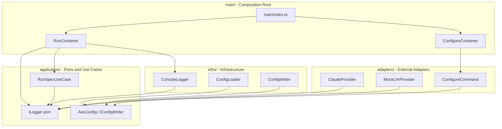
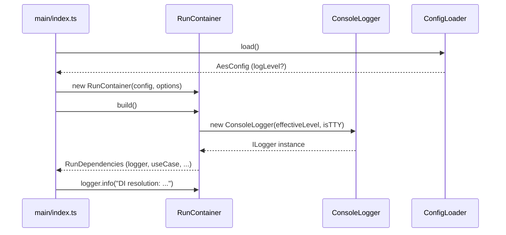
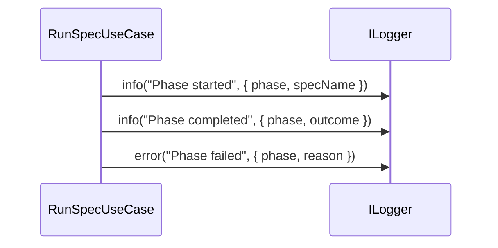

# Design Document: refactor-logging

## Overview

This feature introduces a unified `ILogger` port interface into the `aes` CLI's application layer, replacing the current pattern of scattered `process.stderr.write` calls and ad-hoc specialized writers with a single, level-aware, injectable logging contract. It also renames the `--debug-flow` CLI flag to `--debug`, adds `--debug-log` as the renamed file-path flag, and extends the `aes` configuration schema with a `logLevel` field that persists across invocations.

The refactoring does not remove the existing domain-audit loggers (`IDebugEventSink`, `IImplementationLoopLogger`, `ISelfHealingLoopLogger`) — these remain purpose-specific. The new `ILogger` serves operational observability: phase lifecycle events, LLM interaction summaries, agent command tracing, and DI resolution logging.

**Users**: Engineers and operators running `aes run` and `aes configure` workflows.
**Impact**: All current `process.stderr.write` calls used for operational messages migrate to `ILogger`. The CLI's public flag surface changes (`--debug-flow` → `--debug`; `--debug-flow-log` → `--debug-log`).

### Goals

- Define a single `ILogger` port with `debug`, `info`, `warn`, `error` methods in `application/ports/`
- Inject `ILogger` through the DI container; one instance per run
- Enable level filtering and TTY-aware color output in the concrete implementation
- Persist log level in `aes.config.json` via `aes configure`
- Replace `--debug-flow` / `--debug-flow-log` with `--debug` / `--debug-log`
- Log phase lifecycle, LLM interactions, agent commands, and DI resolution at appropriate levels

### Non-Goals

- Replacing the domain-audit loggers (`IDebugEventSink`, `IImplementationLoopLogger`, `ISelfHealingLoopLogger`)
- Adopting the `pino` library as a mandatory dependency (design supports both native and pino; native is the default)
- Adding log rotation or remote log shipping
- Changing the structured NDJSON output format used by `--log-json`

---

## Requirements Traceability

| Requirement | Summary | Components | Interfaces | Flows |
|-------------|---------|------------|------------|-------|
| 1.1–1.5 | Unified `ILogger` port with DI injection | `ILogger`, `ConsoleLogger`, `RunContainer` | `ILogger` | DI Resolution Flow |
| 2.1–2.4 | Discrete log levels with filtering | `ConsoleLogger`, `LogLevel` | `ILogger` | — |
| 3.1–3.5 | Color-differentiated TTY output | `ConsoleLogger` | `ILogger` | — |
| 4.1–4.4 | Configurable log level via `aes configure` | `AesConfig`, `ConfigLoader`, `ConfigureCommand` | `IConfigWriter` | — |
| 5.1–5.6 | `--debug` replaces `--debug-flow`; `--debug-log` replaces `--debug-flow-log` | `RunContainer`, `RunOptions`, `main/index.ts` | `RunOptions` | CLI Startup Flow |
| 6.1–6.3 | Phase lifecycle logging | `RunSpecUseCase`, call sites in use cases | `ILogger` | Phase Lifecycle Flow |
| 7.1–7.4 | LLM interaction logging | `ClaudeProvider`, `MockLlmProvider` | `ILogger` | LLM Interaction Flow |
| 8.1–8.5 | Agent command logging | `ToolContextLogger`, `ToolExecutor` (existing) | `ILogger`, `Logger` (ToolContext) | Agent Command Flow |
| 9.1–9.4 | DI resolution logging | `RunContainer.build()` | `ILogger` | DI Resolution Flow |
| 10.1–10.4 | Optional pino integration | `ConsoleLogger` (pino variant) | `ILogger` | — |

---

## Architecture

### Existing Architecture Analysis

The current system follows hexagonal (ports & adapters) architecture. Logging is fragmented:

- `IDebugEventSink` (port) / `DebugLogWriter` (infra) — structured debug events for LLM mock and gate tracing; domain-specific
- `IJsonLogWriter` (port) / `JsonLogWriter` (infra) — workflow event NDJSON file; event bus output
- `NdjsonImplementationLoopLogger` / `NdjsonSelfHealingLoopLogger` — domain audit logs; remain unchanged
- `process.stderr.write(...)` — used directly in `src/main/index.ts` and `RunContainer.build()` for operational messages

No unified log-level model exists. This refactoring adds `ILogger` as a new port without removing any existing port.

### Architecture Pattern & Boundary Map



**Architecture Integration**:
- Selected pattern: Hexagonal — `ILogger` is a port; `ConsoleLogger` is an infrastructure adapter
- Domain/feature boundaries: `ILogger` lives in `application/ports/logger.ts`; implementation in `infra/logger/console-logger.ts`
- Existing patterns preserved: pure constructor DI, lazy getter caching, single `build()` for side-effects
- New components: `ILogger` port, `ConsoleLogger` implementation, `LogLevel` type
- Steering compliance: dependency inversion, no framework lock-in, TypeScript strict mode

### Technology Stack

| Layer | Choice / Version | Role in Feature | Notes |
|-------|------------------|-----------------|-------|
| CLI | citty (existing) | CLI arg parsing; adds `--debug`, `--debug-log` flags | Replaces `--debug-flow`, `--debug-flow-log` |
| Application | TypeScript 5.x strict | `ILogger` port, `LogLevel` type | No new library dependency |
| Infrastructure | Bun v1.3.10+ | `ConsoleLogger` — TTY detection via `process.stderr.isTTY` | Native ANSI; no chalk or pino required |
| Config | `aes.config.json` (existing) | Adds optional `logLevel` field | Backward-compatible; defaults to `"info"` |
| Optional | pino v9.x | Alternative `PinoLogger` implementation | Confined to `infra/logger/`; same `ILogger` contract |

---

## System Flows

### CLI Startup and Logger Initialization



### Phase Lifecycle Logging



Key decisions: phase-start and phase-complete are `info`; failures are `error`. Phase names and spec identifiers are included in the context object, not interpolated into the message string.

---

## Components and Interfaces

### Summary Table

| Component | Domain/Layer | Intent | Req Coverage | Key Dependencies | Contracts |
|-----------|--------------|--------|--------------|------------------|-----------|
| `ILogger` | application/ports | Unified logging port | 1.1–1.5, 2.1–2.4, 3.1–3.5 | — | Service |
| `LogLevel` | application/ports | Discriminated union for log levels | 2.1, 5.2 | — | — |
| `ConsoleLogger` | infra/logger | TTY-aware, level-filtered concrete logger | 2.1–2.4, 3.1–3.5 | `process.stderr.isTTY` | Service |
| `AesConfig` (extended) | application/ports/config | Adds optional `logLevel` field | 4.1–4.4 | — | State |
| `ConfigLoader` (updated) | infra/config | Reads `logLevel` from config file; defaults to `"info"` | 4.2, 4.3 | `aes.config.json` | Service |
| `WritableConfig` (extended) | application/ports/config | Adds optional `logLevel` field for persistence | 4.1 | — | State |
| `ConfigureCommand` (updated) | adapters/cli | Adds log-level selection step | 4.1, 4.4 | `IConfigWriter`, `ILogger` | Service |
| `RunOptions` (updated) | main | Renames `debugFlow` → `debug`, `debugFlowLog` → `debugLog` | 5.1–5.6 | — | State |
| `RunContainer` (updated) | main | Injects `ILogger`; wires `--debug` mode | 1.4, 1.5, 9.1–9.4 | `ConsoleLogger`, `ILogger` | Service |
| `main/index.ts` (updated) | main | Replaces CLI flags; passes `ILogger` to container | 5.1–5.4 | `RunContainer` | — |
| `RunSpecUseCase` (updated) | application/usecases | Emits phase lifecycle log entries | 6.1–6.3 | `ILogger` | Service |
| `ClaudeProvider` (updated) | infra/llm | Emits LLM call/response/error entries | 7.1–7.4 | `ILogger` | Service |
| `MockLlmProvider` (updated) | infra/llm | Emits mock LLM entries at debug level | 7.1–7.4 | `ILogger` | Service |
| `ToolContextLogger` (new) | application/services/tools | Adapts `ILogger` to the `Logger` interface used by `ToolContext` | 8.1–8.5 | `ILogger` | Service |

---

### application/ports

#### `ILogger`

| Field | Detail |
|-------|--------|
| Intent | Port interface for level-filtered, structured operational logging |
| Requirements | 1.1, 1.2, 1.3, 2.1 |

**Responsibilities & Constraints**
- Single interface consumed by all application and infrastructure components
- Must not expose transport details (stderr, file, pino) to callers
- Must never throw from any method

**Contracts**: Service [x]

##### Service Interface

```typescript
export type LogLevel = "debug" | "info" | "warn" | "error";

export interface LogContext {
  readonly [key: string]: unknown;
}

export interface ILogger {
  debug(message: string, context?: LogContext): void;
  info(message: string, context?: LogContext): void;
  warn(message: string, context?: LogContext): void;
  error(message: string, context?: LogContext): void;
}
```

- Preconditions: `message` is a non-empty string; `context` is a plain object if provided
- Postconditions: entry is written or silently suppressed per configured level; no side effects beyond output
- Invariants: method calls after construction are always safe; no initialization ceremony required

**Implementation Notes**
- Integration: Injected via `RunContainer`; consumed by `RunSpecUseCase`, LLM providers, agent tool execution sites
- Validation: `LogLevel` type enforced at compile time; no runtime validation needed
- Risks: None — pure interface

---

#### `LogLevel` and `LOG_LEVEL_ORDER`

| Field | Detail |
|-------|--------|
| Intent | Type-safe discrete log level set with ordered comparison support |
| Requirements | 2.1, 2.2, 2.4 |

**Contracts**: State [x]

##### State Management

```typescript
export type LogLevel = "debug" | "info" | "warn" | "error";

export const LOG_LEVEL_ORDER: readonly LogLevel[] = ["debug", "info", "warn", "error"] as const;

/** Returns true if `candidate` is at or above `configured` severity. */
export function isLevelEnabled(configured: LogLevel, candidate: LogLevel): boolean {
  return LOG_LEVEL_ORDER.indexOf(candidate) >= LOG_LEVEL_ORDER.indexOf(configured);
}
```

- State model: immutable constant; no runtime state
- Persistence: `LogLevel` value persisted to `aes.config.json` as a string

---

### infra/logger

#### `ConsoleLogger`

| Field | Detail |
|-------|--------|
| Intent | Concrete `ILogger` implementation writing to `process.stderr` with level filtering and optional ANSI colors |
| Requirements | 2.1–2.4, 3.1–3.5, 1.4 |

**Responsibilities & Constraints**
- Reads `process.stderr.isTTY` once at construction; applies ANSI codes only when `true`
- Filters entries below `minLevel` silently
- Never throws

**Dependencies**
- Inbound: `RunContainer` — constructs and owns instance (P0)
- External: `process.stderr` — output target (P0)

**Contracts**: Service [x]

##### Service Interface

```typescript
export class ConsoleLogger implements ILogger {
  constructor(minLevel: LogLevel, isTTY?: boolean);
}
```

ANSI color mapping:
- `debug` → gray (`\x1b[90m`)
- `info` → default / white (`\x1b[0m`)
- `warn` → yellow (`\x1b[33m`)
- `error` → red (`\x1b[31m`)

When `isTTY` is `false`, output format: `[LEVEL] message { ...context }\n` (plain text).
When `isTTY` is `true`, output format: `<ANSI_START>[LEVEL] message { ...context }\x1b[0m\n`.

**Implementation Notes**
- Integration: `RunContainer` creates one `ConsoleLogger` instance; passes it to all consumers via `ILogger`
- Validation: `minLevel` validated as `LogLevel` type at compile time
- Risks: Bun's `process.stderr.isTTY` behavior — verify during implementation (expected to match Node.js)

---

### application/ports/config (extended)

#### `AesConfig` and `WritableConfig` Extensions

| Field | Detail |
|-------|--------|
| Intent | Extend configuration types to include optional `logLevel` |
| Requirements | 4.1–4.4 |

**Contracts**: State [x]

##### State Management

```typescript
// Extended AesConfig
export interface AesConfig {
  readonly llm: { ... };
  readonly specDir: string;
  readonly sddFramework: "cc-sdd" | "openspec" | "speckit";
  readonly logLevel: LogLevel; // Always present after loading; defaults to "info"
}

// Extended WritableConfig
export interface WritableConfig {
  readonly llm: { ... };
  readonly specDir: string;
  readonly sddFramework: "cc-sdd" | "openspec" | "speckit";
  readonly logLevel?: LogLevel; // Optional — allows omitting from the written file
}
```

- State model: `logLevel` is optional in the persisted file; always resolved to a `LogLevel` value in `AesConfig`
- Persistence: `ConfigLoader` reads `logLevel` from `aes.config.json`; if absent, sets `"info"`
- Concurrency strategy: file written atomically by `ConfigWriter` (existing pattern)

---

### infra/config

#### `ConfigLoader` (updated)

| Field | Detail |
|-------|--------|
| Intent | Parse `logLevel` from `aes.config.json`; provide default `"info"` when absent |
| Requirements | 4.2, 4.3 |

**Contracts**: Service [x]

##### Service Interface

No new public method; `load(): Promise<AesConfig>` populates `logLevel` from the file or defaults to `"info"`. Validates that the value (if present) is one of the four valid `LogLevel` strings and adds `"logLevel"` to `missingFields` / error output if the stored value is invalid.

---

### adapters/cli

#### `ConfigureCommand` (updated)

| Field | Detail |
|-------|--------|
| Intent | Add interactive log-level selection step to the configure wizard |
| Requirements | 4.1, 4.4 |

**Contracts**: Service [x]

**Implementation Notes**
- Integration: `ConfigWizard` gains a `selectLogLevel(): Promise<LogLevel>` prompt; result written via `IConfigWriter.write()` with `logLevel` set
- Validation: Only the four valid `LogLevel` strings are presented as choices; no free-text input
- Risks: None — additive change to existing wizard flow

---

### main

#### `RunOptions` (updated)

| Field | Detail |
|-------|--------|
| Intent | Updated options interface for the `run` command; renames debug fields |
| Requirements | 5.1–5.6 |

**Contracts**: State [x]

##### State Management

```typescript
export interface RunOptions {
  readonly debug: boolean;           // was: debugFlow
  readonly debugLog?: string;        // was: debugFlowLog — now ILogger file output only
  readonly logJsonPath?: string;
  readonly providerOverride?: string;
}
```

**Semantic change for `debugLog`**: `debugFlowLog` previously provided the file path for `DebugLogWriter` (`IDebugEventSink`). After this refactoring, `debugLog` is exclusively for routing `ILogger` debug-level output to an NDJSON file. `DebugLogWriter` always writes to `process.stderr` when `--debug` is active; it no longer accepts a file path via the CLI. This simplifies the flag surface: one file-path flag (`--debug-log`) for one output stream (`ILogger`), and domain debug events always appear inline on stderr alongside operational log output.

---

#### `RunContainer` (updated)

| Field | Detail |
|-------|--------|
| Intent | Inject `ILogger` as a first-class dependency; wire logger to all consumers |
| Requirements | 1.4, 1.5, 9.1–9.4, 5.3 |

**Responsibilities & Constraints**
- Creates exactly one `ConsoleLogger` per container instance
- Creates exactly one `ToolContextLogger` wrapping the `ConsoleLogger` for use in `ToolContext`
- Effective log level = `--debug` flag → `"debug"`, else `config.logLevel` (defaults to `"info"`)
- Logs DI resolution summary in `build()` before returning dependencies

**Dependencies**
- Inbound: `main/index.ts` — constructs container (P0)
- Outbound: `ConsoleLogger`, `ILogger` (P0); `ToolContextLogger` (P0); `RunSpecUseCase` (P0); `ClaudeProvider` / `MockLlmProvider` (P0)

**Contracts**: Service [x]

##### Service Interface

```typescript
export interface RunDependencies {
  readonly useCase: RunSpecUseCase;
  readonly eventBus: WorkflowEventBus;
  readonly logWriter: IJsonLogWriter | null;
  readonly debugWriter: IDebugEventSink | null;
  readonly logger: ILogger;
}
```

`RunContainer.build()` emits DI resolution log entries via `ILogger` before returning:
- `debug` entry for each resolved dependency name and concrete type (9.1)
- `info` entry when a mock/stub is active (9.2)
- `error` entry if a required dependency is null where not expected (9.3)
- All DI entries emitted before workflow begins (9.4)

---

#### `main/index.ts` (updated)

| Field | Detail |
|-------|--------|
| Intent | Replace `--debug-flow` / `--debug-flow-log` with `--debug` / `--debug-log`; pass logger to container |
| Requirements | 5.1–5.6 |

**Contracts**: — (entry point only)

**Implementation Notes**
- `--debug-flow` arg definition removed; `--debug` (boolean, default false) added
- `--debug-flow-log` arg definition removed; `--debug-log` (string) added — routes `ILogger` output to a file; `DebugLogWriter` no longer accepts a file path and always writes to `process.stderr` when `--debug` is active
- Passing `--debug-flow` produces an unrecognized-flag error via citty (5.4)
- Effective level: `args["debug"] ? "debug" : config.logLevel ?? "info"` (5.2, 5.6)
- `process.stderr.write` calls for operational messages (config errors, debug-mode notice) migrate to `ILogger` once the logger is available; pre-logger errors (before `ConfigLoader.load()` succeeds) continue to use `process.stderr.write` as a last resort
- `DebugLogWriter` constructor: remove the optional `filePath` parameter; always write to `process.stderr`

---

### application/usecases

#### `RunSpecUseCase` (updated)

| Field | Detail |
|-------|--------|
| Intent | Emit phase lifecycle log entries at appropriate levels |
| Requirements | 6.1–6.3 |

**Dependencies**
- Inbound: `RunContainer` — injects `ILogger` (P0)

**Contracts**: Service [x]

**Implementation Notes**
- `ILogger` added to `RunSpecUseCase` constructor options alongside existing ports
- Each phase transition emits `info` (start / success) or `error` (failure) via `ILogger`
- Context object: `{ phase: string, specName: string }` on start; `{ phase, outcome }` on complete; `{ phase, reason: string }` on failure

---

### infra/llm (updated callers)

#### `ClaudeProvider` and `MockLlmProvider`

| Field | Detail |
|-------|--------|
| Intent | Emit LLM interaction log entries at `debug` level (call, response); `error` on failure |
| Requirements | 7.1–7.4 |

**Contracts**: Service [x]

**Implementation Notes**
- `ILogger` injected via constructor (both providers)
- `debug` entry on call: `{ phase, callIndex, promptPreview: prompt.slice(0, 500) }` (7.1)
- `debug` entry on response: `{ callIndex, responseSummary }` (7.2)
- `error` entry on failure: `{ callIndex, errorCategory, errorMessage }` (7.3)
- Full prompt/response never logged at `info` or above (7.4)

---

### application/services/tools (new adapter)

#### `ToolContextLogger`

| Field | Detail |
|-------|--------|
| Intent | Bridge `ILogger` to the `Logger` interface consumed by `ToolContext`, enabling `ToolExecutor` to emit agent command log entries through `ILogger` |
| Requirements | 8.1–8.5 |

**Background**: `ToolExecutor` (`application/services/tools/executor.ts`) already implements the full agent command invocation logging pipeline — registry lookup, permission check, execution, timeout, success, and error paths — via `context.logger`, which is typed as `Logger` from `domain/tools/types.ts`. `Logger.info(entry: ToolInvocationLog)` carries `toolName`, `inputSummary`, `durationMs`, `resultStatus`, `errorMessage`, and `outputSize`. No new logging call sites need to be added to git or shell tool implementations; the existing `ToolExecutor` pipeline covers req 8 fully.

**Responsibilities & Constraints**

- Implement `Logger` from `domain/tools/types.ts`
- Forward `Logger.info(entry)` as `ILogger.debug(...)` — tool invocations are debug-level operational data (8.1–8.3)
- Forward `Logger.error(entry)` as `ILogger.warn(...)` when `resultStatus` indicates non-zero exit / permission denial, and as `ILogger.error(...)` when `resultStatus` is `"runtime"` — matching req 8.4 (warn) and 8.5 (error)

**Contracts**: Service [x]

##### Service Interface

```typescript
export class ToolContextLogger implements Logger {
  constructor(private readonly logger: ILogger) {}

  info(entry: ToolInvocationLog): void {
    this.logger.debug(`tool:${entry.toolName}`, {
      inputSummary: entry.inputSummary,
      durationMs: entry.durationMs,
      outputSize: entry.outputSize,
    });
  }

  error(entry: ToolInvocationLog): void {
    const level = entry.resultStatus === "runtime" ? "error" : "warn";
    this.logger[level](`tool:${entry.toolName} failed`, {
      inputSummary: entry.inputSummary,
      durationMs: entry.durationMs,
      errorMessage: entry.errorMessage,
      resultStatus: entry.resultStatus,
    });
  }
}
```

**Implementation Notes**

- Integration: `RunContainer` creates one `ToolContextLogger` instance wrapping its `ILogger`; passes it as `context.logger` when constructing `ToolContext` for each tool invocation
- No changes required in `infra/tools/git.ts`, `infra/tools/shell.ts`, or any individual tool implementation — all logging flows through `ToolExecutor` → `ToolContextLogger` → `ILogger`
- File: `application/services/tools/tool-context-logger.ts`

---

## Data Models

### Domain Model

No new aggregates or entities. `LogLevel` is a value type (`"debug" | "info" | "warn" | "error"`).

### Logical Data Model

**`aes.config.json` schema extension**:

```json
{
  "llm": { "provider": "claude", "modelName": "claude-3-5-sonnet-latest" },
  "specDir": ".kiro/specs",
  "sddFramework": "cc-sdd",
  "logLevel": "info"
}
```

- `logLevel` is optional; `ConfigLoader` defaults to `"info"` when absent
- Valid values: `"debug"`, `"info"`, `"warn"`, `"error"`

---

## Error Handling

### Error Strategy

- Logger method calls that fail (e.g., stderr write error) are silently swallowed — logging must never crash the application
- Config validation: invalid `logLevel` value in `aes.config.json` triggers a `ConfigValidationError` with `"logLevel"` in `missingFields`
- Pre-logger errors (config load failure before `ILogger` is available): continue using `process.stderr.write` as an emergency fallback in `main/index.ts`

### Error Categories and Responses

| Category | Scenario | Response |
|----------|----------|----------|
| User Error | Invalid `logLevel` in config file | `ConfigValidationError`; message: "Run 'aes configure' to set log level" |
| User Error | `--debug-flow` flag passed | citty unrecognized-flag error (5.4) |
| System Error | `process.stderr` write failure | Silently swallowed by `ConsoleLogger` |
| System Error | Missing `ILogger` injection | TypeScript compile error — null/undefined caught at type level |

### Monitoring

`ILogger` itself is the monitoring surface. All operational events are captured through it. No additional health monitoring is introduced.

---

## Testing Strategy

### Unit Tests

- `ConsoleLogger`: level filtering (entries below `minLevel` suppressed), ANSI codes present when `isTTY = true`, absent when `false`, `error` → red, `warn` → yellow, `debug` → gray
- `isLevelEnabled`: all 16 combinations of `(configured, candidate)` pairs
- `ConfigLoader`: `logLevel` parsed from file; default `"info"` when absent; `ConfigValidationError` on invalid value
- `RunContainer`: `logger` in `RunDependencies` is a `ConsoleLogger` instance; level is `"debug"` when `debug: true`; level is `config.logLevel` when `debug: false`

### Integration Tests

- Full `RunContainer.build()`: DI resolution log entries appear before use case is returned
- `aes configure` wizard: selects `"warn"` → `aes.config.json` written with `logLevel: "warn"`; subsequent `ConfigLoader.load()` returns `logLevel: "warn"`
- `aes run --debug`: effective log level is `"debug"`; mock LLM provider is active; `ILogger.info` emitted for mock dependency notification
- `aes run --debug-flow` (removed flag): citty returns non-zero exit code with unrecognized-flag message

### E2E / CLI Tests

- `aes run <spec> --debug`: debug-level entries appear in stderr output
- `aes run <spec>` with `logLevel: "warn"` in config: only `warn` and `error` entries appear
- `aes run <spec> --debug --debug-log /tmp/debug.ndjson`: `ILogger` output written to NDJSON file; `DebugLogWriter` domain events still appear on stderr

---

## Migration Strategy

The migration is an in-place refactoring with no persistent data migration:

1. **Add** `ILogger`, `LogLevel`, `isLevelEnabled` to `application/ports/logger.ts`
2. **Add** `ConsoleLogger` to `infra/logger/console-logger.ts`
3. **Add** `ToolContextLogger` to `application/services/tools/tool-context-logger.ts`; update `RunContainer` to wire it into `ToolContext`
4. **Extend** `AesConfig`, `WritableConfig` with `logLevel`; update `ConfigLoader` default
5. **Update** `RunOptions` — rename fields; update `DebugLogWriter` to drop `filePath` parameter (always stderr); update `RunContainer` to wire `ILogger`
6. **Update** `main/index.ts` — rename CLI flags; pass effective level to container
7. **Update** `RunSpecUseCase`, `ClaudeProvider`, `MockLlmProvider` — inject and use `ILogger`
8. **Update** `ConfigureCommand` / `ConfigWizard` — add log-level selection step

Each step is independently testable and has no circular dependency on the next. Steps 1–2 can be implemented in parallel with steps 3–4.
