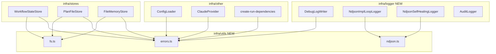
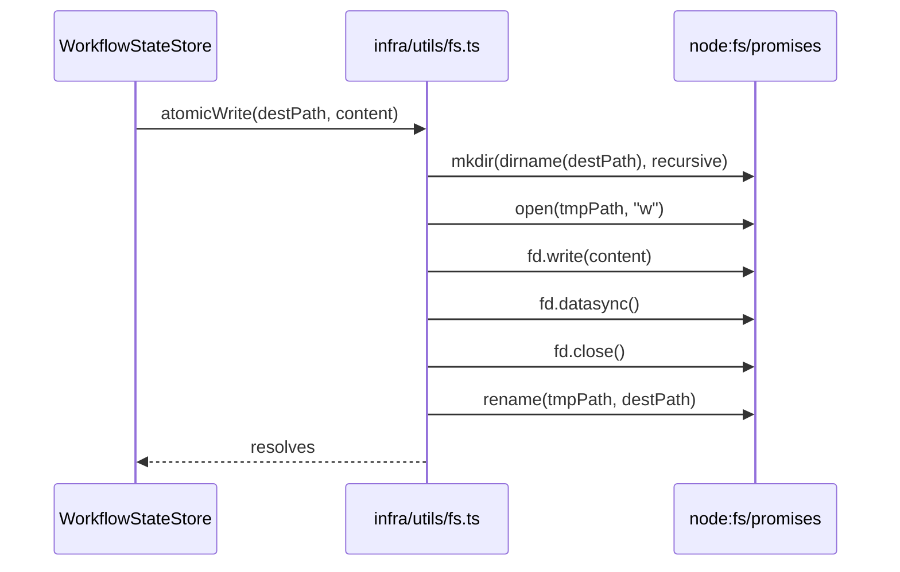

# Design Document — refactoring-dry

## Overview

This refactoring eliminates concrete DRY violations across the `orchestrator-ts` infrastructure layer by extracting three shared utility modules and consolidating all logger implementations under a new `src/infra/logger/` directory. The changes are contained entirely within `src/infra/` and `src/adapters/cli/` (one file moved out): no domain or application layer files are modified, and no public class interfaces change.

**Purpose**: Remove verbatim-duplicated utility code and establish a clear home for all logger implementations to reduce maintenance cost and prevent layer-boundary violations.
**Users**: Developers maintaining and extending the orchestrator-ts codebase.
**Impact**: Creates `src/infra/logger/` (4 files moved in), creates `src/infra/utils/` (3 new files), and updates 9 caller files with new import paths.

### Goals

- Create `src/infra/logger/` and move all logger classes there (`DebugLogWriter`, both NDJSON loggers, `AuditLogger`)
- Extract `isNodeError` (4 duplicates) and `getErrorMessage` (3+ duplicates) into `src/infra/utils/errors.ts`
- Extract `atomicWrite` (3 duplicates) and `readFileSafe` (2 duplicates) into `src/infra/utils/fs.ts`
- Extract the NDJSON mkdir+append core (2 loggers) into `src/infra/utils/ndjson.ts`
- Consolidate the LLM provider debug-condition check within `create-run-dependencies.ts`
- All existing tests pass and typecheck is clean after every change

### Non-Goals

- Refactoring `audit-logger.ts` atomic write behavior (it uses append-open, not temp+rename — see `research.md`)
- Modifying any `domain/` or `application/` layer files
- Changing error-handling policy of any logger (each retains its own `.catch()` strategy)
- Introducing new npm dependencies

## Architecture

### Existing Architecture Analysis

The codebase follows Clean Architecture with four layers: `domain` → `application` → `infra` + `adapters`. The architecture linter (`scripts/lint-ts-architecture.sh`) enforces strict import rules per directory. Notably, `src/adapters/cli/` may only import from `adapters/cli/`, `application/usecases/`, `application/ports/`, and `infra/bootstrap/` — it may not import from `infra/utils/`. Moving `DebugLogWriter` from `adapters/cli/` to `infra/logger/` resolves this constraint cleanly since `infra/logger/` has no such restriction on importing from `infra/utils/`.

The new `src/infra/logger/` directory becomes the single home for all logger class implementations. The new `src/infra/utils/` directory holds stateless utility functions importable by any `infra/` module.

### Architecture Pattern & Boundary Map



**Architecture Integration**:
- Selected pattern: Shared utility module within `infra/` layer — utilities are stateless pure functions; loggers are stateful classes grouped by concern
- `infra/logger/` boundary: all logger classes; may import from `infra/utils/` and `application/ports/`
- `infra/utils/` boundary: stateless utilities; imported by any `infra/` module; never imported by `domain/`, `application/`, or `adapters/`
- Existing patterns preserved: atomic temp+rename write, ENOENT-safe reads, Node error type narrowing, per-logger error policies
- `DebugLogWriter` removed from `adapters/cli/` eliminates the only cross-boundary import concern

### Technology Stack

| Layer | Choice / Version | Role in Feature | Notes |
|-------|------------------|-----------------|-------|
| Runtime | Bun v1.3.10+ | Executes TypeScript | No change |
| Language | TypeScript strict | All new utility code | `noUncheckedIndexedAccess`, `exactOptionalPropertyTypes` enforced |
| File I/O | `node:fs/promises` | `atomicWrite`, `readFileSafe`, `appendNdjsonLine` | `node:fs` sync APIs removed from `NdjsonImplementationLoopLogger` |

## Requirements Traceability

| Requirement | Summary | Components | Interfaces |
|-------------|---------|------------|------------|
| 1.1–1.7 | Shared fs utilities | `FsUtils` | `atomicWrite`, `readFileSafe` |
| 2.1–2.4 | Shared `isNodeError` | `ErrorUtils` | `isNodeError` |
| 3.1–3.4 | Shared `getErrorMessage` | `ErrorUtils` | `getErrorMessage` |
| 4.1–4.6 | Shared NDJSON append | `NdjsonUtils` | `appendNdjsonLine` |
| 5.1–5.4 | LLM provider factory | `create-run-dependencies` | `createLlmProvider` closure |
| 6.1–6.6 | Behavioral preservation and linter compliance | All modified files | — |
| 7.1–7.8 | Logger consolidation | `infra/logger/` | All logger classes |

## Components and Interfaces

### Summary Table

| Component | Layer | Intent | Req Coverage | Key Dependencies |
|-----------|-------|--------|--------------|-----------------|
| `FsUtils` | `infra/utils/fs.ts` | Shared atomic write and safe-read | 1.1–1.7 | `node:fs/promises` (P0) |
| `ErrorUtils` | `infra/utils/errors.ts` | Shared error type guard and message extractor | 2.1–2.4, 3.1–3.4 | None (P0) |
| `NdjsonUtils` | `infra/utils/ndjson.ts` | Shared NDJSON line appender | 4.1–4.6 | `node:fs/promises` (P0) |
| `InfraLogger` | `infra/logger/` | Consolidated home for all logger classes | 7.1–7.8 | `infra/utils/` (P0), `application/ports/` (P1) |
| `create-run-dependencies` (modified) | `infra/bootstrap` | Consolidated LLM provider factory | 5.1–5.4 | `ErrorUtils` (P1) |

---

### infra/utils

#### FsUtils (`src/infra/utils/fs.ts`)

| Field | Detail |
|-------|--------|
| Intent | Provide `atomicWrite` and `readFileSafe` as shared pure async functions |
| Requirements | 1.1, 1.2, 1.3, 1.4, 1.5, 1.6, 1.7 |

**Responsibilities & Constraints**
- Owns the temp+datasync+rename pattern; callers must not reimplement it
- `readFileSafe` returns `null` on ENOENT; callers convert to domain-specific defaults at the call site
- Must not import from `domain/` or `application/`

**Dependencies**
- External: `node:fs/promises` — `open`, `mkdir`, `rename`, `readFile` (P0)

**Contracts**: Service [x]

##### Service Interface

```typescript
/**
 * Writes `content` to `destPath` atomically using a temp file.
 * Creates parent directories if they do not exist.
 * May throw on filesystem errors.
 */
export async function atomicWrite(destPath: string, content: string): Promise<void>;

/**
 * Reads `filePath` as UTF-8. Returns null if the file does not exist (ENOENT).
 * Re-throws all other errors.
 */
export async function readFileSafe(filePath: string): Promise<string | null>;
```

- Preconditions for `atomicWrite`: `destPath` is an absolute or resolvable path; `content` is a valid UTF-8 string
- Postconditions for `atomicWrite`: `destPath` contains exactly `content`; temp file is removed on success
- Postconditions for `readFileSafe`: returns file content as string, or `null` if file absent

**Implementation Notes**
- `atomicWrite` calls `mkdir(dirname(destPath), { recursive: true })` before opening the temp file, matching `PlanFileStore.atomicWrite` which is the most complete existing implementation
- `WorkflowStateStore.persist()` currently calls `mkdir` separately; that call is removed after migration (absorbed into `atomicWrite`)
- `FileMemoryStore.readFileSafe` currently returns `""` on ENOENT; its call sites must coerce `null → ""` after migration

---

#### ErrorUtils (`src/infra/utils/errors.ts`)

| Field | Detail |
|-------|--------|
| Intent | Provide `isNodeError` type guard and `getErrorMessage` extractor as shared pure functions |
| Requirements | 2.1, 2.2, 2.3, 2.4, 3.1, 3.2, 3.3, 3.4 |

**Responsibilities & Constraints**
- Zero runtime dependencies; safe to import from any `infra/` module
- `isNodeError` narrows `unknown` to `NodeJS.ErrnoException` using the same check as all four current duplicates
- Callers in `infra/logger/` access this module without any layer boundary concern

**Contracts**: Service [x]

##### Service Interface

```typescript
/**
 * Returns true when `err` is an Error instance with a `code` property,
 * narrowing the type to NodeJS.ErrnoException.
 */
export function isNodeError(err: unknown): err is NodeJS.ErrnoException;

/**
 * Extracts a human-readable message from an unknown caught value.
 * Returns `err.message` for Error instances, `String(err)` otherwise.
 */
export function getErrorMessage(err: unknown): string;
```

- Preconditions: none (accepts any `unknown` value)
- Postconditions: both functions are pure with no side effects

**Implementation Notes**
- `isNodeError`: `return err instanceof Error && "code" in err` — identical to all four existing definitions
- `getErrorMessage`: `return err instanceof Error ? err.message : String(err)` — identical to all existing inline expressions
- `infra/logger/debug-log-writer.ts` (formerly `adapters/cli/debug-log-writer.ts`) uses `getErrorMessage` without layer violation since it is now within `infra/`

---

#### NdjsonUtils (`src/infra/utils/ndjson.ts`)

| Field | Detail |
|-------|--------|
| Intent | Provide the shared mkdir+appendFile core for NDJSON logging |
| Requirements | 4.1, 4.2, 4.3, 4.4, 4.5, 4.6 |

**Responsibilities & Constraints**
- Owns the `mkdir(dirname(logPath), { recursive: true }) → appendFile(logPath, line)` pattern
- Does **not** swallow errors internally; callers install their own `.catch()` (see `research.md` — Decision: NDJSON error handling)
- Each logger's public interface and error-reporting policy remains unchanged

**Dependencies**
- External: `node:fs/promises` — `mkdir`, `appendFile` (P0)

**Contracts**: Service [x]

##### Service Interface

```typescript
/**
 * Appends a JSON-serialized line for `entry` to `logPath`.
 * Creates the parent directory recursively if it does not exist.
 * May throw on filesystem errors; callers are responsible for error handling.
 */
export async function appendNdjsonLine(
  logPath: string,
  entry: object,
): Promise<void>;
```

- Preconditions: `logPath` is a valid resolvable path
- Postconditions: one `${JSON.stringify(entry)}\n` line appended to `logPath`

**Implementation Notes**
- Internally computes `logDir = dirname(logPath)`, eliminating the redundant `logDir` parameter that was in the draft design
- `NdjsonImplementationLoopLogger.#append` calls `appendNdjsonLine(this.#logPath, entry).catch((err) => console.error("Failed to write to NDJSON log:", err))`
- `NdjsonSelfHealingLoopLogger.#append` calls `appendNdjsonLine(this.#logPath, entry).catch(() => { this.#writeErrorCount++ })` — `writeErrorCount` semantics preserved

---

### infra/logger (new directory)

#### Logger Consolidation (`src/infra/logger/`)

| Field | Detail |
|-------|--------|
| Intent | Single home for all logger class implementations; enables infra/utils imports without linter violations |
| Requirements | 7.1, 7.2, 7.3, 7.4, 7.5, 7.6, 7.7, 7.8 |

**Responsibilities & Constraints**
- Owns all logger class definitions; no logger classes live in other infra subdirectories or in `adapters/`
- May import from `infra/utils/` and `application/ports/`; must not import from `domain/` business logic or `adapters/`
- All moved classes retain their existing public interfaces and exported types unchanged

**File Moves**

| Source | Destination |
|--------|-------------|
| `src/adapters/cli/debug-log-writer.ts` | `src/infra/logger/debug-log-writer.ts` |
| `src/infra/implementation-loop/ndjson-logger.ts` | `src/infra/logger/ndjson-impl-loop-logger.ts` |
| `src/infra/self-healing/ndjson-logger.ts` | `src/infra/logger/ndjson-self-healing-logger.ts` |
| `src/infra/safety/audit-logger.ts` | `src/infra/logger/audit-logger.ts` |

**Import Path Updates Required**

| File | Old import | New import |
|------|-----------|-----------|
| `infra/bootstrap/create-run-dependencies.ts` | `@/adapters/cli/debug-log-writer` | `@/infra/logger/debug-log-writer` |
| `infra/safety/create-safety-executor.ts` | `@/infra/safety/audit-logger` | `@/infra/logger/audit-logger` |
| `infra/git/create-git-integration-service.ts` | (verify audit-logger import) | `@/infra/logger/audit-logger` |
| `infra/implementation-loop/create-implementation-loop-service.ts` | (verify ndjson-logger import) | `@/infra/logger/ndjson-impl-loop-logger` |
| `infra/self-healing/` (any consumer) | `./ndjson-logger` | `@/infra/logger/ndjson-self-healing-logger` |

**Contracts**: Service [x]

**Implementation Notes**
- `DebugLogWriter` moves from `adapters/cli/` to `infra/logger/`; its `getErrorMessage` call previously could not safely import from `infra/utils/` due to linter rules; after the move it can
- `AuditLogger` uses append-open (`"a"` mode) with `fh.datasync()` — this is **not** the temp+rename `atomicWrite` pattern and remains unchanged; it is moved as-is
- The architecture linter will require a new rule entry for `src/infra/logger/` if it enforces per-directory allowlists — the implementation task must add this rule

---

### infra/bootstrap (modified)

#### LLM Provider Factory Consolidation (`src/infra/bootstrap/create-run-dependencies.ts`)

| Field | Detail |
|-------|--------|
| Intent | Eliminate the second inline debug-condition check by making `implLlm` call the `createLlmProvider` closure |
| Requirements | 5.1, 5.2, 5.3, 5.4 |

**Responsibilities & Constraints**
- `createLlmProvider` closure is defined before `implLlm` in the function body
- `implLlm` is assigned by calling `createLlmProvider(config)` with no provider override
- The closure's provider-override switch remains intact for use by `RunSpecUseCase`

**Contracts**: Service [x]

##### Service Interface

The `createLlmProvider` closure type (defined once, used in two places):

```typescript
type CreateLlmProvider = (cfg: AesConfig, providerOverride?: string) => LlmProviderPort;
```

- When `debugFlow && debugWriter !== null`: returns `MockLlmProvider`
- Otherwise: switches on `providerOverride ?? cfg.llm.provider`; throws `Error` for unsupported providers

**Implementation Notes**
- `const implLlm = createLlmProvider(config)` replaces the current inline ternary at line 69
- `getErrorMessage` from `ErrorUtils` replaces the inline ternary at line 51 in the `eventBus.on` handler

## System Flows



The `readFileSafe` and `appendNdjsonLine` flows follow the same inward-delegation pattern; diagrams omitted.

## Error Handling

### Error Strategy

All utilities follow the existing infra-layer convention: propagate unexpected errors to callers; handle domain-expected conditions (ENOENT, missing directories) inline.

### Error Categories and Responses

| Scenario | Utility | Behavior |
|----------|---------|----------|
| `ENOENT` on read | `readFileSafe` | Returns `null`; does not throw |
| Other read error | `readFileSafe` | Re-throws |
| Write failure | `atomicWrite` | Re-throws; temp file may remain (same as current) |
| NDJSON append error | `appendNdjsonLine` | Throws; `NdjsonImplementationLoopLogger` logs via `console.error`; `NdjsonSelfHealingLoopLogger` increments `writeErrorCount` |
| Unsupported LLM provider | `createLlmProvider` | Throws `Error("Unsupported LLM provider: '${provider}'")`|

## Testing Strategy

### Unit Tests

- `FsUtils.atomicWrite`: verify final file content equals input; verify temp file removed; verify parent directory created
- `FsUtils.readFileSafe`: verify `null` for missing file; verify content for existing file; verify re-throws on non-ENOENT errors
- `ErrorUtils.isNodeError`: verify `true` for `ErrnoException`; verify `false` for plain `Error`; verify `false` for non-Error values
- `ErrorUtils.getErrorMessage`: verify `.message` for `Error`; verify `String()` for non-Error
- `NdjsonUtils.appendNdjsonLine`: verify line appended; verify directory created; verify JSON format; verify `dirname(logPath)` used (not a separate `logDir` param)

### Integration Tests

- `WorkflowStateStore.persist/restore` round-trip: verify behavior unchanged after `atomicWrite` migration
- `PlanFileStore.save/load` round-trip: verify behavior unchanged
- `NdjsonImplementationLoopLogger`: verify log entries appear in file after async flush (sync-to-async migration validated)
- `NdjsonSelfHealingLoopLogger`: verify `writeErrorCount` increments on simulated write failure
- `DebugLogWriter`: verify behavior unchanged after move to `infra/logger/`

### Regression

- Full test suite: `bun test` from `orchestrator-ts/` — zero new failures required
- Type check: `bun run typecheck` — zero errors required
- Architecture linter: `bash scripts/lint-ts-architecture.sh` — zero violations required
