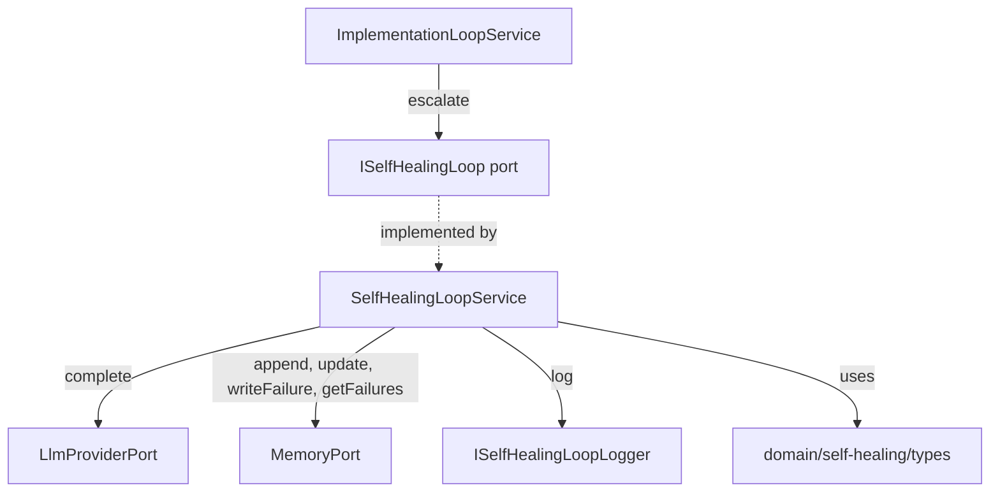
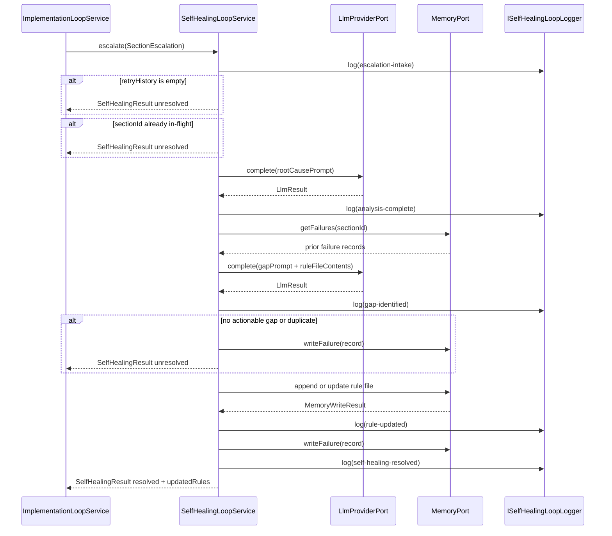
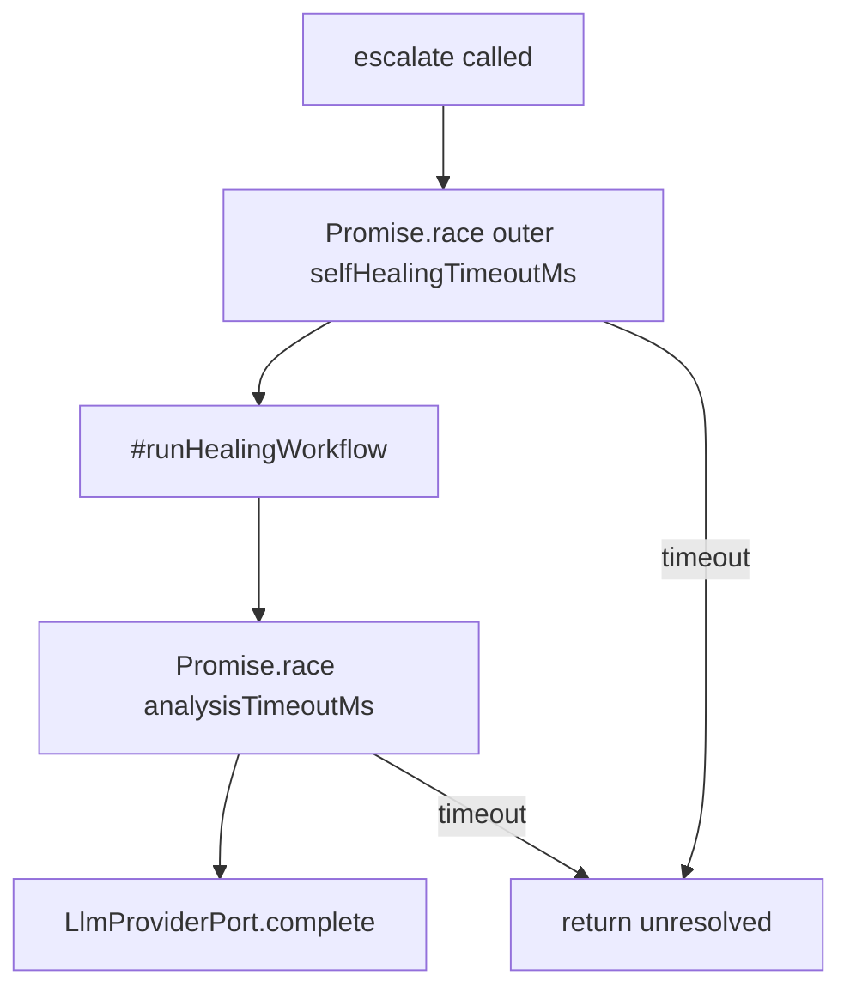

# Design Document: Self-Healing Loop

## Overview

The self-healing loop is the autonomous recovery subsystem of AI Dev Agent v1. It activates when the implementation loop exhausts its per-section retry budget and provides a `SelfHealingLoopService` that implements the existing `ISelfHealingLoop` port already declared in spec9.

**Purpose**: This feature delivers autonomous failure analysis, targeted rule updates, and structured failure persistence to the implementation pipeline. It closes the feedback loop between runtime failures and the agent's internal knowledge base so the agent can improve its behavior over time without human intervention.

**Users**: The implementation loop service (`ImplementationLoopService`) is the sole caller. Operators and developers interact indirectly through structured NDJSON logs and failure records written to the memory system.

**Impact**: Adds a new `SelfHealingLoopService` class under `orchestrator-ts/src/application/self-healing-loop/` and a domain type file at `orchestrator-ts/src/domain/self-healing/types.ts`. No changes are required to existing spec9 or spec5 files.

### Goals

- Implement `ISelfHealingLoop.escalate()` as a fully typed, non-throwing service.
- Perform LLM-driven root-cause analysis and knowledge-gap identification for exhausted sections.
- Write targeted rule updates to the memory system (`coding_rules`, `review_rules`, `implementation_patterns`).
- Persist structured failure records via `MemoryPort.writeFailure()` for every processed escalation.
- Produce queryable NDJSON logs at each major step of the self-healing workflow.

### Non-Goals

- Replacing or modifying `ImplementationLoopService` — the integration point is already complete in spec9.
- Implementing the human-approval workflow invocation — that is spec3's responsibility; spec10 returns `"unresolved"` and spec9 handles escalation to human.
- Multi-agent or parallel self-healing execution.
- Real-time streaming of LLM responses.

## Requirements Traceability

| Requirement | Summary | Components | Interfaces | Flows |
|-------------|---------|------------|------------|-------|
| 1.1 | Accept escalation without throwing | `SelfHealingLoopService.escalate()` | `ISelfHealingLoop` | Main flow: Intake |
| 1.2 | Return unresolved if retryHistory is empty | `SelfHealingLoopService.escalate()` | `ISelfHealingLoop` | Guard clause in Intake |
| 1.3 | Record full escalation as working context | `SelfHealingLoopService` internal state | — | Intake |
| 1.4 | Reject duplicate concurrent escalations | `#inFlightSections: Set<string>` | — | Intake guard |
| 1.5 | Total timeout via `selfHealingTimeoutMs` | `promiseWithTimeout()` | — | Wraps entire `escalate()` |
| 2.1 | LLM call with full retryHistory | `#analyzeRootCause()` | `LlmProviderPort` | Analysis flow |
| 2.2 | Structured root-cause output (what/failed/pattern) | `#analyzeRootCause()`, `RootCauseAnalysis` type | `LlmProviderPort` | Analysis flow |
| 2.3 | Retry LLM up to `maxAnalysisRetries` | `#analyzeRootCause()` retry loop | `LlmProviderPort` | Analysis flow |
| 2.4 | Log analysis result as NDJSON | `ISelfHealingLoopLogger` | `SelfHealingLogEntry` | Analysis flow |
| 2.5 | Analysis timeout via `analysisTimeoutMs` | `promiseWithTimeout()` | — | Analysis step |
| 3.1 | LLM call with root-cause + rule file contents | `#identifyGap()` | `LlmProviderPort`, `MemoryPort` | Gap flow |
| 3.2 | Structured gap report (targetFile, change, rationale) | `#identifyGap()`, `GapReport` type | — | Gap flow |
| 3.3 | Return unresolved if no actionable gap | `#identifyGap()` | — | Gap flow guard |
| 3.4 | Duplicate gap detection via failure memory | `#identifyGap()`, `MemoryPort.getFailures()` | `MemoryPort` | Gap flow guard |
| 3.5 | Log gap report as NDJSON | `ISelfHealingLoopLogger` | `SelfHealingLogEntry` | Gap flow |
| 4.1 | Write proposed addition/correction to rule file | `#updateRuleFile()` | `MemoryPort` | Rule-update flow |
| 4.2 | Append with machine-readable marker, no overwrite | `#updateRuleFile()` using `MemoryPort.append()` | `MemoryPort` | Rule-update flow |
| 4.3 | Return unresolved on filesystem error | `#updateRuleFile()` | — | Rule-update flow |
| 4.4 | Return updated paths as `updatedRules` | `SelfHealingLoopService` result assembly | `ISelfHealingLoop` | Resolution path |
| 4.5 | Workspace boundary validation | `#validateRulePath()` | — | Path guard |
| 5.1 | Write failure record for every escalation | `#persistFailureRecord()` | `MemoryPort` | Finalization |
| 5.2 | NDJSON append to `.memory/failures/failure-records.ndjson` | `MemoryPort.writeFailure()` | `MemoryPort` | Finalization |
| 5.3 | Write before returning; log error but keep outcome | `#persistFailureRecord()` in `finally` | — | Finalization |
| 5.4 | Use `IFailureMemory` port (MemoryPort) | `MemoryPort.writeFailure()` | `MemoryPort` | Finalization |
| 5.5 | Truncate `agentObservations` if record exceeds size limit | `#persistFailureRecord()` | — | Finalization |
| 6.1 | Return `outcome: "resolved"` with `updatedRules` | `SelfHealingLoopService` result assembly | `ISelfHealingLoop` | Resolution path |
| 6.2–6.4 | Implementation loop resets retry counter and guards re-escalation | Already implemented in spec9 | `ImplementationLoopService` | — |
| 6.5 | Emit `self-healing-resolved` log entry | `ISelfHealingLoopLogger` | `SelfHealingLogEntry` | Resolution path |
| 7.1 | Return `unresolved` with full summary | `SelfHealingLoopService` | `ISelfHealingLoop` | Unresolved path |
| 7.2 | Ensure failure record written before returning unresolved | `#persistFailureRecord()` awaited before return | — | Finalization |
| 7.3–7.4 | Mark section `escalated-to-human`, emit event, invoke human approval | Already implemented in spec9 | `ImplementationLoopService` | — |
| 7.5 | Every unresolved path has non-empty summary | All `unresolved` return sites | — | All unresolved paths |
| 8.1 | NDJSON log to `.aes/logs/self-healing-<planId>.ndjson` | `ISelfHealingLoopLogger` | `SelfHealingLogEntry` | All steps |
| 8.2 | Log entry at each major step | `SelfHealingLoopService` | `ISelfHealingLoopLogger` | All steps |
| 8.3 | Optional logger — absence never throws | Optional injection | — | All steps |
| 8.4 | `totalDurationMs` in final outcome log entry | `SelfHealingLoopService` | `SelfHealingLogEntry` | Finalization |
| 8.5 | Never log credentials or external paths | `SelfHealingLoopService` | — | All steps |

## Architecture

### Existing Architecture Analysis

The implementation-loop service (`ImplementationLoopService`) already contains the full escalation path including the optional `ISelfHealingLoop` call. Key integration details:

- `#escalateSection()` calls `options.selfHealingLoop.escalate(escalation)` inside try/catch.
- On `"resolved"`: calls `buildHealedImprovePrompt(task.title, healingResult.summary, healingResult.updatedRules ?? [])` and resets `retryCount = 0`.
- On `"unresolved"`: marks section `"escalated-to-human"` and halts.
- `#executeSection()` guards against re-escalation after a resolved self-healing (requirement 6.4 is already satisfied by spec9).
- `contextEngine.resetTask(sectionId)` is called at section start — it is NOT called again on the healed retry (this is fine; context accumulates across all iterations of the section).

The `MemoryPort` (spec5) already provides all necessary methods: `append()`, `update()`, `writeFailure()`, and `getFailures()`. `KnowledgeMemoryFile` targets match the rule files in requirements exactly.

### Architecture Pattern & Boundary Map

**Selected pattern**: Single-service implementation of an existing port, with internal sequential steps and optional collaborator ports injected via constructor. No new domain aggregates are introduced; all domain state is local to a single `escalate()` call.



**Architecture Integration**:
- Selected pattern: port implementation — `SelfHealingLoopService` implements `ISelfHealingLoop` via constructor injection of `LlmProviderPort`, `MemoryPort`, `SelfHealingLoopConfig`, and optional `ISelfHealingLoopLogger`.
- Domain/feature boundaries: spec10 owns `domain/self-healing/` and `application/self-healing-loop/`. It reads but does not modify spec9 or spec5 files.
- Existing patterns preserved: optional port injection with silent no-ops (same as `eventBus` and `logger` in spec9), NDJSON logging pattern, `MemoryPort`-mediated persistence.
- New components rationale: `SelfHealingLoopService` is needed to implement `ISelfHealingLoop`; `SelfHealingLoopConfig` externalizes tunable parameters; `ISelfHealingLoopLogger` follows the existing logger pattern.
- Steering compliance: Clean Architecture dependency direction maintained (application layer imports ports, not adapters); no `any` types; TypeScript strict mode.

### Technology Stack

| Layer | Choice / Version | Role in Feature | Notes |
|-------|-----------------|-----------------|-------|
| Backend / Services | TypeScript strict + Bun v1.3.10+ | `SelfHealingLoopService` implementation | No new runtime dependencies |
| LLM | `LlmProviderPort` (existing) | Root-cause analysis and gap identification | Prompt-engineered JSON output |
| Data / Storage | `MemoryPort` (existing, spec5) | Rule file updates and failure record persistence | Uses `append`, `update`, `writeFailure`, `getFailures` |
| Logging | `ISelfHealingLoopLogger` (new port) | NDJSON step-level observability | Optional; no-op when absent |
| Infrastructure | `Promise.race` + timer | Timeout enforcement for LLM calls | No new library needed |

## System Flows

### Main Self-Healing Workflow



### Timeout Wrapping

Both the entire `escalate()` call and the individual analysis LLM calls are wrapped with `promiseWithTimeout()`:



Key decision: the outer timeout wraps `#runHealingWorkflow()`, not the constructor. A timeout result always writes the failure record before returning.

## Components and Interfaces

### Component Summary

| Component | Domain/Layer | Intent | Req Coverage | Key Dependencies | Contracts |
|-----------|-------------|--------|--------------|-----------------|-----------|
| `SelfHealingLoopService` | Application | Implements `ISelfHealingLoop`; orchestrates all healing steps | 1.1–8.5 | `LlmProviderPort` (P0), `MemoryPort` (P0), `ISelfHealingLoopLogger` (P2) | Service |
| `SelfHealingLoopConfig` | Application | Tunable parameters (timeouts, retries, size limits) | 1.5, 2.3, 2.5, 5.5 | — | State |
| `ISelfHealingLoopLogger` | Application port | Optional NDJSON step logging | 8.1–8.5 | — | Service |
| `RootCauseAnalysis` | Domain | Value object: parsed LLM output for analysis step | 2.2 | — | State |
| `GapReport` | Domain | Value object: target file, proposed change, rationale | 3.2 | — | State |
| `SelfHealingLogEntry` | Domain | Discriminated union of all NDJSON log entry shapes | 8.1–8.2 | — | Event |
| `SelfHealingFailureRecord` | Domain | Extended failure record for memory persistence | 5.1 | — | State |

### Application Layer

#### `SelfHealingLoopService`

| Field | Detail |
|-------|--------|
| Intent | Implements `ISelfHealingLoop`; orchestrates root-cause analysis, gap identification, rule update, failure persistence, and logging in a single `escalate()` call |
| Requirements | 1.1–1.5, 2.1–2.5, 3.1–3.5, 4.1–4.5, 5.1–5.5, 6.1, 6.5, 7.1, 7.2, 7.5, 8.1–8.5 |

**Responsibilities & Constraints**
- Implements `ISelfHealingLoop.escalate()` and must never throw from that method.
- Owns the in-flight section set (`#inFlightSections`) for concurrency guard.
- Enforces `selfHealingTimeoutMs` and `analysisTimeoutMs` via `promiseWithTimeout()`.
- Delegates LLM calls, memory reads/writes, and logging to injected ports; contains no direct I/O.
- After any terminal path (resolved or unresolved), failure record is written via `MemoryPort` before returning.

**Dependencies**
- Inbound: `ImplementationLoopService` — calls `escalate()` (P0)
- Outbound: `LlmProviderPort` — root-cause analysis and gap identification LLM calls (P0)
- Outbound: `MemoryPort` — rule file append/update, failure write, failure query for duplicate detection (P0)
- Outbound: `ISelfHealingLoopLogger` — step-level NDJSON logging (P2, optional)

**Contracts**: Service [x]

##### Service Interface

```typescript
// Port — already defined in orchestrator-ts/src/application/ports/implementation-loop.ts
interface ISelfHealingLoop {
  escalate(escalation: SectionEscalation): Promise<SelfHealingResult>;
}

// Configuration value object
interface SelfHealingLoopConfig {
  readonly workspaceRoot: string;
  /** Max milliseconds for the entire escalate() call. Default: 120_000. */
  readonly selfHealingTimeoutMs: number;
  /** Max milliseconds for a single LLM analysis call. Default: 60_000. */
  readonly analysisTimeoutMs: number;
  /** Max LLM retry attempts for analysis or gap identification. Default: 2. */
  readonly maxAnalysisRetries: number;
  /** Max bytes per failure record before agentObservations truncation. Default: 65_536. */
  readonly maxRecordSizeBytes: number;
}

// Constructor signature
class SelfHealingLoopService implements ISelfHealingLoop {
  constructor(
    llmProvider: LlmProviderPort,
    memory: MemoryPort,
    config: SelfHealingLoopConfig,
    logger?: ISelfHealingLoopLogger,
  );
  escalate(escalation: SectionEscalation): Promise<SelfHealingResult>;
}
```

- Preconditions: `escalation.sectionId` and `escalation.planId` are non-empty strings.
- Postconditions: Returns `SelfHealingResult` on every code path; failure record written to `MemoryPort` before return.
- Invariants: `#inFlightSections` is always consistent — every entry added in `escalate()` is removed in the `finally` block.

**Implementation Notes**
- Integration: Registered in the DI composition root as the concrete implementation of `ISelfHealingLoop`. Passed to `ImplementationLoopService` via `ImplementationLoopOptions.selfHealingLoop`.
- Validation: Input validation (empty `retryHistory`, duplicate in-flight) is performed synchronously before any async work begins.
- Risks: If `LlmProviderPort.complete()` takes longer than `analysisTimeoutMs`, the promise race resolves to unresolved but the LLM call continues in the background. This is acceptable because `LlmProviderPort.clearContext()` is not called during a healing run, so the provider's internal conversation history is not corrupted. **Mitigation for retry accumulation**: before launching each retry attempt inside the analysis loop, the implementation MUST check whether the elapsed time already exceeds `selfHealingTimeoutMs`. If the outer timeout window has been consumed, no new `complete()` call is initiated and the step returns unresolved immediately. This caps background LLM calls to at most one dangling promise per `escalate()` invocation. A follow-up task should add an optional `AbortSignal` parameter to `LlmProviderPort.complete()` to allow clean cancellation.

#### `ISelfHealingLoopLogger`

| Field | Detail |
|-------|--------|
| Intent | Optional port for writing structured NDJSON entries at each self-healing step |
| Requirements | 8.1–8.5 |

**Contracts**: Service [x]

##### Service Interface

```typescript
interface ISelfHealingLoopLogger {
  /**
   * Write a structured log entry. Never throws.
   * Implementations write NDJSON to .aes/logs/self-healing-<planId>.ndjson.
   */
  log(entry: SelfHealingLogEntry): void;
}
```

- Preconditions: None — always safe to call.
- Postconditions: Entry is queued for NDJSON append; the concrete adapter MUST use async fire-and-forget (`void fs.appendFile(...)`) — never `appendFileSync` — to avoid blocking the event loop. Write errors MUST be captured to an internal error counter (not thrown or re-emitted) so that log loss is detectable via a diagnostic property (e.g., `readonly writeErrorCount: number`) without surfacing to callers.
- Invariants: The absence of a logger (undefined) must never cause `SelfHealingLoopService` to throw (requirement 8.3). The concrete adapter must match the async pattern of `NdjsonImplementationLoopLogger` for consistency.

### Domain Layer

#### Domain Types (`orchestrator-ts/src/domain/self-healing/types.ts`)

New domain types required by the self-healing workflow:

```typescript
// Parsed output of the root-cause analysis LLM call (requirement 2.2)
interface RootCauseAnalysis {
  readonly attemptsNarrative: string;       // what was attempted in each retry
  readonly failureNarrative: string;        // what failed each time
  readonly recurringPattern: string;        // concise cross-attempt theme
}

// Parsed output of the gap-identification LLM call (requirements 3.1–3.2)
interface GapReport {
  readonly targetFile: KnowledgeMemoryFile; // coding_rules | review_rules | implementation_patterns
  readonly proposedChange: string;          // specific addition or correction text
  readonly rationale: string;               // links gap to observed failure pattern
}

// Discriminated union for all NDJSON log entries (requirement 8.1–8.2)
type SelfHealingLogEntryType =
  | "escalation-intake"
  | "analysis-complete"
  | "gap-identified"
  | "rule-updated"
  | "retry-initiated"
  | "self-healing-resolved"
  | "unresolved";

interface SelfHealingLogEntryBase {
  readonly type: SelfHealingLogEntryType;
  readonly sectionId: string;
  readonly planId: string;
  readonly timestamp: string; // ISO 8601
}

interface EscalationIntakeLogEntry extends SelfHealingLogEntryBase {
  readonly type: "escalation-intake";
  readonly retryHistoryCount: number;
}

interface AnalysisCompleteLogEntry extends SelfHealingLogEntryBase {
  readonly type: "analysis-complete";
  readonly recurringPattern: string;
}

interface GapIdentifiedLogEntry extends SelfHealingLogEntryBase {
  readonly type: "gap-identified";
  readonly targetFile: KnowledgeMemoryFile;
}

interface RuleUpdatedLogEntry extends SelfHealingLogEntryBase {
  readonly type: "rule-updated";
  readonly targetFile: KnowledgeMemoryFile;
  readonly memoryWriteAction: MemoryWriteAction;
}

interface SelfHealingResolvedLogEntry extends SelfHealingLogEntryBase {
  readonly type: "self-healing-resolved";
  readonly updatedRules: ReadonlyArray<string>;
  readonly totalDurationMs: number;
}

interface UnresolvedLogEntry extends SelfHealingLogEntryBase {
  readonly type: "unresolved";
  readonly stopStep: string;
  readonly totalDurationMs: number;
}

type SelfHealingLogEntry =
  | EscalationIntakeLogEntry
  | AnalysisCompleteLogEntry
  | GapIdentifiedLogEntry
  | RuleUpdatedLogEntry
  | SelfHealingResolvedLogEntry
  | UnresolvedLogEntry;

// Internal failure record shape before mapping to MemoryPort.FailureRecord (requirement 5.1)
interface SelfHealingFailureRecord {
  readonly sectionId: string;
  readonly planId: string;
  readonly rootCause: string | null;
  readonly gapIdentified: GapReport | null;
  readonly ruleFilesUpdated: ReadonlyArray<string>;
  readonly outcome: "resolved" | "unresolved";
  readonly truncated: boolean;
  readonly timestamp: string; // ISO 8601
}
```

## Data Models

### Domain Model

The self-healing loop is stateless across invocations (no persistent aggregate). Each `escalate()` call is a self-contained transaction:

1. **Input**: `SectionEscalation` value object (owned by spec9 domain).
2. **Internal state**: `RootCauseAnalysis`, `GapReport` — ephemeral, local to a single call.
3. **Output**: `SelfHealingResult` value object (owned by spec9 domain).
4. **Side effects**: `MemoryEntry` written to `KnowledgeMemoryFile` target; `FailureRecord` written to `.memory/failures/`.

No aggregate root is introduced. The `#inFlightSections: Set<string>` class field is process-level concurrency state, not a domain concept.

### Logical Data Model

#### `SelfHealingFailureRecord` → `FailureRecord` Mapping

The internal `SelfHealingFailureRecord` is mapped to the existing `FailureRecord` type before calling `MemoryPort.writeFailure()`:

| Internal Field | `FailureRecord` Field | Notes |
|---------------|----------------------|-------|
| `sectionId` | `taskId` | Direct mapping |
| `planId` | `specName` | Plan ID serves as spec context |
| `"IMPLEMENTATION"` (constant) | `phase` | Fixed to `WorkflowPhase` literal `"IMPLEMENTATION"` — confirmed value in `domain/workflow/types.ts` `WORKFLOW_PHASES` array |
| `escalation.retryHistory` summary | `attempted` | Serialized JSON string |
| derived from `rootCause` | `errors` | Array of failure pattern strings |
| `rootCause` | `rootCause` | Direct mapping |
| `gapReport.proposedChange` | `ruleUpdate` | Null if no gap identified |
| `timestamp` | `timestamp` | Direct mapping |

#### `GapReport` → `MemoryEntry` Mapping

When `#updateRuleFile()` writes to `MemoryPort`:

| `GapReport` Field | `MemoryEntry` Field | Notes |
|-------------------|---------------------|-------|
| `proposedChange` as title prefix + `sectionId` | `title` | Ensures uniqueness |
| `planId` + `sectionId` | `context` | Traceability |
| `proposedChange` + marker `<!-- self-healing: <sectionId> <timestamp> -->` | `description` | Requirement 4.2 marker |
| current ISO 8601 timestamp | `date` | |

### Data Contracts & Integration

#### LLM Prompt Schemas

**Root-Cause Analysis Prompt** (requirement 2.1–2.2): System message includes a JSON schema for `RootCauseAnalysis`. The user message includes serialized `retryHistory`, `reviewFeedback`, and `agentObservations`. Response is expected as a JSON code block.

**Gap Identification Prompt** (requirement 3.1–3.2): System message includes a JSON schema for `GapReport` and the valid `targetFile` values. User message includes the `RootCauseAnalysis` output and the current contents of all three knowledge rule files (read via `MemoryPort.query()`). Response is a JSON code block.

#### Failure Record Persistence

- Written to `.memory/failures/failure-records.ndjson` via `MemoryPort.writeFailure()`.
- One record per `escalate()` call, regardless of outcome.
- Records are append-only (requirement 5.2).
- Size limit enforced: if serialized record exceeds `maxRecordSizeBytes` (default 64 KB), `agentObservations` is truncated and `truncated: true` is set in the internal record (requirement 5.5).

## Error Handling

### Error Strategy

All error boundaries return `SelfHealingResult { outcome: "unresolved", summary: "<step>: <description>" }` rather than throwing. The `summary` field is guaranteed non-empty (requirement 7.5).

### Error Categories and Responses

| Category | Condition | Response |
|----------|-----------|----------|
| Empty retryHistory | `escalation.retryHistory.length === 0` | Immediate unresolved with descriptive summary |
| Concurrent escalation | Same `sectionId` already in-flight | Immediate unresolved with "concurrent escalation in progress" summary |
| Outer timeout | `selfHealingTimeoutMs` elapsed | Unresolved with "timeout after Xms" summary; failure record written |
| LLM call failure | `LlmResult.ok === false` | Retry up to `maxAnalysisRetries`; unresolved if all retries fail |
| LLM parse failure | Response is not valid JSON or missing fields | Same retry path as LLM call failure |
| Analysis timeout | `analysisTimeoutMs` elapsed on LLM call | Counted as LLM failure; triggers retry |
| No actionable gap | LLM finds no missing rule | Unresolved with "no actionable gap identified" summary |
| Unsupported target file | `GapReport.targetFile` not in `KnowledgeMemoryFile` | Unresolved with "unsupported rule file" summary |
| Duplicate gap | Same gap already in failure-memory | Unresolved with "duplicate gap detected" summary |
| Workspace boundary violation | Resolved path outside `workspaceRoot` | Unresolved with "workspace safety violation" summary |
| Rule file write failure | `MemoryPort.append()` or `update()` returns `ok: false` | Unresolved with filesystem error in summary |
| Failure record write failure | `MemoryPort.writeFailure()` returns `ok: false` | Log error; do not change already-determined outcome (requirement 5.3) |

### Monitoring

- All major steps emit a `SelfHealingLogEntry` via `ISelfHealingLoopLogger`.
- The final log entry (either `self-healing-resolved` or `unresolved`) includes `totalDurationMs` (requirement 8.4).
- Log entries never include LLM API keys, credentials, or workspace-external paths (requirement 8.5).

## Testing Strategy

### Unit Tests

- `SelfHealingLoopService` with mocked `LlmProviderPort` and `MemoryPort`:
  - Returns `unresolved` immediately on empty `retryHistory`.
  - Returns `unresolved` on duplicate concurrent call for same `sectionId`.
  - Returns `unresolved` when `selfHealingTimeoutMs` is exceeded.
  - Retries LLM call up to `maxAnalysisRetries` on parse failure, then returns `unresolved`.
  - Returns `unresolved` when gap report maps to unsupported target file.
  - Returns `unresolved` when duplicate gap detected via `MemoryPort.getFailures()`.
  - Returns `resolved` with correct `updatedRules` when full happy path succeeds.
  - Calls `MemoryPort.writeFailure()` exactly once regardless of outcome.
  - Truncates `agentObservations` when serialized record exceeds `maxRecordSizeBytes`.
  - Logger is never called if not injected; absence does not cause throws.

### Integration Tests

- `SelfHealingLoopService` with a real in-memory `MemoryPort` stub:
  - Full happy path: analysis → gap → rule update → resolved result with `updatedRules` populated.
  - Duplicate gap detection: second escalation with same sectionId and identical gap is rejected with `unresolved`.
  - Workspace boundary: path returned by memory adapter outside workspace root returns `unresolved`.
  - Failure record written and readable via `MemoryPort.getFailures()` after call completes.

### E2E Tests

- `SelfHealingLoopService` connected to `ImplementationLoopService` via `ImplementationLoopOptions.selfHealingLoop`:
  - Implementation loop exhausts retries → self-healing resolves → retry counter resets → section completes.
  - Self-healing returns `unresolved` → implementation loop marks section `"escalated-to-human"` → loop halts with `"human-intervention-required"`.
  - Self-healing throws unexpectedly → implementation loop catches → section marked `"failed"` (spec9 regression test).

### Performance Tests

- `escalate()` completes within `selfHealingTimeoutMs` under normal mock latency.
- Serialization of large `agentObservations` (>100 entries) does not exceed `maxRecordSizeBytes` after truncation.

## Security Considerations

- Workspace boundary validation (requirement 4.5) prevents path traversal when rule file paths are derived from LLM output.
- LLM prompts must not include secrets from `ImplementationLoopOptions` (e.g., API keys passed through config). `SelfHealingLoopService` only forwards `SectionEscalation` content, which contains no credentials.
- Log entries must not include raw `LlmProviderPort` credentials (requirement 8.5). The service never has access to provider credentials — they are encapsulated in the adapter.
