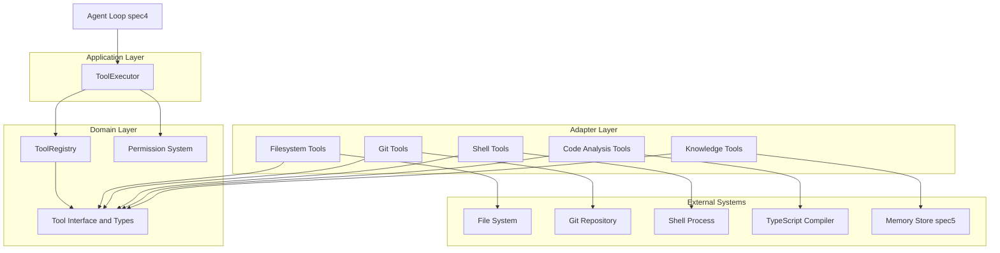
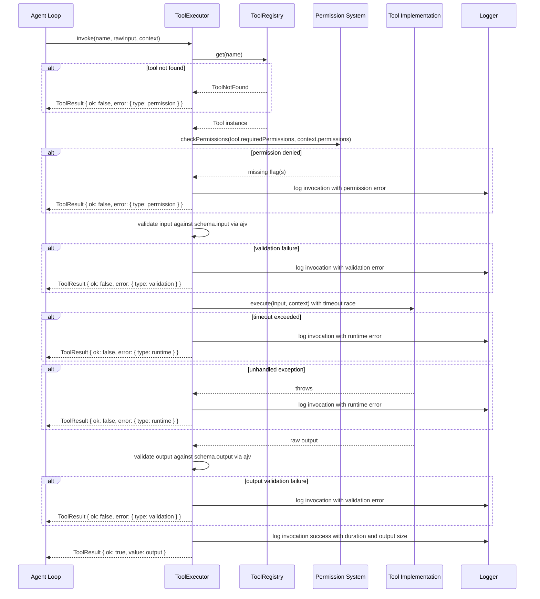
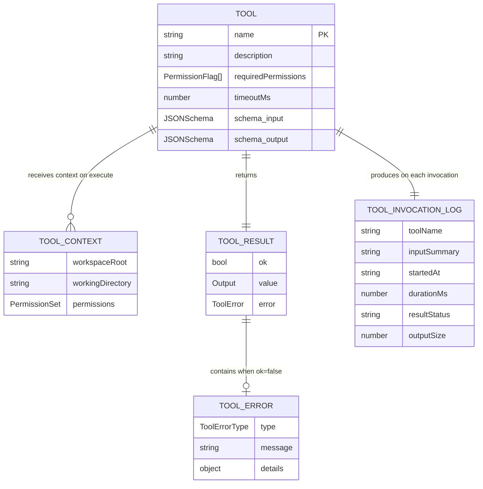

# Design Document: tool-system

## Overview

The Tool System is the structured execution interface between the LLM and the development environment. It provides the deterministic, permission-controlled bridge through which the AI agent performs all filesystem, shell, git, code analysis, and knowledge operations. Every tool invocation follows the same pipeline: registry lookup → permission check → input validation → execution → output validation → structured log.

**Purpose**: This feature delivers a safe, composable, and observable tool execution layer to the Autonomous Engineer agent loop (spec4) and all higher-level specs that depend on environment interaction.

**Users**: The agent loop (spec4) is the primary consumer; spec3 (agent-safety) wraps this system with additional guardrails. Human operators observe execution through structured logs.

**Impact**: Establishes a new `domain/tools/` and `adapters/tools/` subtree within `orchestrator-ts/`; adds no changes to existing workflow, LLM, or SDD adapter code.

### Goals
- Define a single `Tool<Input, Output>` interface that all tool implementations satisfy.
- Provide a central `ToolRegistry` for tool registration and discovery.
- Enforce permission checks and schema validation through a `ToolExecutor` before any tool executes.
- Implement all five tool categories (filesystem, git, shell, code analysis, knowledge) as adapters.
- Return structured, typed errors for all failure modes using the project-standard `ToolResult<T>` pattern.

### Non-Goals
- Agent-safety guardrails (shell allowlists, workspace boundary enforcement beyond path traversal) — deferred to spec3.
- Memory indexing, semantic search, and incremental parsing — deferred to spec5 and spec11.
- Remote or distributed tool execution — v1.x future extension.
- Dynamic plugin loading of third-party tools — v1.x future extension.

---

## Architecture

### Architecture Pattern & Boundary Map

The tool-system follows the same Clean/Hexagonal Architecture used throughout `orchestrator-ts/`. Pure types and business logic reside in the domain layer; orchestration lives in the application layer; external system interactions are adapters.



**Architecture Integration**:
- Selected pattern: Clean/Hexagonal — matches existing `orchestrator-ts/` structure mandated by `steering/tech.md`.
- Domain/feature boundaries: `domain/tools/` owns types, registry, and permission logic; `adapters/tools/` owns all category implementations; `application/tools/` owns the executor orchestrator.
- Existing patterns preserved: `{ ok: true; value: T } | { ok: false; error: E }` result type; port interfaces in `application/ports/`; adapters in `adapters/`.
- New components rationale: five tool-category adapter directories are required by spec scope; executor is needed to enforce the validation + permission pipeline centrally.

### Technology Stack

| Layer | Choice / Version | Role in Feature | Notes |
|-------|-----------------|-----------------|-------|
| Runtime | Bun v1.3.10+ | Executes tool implementations; provides `node:path`, `node:child_process`, `node:fs` | Existing constraint |
| Language | TypeScript (strict) | All type definitions and interfaces | Existing constraint; `noUncheckedIndexedAccess`, `exactOptionalPropertyTypes` enabled |
| Schema validation | ajv v8 | Runtime JSON Schema validation in `ToolExecutor` | New dependency; replaces raw `zod` for JSON Schema use case (see `research.md`) |
| Zod | v3.25 (existing) | Config and tool-option validation where zod schemas are natural | Not used for Tool interface JSON Schema validation |
| TypeScript Compiler API | Built-in to Bun/TypeScript | Powers `parse_typescript_ast`, `find_symbol_definition`, `find_references`, `dependency_graph` code-analysis tools | Available without additional packages |

---

## System Flows

### Tool Invocation Pipeline



Key decisions visible in the flow:
- Permission check occurs **before** input validation to fail fast without touching untrusted data.
- Output validation is performed even on successful execution to catch malformed tool implementations early.
- All paths write to the logger before returning, ensuring 100% invocation observability.

---

## Requirements Traceability

| Requirement | Summary | Components | Interfaces |
|-------------|---------|------------|------------|
| 1.1–1.5 | Tool interface + ToolContext | ToolInterface, ToolRegistry | `Tool<I,O>`, `ToolContext` |
| 2.1–2.5 | Registry CRUD + conflict rejection | ToolRegistry | `IToolRegistry` |
| 3.1–3.5 | Executor validation, timeout, exception catch, logging | ToolExecutor | `IToolExecutor` |
| 4.1–4.5 | Permission flags + modes + runtime lock | PermissionSystem | `PermissionSet`, `ExecutionMode` |
| 5.1–5.5 | Filesystem tool implementations + path safety | FilesystemToolsAdapter | Tool instances |
| 6.1–6.5 | Git tool implementations (git_status, git_diff, git_commit, git_branch_list, git_branch_create, git_branch_switch) | GitToolsAdapter | Tool instances |
| 7.1–7.5 | Shell tool implementations + stdout/stderr capture | ShellToolsAdapter | Tool instances |
| 8.1–8.5 | Code analysis tool implementations | CodeAnalysisToolsAdapter | Tool instances |
| 9.1–9.5 | Knowledge tool implementations + MemoryClient port | KnowledgeToolsAdapter | `MemoryClient` |
| 10.1–10.5 | ToolError type + typed categories + details | ToolInterface | `ToolError`, `ToolResult<T>` |
| 11.1–11.5 | Structured execution logging + sanitization | ToolExecutor | `Logger`, `ToolInvocationLog` |

---

## Components and Interfaces

### Component Summary

| Component | Domain/Layer | Intent | Req Coverage | Key Dependencies | Contracts |
|-----------|-------------|--------|--------------|-----------------|-----------|
| ToolInterface | Domain | Core type definitions for all tools | 1.1–1.5, 10.1–10.5 | none | Service |
| ToolRegistry | Domain | Register, retrieve, and list tools | 2.1–2.5 | ToolInterface | Service |
| PermissionSystem | Domain | Mode-to-PermissionSet resolution and flag checking | 4.1–4.5 | ToolInterface | Service |
| ToolExecutor | Application | Orchestrate validation + permission + execution + logging | 3.1–3.5, 11.1–11.5 | ToolRegistry, PermissionSystem, ajv | Service |
| FilesystemToolsAdapter | Adapter | read_file, write_file, list_directory, search_files | 5.1–5.5 | node:fs, node:path | Service |
| GitToolsAdapter | Adapter | git_status, git_diff, git_commit, git_branch_list, git_branch_create, git_branch_switch | 6.1–6.5 | node:child_process | Service |
| ShellToolsAdapter | Adapter | run_command, run_test_suite, install_dependencies | 7.1–7.5 | node:child_process | Service |
| CodeAnalysisToolsAdapter | Adapter | parse_typescript_ast, find_symbol_definition, find_references, dependency_graph | 8.1–8.5 | typescript compiler API | Service |
| KnowledgeToolsAdapter | Adapter | search_memory, retrieve_spec, retrieve_design_doc | 9.1–9.5 | MemoryClient (port), node:fs | Service |

---

### Domain Layer

#### ToolInterface (types)

| Field | Detail |
|-------|--------|
| Intent | Core type definitions: `Tool<I,O>`, `ToolContext`, `ToolError`, `ToolResult<T>`, `PermissionSet`, `ExecutionMode` |
| Requirements | 1.1, 1.2, 1.3, 1.4, 1.5, 4.1, 4.2, 10.1, 10.2, 10.3 |

**Responsibilities & Constraints**
- Defines all shared types consumed by every other component.
- No runtime logic; pure type declarations only.
- Must not import from any adapter or application module (dependency inversion).

**Dependencies**
- Inbound: all other components consume these types (P0)
- Outbound: none

**Contracts**: Service [x]

##### Service Interface

```typescript
// -- Permission model --

export type PermissionFlag =
  | 'filesystemRead'
  | 'filesystemWrite'
  | 'shellExecution'
  | 'gitWrite'
  | 'networkAccess';

export type PermissionSet = Readonly<Record<PermissionFlag, boolean>>;

export type ExecutionMode = 'ReadOnly' | 'Dev' | 'CI' | 'Full';

// -- JSON Schema (minimal, compatible with JSON Schema Draft-07) --

export type JSONSchema = Record<string, unknown>;

// -- Forward-reference ports (fulfilled by spec5 and infra logger) --

export interface MemoryClient {
  search(query: string): Promise<ReadonlyArray<MemoryEntry>>;
}

export interface MemoryEntry {
  readonly id: string;
  readonly content: string;
  readonly score: number;
}

export interface Logger {
  info(entry: ToolInvocationLog): void;
  error(entry: ToolInvocationLog): void;
}

export interface ToolInvocationLog {
  readonly toolName: string;
  readonly inputSummary: string;    // sanitized, max 256 chars
  readonly startedAt: string;       // ISO 8601
  readonly durationMs: number;
  readonly resultStatus: 'success' | ToolErrorType;
  readonly outputSize?: number;     // byte count or entry count
  readonly errorMessage?: string;
}

// -- Tool context --

export interface ToolContext {
  readonly workspaceRoot: string;
  readonly workingDirectory: string;
  readonly permissions: PermissionSet;
  readonly memory: MemoryClient;
  readonly logger: Logger;
}

// -- Error model --

export type ToolErrorType = 'validation' | 'runtime' | 'permission';

export interface ToolError {
  readonly type: ToolErrorType;
  readonly message: string;
  readonly details?: Readonly<Record<string, unknown>>;
}

// -- Result type (mirrors LlmResult pattern) --

export type ToolResult<T> =
  | { readonly ok: true;  readonly value: T }
  | { readonly ok: false; readonly error: ToolError };

// -- Tool interface --

export interface Tool<Input, Output> {
  readonly name: string;
  readonly description: string;
  readonly requiredPermissions: ReadonlyArray<PermissionFlag>;
  readonly timeoutMs?: number;
  readonly schema: {
    readonly input: JSONSchema;
    readonly output: JSONSchema;
  };
  execute(input: Input, context: ToolContext): Promise<Output>;
}
```

- Preconditions: All properties on `Tool<I,O>` must be present and non-empty at registration time (enforced by `ToolRegistry`).
- Postconditions: `ToolResult<T>` always carries either a typed value or a typed `ToolError`; no other states exist.
- Invariants: `ToolError.type` is always one of the three discriminated values; `ToolInvocationLog.inputSummary` is never longer than 256 characters.

**Implementation Notes**
- `JSONSchema` is typed as `Record<string, unknown>` to avoid coupling to a specific JSON Schema library; ajv accepts this without issues.
- `MemoryClient` and `Logger` are minimal stubs here; spec5 and the existing event-bus infrastructure will satisfy them at composition root.

---

#### ToolRegistry

| Field | Detail |
|-------|--------|
| Intent | Central in-memory index for tool registration, retrieval, and discovery |
| Requirements | 2.1, 2.2, 2.3, 2.4, 2.5 |

**Responsibilities & Constraints**
- Maintains a `Map<string, Tool<unknown, unknown>>` keyed by tool name.
- Rejects duplicate registrations with a descriptive error.
- Returns a typed `ToolNotFound` result (not an exception) when a tool is not found.

**Dependencies**
- Inbound: ToolExecutor reads from it (P0); bootstrap code registers tools (P0)
- Outbound: ToolInterface types (P0)

**Contracts**: Service [x]

##### Service Interface

```typescript
export type RegistryError =
  | { readonly type: 'duplicate_name'; readonly name: string }
  | { readonly type: 'not_found';      readonly name: string };

export type RegistryResult<T> =
  | { readonly ok: true;  readonly value: T }
  | { readonly ok: false; readonly error: RegistryError };

export interface IToolRegistry {
  register(tool: Tool<unknown, unknown>): RegistryResult<void>;
  get(name: string): RegistryResult<Tool<unknown, unknown>>;
  list(): ReadonlyArray<{
    readonly name: string;
    readonly description: string;
    readonly schema: Tool<unknown, unknown>['schema'];
  }>;
}
```

- Preconditions: `tool.name` must be a non-empty string; all five `Tool` properties must be defined.
- Postconditions: After a successful `register`, `get(tool.name)` always returns `ok: true`.
- Invariants: The registry is append-only at runtime (no deletion, no overwrite).

---

#### PermissionSystem

| Field | Detail |
|-------|--------|
| Intent | Resolves execution modes to PermissionSet profiles and checks tool permission requirements |
| Requirements | 4.1, 4.2, 4.3, 4.4, 4.5 |

**Responsibilities & Constraints**
- Provides a `resolvePermissionSet(mode: ExecutionMode): PermissionSet` function returning frozen, immutable permission profiles.
- Provides a `checkPermissions(required, active): PermissionCheck` function used by the executor.
- Mode profiles are compile-time constants; runtime modification is not possible.

**Dependencies**
- Inbound: ToolExecutor (P0); bootstrap/CLI config (P0)
- Outbound: ToolInterface types (P0)

**Contracts**: Service [x]

##### Service Interface

```typescript
export interface PermissionCheck {
  readonly granted: boolean;
  readonly missingFlags: ReadonlyArray<PermissionFlag>;
}

export interface IPermissionSystem {
  resolvePermissionSet(mode: ExecutionMode): PermissionSet;
  checkPermissions(
    required: ReadonlyArray<PermissionFlag>,
    active: PermissionSet
  ): PermissionCheck;
}

// Compile-time mode profiles (in implementation):
// ReadOnly : { filesystemRead: true,  filesystemWrite: false, shellExecution: false, gitWrite: false, networkAccess: false }
// Dev      : { filesystemRead: true,  filesystemWrite: true,  shellExecution: false, gitWrite: false, networkAccess: false }
// CI       : { filesystemRead: true,  filesystemWrite: false, shellExecution: true,  gitWrite: false, networkAccess: false }
// Full     : { filesystemRead: true,  filesystemWrite: true,  shellExecution: true,  gitWrite: true,  networkAccess: true  }
```

**Implementation Notes**
- Integration: Mode is resolved once at CLI startup and passed into `ToolContext.permissions`; it is never re-resolved during a session.
- Risks: The `CI` mode intentionally omits `filesystemWrite` — shell tools can write via subprocess but the agent cannot directly write files. Ensure this intent is documented at the composition root.

---

### Application Layer

#### ToolExecutor

| Field | Detail |
|-------|--------|
| Intent | Orchestrates the full tool invocation pipeline: registry lookup → permission check → input validation → execution with timeout → output validation → logging |
| Requirements | 3.1, 3.2, 3.3, 3.4, 3.5, 11.1, 11.2, 11.3, 11.4, 11.5 |

**Responsibilities & Constraints**
- Owns the ajv `Ajv` instance; compiles schemas on first use and caches compiled validators.
- Uses `Promise.race` with an `AbortSignal`-based timeout to enforce per-invocation time limits.
- Never throws; all error paths return `ToolResult { ok: false }`.
- Sanitizes input parameters before logging (truncates values > `logMaxInputBytes` config).

**Dependencies**
- Inbound: Agent loop (P0)
- Outbound: IToolRegistry — tool lookup (P0); IPermissionSystem — permission check (P0); Tool.execute — tool invocation (P0); Logger — structured logging (P1)
- External: ajv v8 — JSON Schema validation (P0)

**Contracts**: Service [x]

##### Service Interface

```typescript
export interface ToolExecutorConfig {
  readonly defaultTimeoutMs: number;
  readonly logMaxInputBytes: number;  // truncation threshold for log sanitization
}

export interface IToolExecutor {
  invoke(
    name: string,
    rawInput: unknown,
    context: ToolContext
  ): Promise<ToolResult<unknown>>;
}
```

- Preconditions: `name` must be a non-empty string; `context.permissions` is a frozen `PermissionSet` set at session start.
- Postconditions: Returns `ToolResult<unknown>` in all cases. Logger receives an entry for every invocation before the promise resolves. The caller is responsible for narrowing the `value` type at the call site (e.g., via a zod schema or explicit type guard) — the registry stores `Tool<unknown, unknown>`, so static typing across the call boundary is not guaranteed.
- Invariants: `ajv` schema compilation is idempotent; the same compiled validator is reused for repeated invocations of the same tool.

**Implementation Notes**
- Integration: The executor is instantiated once at session startup and injected into the agent loop via dependency injection.
- Validation: ajv v8 with `allErrors: false` (fail fast on first validation error); `strict: false` to tolerate additional JSON Schema keywords without throwing.
- Risks: ajv v8 ESM compatibility under Bun must be confirmed on first CI run; pin `ajv@^8.17` to avoid breaking changes.

---

### Adapter Layer — Tool Implementations

All tool implementations satisfy `Tool<Input, Output>`. Each adapter module exports a factory function (or plain object literal) returning the tool instance. Bootstrap code registers all tools into `ToolRegistry` at startup.

#### FilesystemToolsAdapter

| Field | Detail |
|-------|--------|
| Intent | Implements read_file, write_file, list_directory, search_files for project filesystem access |
| Requirements | 5.1, 5.2, 5.3, 5.4, 5.5 |

**Dependencies**
- External: `node:fs/promises`, `node:path` (P0)

**Contracts**: Service [x]

##### Service Interface

```typescript
// Shared internal utility (not exported)
// resolveWorkspacePath(workspaceRoot: string, requestedPath: string): string
// Throws ToolError { type: 'permission' } if resolved path does not start with workspaceRoot.

export interface ReadFileInput  { readonly path: string }
export interface ReadFileOutput { readonly content: string }

export interface WriteFileInput  { readonly path: string; readonly content: string }
export interface WriteFileOutput { readonly bytesWritten: number }

export interface ListDirectoryInput  { readonly path: string }
export interface ListDirectoryEntry  { readonly name: string; readonly type: 'file' | 'directory'; readonly size: number }
export interface ListDirectoryOutput { readonly entries: ReadonlyArray<ListDirectoryEntry> }

export interface SearchFilesInput  { readonly pattern: string; readonly directory: string }
export interface SearchFilesOutput { readonly paths: ReadonlyArray<string> }
```

- `read_file`: `requiredPermissions: ['filesystemRead']`
- `write_file`: `requiredPermissions: ['filesystemWrite']`
- `list_directory`: `requiredPermissions: ['filesystemRead']`
- `search_files`: `requiredPermissions: ['filesystemRead']`

**Implementation Notes**
- Risks: `search_files` with broad patterns on large repos may be slow; no caching in v1. Documented known limitation.

---

#### GitToolsAdapter

| Field | Detail |
|-------|--------|
| Intent | Implements git_status, git_diff, git_commit, git_branch via subprocess git invocations |
| Requirements | 6.1, 6.2, 6.3, 6.4, 6.5 |

**Dependencies**
- External: `node:child_process` (P0); `git` binary must be present in PATH (P0)

**Contracts**: Service [x]

##### Service Interface

```typescript
export interface GitStatusOutput {
  readonly staged:    ReadonlyArray<string>;
  readonly unstaged:  ReadonlyArray<string>;
  readonly untracked: ReadonlyArray<string>;
}

export interface GitDiffInput  { readonly staged?: boolean; readonly base?: string; readonly head?: string }
export interface GitDiffOutput { readonly diff: string }

export interface GitCommitInput  { readonly message: string }
export interface GitCommitOutput { readonly hash: string }

// git_branch is split into three tools so each maps cleanly to a static requiredPermissions list.
export interface GitBranchListOutput   { readonly branches: ReadonlyArray<string>; readonly current: string }
export interface GitBranchCreateInput  { readonly name: string }
export interface GitBranchCreateOutput { readonly name: string }
export interface GitBranchSwitchInput  { readonly name: string }
export interface GitBranchSwitchOutput { readonly name: string }
```

- `git_status`: `requiredPermissions: []`
- `git_diff`: `requiredPermissions: []`
- `git_commit`: `requiredPermissions: ['gitWrite']`
- `git_branch_list`: `requiredPermissions: []`
- `git_branch_create`: `requiredPermissions: ['gitWrite']`
- `git_branch_switch`: `requiredPermissions: ['gitWrite']`

**Implementation Notes**
- Integration: All git operations run via `child_process.execFile('git', args, { cwd: workingDirectory })`; stdout/stderr are captured and returned in `ToolError.details` on failure.

---

#### ShellToolsAdapter

| Field | Detail |
|-------|--------|
| Intent | Implements run_command, run_test_suite, install_dependencies via subprocess shell execution |
| Requirements | 7.1, 7.2, 7.3, 7.4, 7.5 |

**Dependencies**
- External: `node:child_process` (P0)

**Contracts**: Service [x]

##### Service Interface

```typescript
export interface RunCommandInput {
  readonly command: string;
  readonly args: ReadonlyArray<string>;
  readonly cwd?: string;
}
export interface RunCommandOutput {
  readonly stdout:   string;
  readonly stderr:   string;
  readonly exitCode: number;
}

export type TestFramework = 'bun' | 'jest' | 'vitest' | 'mocha';
export interface RunTestSuiteInput  { readonly framework: TestFramework; readonly pattern?: string }
export interface TestResult         { readonly passed: number; readonly failed: number; readonly failures: ReadonlyArray<string> }
export interface RunTestSuiteOutput { readonly result: TestResult; readonly stdout: string; readonly stderr: string }

export type PackageManager = 'bun' | 'npm' | 'pnpm' | 'yarn';
export interface InstallDependenciesInput  { readonly packageManager: PackageManager; readonly cwd?: string }
export interface InstallDependenciesOutput { readonly stdout: string; readonly stderr: string; readonly exitCode: number }
```

- All shell tools: `requiredPermissions: ['shellExecution']`

**Implementation Notes**
- Integration: `run_command` and `install_dependencies` use `execFile` with argument arrays (not shell interpolation) to prevent command injection.
- Risks: Shell tool output may include sensitive data; the executor's log sanitization applies to the `inputSummary` field but not to raw stdout/stderr stored in the result.

---

#### CodeAnalysisToolsAdapter

| Field | Detail |
|-------|--------|
| Intent | Implements parse_typescript_ast, find_symbol_definition, find_references, dependency_graph using the TypeScript compiler API |
| Requirements | 8.1, 8.2, 8.3, 8.4, 8.5 |

**Dependencies**
- External: `typescript` (compiler API) (P0)

**Contracts**: Service [x]

##### Service Interface

```typescript
export interface ParseTsAstInput  { readonly filePath: string }
export interface TsDeclaration    { readonly kind: string; readonly name: string; readonly line: number }
export interface ParseTsAstOutput {
  readonly declarations: ReadonlyArray<TsDeclaration>;
  readonly imports:      ReadonlyArray<string>;
  readonly exports:      ReadonlyArray<string>;
}

export interface FindSymbolInput  { readonly symbolName: string; readonly scope?: string }
export interface SymbolDefinition { readonly filePath: string; readonly line: number; readonly signature: string }
export interface FindSymbolOutput { readonly definition: SymbolDefinition | null }

export interface FindReferencesInput  { readonly symbolName: string; readonly scope?: string }
export interface SymbolReference      { readonly filePath: string; readonly line: number }
export interface FindReferencesOutput { readonly references: ReadonlyArray<SymbolReference> }

export interface DependencyGraphInput  { readonly entryPoint: string }
export interface DependencyNode        { readonly module: string; readonly dependencies: ReadonlyArray<string> }
export interface DependencyGraphOutput { readonly nodes: ReadonlyArray<DependencyNode> }
```

- All code analysis tools: `requiredPermissions: ['filesystemRead']`

**Implementation Notes**
- Integration: Tools use `ts.createProgram` with `rootNames: [filePath]` and the project's `tsconfig.json`; no persistent compiler host in v1 (created per invocation). Performance optimization deferred to spec11.
- Risks: Large files or deeply nested dependency graphs may cause high memory usage in v1; acceptable for initial implementation scope.

---

#### KnowledgeToolsAdapter

| Field | Detail |
|-------|--------|
| Intent | Implements search_memory, retrieve_spec, retrieve_design_doc using MemoryClient and filesystem access |
| Requirements | 9.1, 9.2, 9.3, 9.4, 9.5 |

**Dependencies**
- Inbound: ToolContext.memory (MemoryClient port) (P0)
- External: `node:fs/promises` (P0)

**Contracts**: Service [x]

##### Service Interface

```typescript
export interface SearchMemoryInput  { readonly query: string }
export interface SearchMemoryOutput { readonly entries: ReadonlyArray<MemoryEntry> }

export interface RetrieveSpecInput  { readonly specName: string }
export interface RetrieveSpecOutput {
  readonly requirements: string;
  readonly design:       string | null;
  readonly tasks:        string | null;
}

export interface RetrieveDesignDocInput  { readonly docPath: string }
export interface RetrieveDesignDocOutput { readonly content: string }
```

- `search_memory`: `requiredPermissions: []` (uses MemoryClient port, not direct filesystem access)
- `retrieve_spec`: `requiredPermissions: ['filesystemRead']`
- `retrieve_design_doc`: `requiredPermissions: ['filesystemRead']`

**Implementation Notes**
- Integration: `search_memory` delegates entirely to `context.memory.search(query)`; the tool does not manage memory connections directly (requirement 9.5).
- `retrieve_spec` resolves paths relative to `workspaceRoot + '/.kiro/specs/' + specName/`; applies path traversal check via `resolveWorkspacePath`.

---

## Data Models

### Domain Model

The tool-system's primary domain concept is the `Tool<Input, Output>` value object. It has no mutable state — all state is held externally by `ToolRegistry` and `ToolExecutor`.



**Invariants**:
- `TOOL.name` is unique across the registry at all times.
- `TOOL_RESULT.ok` is always explicitly `true` or `false`; never `undefined`.
- `TOOL_INVOCATION_LOG.inputSummary` never exceeds `logMaxInputBytes` characters.

### Logical Data Model

All data is in-memory (no persistent storage in this spec). The `ToolRegistry` holds a `Map<string, Tool<unknown, unknown>>`. `ToolInvocationLog` entries are emitted to the `Logger` and consumed by the event bus; they are not stored within the tool-system itself.

---

## Error Handling

### Error Strategy

The tool-system uses the **fail-fast + structured error** strategy: validation errors are caught before execution; all error paths return typed `ToolResult { ok: false }` rather than throwing. This enables the agent loop to apply category-specific recovery strategies without try/catch.

### Error Categories and Responses

| Type | Trigger | `details` Content | Agent Recovery Strategy |
|------|---------|-----------------|------------------------|
| `validation` (input) | Input fails `schema.input` | `{ field: string, constraint: string }` | Retry with corrected input |
| `validation` (output) | Output fails `schema.output` | `{ field: string, constraint: string }` | Report tool bug; select alternative tool |
| `permission` | Required flag absent in PermissionSet | `{ requiredFlag: string, currentMode: ExecutionMode }` | Escalate to human; do not retry |
| `runtime` (timeout) | Execution exceeds `timeoutMs` | `{ timeoutMs: number, toolName: string }` | Retry once with same input; then escalate |
| `runtime` (exception) | Tool throws unhandled exception | `{ originalMessage: string }` | Retry once; then select alternative tool |
| `runtime` (git/fs/shell) | OS-level operation fails | `{ stderr: string, exitCode?: number }` | Inspect error; attempt fix; then retry |

### Monitoring

Every invocation produces a `ToolInvocationLog` entry via `context.logger`. The executor logs before returning, guaranteeing that no invocation is silently lost. Log consumers (event bus, CLI renderer) handle aggregation and display.

---

## Testing Strategy

### Unit Tests

- `ToolRegistry`: register success, duplicate rejection, get not-found, list returns all entries.
- `PermissionSystem`: each mode resolves to the correct PermissionSet; `checkPermissions` returns missing flags correctly.
- `ToolExecutor`: input validation failure path; output validation failure path; permission denial path; timeout path; exception catch path; success path with log emission; log sanitization truncation.

### Integration Tests

- Filesystem tools: `read_file` on real file, `write_file` creates and reads back, `list_directory` returns correct structure, `search_files` matches expected pattern, path traversal is rejected.
- Git tools: `git_status` returns staged/unstaged correctly, `git_commit` creates a real commit (in test repo), `git_branch list` returns branches.
- Shell tools: `run_command` captures stdout and stderr, exit code non-zero returns runtime error, timeout aborts process.
- Knowledge tools: `retrieve_spec` reads correct spec files, `retrieve_design_doc` reads correct doc, not-found returns runtime error.

### E2E Tests

- Full invocation pipeline: register a tool → executor.invoke → validate result → check log emission.
- Mode enforcement: attempt `write_file` in ReadOnly mode → permission error; attempt in Dev mode → success.

### Performance

- `ToolExecutor` schema compilation caching: repeated invocations of the same tool do not recompile the ajv validator.
- `parse_typescript_ast` on a medium TypeScript file (500 lines): completes within tool default timeout.

---

## Security Considerations

- **Path traversal**: `resolveWorkspacePath` prevents access outside `workspaceRoot` for all filesystem and knowledge tools. This is the primary security boundary for this spec.
- **Command injection**: Shell tools use `execFile` with array arguments, not `exec` with shell interpolation. Command strings are never interpolated.
- **Log sanitization**: `ToolInvocationLog.inputSummary` is truncated to `logMaxInputBytes`; file content values are replaced with `[content: N bytes]` annotations.
- **Permission immutability**: `PermissionSet` is frozen at startup; runtime escalation is architecturally impossible. Additional guardrails (allowlists, blocklists) are deferred to spec3.

---

## Supporting References

- `research.md` — architecture pattern evaluation, ajv selection rationale, risk register
- `docs/architecture/tool-system-architecture.md` — primary architecture document
- `docs/agent/dev-agent-v1-specs.md` (spec2) — scope and success criteria
- Existing pattern reference: `orchestrator-ts/application/ports/llm.ts` (`LlmResult` discriminated union)
