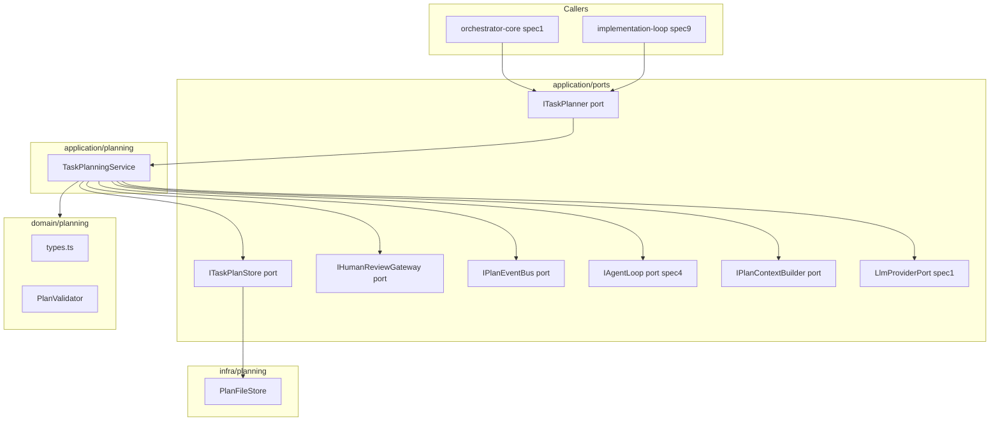
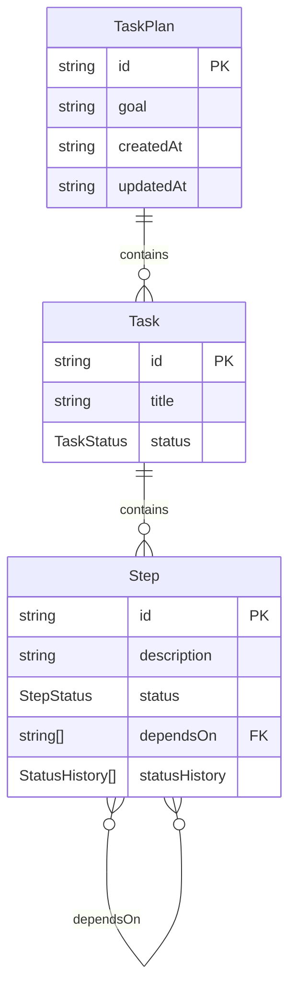

# Design Document — task-planning

## Overview

The Task Planning system is the hierarchical planning layer of the AI Dev Agent, sitting above the Agent Loop (spec4) and consuming the Context Engine (spec6). It transforms a high-level engineering goal — typically a task section from a cc-sdd task list — into a structured `TaskPlan` with Goals, Tasks, Steps, and Actions, executes that plan step-by-step by invoking `IAgentLoop` once per Step, and maintains accurate plan state across failures, dynamic revisions, and resumptions after interruption.

**Purpose**: Deliver structured, dependency-ordered, recoverable execution of complex engineering goals by managing the plan lifecycle from LLM-generated draft to completed or escalated outcome.

**Users**: The orchestrator-core workflow engine (spec1) and the implementation loop (spec9) invoke `ITaskPlanner` to execute a plan for a given goal. Human operators interact via the approval gate for large or high-risk plans.

**Impact**: Introduces three new code layers — `domain/planning/`, `application/ports/task-planning.ts`, and `application/planning/task-planning-service.ts` — alongside an `infra/planning/plan-file-store.ts` adapter. No modifications to existing ports, domain types, or adapters are required.

### Goals

- Generate an LLM-driven `TaskPlan` from a goal description using the Context Engine for prompt assembly.
- Execute each Step in declared dependency order by invoking `IAgentLoop.run()` once per Step.
- Persist plan state atomically at every status transition to enable crash recovery and resumption.
- Enforce a configurable human review gate before executing large or high-risk plans.
- Recover from step failures via retry, LLM-driven plan revision, and escalation to spec10.

### Non-Goals

- Managing Git operations (spec8 responsibility).
- The Implement → Review → Improve → Commit cycle (spec9 implementation-loop responsibility).
- Self-healing rule file updates (spec10 self-healing-loop responsibility).
- Parallel step execution (v1 executes steps sequentially; parallel execution is a future enhancement).
- Semantic code retrieval (spec11 codebase-intelligence responsibility).

---

## Requirements Traceability

| Requirement | Summary | Components | Interfaces | Flows |
|-------------|---------|------------|------------|-------|
| 1.1–1.5 | Four-level planning hierarchy with typed data model | `domain/planning/types.ts` | `TaskPlan`, `Task`, `Step` types | — |
| 2.1–2.5 | LLM-driven initial plan generation | `TaskPlanningService` | `IPlanContextBuilder`, `LlmProviderPort` | Plan Generation Flow |
| 3.1–3.5 | Mid-execution dynamic plan adjustment | `TaskPlanningService` | `ITaskPlanStore` | Step Execution Flow |
| 4.1–4.5 | Step execution via Agent Loop with status tracking | `TaskPlanningService` | `IAgentLoop` | Step Execution Flow |
| 5.1–5.5 | Dependency tracking and ordered execution | `PlanValidator`, `TaskPlanningService` | `TaskPlan` | Step Execution Flow |
| 6.1–6.5 | Pre-execution plan validation | `PlanValidator` | `PlanValidationResult` | Plan Generation Flow |
| 7.1–7.5 | Failure recovery: retry → revision → escalation | `TaskPlanningService` | `IAgentLoop`, `LlmProviderPort` | Failure Recovery Flow |
| 8.1–8.5 | Atomic JSON plan persistence and resumption | `PlanFileStore` | `ITaskPlanStore` | All Flows |
| 9.1–9.5 | Human review gate for large/high-risk plans | `TaskPlanningService` | `IHumanReviewGateway` | Plan Generation Flow |
| 10.1–10.5 | Structured observability via PlanEvent emission | `TaskPlanningService` | `PlanEvent`, `IPlanEventBus` | All Flows |
| 11.1–11.5 | Integration with IAgentLoop and IPlanContextBuilder | `TaskPlanningService` | `IAgentLoop`, `IPlanContextBuilder`, `LlmProviderPort` | All Flows |

---

## Architecture

### Existing Architecture Analysis

The `orchestrator-ts` codebase follows Clean/Hexagonal Architecture with four layers:

```
CLI → Application (Use Cases + Ports) → Domain → Adapters + Infra → External Systems
```

Key constraints respected by this design:
- Domain layer contains only pure logic — no I/O, no imports from application or adapter layers.
- Ports are defined in `application/ports/` and implemented in `adapters/` or `infra/`.
- `IAgentLoop` (`application/ports/agent-loop.ts`) is the authoritative interface for Agent Loop invocation. `TaskPlanningService` consumes it without modification.
- The atomic temp-file + rename write pattern from `FileMemoryStore` is replicated for plan persistence.

### Architecture Pattern & Boundary Map



**Architecture decisions**:
- `TaskPlanningService` is the single orchestrator; all five sub-concerns (generation, execution, persistence, human gate, recovery) are private methods within this class — consistent with `AgentLoopService`.
- `PlanValidator` is a pure domain function (no I/O) invoked both on generation and on load-from-disk.
- `IHumanReviewGateway` and `IPlanEventBus` are optional injection points; when absent, the service falls back to auto-approve and silent operation respectively.
- Steering compliance: no direct LLM provider calls — all LLM interactions are mediated through `IPlanContextBuilder` (for context assembly) and `LlmProviderPort` (for completion).

### Technology Stack

| Layer | Choice / Version | Role in Feature | Notes |
|-------|------------------|-----------------|-------|
| Runtime | Bun v1.3.10+ | TypeScript execution | Existing project runtime |
| Language | TypeScript strict | All new files | `noUncheckedIndexedAccess`, `exactOptionalPropertyTypes` enabled |
| Persistence | Node.js `fs/promises` | Atomic JSON plan files | Same APIs used by `FileMemoryStore`; no new dependencies |
| LLM | `LlmProviderPort` (Claude adapter) | Plan generation, plan revision | Existing port; no new adapter |
| Agent Loop | `IAgentLoop` (spec4) | Step execution | Existing port; no changes |
| Context Engine | `IPlanContextBuilder` (new port, spec6 adapter) | Prompt assembly for plan generation and revision | Narrow port defined in `task-planning.ts`; spec6 provides the adapter; minimal fallback built into service |

---

## System Flows

### Plan Generation and Approval Flow

```mermaid
sequenceDiagram
    participant Caller
    participant TPS as TaskPlanningService
    participant PCB as IPlanContextBuilder
    participant LLM as LlmProviderPort
    participant PV as PlanValidator
    participant HRG as IHumanReviewGateway
    participant Store as ITaskPlanStore

    Caller->>TPS: run(goal, options)
    TPS->>PCB: buildPlanContext(goal)
    PCB-->>TPS: contextString
    TPS->>LLM: complete(contextString)
    LLM-->>TPS: raw plan JSON
    TPS->>TPS: parsePlan(rawJson) — assigns new UUID planId
    TPS->>PV: validate(plan)
    PV-->>TPS: PlanValidationResult
    alt validation failed
        TPS-->>Caller: TaskPlanResult(validationError)
    end
    TPS->>Store: save(plan) — persist initial state
    Note over Caller,Store: planId is in TaskPlanResult.plan.id; Caller uses listResumable() after crash
    alt plan is large or high-risk
        TPS->>HRG: reviewPlan(plan, reason, timeoutMs)
        HRG-->>TPS: PlanReviewDecision
        alt timeout
            TPS-->>Caller: TaskPlanResult(waiting-for-input)
        else rejected with feedback
            TPS->>PCB: buildPlanContext(goal + feedback)
            PCB-->>TPS: revisedContextString
            TPS->>LLM: complete(revisedContextString)
            TPS->>HRG: reviewPlan(revisedPlan, reason, timeoutMs)
        end
    end
    TPS->>TPS: executeSteps(plan)
```

### Step Execution and Failure Recovery Flow

```mermaid
sequenceDiagram
    participant TPS as TaskPlanningService
    participant AL as IAgentLoop
    participant Store as ITaskPlanStore
    participant LLM as LlmProviderPort
    participant EB as IPlanEventBus

    loop for each Step in dependency order
        TPS->>TPS: checkDependencies(step)
        TPS->>Store: save(plan with step.status=in_progress)
        TPS->>EB: emit(step:start)
        TPS->>AL: run(step.description, options)
        AL-->>TPS: AgentLoopResult

        alt taskCompleted === true
            TPS->>Store: save(plan with step.status=completed)
            TPS->>EB: emit(step:completed)
        else failure termination
            TPS->>EB: emit(step:failed, attempt)
            loop retry up to maxRetries
                TPS->>AL: run(step.description + failureContext, options)
                AL-->>TPS: AgentLoopResult
                alt taskCompleted === true
                    TPS->>Store: save(step.status=completed)
                    break
                end
            end
            alt still failing after retries
                TPS->>LLM: complete(revisionPrompt)
                LLM-->>TPS: revisedStepPlan
                TPS->>AL: run(revisedStep.description, options)
                AL-->>TPS: AgentLoopResult
                alt taskCompleted === true
                    TPS->>Store: save(step.status=completed)
                else still failing
                    TPS->>Store: save(step.status=failed)
                    TPS->>EB: emit(step:escalated)
                    TPS-->>TPS: return TaskPlanResult(escalated)
                end
            end
        end
    end
    TPS-->>TPS: return TaskPlanResult(completed)
```

---

## Components and Interfaces

| Component | Domain/Layer | Intent | Req Coverage | Key Dependencies | Contracts |
|-----------|--------------|--------|--------------|------------------|-----------|
| `domain/planning/types.ts` | Domain | All planning domain types | 1.1–1.5, 10.1 | — | State |
| `PlanValidator` | Domain | Structural and dependency validation | 5.3, 6.1–6.5 | Domain types | Service |
| `ITaskPlanner` | App Port | Public interface for plan execution | 2–11 | — | Service |
| `ITaskPlanStore` | App Port | Plan persistence read/write | 8.1–8.5 | — | Service |
| `IPlanContextBuilder` | App Port | Narrow context assembly for plan generation and revision | 2.3, 11.3 | — | Service |
| `IHumanReviewGateway` | App Port | Human approval gate | 9.1–9.5 | — | Service |
| `IPlanEventBus` | App Port | Structured event emission | 10.1–10.5 | — | Event |
| `TaskPlanningService` | Application | Orchestrates plan lifecycle | All | IAgentLoop, IPlanContextBuilder, LlmProviderPort, ITaskPlanStore, IHumanReviewGateway | Service |
| `PlanFileStore` | Infra | Atomic JSON file persistence | 8.1–8.5 | `fs/promises` | Service |

---

### Domain Layer

#### `domain/planning/types.ts`

| Field | Detail |
|-------|--------|
| Intent | All planning domain types: TaskPlan, Task, Step, PlanEvent discriminated union |
| Requirements | 1.1, 1.2, 1.3, 1.4, 1.5, 10.1 |

**Responsibilities & Constraints**
- Defines the canonical data model for the entire task-planning subsystem.
- No imports from application, adapter, or infra layers.
- All types are `readonly` to enforce immutability at type level.

**Contracts**: State [x]

##### State Management

```typescript
export type StepStatus = "pending" | "in_progress" | "completed" | "failed";
export type TaskStatus = "pending" | "in_progress" | "completed" | "failed";

export interface Step {
  readonly id: string;
  readonly description: string;
  readonly status: StepStatus;
  readonly dependsOn: ReadonlyArray<string>;
  /** ISO 8601 timestamps for each status transition. */
  readonly statusHistory: ReadonlyArray<{ status: StepStatus; at: string }>;
}

export interface Task {
  readonly id: string;
  readonly title: string;
  readonly status: TaskStatus;
  readonly steps: ReadonlyArray<Step>;
}

export interface TaskPlan {
  readonly id: string;
  readonly goal: string;
  readonly tasks: ReadonlyArray<Task>;
  /** ISO 8601 timestamp of plan creation. */
  readonly createdAt: string;
  /** ISO 8601 timestamp of last status change. */
  readonly updatedAt: string;
}

/** Discriminated union of all observable planning lifecycle events. */
export type PlanEvent =
  | { readonly type: "plan:created"; readonly planId: string; readonly goal: string; readonly timestamp: string }
  | { readonly type: "plan:validated"; readonly planId: string; readonly timestamp: string }
  | { readonly type: "plan:revision"; readonly planId: string; readonly stepId: string; readonly originalDescription: string; readonly revisedDescription: string; readonly reason: string; readonly timestamp: string }
  | { readonly type: "step:start"; readonly planId: string; readonly stepId: string; readonly attempt: number; readonly timestamp: string }
  | { readonly type: "step:completed"; readonly planId: string; readonly stepId: string; readonly durationMs: number; readonly timestamp: string }
  | { readonly type: "step:failed"; readonly planId: string; readonly stepId: string; readonly attempt: number; readonly errorSummary: string; readonly recoveryAction: string; readonly timestamp: string }
  | { readonly type: "step:escalated"; readonly planId: string; readonly stepId: string; readonly timestamp: string }
  | { readonly type: "plan:awaiting-review"; readonly planId: string; readonly reason: PlanReviewReason; readonly timestamp: string }
  | { readonly type: "plan:completed"; readonly planId: string; readonly totalSteps: number; readonly durationMs: number; readonly timestamp: string }
  | { readonly type: "plan:escalated"; readonly planId: string; readonly failedStepId: string; readonly timestamp: string };

export type PlanReviewReason = "large-plan" | "high-risk-operations";
```

---

#### `PlanValidator`

| Field | Detail |
|-------|--------|
| Intent | Pure domain validation: ID uniqueness, dependency reference integrity, circular dependency detection |
| Requirements | 1.5, 5.3, 6.1, 6.2, 6.3 |

**Responsibilities & Constraints**
- Stateless pure functions; no I/O; no imports from application layer.
- Implements Kahn's topological sort algorithm for cycle detection and execution order computation.
- Returns all validation errors in a single pass (not fail-fast) so callers can report the full set.

**Contracts**: Service [x]

##### Service Interface

```typescript
export interface PlanValidationError {
  readonly code: "duplicate-id" | "missing-dependency" | "circular-dependency";
  readonly message: string;
}

export interface PlanValidationResult {
  readonly valid: boolean;
  readonly errors: ReadonlyArray<PlanValidationError>;
  /** Topologically sorted step IDs in valid execution order; empty when valid is false. */
  readonly executionOrder: ReadonlyArray<string>;
}

export interface PlanValidator {
  validate(plan: TaskPlan): PlanValidationResult;
}
```

- Preconditions: `plan.tasks` is a non-empty array; all step IDs are non-empty strings.
- Postconditions: When `valid === true`, `executionOrder` contains every step ID exactly once in a topologically valid order.
- Invariants: Steps in `executionOrder` appear only after all their `dependsOn` prerequisites.

**Implementation Notes**
- Validation: Three-phase pass — (1) collect all IDs, check for duplicates; (2) verify all `dependsOn` references exist; (3) Kahn's algorithm for cycle detection and ordering.
- Risks: Plans with 0 steps in a Task should emit a validation warning (not an error) since it may be a planned future addition.

---

### Application Ports Layer

#### `application/ports/task-planning.ts`

| Field | Detail |
|-------|--------|
| Intent | All application-layer ports for task-planning: ITaskPlanner, ITaskPlanStore, IHumanReviewGateway, IPlanEventBus, option types, result types |
| Requirements | 2.1–11.5 |

**Contracts**: Service [x]

##### Service Interface

```typescript
export interface TaskPlannerOptions {
  /** Max Agent Loop invocations per step before entering failure recovery. Default: 1. */
  readonly maxStepRetries: number;
  /** Steps threshold above which the human review gate activates. Default: 10. */
  readonly maxAutoApproveSteps: number;
  /** If true, skip human review gate regardless of plan size or risk. Default: false. */
  readonly skipHumanReview: boolean;
  /** Agent Loop options forwarded to each IAgentLoop.run() call. */
  readonly agentLoopOptions?: Partial<AgentLoopOptions>;
  /** Optional event bus for structured PlanEvent emission. */
  readonly eventBus?: IPlanEventBus;
  /** Optional structured logger. */
  readonly logger?: TaskPlannerLogger;
}

export type TaskPlanOutcome =
  | "completed"
  | "escalated"
  | "validation-error"
  | "human-rejected"
  | "waiting-for-input"
  | "dependency-unavailable";

export interface TaskPlanResult {
  readonly outcome: TaskPlanOutcome;
  readonly plan: TaskPlan;
  readonly failedStepId?: string;
  readonly escalationContext?: string;
}

/** Public interface for callers (orchestrator-core, implementation-loop). */
export interface ITaskPlanner {
  /**
   * Generate and execute a plan for the given goal.
   * Never throws — all errors surface as TaskPlanOutcome in TaskPlanResult.
   */
  run(goal: string, options?: Partial<TaskPlannerOptions>): Promise<TaskPlanResult>;
  /**
   * Resume an existing in-progress plan from the last completed step.
   * Returns validation-error outcome if no resumable plan exists for the given planId.
   */
  resume(planId: string, options?: Partial<TaskPlannerOptions>): Promise<TaskPlanResult>;
  /**
   * Returns IDs of all persisted plans not yet in "completed" or "failed" status.
   * Allows callers to discover resumable plans after a crash without accessing ITaskPlanStore directly.
   */
  listResumable(): Promise<ReadonlyArray<string>>;
  /** Signal graceful stop; halts after the current step completes. */
  stop(): void;
}

/** Persistence port for plan read/write. */
export interface ITaskPlanStore {
  save(plan: TaskPlan): Promise<void>;
  load(planId: string): Promise<TaskPlan | null>;
  /** Returns IDs of all persisted plans not in "completed" or "failed" status. */
  listResumable(): Promise<ReadonlyArray<string>>;
}

export type PlanReviewDecision =
  | { readonly approved: true }
  | { readonly approved: false; readonly feedback: string };

/**
 * Narrow context-building port for plan generation.
 * Decouples task-planning from spec6's full IContextEngine API, whose signature
 * (buildContext(AgentState, toolSchemas)) is incompatible with plan generation
 * (no AgentState exists before a plan is created).
 * A spec6 adapter implements this port; a minimal fallback implementation is
 * also provided in TaskPlanningService for when spec6 is unavailable.
 */
export interface IPlanContextBuilder {
  /** Assembles the LLM prompt for initial plan generation from the goal and optional repository context. */
  buildPlanContext(goal: string, repositoryContext?: string): Promise<string>;
  /** Assembles the LLM prompt for plan revision given the current plan and failure context. */
  buildRevisionContext(plan: TaskPlan, failedStepId: string, failureSummary: string): Promise<string>;
}

/** Human review gateway port — awaited by the service; adapter implements interaction. */
export interface IHumanReviewGateway {
  reviewPlan(
    plan: TaskPlan,
    reason: PlanReviewReason,
    timeoutMs: number,
  ): Promise<PlanReviewDecision>;
}

/** Event bus for PlanEvent emission — optional; when absent, events are silently dropped. */
export interface IPlanEventBus {
  emit(event: PlanEvent): void;
  on(handler: (event: PlanEvent) => void): void;
  off(handler: (event: PlanEvent) => void): void;
}

export interface TaskPlannerLogger {
  info(message: string, data?: Readonly<Record<string, unknown>>): void;
  error(message: string, data?: Readonly<Record<string, unknown>>): void;
}
```

---

### Application Layer

#### `TaskPlanningService`

| Field | Detail |
|-------|--------|
| Intent | Orchestrates the full plan lifecycle: generate → validate → persist → human gate → execute steps → recover → escalate |
| Requirements | 2.1–11.5 |

**Responsibilities & Constraints**
- Implements `ITaskPlanner`; all lifecycle sub-concerns are private methods.
- Never calls `LlmProviderPort` directly for plan execution — LLM calls are limited to (a) plan generation and (b) plan revision after retry exhaustion; both are mediated by context strings from `IPlanContextBuilder`.
- Never throws from `run()` or `resume()` — all errors surface as `TaskPlanOutcome`.
- Mutates plan state only via `ITaskPlanStore.save()` after each status change — no in-memory-only mutations.

**Dependencies**
- Inbound: `ITaskPlanner` interface — orchestrator-core and implementation-loop (P0)
- Outbound: `IAgentLoop` — step execution (P0)
- Outbound: `IPlanContextBuilder` — plan generation and revision prompt assembly (P0)
- Outbound: `LlmProviderPort` — plan generation completion and revision (P0)
- Outbound: `ITaskPlanStore` — persistence (P0)
- Outbound: `IHumanReviewGateway` — human approval gate (P1, optional)
- Outbound: `IPlanEventBus` — observability (P2, optional)
- External: `PlanValidator` — structural validation (P0)

**Contracts**: Service [x]

##### Service Interface

```typescript
export class TaskPlanningService implements ITaskPlanner {
  constructor(
    agentLoop: IAgentLoop,
    contextBuilder: IPlanContextBuilder,
    llm: LlmProviderPort,
    store: ITaskPlanStore,
    reviewGateway?: IHumanReviewGateway,
  );

  run(goal: string, options?: Partial<TaskPlannerOptions>): Promise<TaskPlanResult>;
  resume(planId: string, options?: Partial<TaskPlannerOptions>): Promise<TaskPlanResult>;
  listResumable(): Promise<ReadonlyArray<string>>;
  stop(): void;
}
```

- Preconditions: `agentLoop`, `contextBuilder`, `llm`, and `store` are non-null; `goal` is a non-empty string.
- Postconditions: Every call to `run()` or `resume()` results in either `"completed"` or a terminal non-completed outcome; the final plan state is persisted.
- Invariants: At most one Step is in `"in_progress"` state at any time within a plan execution.

**Implementation Notes**
- The plan ID is generated as a UUID v4 at plan creation time.
- Risk classification for human review gate: a plan is "high-risk" if any step description contains keywords from a configured blocklist (e.g., `["delete", "drop", "force-push", "schema migration"]`). This is applied in addition to the step count threshold.
- Dynamic plan adjustment: when `AgentLoopResult` contains observations with `planAdjustment === "revise"`, the service extracts the `revisedPlan` array from the latest `ReflectionOutput`, maps it to a revised Step list, runs validation, and persists the revision as a `plan:revision` event before continuing.
- Fallback context: when `IPlanContextBuilder.buildPlanContext()` returns an error, the service constructs a minimal prompt directly from the goal string (consistent with `AgentLoopService.#buildFallbackContext`). This ensures plan generation degrades gracefully when spec6 is not yet wired.
- Risks: If `ITaskPlanStore.save()` fails, `run()` returns `TaskPlanResult` with outcome `"escalated"` and the filesystem error in `escalationContext` rather than continuing without persistence.

---

### Infra Layer

#### `PlanFileStore`

| Field | Detail |
|-------|--------|
| Intent | Atomic JSON persistence of TaskPlan objects at `.memory/tasks/task_{id}.json` |
| Requirements | 8.1, 8.2, 8.3, 8.4, 8.5 |

**Responsibilities & Constraints**
- Implements `ITaskPlanStore`.
- All writes are atomic: write to `.tmp` sibling file, `datasync`, then `rename` to destination — identical to `FileMemoryStore.atomicWrite`.
- Parent directory `.memory/tasks/` is created with `{ recursive: true }` on first write.
- `load()` returns `null` when the plan file does not exist (ENOENT) and throws for all other filesystem errors.

**Dependencies**
- Inbound: `ITaskPlanStore` — `TaskPlanningService` (P0)
- External: `node:fs/promises` — `open`, `rename`, `mkdir`, `readFile`, `readdir` (P0)

**Contracts**: Service [x]

##### Service Interface

```typescript
export class PlanFileStore implements ITaskPlanStore {
  constructor(options?: { baseDir?: string });

  save(plan: TaskPlan): Promise<void>;
  load(planId: string): Promise<TaskPlan | null>;
  listResumable(): Promise<ReadonlyArray<string>>;

  /** Exposed for testing: resolves the full file path for a given planId. */
  resolvePlanPath(planId: string): string;
}
```

- `save` postcondition: the plan JSON is fully written and synced to disk before the method resolves.
- `listResumable` reads all `.json` files in `.memory/tasks/`, parses each, and returns IDs where `plan.tasks` contains at least one task not in `"completed"` or `"failed"` status.

**Implementation Notes**
- Integration: follows the same `atomicWrite` private helper pattern as `FileMemoryStore`; consider extracting `atomicWrite` to a shared infra utility if both stores grow in parallel.
- Validation: `PlanValidator.validate()` is run on every `load()` result before returning. If validation fails (indicating corrupted or manually edited plan), `load()` throws a structured `PlanStoreError` rather than returning invalid state.
- Risks: Concurrent writes to the same plan file from two processes are not protected beyond filesystem-level atomicity of `rename`; for v1 this is acceptable since the agent runs as a single process.

---

## Data Models

### Domain Model

The `TaskPlan` is the aggregate root. It owns all `Task` and `Step` entities within it. Status transitions flow in one direction: `pending → in_progress → completed | failed`.



**Business rules and invariants**:
- A `Task.status` is `"completed"` only when all its Steps are `"completed"`.
- A `Task.status` is `"failed"` when any Step is `"failed"` and escalation has occurred.
- A `Step.status` may only transition forward or to `"failed"` (never from `"completed"` back to `"pending"`).
- A Step whose `dependsOn` references a `"failed"` Step is immediately set to `"failed"` (cascading block).

### Logical Data Model

**Persisted plan file** (`.memory/tasks/task_{id}.json`):
- A single JSON object matching the `TaskPlan` TypeScript interface.
- `statusHistory` within each Step records every status transition with an ISO 8601 timestamp.
- The file is a complete snapshot; no append-only log — each write replaces the previous version atomically.

**Consistency & Integrity**:
- Single-writer guarantee: only `TaskPlanningService` writes plan files; no concurrent writes within a session.
- Every write is atomic (temp + rename), ensuring readers never observe partial state.
- `PlanValidator` is run on every `load()` to detect corruption introduced by external edits.

---

## Error Handling

### Error Strategy

`TaskPlanningService.run()` never throws. All internal errors are caught, logged (if a logger is injected), and surfaced as a `TaskPlanOutcome` value in `TaskPlanResult`. This mirrors the `AgentLoopService.run()` never-throws contract.

### Error Categories and Responses

| Category | Trigger | Response |
|----------|---------|----------|
| Validation error | `PlanValidator.validate()` returns `valid: false` | Return `TaskPlanResult(outcome: "validation-error")`; emit `plan:escalated` event |
| LLM generation failure | `LlmProviderPort.complete()` returns error or unparseable JSON | Retry up to `maxPlanParseRetries` (default 2); if exhausted, return `"escalated"` |
| Step failure (recoverable) | `AgentLoopResult.taskCompleted === false` | Retry step up to `maxStepRetries`; on exhaustion, LLM-driven plan revision; then final attempt |
| Step failure (unrecoverable) | Final retry + revision attempt also fails | Set step to `"failed"`, cascade-fail dependent steps, return `TaskPlanResult(outcome: "escalated", failedStepId)` |
| Persistence failure | `ITaskPlanStore.save()` throws | Log error, return `"escalated"` with filesystem error in `escalationContext`; do not continue |
| Human review timeout | `IHumanReviewGateway.reviewPlan()` times out | Emit `plan:awaiting-review`; halt execution; return `"waiting-for-input"` outcome — plan remains persisted and resumable via `resume(planId)` once the operator responds |
| Human review rejected | `PlanReviewDecision.approved === false` | Incorporate feedback, regenerate plan sections, re-present for approval (up to 1 revision); if rejected again, return `"human-rejected"` |
| Dependency unavailable | `IAgentLoop`, `IPlanContextBuilder`, or `LlmProviderPort` constructor injection missing | Return `"dependency-unavailable"` immediately with the missing dependency name |

### Monitoring

- Every `PlanEvent` emitted to `IPlanEventBus` is also written to the logger (if injected) as a structured JSON log entry.
- Step failure events include: `stepId`, `attempt`, `terminationCondition` from `AgentLoopResult`, and the `errorSummary`.
- Escalation events include the full `escalationContext` string for downstream diagnostic use by spec10.

---

## Testing Strategy

### Unit Tests (`tests/domain/planning/`)

- `PlanValidator.validate()`: duplicate IDs, missing dependency reference, circular dependency (A→B→A), valid DAG with correct execution order output, empty `dependsOn` handling.
- Plan status transition guards: attempt to set step from `"completed"` to `"pending"` should be rejected; cascade-fail logic when a dependency step reaches `"failed"`.

### Unit Tests (`tests/application/planning/`)

- `TaskPlanningService.run()`: successful plan generation + execution with mocked `IAgentLoop` returning `taskCompleted: true`; LLM generation failure triggering parse-retry; validation failure returning correct outcome; stop signal halting after current step.
- Human review gate: gate activates when step count exceeds threshold; gate skipped when `skipHumanReview: true`; rejection with feedback triggers one plan revision.
- Failure recovery: first retry passes (step succeeds on second attempt); all retries exhausted → plan revision attempted; revision fails → escalation outcome returned.
- Dynamic plan adjustment: `AgentLoopResult` observation containing `planAdjustment: "revise"` triggers plan revision, persists revision, continues from revised step.
- Observability: verify `IPlanEventBus.emit()` is called with correct `PlanEvent` types at each lifecycle milestone.

### Integration Tests (`tests/integration/task-planning/`)

- Full plan generation → validation → human auto-approve → step execution → completion cycle using `AgentLoopService` stub that returns `taskCompleted: true`.
- Resumption: persist a plan in `"in_progress"` state, instantiate a new `TaskPlanningService`, call `resume(planId)`, verify execution continues from the last incomplete step.
- Persistence: verify plan JSON at `.memory/tasks/task_{id}.json` is readable and matches `TaskPlan` schema after each step completion.
- Failure cascade: step A fails → dependent step B automatically set to `"failed"` → plan outcome is `"escalated"`.

### Performance

- Plan generation: LLM round-trip time is the dominant cost; validate that the `PlanValidator` itself completes in < 10ms for plans with up to 100 steps.
- Persistence: atomic write for a typical 20-step plan JSON (< 10 KB) should complete in < 50ms.

---

## Supporting References

See `research.md` for:
- Detailed investigation of `IAgentLoop` and `IContextEngine` interfaces.
- Architecture pattern evaluation (event-sourced vs. snapshot persistence).
- Risk analysis for large-plan human approval gate and failure cascade scenarios.
- Full design decision rationale for plan revision strategy.
