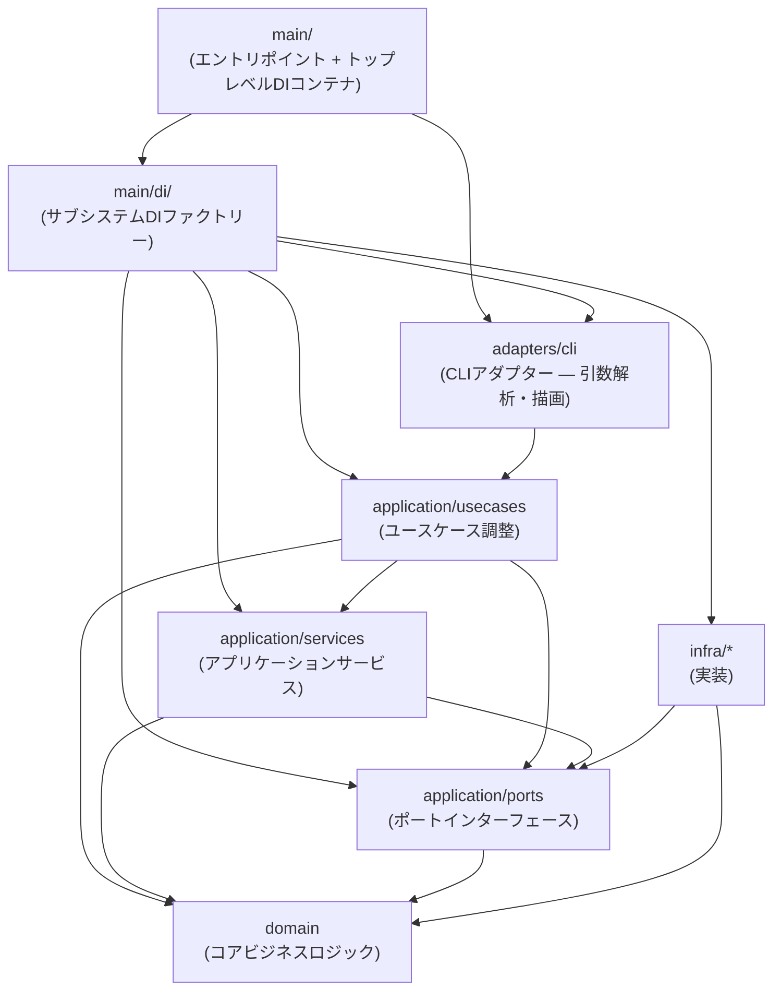

<!-- SSOT: クリーンアーキテクチャのレイヤー依存関係図（Mermaid）。
     Included by:
       docs/architecture/architecture.md,
       docs/ja/architecture/architecture.md
     Edit only this file when the diagram changes. -->

<!-- 依存関係の方向: infra ──► adapters ──► application ──► domain
     図中の矢印はコンパイル時のインポート依存関係を表します。
     レイヤーごとの詳細ルールは src-dependency-direction-ja.md を参照してください。 -->

矢印はコンパイル時のインポート依存関係を表します。各レイヤーは厳格な責務を持ちます。
