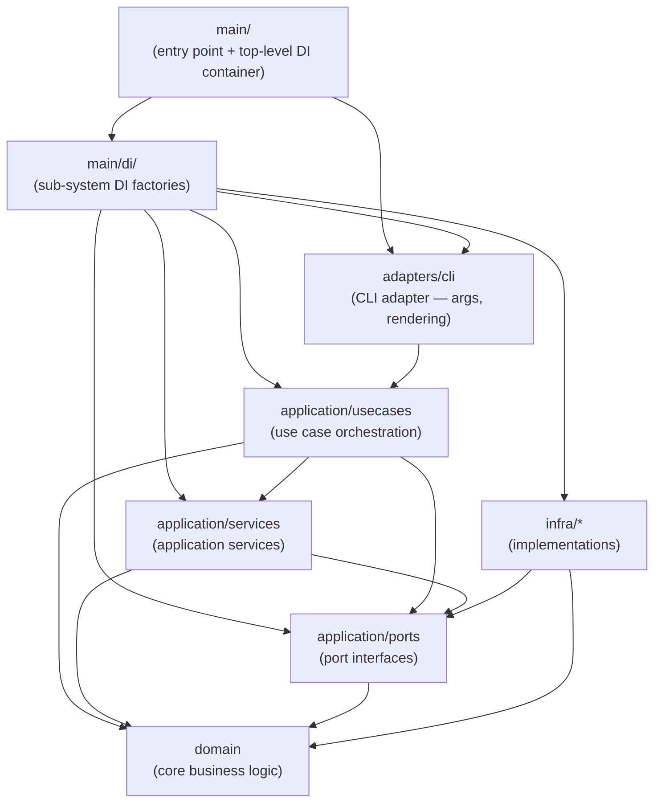

<!-- SSOT: Clean Architecture layer dependency diagram (Mermaid).
     Included by:
       docs/architecture/architecture.md,
       docs/ja/architecture/architecture.md
     Edit only this file when the diagram changes. -->

<!-- Dependency direction: infra ──► adapters ──► application ──► domain
     Arrows in the diagram represent compile-time import dependencies.
     For the full per-layer rules, see src-dependency-direction.md. -->

Arrows represent compile-time import dependencies. Each layer has strict responsibilities.
