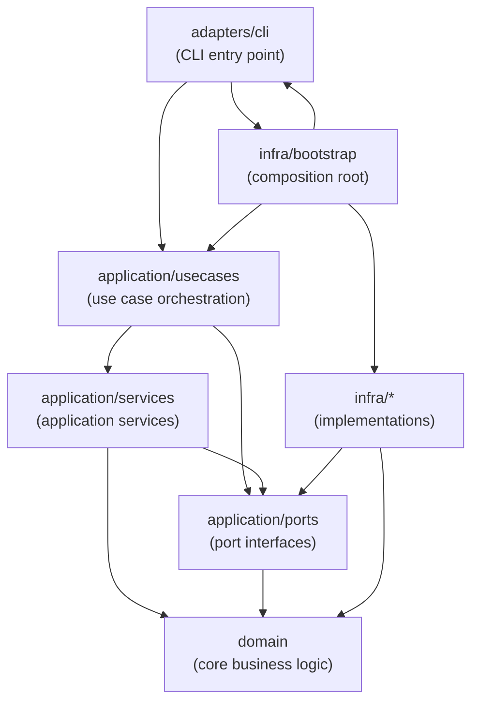

# Architecture

## Overview

Autonomous Engineer is designed as a modular system that orchestrates AI-driven software development workflows.

The architecture emphasizes:

- modularity
- clear boundaries
- extensibility
- minimal coupling
- provider abstraction

The system follows principles inspired by **Clean Architecture** and **Hexagonal Architecture**, allowing core logic to remain independent from external tools and providers.

This ensures that the system can evolve without major architectural rewrites.

---

## Architectural Principles

The architecture follows several guiding principles.

### Separation of Concerns

Each module should have a clearly defined responsibility.

Examples:

- workflow orchestration
- specification generation
- task execution
- AI interaction
- repository management

Modules should not take on responsibilities outside their domain.

---

### Dependency Inversion

Core system logic must not depend directly on infrastructure implementations.

Instead, dependencies should be defined as interfaces and implemented by adapters.

For example:

```
Core Logic
↓
Interfaces
↓
Adapters
↓
External Systems
```

External systems include:

- AI providers
- Git repositories
- SDD frameworks
- file systems

---

### Replaceable Infrastructure

Infrastructure components must be replaceable without changing core logic.

Examples:

- different LLM providers
- different specification systems
- different memory backends

---

### Minimal Context Surfaces

AI interactions should receive only the minimal necessary context.

This improves reasoning quality and reduces token consumption.

---

## Clean Architecture

The system is organized into several layers.



Arrows represent compile-time import dependencies. Each layer has strict responsibilities.

### Dependency Inversion and Why Infra → Ports Is Not Circular

`infra/*` (non-bootstrap) imports from `application/ports` to know **which interfaces to implement**. `application` never imports from `infra`. The dependency is strictly one-directional:

```
Compile-time:  usecase → ports ← infra   (both depend on ports; neither on the other)
Runtime (DI):  usecase → [port] → infra-impl   (bootstrap wires them together)
```

`infra/bootstrap` is the only module that knows both sides and performs the wiring. This is the Dependency Inversion Principle: high-level policy (`usecases`) and low-level details (`infra`) both depend on the abstraction (`ports`), not on each other.

### Application Layer: Usecases vs Services

The `application/` layer has two distinct sub-layers:

| Sub-layer | Role | Examples |
|-----------|------|---------|
| `usecases/` | Thin entry-point orchestrators for a specific user-facing operation | `RunSpecUseCase` |
| `services/` | Reusable coordination logic supporting multiple usecases; encodes application-level policy but not domain rules | `AgentLoopService`, `ToolExecutor`, `SafetyGuardedToolExecutor`, `ContextEngineService` |

Services contain logic that is too complex for a single use case class but does not belong in the domain (it is not domain logic — it depends on port abstractions such as `ILlmProvider` or `IToolRegistry`). Services may depend on ports and domain; usecases may depend on services and ports.

### Use Case Layer

The Use Case Layer encodes application-specific business rules and orchestrates development workflows.

In this system, workflow orchestration (driving phases such as spec-init → requirements → design → tasks → implementation) is itself a use case concern — it coordinates domain entities to fulfill application goals without depending on UI, frameworks, or external systems.

Responsibilities:

- orchestrate development lifecycle phases
- coordinate domain entities to fulfill a single application goal
- enforce business constraints specific to each use case
- remain independent of UI, frameworks, and external systems

Examples:

- `RunSpecUseCase` — drives the full spec initialization → implementation workflow

Use cases depend only on port interfaces and application services at the code level, never importing from adapter or infrastructure packages directly. At runtime, concrete infrastructure implementations are injected via dependency injection through `infra/bootstrap`.

---

## Core Modules

The Domain Layer contains the core system modules.

### Workflow Engine

Responsible for orchestrating the development lifecycle.

Key responsibilities:

- phase transitions
- execution coordination
- workflow state management

Example phases:

```
spec-init
requirements
design
validate-design
tasks
implementation
pull-request
```

The workflow engine operates as a **state machine**.

---

### Spec Engine

Handles interactions with specification frameworks.

Responsibilities:

- initialize specifications
- generate requirements
- create designs
- validate designs
- generate tasks

The spec engine does not directly depend on any specific framework.

---

### Implementation Engine

Responsible for executing generated tasks.

Each task is processed through an iterative loop.

```
Implement
↓
Review
↓
Improve
↓
Commit
```

This loop continues until the task satisfies quality conditions.

---

### Review Engine

Evaluates artifacts generated during the workflow.

Examples include:

- design validation
- code review
- architecture consistency checks
- requirement compliance

The review engine ensures outputs remain aligned with specifications.

---

### Self-Healing Engine

Analyzes cases where AI execution fails or becomes inefficient.

Responsibilities:

- failure analysis
- identifying missing rules
- updating system knowledge

Outputs may include updates to:

```
rules/
implementation_rules.md
review_rules.md
debugging_patterns.md
```

This enables long-term system improvement.

---

## Adapter Pattern

External integrations are implemented using adapters.

Adapters translate core system operations into provider-specific implementations.

Example structure:

```
SpecEngine Interface

├── CCSddAdapter
├── OpenSpecAdapter
└── SpecKitAdapter
```

Similarly for AI providers:

```
LLMProvider Interface

├── ClaudeProvider
├── CodexProvider
├── CursorProvider
└── CopilotProvider
```

This ensures the core system remains independent of external technologies.

---

## Workflow Architecture

Workflows are deterministic and phase-based.

Example workflow:

```
SPEC_INIT
↓
REQUIREMENTS
↓
DESIGN
↓
VALIDATE_DESIGN
↓
TASK_GENERATION
↓
IMPLEMENTATION
↓
PULL_REQUEST
```

Each phase invokes specific engines.

Example mapping:

```
SPEC_INIT → Spec Engine
REQUIREMENTS → Spec Engine
DESIGN → Spec Engine
TASKS → Spec Engine
IMPLEMENTATION → Implementation Engine
REVIEW → Review Engine
```

The workflow engine controls transitions and ensures correct ordering.

---

## Memory Architecture Integration

The system integrates persistent memory for learning and context reuse.

Memory is divided into several layers.

### Short-Term Memory

Used during a single workflow execution.

Examples:

- current spec
- current tasks
- design artifacts

---

### Project Memory

Knowledge specific to the repository.

Examples:

- coding conventions
- architectural patterns
- review feedback

---

### Knowledge Memory

Reusable patterns discovered during development.

Examples:

- debugging strategies
- implementation templates
- rule improvements

Memory enables the system to evolve over time.

---

## LLM Integration

AI models are accessed through the LLM Provider interface.

The provider abstraction manages:

- prompt execution
- response parsing
- context control
- provider-specific APIs

Example interface:

```
LLMProvider

complete(prompt)
clearContext()
```

This design ensures that different AI systems can be used without changing core logic.

---

## Context Management

Effective context management is critical for LLM reliability.

The system enforces several strategies.

### Phase Isolation

Context is reset when entering a new workflow phase.

### Task Isolation

Each task section runs with minimal context.

### Artifact Injection

Only relevant documents are included in prompts.

Examples:

- spec documents
- design documents
- relevant source files

These strategies minimize token consumption and reduce reasoning errors.

---

## Git Integration

Git operations are performed through a dedicated controller.

Responsibilities include:

- branch creation
- committing changes
- pushing updates
- pull request creation

Example automated flow:

```
create feature branch
implement tasks
commit changes
push branch
create pull request
```

This enables end-to-end automated development workflows.

---

## Rust Integration

Certain components may require higher performance than JavaScript environments provide.

Rust may be used for:

- memory indexing
- semantic search
- context diffing
- knowledge retrieval

Rust modules can be integrated using:

- napi-rs
- WebAssembly

Example architecture:

```
TypeScript Core
│
▼
Rust Memory Engine
```

This allows performance-critical operations to scale efficiently.

---

## Extensibility

The architecture is designed for long-term extensibility.

Future extensions may include:

### Multi-Agent Systems

Different agents specializing in different tasks.

Examples:

- Planning Agent
- Architecture Agent
- Implementation Agent
- Review Agent

---

### Advanced Memory Systems

Future versions may include:

- vector databases
- semantic knowledge graphs
- automated pattern extraction

---

### Workflow Variants

Different development methodologies may be supported.

Examples:

- test-driven workflows
- research workflows
- infrastructure automation

---

## Directory Structure

The project follows a modular directory structure organized by implementation boundary.

### Naming Convention

Implementation directories are named `<responsibility>-<lang-suffix>`:

- The prefix reflects the domain responsibility of that component
- The suffix reflects the implementation language (`-ts`, `-rs`, `-rb`, etc.)

This convention makes technology boundaries explicit for both developers and AI agents without burying the semantic meaning in the language name alone.

Examples:
- `orchestrator-ts/` — the workflow orchestration engine, implemented in TypeScript
- `memory-rs/` — a future memory indexing/search component, to be implemented in Rust

### Current Structure

```
autonomous-engineer/
├─ orchestrator-ts/          # Workflow orchestration engine + aes CLI (TypeScript/Bun)
│  │
│  ├─ src/
│  │  ├─ adapters/
│  │  │  └─ cli/             # CLI entry point (thin — parse args, call use case, render output)
│  │  │
│  │  ├─ application/
│  │  │  ├─ usecases/        # Top-level entrypoints for application actions (e.g. run-spec.ts)
│  │  │  ├─ services/        # Reusable orchestration logic (agent, context, git, safety, tools…)
│  │  │  └─ ports/           # Abstract interface definitions (llm, memory, sdd, workflow…)
│  │  │
│  │  ├─ domain/
│  │  │  ├─ agent/
│  │  │  ├─ context/
│  │  │  ├─ debug/
│  │  │  ├─ git/
│  │  │  ├─ implementation-loop/
│  │  │  ├─ planning/
│  │  │  ├─ safety/
│  │  │  ├─ self-healing/
│  │  │  ├─ tools/
│  │  │  └─ workflow/
│  │  │
│  │  └─ infra/
│  │     ├─ bootstrap/       # Composition root — wires the full object graph
│  │     ├─ config/          # Config loading and SDD framework detection
│  │     ├─ events/          # Concrete event bus implementations
│  │     ├─ git/             # Git controller adapter and GitHub PR adapter
│  │     ├─ implementation-loop/
│  │     ├─ logger/          # Consolidated logger classes (DebugLogWriter, NdjsonLogger…)
│  │     ├─ llm/             # Claude provider, mock LLM provider
│  │     ├─ memory/          # File-backed and in-memory stores
│  │     ├─ planning/        # Plan file store
│  │     ├─ safety/          # Approval gateway, sandbox executor
│  │     ├─ sdd/             # Claude Code SDD adapter, mock SDD adapter
│  │     ├─ self-healing/    # Self-healing loop service factory
│  │     ├─ state/           # Workflow state store
│  │     ├─ tools/           # Shell, filesystem, git, code-analysis tool implementations
│  │     └─ utils/           # Shared low-level utilities (errors, fs, ndjson)
│  │
│  ├─ tests/
│  ├─ package.json
│  └─ tsconfig.json
│
├─ docs/
│  ├─ architecture/
│  ├─ agent/
│  ├─ workflow/
│  ├─ memory/
│  └─ development/
│
├─ .kiro/
│  ├─ specs/
│  └─ steering/
│
└─ README.md
```

### Structure Philosophy

Each implementation directory (`*-ts`, `*-rs`, etc.) is a self-contained component with its own toolchain, dependencies, and internal architecture. Within `orchestrator-ts/src/`, the directory structure maps directly to Clean Architecture layers:

- `adapters/cli/` is the inbound delivery adapter — the CLI entry point
- `application/` is the application layer, grouped into three concerns:
  - `usecases/` — application business rules and workflow orchestration
  - `services/` — reusable coordination logic supporting multiple use cases
  - `ports/` — input/output port definitions (interfaces required by the application)
- `domain/` contains core domain logic independent of all external concerns
- `infra/` provides concrete infrastructure implementations (git, LLM, filesystem, logging, etc.) and the composition root (`infra/bootstrap/`)
- `infra/utils/` holds shared low-level utilities used across infra sub-directories only
- `docs/` provides architectural knowledge for both developers and AI agents

This structure allows the system to evolve while keeping the core logic independent from external dependencies.

---

## Summary

The architecture of Autonomous Engineer focuses on:

- modular design
- strict boundaries
- provider abstraction
- workflow determinism
- AI orchestration
- persistent learning

This architecture allows the system to evolve from a **single AI development agent** into a **fully autonomous engineering platform** capable of managing complex software systems.
