# Orchestrator-TS Architecture: Class Diagrams

## Overview

The `orchestrator-ts` system is structured around Clean Architecture with four layers: **domain** (pure business rules), **application** (ports + services), **infra** (concrete implementations), and **adapters** (CLI delivery). All inter-layer communication goes through abstract port interfaces defined in `application/ports/`. Services in `application/services/` hold the business logic and depend only on ports; infrastructure classes in `infra/` implement those ports with concrete technology choices.

The five diagrams below partition the architecture by concern. Each interface carries `<<interface>>` and each domain value object carries `<<type>>`. Dependency arrows are labeled to distinguish `implements` relationships from runtime `uses` (composition) relationships.

---

## Diagram 1: Core Ports and Their Infrastructure Implementations

This diagram shows every abstract port in `application/ports/` together with its concrete infra implementation(s). The left column holds the port interfaces; arrows point right to the classes that satisfy them.

```mermaid
classDiagram
    %% ── Core execution ports ─────────────────────────────────────────────────

    class LlmProviderPort {
        <<interface>>
        +complete(prompt, options?) Promise~LlmResult~
        +clearContext() void
    }
    class ClaudeProvider {
        +complete(prompt, options?) Promise~LlmResult~
        +clearContext() void
    }
    class MockLlmProvider {
        +complete(prompt, options?) Promise~LlmResult~
        +clearContext() void
    }
    ClaudeProvider ..|> LlmProviderPort : implements
    MockLlmProvider ..|> LlmProviderPort : implements

    %% ── Logger port ──────────────────────────────────────────────────────────

    class ILogger {
        <<interface>>
        +debug(message, context?) void
        +info(message, context?) void
        +warn(message, context?) void
        +error(message, context?) void
    }
    class ConsoleLogger {
        +debug(message, context?) void
        +info(message, context?) void
        +warn(message, context?) void
        +error(message, context?) void
    }
    class NdjsonFileLogger {
        +debug(message, context?) void
        +info(message, context?) void
        +warn(message, context?) void
        +error(message, context?) void
    }
    class JsonLogWriter {
        +debug(message, context?) void
        +info(message, context?) void
        +warn(message, context?) void
        +error(message, context?) void
    }
    ConsoleLogger ..|> ILogger : implements
    NdjsonFileLogger ..|> ILogger : implements
    JsonLogWriter ..|> ILogger : implements

    class IAuditLogger {
        <<interface>>
        +write(entry AuditEntry) Promise~void~
        +flush() Promise~void~
    }
    class AuditLogger {
        +write(entry AuditEntry) Promise~void~
        +flush() Promise~void~
    }
    AuditLogger ..|> IAuditLogger : implements
    AuditLogger ..|> ILogger : implements

    %% ── Memory port ──────────────────────────────────────────────────────────

    class MemoryPort {
        <<interface>>
        +shortTerm ShortTermMemoryPort
        +query(query) Promise~MemoryQueryResult~
        +append(target, entry, trigger) Promise~MemoryWriteResult~
        +update(target, title, entry) Promise~MemoryWriteResult~
        +writeFailure(record) Promise~MemoryWriteResult~
        +getFailures(filter?) Promise~FailureRecord[]~
    }
    class FileMemoryStore {
        +shortTerm ShortTermMemoryPort
        +query(query) Promise~MemoryQueryResult~
        +append(target, entry, trigger) Promise~MemoryWriteResult~
        +update(target, title, entry) Promise~MemoryWriteResult~
        +writeFailure(record) Promise~MemoryWriteResult~
        +getFailures(filter?) Promise~FailureRecord[]~
    }
    FileMemoryStore ..|> MemoryPort : implements

    %% ── Agent loop port ──────────────────────────────────────────────────────

    class IAgentLoop {
        <<interface>>
        +run(task, options?) Promise~AgentLoopResult~
        +stop() void
        +getState() AgentState | null
    }
    class AgentLoopService {
        +run(task, options?) Promise~AgentLoopResult~
        +stop() void
        +getState() AgentState | null
    }
    AgentLoopService ..|> IAgentLoop : implements

    %% ── Context engine port ──────────────────────────────────────────────────

    class IContextEngine {
        <<interface>>
        +buildContext(request) Promise~ContextAssemblyResult~
        +expandContext(request) Promise~ExpansionResult~
        +resetPhase(phaseId) void
        +resetTask(taskId) void
    }
    class ContextEngineService {
        +buildContext(request) Promise~ContextAssemblyResult~
        +expandContext(request) Promise~ExpansionResult~
        +resetPhase(phaseId) void
        +resetTask(taskId) void
    }
    ContextEngineService ..|> IContextEngine : implements

    %% ── Tool executor port ───────────────────────────────────────────────────

    class IToolExecutor {
        <<interface>>
        +invoke(name, rawInput, context) Promise~ToolResult~
    }
    class ToolExecutor {
        +invoke(name, rawInput, context) Promise~ToolResult~
    }
    ToolExecutor ..|> IToolExecutor : implements

    %% ── Workflow event/state ports ───────────────────────────────────────────

    class IWorkflowStateStore {
        <<interface>>
        +persist(state) Promise~void~
        +restore(specName) Promise~WorkflowState | null~
        +init(specName) WorkflowState
    }
    class WorkflowStateStore {
        +persist(state) Promise~void~
        +restore(specName) Promise~WorkflowState | null~
        +init(specName) WorkflowState
    }
    WorkflowStateStore ..|> IWorkflowStateStore : implements

    class IWorkflowEventBus {
        <<interface>>
        +emit(event WorkflowEvent) void
        +on(handler) void
        +off(handler) void
    }
    class WorkflowEventBus {
        +emit(event WorkflowEvent) void
        +on(handler) void
        +off(handler) void
    }
    WorkflowEventBus ..|> IWorkflowEventBus : implements

    %% ── Git ports ────────────────────────────────────────────────────────────

    class IGitController {
        <<interface>>
        +listBranches() Promise~GitResult~
        +detectChanges() Promise~GitResult~
        +createAndCheckoutBranch(name, base) Promise~GitResult~
        +stageAndCommit(files, message) Promise~GitResult~
        +push(branch, remote) Promise~GitResult~
    }
    class GitControllerAdapter {
        +listBranches() Promise~GitResult~
        +detectChanges() Promise~GitResult~
        +createAndCheckoutBranch(name, base) Promise~GitResult~
        +stageAndCommit(files, message) Promise~GitResult~
        +push(branch, remote) Promise~GitResult~
    }
    GitControllerAdapter ..|> IGitController : implements

    class IGitEventBus {
        <<interface>>
        +emit(event) void
        +on(handler) void
        +off(handler) void
    }
    class GitEventBus {
        +emit(event) void
        +on(handler) void
        +off(handler) void
    }
    GitEventBus ..|> IGitEventBus : implements

    %% ── Safety ports ─────────────────────────────────────────────────────────

    class IApprovalGateway {
        <<interface>>
        +requestApproval(request, timeoutMs) Promise~ApprovalDecision~
    }
    class ApprovalGateway {
        +requestApproval(request, timeoutMs) Promise~ApprovalDecision~
    }
    ApprovalGateway ..|> IApprovalGateway : implements

    class ISandboxExecutor {
        <<interface>>
        +execute(request, timeoutMs) Promise~SandboxExecutionResult~
    }
    class TempDirSandboxExecutor {
        +execute(request, timeoutMs) Promise~SandboxExecutionResult~
    }
    TempDirSandboxExecutor ..|> ISandboxExecutor : implements

    class IEmergencyStopHandler {
        <<interface>>
        +register(session, auditLogger) void
        +trigger(source) Promise~void~
        +deregister() void
    }
    class EmergencyStopHandler {
        +register(session, auditLogger) void
        +trigger(source) Promise~void~
        +deregister() void
    }
    EmergencyStopHandler ..|> IEmergencyStopHandler : implements

    %% ── SDD and Framework ports ──────────────────────────────────────────────

    class SddFrameworkPort {
        <<interface>>
        +executeCommand(commandName, ctx) Promise~SddOperationResult~
    }
    class CcSddAdapter {
        +executeCommand(commandName, ctx) Promise~SddOperationResult~
    }
    class MockSddAdapter {
        +executeCommand(commandName, ctx) Promise~SddOperationResult~
    }
    CcSddAdapter ..|> SddFrameworkPort : implements
    MockSddAdapter ..|> SddFrameworkPort : implements

    class FrameworkDefinitionPort {
        <<interface>>
        +load(frameworkId) Promise~FrameworkDefinition~
    }
    class YamlWorkflowDefinitionLoader {
        +load(frameworkId) Promise~FrameworkDefinition~
    }
    YamlWorkflowDefinitionLoader ..|> FrameworkDefinitionPort : implements

    %% ── Implementation loop ports ────────────────────────────────────────────

    class IImplementationLoop {
        <<interface>>
        +run(planId, options?) Promise~ImplementationLoopResult~
        +resume(planId, options?) Promise~ImplementationLoopResult~
        +stop() void
    }
    class ImplementationLoopService {
        +run(planId, options?) Promise~ImplementationLoopResult~
        +resume(planId, options?) Promise~ImplementationLoopResult~
        +stop() void
    }
    ImplementationLoopService ..|> IImplementationLoop : implements

    class IReviewEngine {
        <<interface>>
        +review(result, section, config) Promise~ReviewResult~
    }
    class LlmReviewEngineService {
        +review(result, section, config) Promise~ReviewResult~
    }
    LlmReviewEngineService ..|> IReviewEngine : implements

    class IQualityGate {
        <<interface>>
        +run(config QualityGateConfig) Promise~ReviewCheckResult[]~
    }
    class QualityGateRunner {
        +run(config QualityGateConfig) Promise~ReviewCheckResult[]~
    }
    QualityGateRunner ..|> IQualityGate : implements

    class ISelfHealingLoop {
        <<interface>>
        +escalate(escalation) Promise~SelfHealingResult~
    }
    class SelfHealingLoopService {
        +escalate(escalation) Promise~SelfHealingResult~
    }
    SelfHealingLoopService ..|> ISelfHealingLoop : implements

    %% ── Planning ports ───────────────────────────────────────────────────────

    class ITaskPlanner {
        <<interface>>
        +run(goal, options?) Promise~TaskPlanResult~
        +resume(planId, options?) Promise~TaskPlanResult~
        +listResumable() Promise~string[]~
        +stop() void
    }
    class TaskPlanningService {
        +run(goal, options?) Promise~TaskPlanResult~
        +resume(planId, options?) Promise~TaskPlanResult~
        +listResumable() Promise~string[]~
        +stop() void
    }
    TaskPlanningService ..|> ITaskPlanner : implements
```

---

## Diagram 2: Agent and Workflow Subsystem

This diagram shows how the `WorkflowEngine` drives phase execution through `PhaseRunner`, how `AgentLoopService` implements the PLAN→ACT→OBSERVE→REFLECT loop, and which domain types and optional ports flow through each class.

```mermaid
classDiagram
    %% ── Domain types ─────────────────────────────────────────────────────────

    class AgentState {
        <<type>>
        +task string
        +plan ActionPlan | null
        +completedSteps ReadonlyArray~string~
        +currentStep string | null
        +iterationCount number
        +observations ReadonlyArray~Observation~
        +recoveryAttempts number
        +startedAt string
    }

    class ActionPlan {
        <<type>>
        +category ActionCategory
        +toolName string
        +toolInput unknown
        +rationale string
    }

    class ReflectionOutput {
        <<type>>
        +assessment ReflectionAssessment
        +learnings string
        +planAdjustment PlanAdjustment
        +taskComplete boolean
        +summary string
    }

    class TerminationCondition {
        <<type>>
        TASK_COMPLETED
        MAX_ITERATIONS_REACHED
        HUMAN_INTERVENTION_REQUIRED
        SAFETY_STOP
        RECOVERY_EXHAUSTED
    }

    class WorkflowState {
        <<type>>
        +specName string
        +currentPhase WorkflowPhase
        +completedPhases ReadonlyArray~WorkflowPhase~
        +status string
        +failureDetail object | null
        +startedAt string
        +updatedAt string
    }

    class FrameworkDefinition {
        <<type>>
        +id string
        +phases ReadonlyArray~PhaseDefinition~
    }

    class PhaseDefinition {
        <<type>>
        +phase string
        +type PhaseExecutionType
        +content string
        +requiredArtifacts ReadonlyArray~string~
        +approvalGate ApprovalPhase?
        +outputFile string?
        +loopPhases ReadonlyArray~LoopPhaseDefinition~?
    }

    class LoopPhaseDefinition {
        <<type>>
        +phase string
        +type LoopPhaseExecutionType
        +content string
    }

    FrameworkDefinition *-- PhaseDefinition : contains
    PhaseDefinition *-- LoopPhaseDefinition : optional sub-phases

    %% ── Ports used by this subsystem ─────────────────────────────────────────

    class IAgentLoop {
        <<interface>>
        +run(task, options?) Promise~AgentLoopResult~
        +stop() void
        +getState() AgentState | null
    }

    class IContextProvider {
        <<interface>>
        +buildContext(state, toolSchemas) Promise~string~
    }

    class IAgentEventBus {
        <<interface>>
        +emit(event AgentLoopEvent) void
        +on(handler) void
        +off(handler) void
    }

    class IWorkflowStateStore {
        <<interface>>
        +persist(state) Promise~void~
        +restore(specName) Promise~WorkflowState | null~
        +init(specName) WorkflowState
    }

    class IWorkflowEventBus {
        <<interface>>
        +emit(event WorkflowEvent) void
        +on(handler) void
        +off(handler) void
    }

    class SddFrameworkPort {
        <<interface>>
        +executeCommand(commandName, ctx) Promise~SddOperationResult~
    }

    class LlmProviderPort {
        <<interface>>
        +complete(prompt, options?) Promise~LlmResult~
        +clearContext() void
    }

    class IImplementationLoop {
        <<interface>>
        +run(planId, options?) Promise~ImplementationLoopResult~
        +resume(planId, options?) Promise~ImplementationLoopResult~
        +stop() void
    }

    class IToolExecutor {
        <<interface>>
        +invoke(name, rawInput, context) Promise~ToolResult~
    }

    class IToolRegistry {
        <<interface>>
        +list() ReadonlyArray~ToolListEntry~
        +get(name) Tool | null
    }

    %% ── Service classes ──────────────────────────────────────────────────────

    class AgentLoopService {
        -llm LlmProviderPort
        -executor IToolExecutor
        -registry IToolRegistry
        +run(task, options?) Promise~AgentLoopResult~
        +stop() void
        +getState() AgentState | null
    }
    AgentLoopService ..|> IAgentLoop : implements
    AgentLoopService --> LlmProviderPort : uses
    AgentLoopService --> IToolExecutor : uses
    AgentLoopService --> IToolRegistry : uses
    AgentLoopService --> IContextProvider : optional
    AgentLoopService --> IAgentEventBus : optional
    AgentLoopService --> AgentState : manages
    AgentLoopService --> ActionPlan : produces
    AgentLoopService --> ReflectionOutput : produces
    AgentLoopService --> TerminationCondition : returns

    class WorkflowEngine {
        -stateStore IWorkflowStateStore
        -eventBus IWorkflowEventBus
        -phaseRunner PhaseRunner
        -frameworkDefinition FrameworkDefinition
        -specDir string
        -language string
        +execute(state) Promise~WorkflowResult~
        +getState() WorkflowState
    }
    WorkflowEngine --> IWorkflowStateStore : uses
    WorkflowEngine --> IWorkflowEventBus : uses
    WorkflowEngine --> PhaseRunner : delegates to
    WorkflowEngine --> FrameworkDefinition : driven by
    WorkflowEngine --> WorkflowState : manages

    class PhaseRunner {
        -sdd SddFrameworkPort
        -llm LlmProviderPort
        -frameworkDefinition FrameworkDefinition
        -implementationLoop IImplementationLoop?
        +execute(phase, ctx) Promise~PhaseResult~
        +onEnter(phase) Promise~void~
        +onExit(phase) Promise~void~
    }
    PhaseRunner --> SddFrameworkPort : uses
    PhaseRunner --> LlmProviderPort : uses
    PhaseRunner --> IImplementationLoop : optional
    PhaseRunner --> FrameworkDefinition : reads
    PhaseRunner --> LoopPhaseDefinition : passes to loop
```

---

## Diagram 3: Implementation Loop Subsystem

This diagram covers the `ImplementationLoopService` and all of its dependencies: the agent loop it drives, the review engine, the quality gate, the plan store, the self-healing loop, the git controller, and the optional observability ports. Domain record types that flow through the loop are also shown.

```mermaid
classDiagram
    %% ── Domain record types ──────────────────────────────────────────────────

    class ReviewResult {
        <<type>>
        +outcome ReviewOutcome
        +checks ReadonlyArray~ReviewCheckResult~
        +feedback string
        +durationMs number
    }

    class ReviewCheckResult {
        <<type>>
        +checkName string
        +outcome ReviewOutcome
        +required boolean
        +details string
    }

    class SectionExecutionRecord {
        <<type>>
        +sectionId string
        +planId string
        +title string
        +status SectionExecutionStatus
        +retryCount number
        +iterations ReadonlyArray~SectionIterationRecord~
        +startedAt string
        +completedAt string?
        +commitSha string?
    }

    class SectionIterationRecord {
        <<type>>
        +iterationNumber number
        +reviewResult ReviewResult
        +improvePrompt string?
        +durationMs number
        +timestamp string
    }

    class SectionEscalation {
        <<type>>
        +sectionId string
        +planId string
        +retryHistory ReadonlyArray~SectionIterationRecord~
        +reviewFeedback string
        +agentObservations string
    }

    SectionExecutionRecord *-- SectionIterationRecord : iterations

    %% ── Ports ────────────────────────────────────────────────────────────────

    class IImplementationLoop {
        <<interface>>
        +run(planId, options?) Promise~ImplementationLoopResult~
        +resume(planId, options?) Promise~ImplementationLoopResult~
        +stop() void
    }

    class IAgentLoop {
        <<interface>>
        +run(task, options?) Promise~AgentLoopResult~
        +stop() void
        +getState() AgentState | null
    }

    class IReviewEngine {
        <<interface>>
        +review(result, section, config) Promise~ReviewResult~
    }

    class IQualityGate {
        <<interface>>
        +run(config QualityGateConfig) Promise~ReviewCheckResult[]~
    }

    class IPlanStore {
        <<interface>>
        +loadPlan(planId) Promise~TaskPlan | null~
        +updateSectionStatus(planId, sectionId, status) Promise~void~
    }

    class IGitController {
        <<interface>>
        +listBranches() Promise~GitResult~
        +detectChanges() Promise~GitResult~
        +createAndCheckoutBranch(name, base) Promise~GitResult~
        +stageAndCommit(files, message) Promise~GitResult~
        +push(branch, remote) Promise~GitResult~
    }

    class ISelfHealingLoop {
        <<interface>>
        +escalate(escalation SectionEscalation) Promise~SelfHealingResult~
    }

    class IImplementationLoopLogger {
        <<interface>>
        +logIteration(entry) void
        +logSectionComplete(record) void
        +logHaltSummary(summary) void
    }

    class IImplementationLoopEventBus {
        <<interface>>
        +emit(event ImplementationLoopEvent) void
    }

    class IContextEngine {
        <<interface>>
        +buildContext(request) Promise~ContextAssemblyResult~
        +expandContext(request) Promise~ExpansionResult~
        +resetPhase(phaseId) void
        +resetTask(taskId) void
    }

    class IAgentEventBus {
        <<interface>>
        +emit(event) void
        +on(handler) void
        +off(handler) void
    }

    class SddFrameworkPort {
        <<interface>>
        +executeCommand(commandName, ctx) Promise~SddOperationResult~
    }

    class LlmProviderPort {
        <<interface>>
        +complete(prompt, options?) Promise~LlmResult~
        +clearContext() void
    }

    class IToolExecutor {
        <<interface>>
        +invoke(name, rawInput, context) Promise~ToolResult~
    }

    %% ── Service implementations ───────────────────────────────────────────────

    class ImplementationLoopService {
        -agentLoop IAgentLoop
        -reviewEngine IReviewEngine
        -qualityGate IQualityGate
        -planStore IPlanStore
        -gitController IGitController
        +run(planId, options?) Promise~ImplementationLoopResult~
        +resume(planId, options?) Promise~ImplementationLoopResult~
        +stop() void
    }
    ImplementationLoopService ..|> IImplementationLoop : implements
    ImplementationLoopService --> IAgentLoop : drives
    ImplementationLoopService --> IReviewEngine : evaluates with
    ImplementationLoopService --> IQualityGate : runs checks via
    ImplementationLoopService --> IPlanStore : reads/writes plan
    ImplementationLoopService --> IGitController : commits via
    ImplementationLoopService --> ISelfHealingLoop : optional escalation
    ImplementationLoopService --> IImplementationLoopLogger : optional logging
    ImplementationLoopService --> IImplementationLoopEventBus : optional events
    ImplementationLoopService --> IContextEngine : optional context isolation
    ImplementationLoopService --> IAgentEventBus : optional forwarding
    ImplementationLoopService --> SddFrameworkPort : optional loop-phases
    ImplementationLoopService --> LlmProviderPort : optional loop-phases
    ImplementationLoopService --> SectionExecutionRecord : produces
    ImplementationLoopService --> SectionEscalation : produces on exhaustion

    class LlmReviewEngineService {
        -llm LlmProviderPort
        +review(result, section, config) Promise~ReviewResult~
    }
    LlmReviewEngineService ..|> IReviewEngine : implements
    LlmReviewEngineService --> LlmProviderPort : uses
    LlmReviewEngineService --> ReviewResult : returns

    class QualityGateRunner {
        -toolExecutor IToolExecutor
        -context ToolContext
        +run(config QualityGateConfig) Promise~ReviewCheckResult[]~
    }
    QualityGateRunner ..|> IQualityGate : implements
    QualityGateRunner --> IToolExecutor : runs shell commands via

    class SelfHealingLoopService {
        -llm LlmProviderPort
        -memory MemoryPort
        +escalate(escalation) Promise~SelfHealingResult~
    }
    SelfHealingLoopService ..|> ISelfHealingLoop : implements
    SelfHealingLoopService --> LlmProviderPort : analyzes with
    SelfHealingLoopService --> SectionEscalation : receives
```

---

## Diagram 4: Context Engine Subsystem

This diagram shows the `ContextEngineService` and its five sub-interfaces — token budget manager, accumulator, planner, compressor, and cache — together with the domain value types that flow through the 7-layer assembly pipeline.

```mermaid
classDiagram
    %% ── Domain types ─────────────────────────────────────────────────────────

    class LayerId {
        <<type>>
        systemInstructions
        taskDescription
        activeSpecification
        codeContext
        repositoryState
        memoryRetrieval
        toolResults
    }

    class StepType {
        <<type>>
        Exploration
        Modification
        Validation
    }

    class PlannerDecision {
        <<type>>
        +layersToRetrieve ReadonlyArray~LayerId~
        +codeContextQuery string?
        +memoryQuery string?
        +specSections string[]?
        +rationale string
    }

    class ContextBuildRequest {
        <<type>>
        +sessionId string
        +phaseId string
        +taskId string
        +stepType StepType
        +taskDescription string
        +previousToolResults ToolResultEntry[]?
        +modelTokenLimit number?
    }

    class ContextAssemblyResult {
        <<type>>
        +content string
        +layers ReadonlyArray~LayerContent~
        +totalTokens number
        +layerUsage ReadonlyArray~LayerTokenUsage~
        +plannerDecision PlannerDecision
        +degraded boolean
        +omittedLayers ReadonlyArray~LayerId~
    }

    %% ── Sub-interfaces ───────────────────────────────────────────────────────

    class IContextEngine {
        <<interface>>
        +buildContext(request) Promise~ContextAssemblyResult~
        +expandContext(request) Promise~ExpansionResult~
        +resetPhase(phaseId) void
        +resetTask(taskId) void
    }

    class IContextCache {
        <<interface>>
        +get(filePath, mtime) CachedEntry | null
        +set(entry CachedEntry) void
        +invalidate(filePath) void
        +stats() CacheStats
        +clear() void
    }

    class IContextAccumulator {
        <<interface>>
        +accumulate(entry AccumulatedEntry) void
        +getEntries(phaseId, taskId) ReadonlyArray~AccumulatedEntry~
        +recordExpansion(event) object
        +getExpansionEvents() ReadonlyArray~ExpansionEvent~
        +resetPhase(phaseId) void
        +resetTask(taskId) void
    }

    class IContextPlanner {
        <<interface>>
        +plan(stepType, taskDescription, toolResults) PlannerDecision
    }

    class ILayerCompressor {
        <<interface>>
        +compress(layerId, content, budget, tokenCounter) CompressionResult
    }

    class ITokenBudgetManager {
        <<interface>>
        +countTokens(text) number
        +allocate(config) LayerBudgetMap
        +checkBudget(content, budget) object
        +checkTotal(layerTokenCounts, totalBudget) number
    }

    class MemoryPort {
        <<interface>>
        +query(query) Promise~MemoryQueryResult~
        +append(target, entry, trigger) Promise~MemoryWriteResult~
    }

    class IToolExecutor {
        <<interface>>
        +invoke(name, rawInput, context) Promise~ToolResult~
    }

    %% ── Service implementation ────────────────────────────────────────────────

    class ContextEngineService {
        -cache IContextCache
        -accumulator IContextAccumulator
        -planner IContextPlanner
        -compressor ILayerCompressor
        -budgetManager ITokenBudgetManager
        -memory MemoryPort
        -toolExecutor IToolExecutor
        +buildContext(request) Promise~ContextAssemblyResult~
        +expandContext(request) Promise~ExpansionResult~
        +resetPhase(phaseId) void
        +resetTask(taskId) void
    }
    ContextEngineService ..|> IContextEngine : implements
    ContextEngineService --> IContextCache : cache lookups
    ContextEngineService --> IContextAccumulator : accumulates entries
    ContextEngineService --> IContextPlanner : decides layers
    ContextEngineService --> ILayerCompressor : compresses oversize layers
    ContextEngineService --> ITokenBudgetManager : budgets tokens
    ContextEngineService --> MemoryPort : retrieves memories
    ContextEngineService --> IToolExecutor : reads repo files
    ContextEngineService --> ContextBuildRequest : receives
    ContextEngineService --> ContextAssemblyResult : produces
    ContextEngineService --> PlannerDecision : uses

    IContextPlanner --> PlannerDecision : returns
    IContextPlanner --> StepType : takes
    ContextAssemblyResult --> LayerId : references
    ContextBuildRequest --> StepType : carries
```

---

## Diagram 5: Planning and Tools Subsystem

This diagram shows the `TaskPlanningService`, its sub-ports for plan persistence, context building, human review, and event emission, together with the `ToolExecutor` and the infra tool implementations it dispatches to.

```mermaid
classDiagram
    %% ── Domain types ─────────────────────────────────────────────────────────

    class TaskPlan {
        <<type>>
        +id string
        +goal string
        +tasks ReadonlyArray~Task~
        +createdAt string
        +updatedAt string
    }

    class Task {
        <<type>>
        +id string
        +title string
        +status string
        +steps ReadonlyArray~Step~
    }

    class Step {
        <<type>>
        +id string
        +description string
        +status string
        +dependsOn ReadonlyArray~string~
        +statusHistory ReadonlyArray~object~
    }

    class PlanReviewReason {
        <<type>>
        "large-plan"
        "high-risk-operations"
    }

    TaskPlan *-- Task : contains
    Task *-- Step : contains

    %% ── Planning ports ───────────────────────────────────────────────────────

    class ITaskPlanner {
        <<interface>>
        +run(goal, options?) Promise~TaskPlanResult~
        +resume(planId, options?) Promise~TaskPlanResult~
        +listResumable() Promise~string[]~
        +stop() void
    }

    class ITaskPlanStore {
        <<interface>>
        +save(plan TaskPlan) Promise~void~
        +load(planId) Promise~TaskPlan | null~
        +listResumable() Promise~string[]~
    }

    class IPlanContextBuilder {
        <<interface>>
        +buildPlanContext(goal, repositoryContext?) Promise~string~
        +buildRevisionContext(plan, failedStepId, summary) Promise~string~
    }

    class IHumanReviewGateway {
        <<interface>>
        +reviewPlan(plan, reason, timeoutMs) Promise~PlanReviewDecision~
    }

    class IPlanEventBus {
        <<interface>>
        +emit(event PlanEvent) void
        +on(handler) void
        +off(handler) void
    }

    class IAgentLoop {
        <<interface>>
        +run(task, options?) Promise~AgentLoopResult~
        +stop() void
        +getState() AgentState | null
    }

    class LlmProviderPort {
        <<interface>>
        +complete(prompt, options?) Promise~LlmResult~
        +clearContext() void
    }

    %% ── Tool ports ───────────────────────────────────────────────────────────

    class IToolExecutor {
        <<interface>>
        +invoke(name, rawInput, context) Promise~ToolResult~
    }

    class IToolRegistry {
        <<interface>>
        +list() ReadonlyArray~ToolListEntry~
        +get(name) Tool | null
    }

    class IPermissionSystem {
        <<interface>>
        +check(toolName, input) PermissionResult
    }

    %% ── Service implementations ───────────────────────────────────────────────

    class TaskPlanningService {
        -llm LlmProviderPort
        -agentLoop IAgentLoop
        -planStore ITaskPlanStore
        -contextBuilder IPlanContextBuilder
        -reviewGateway IHumanReviewGateway
        +run(goal, options?) Promise~TaskPlanResult~
        +resume(planId, options?) Promise~TaskPlanResult~
        +listResumable() Promise~string[]~
        +stop() void
    }
    TaskPlanningService ..|> ITaskPlanner : implements
    TaskPlanningService --> LlmProviderPort : generates plan with
    TaskPlanningService --> IAgentLoop : executes steps via
    TaskPlanningService --> ITaskPlanStore : persists plan to
    TaskPlanningService --> IPlanContextBuilder : assembles prompts via
    TaskPlanningService --> IHumanReviewGateway : gates large plans
    TaskPlanningService --> IPlanEventBus : optional events
    TaskPlanningService --> TaskPlan : produces/manages
    TaskPlanningService --> PlanReviewReason : uses to classify plans

    class ToolExecutor {
        -registry IToolRegistry
        -permissions IPermissionSystem
        +invoke(name, rawInput, context) Promise~ToolResult~
    }
    ToolExecutor ..|> IToolExecutor : implements
    ToolExecutor --> IToolRegistry : dispatches through
    ToolExecutor --> IPermissionSystem : enforces

    %% ── Infrastructure tool implementations ──────────────────────────────────

    class ShellTool {
        +name string
        +invoke(input, context) Promise~ToolResult~
    }
    class FilesystemTool {
        +name string
        +invoke(input, context) Promise~ToolResult~
    }
    class GitTool {
        +name string
        +invoke(input, context) Promise~ToolResult~
    }
    class CodeAnalysisTool {
        +name string
        +invoke(input, context) Promise~ToolResult~
    }
    class KnowledgeTool {
        +name string
        +invoke(input, context) Promise~ToolResult~
    }

    IToolRegistry --> ShellTool : registers
    IToolRegistry --> FilesystemTool : registers
    IToolRegistry --> GitTool : registers
    IToolRegistry --> CodeAnalysisTool : registers
    IToolRegistry --> KnowledgeTool : registers
```

