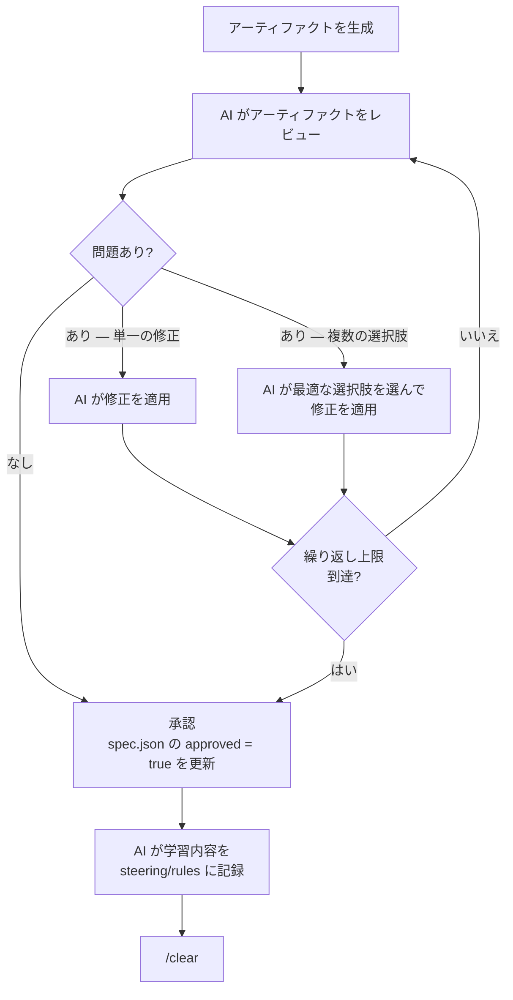
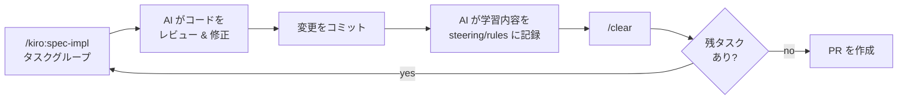

# 自動化ワークフロー

## 概要

このドキュメントでは、Autonomous Engineer システムにおけるユーザーと AI 駆動の自動化の役割分担を説明します。目標は日常的な開発作業を排除することです — ユーザーは開始時と終了時のみ関与し、AI がその間のすべてを処理します。

**ユーザーの関与箇所**: 初期コンテキスト準備 + 最終 PR レビュー。

**AI が自動化**: ブランチ作成、仕様生成、レビューループ、承認、実装、コミット、PR 作成。

---

## ワークフロー全体図

```mermaid
flowchart TD
    H1["👤 ユーザー: 前提ドキュメントを整理"] --> H2
    H2["👤 ユーザー: /kiro:spec-init + requirements.md の Project Description を編集"] --> BRANCH_CHECK

    subgraph AUTO ["🤖 自動化"]
        BRANCH_CHECK{フィーチャーブランチは\n既に存在する?}
        BRANCH_CHECK -->|いいえ| BRANCH_CREATE["フィーチャーブランチ作成\nfeature/spec-{spec-name}"]
        BRANCH_CHECK -->|はい| BRANCH_CONFIRM["確認: 既存ブランチで\n続行しますか? [Y/n]"]
        BRANCH_CREATE --> REQ
        BRANCH_CONFIRM --> REQ

        subgraph SPEC_PHASE ["仕様フェーズ"]
            REQ["/kiro:spec-requirements"] --> REQ_LOOP
            subgraph REQ_LOOP ["レビューループ（最大 N 回）"]
                REQ_R["AI が requirements.md をレビュー"] --> REQ_F["AI が問題を修正"]
                REQ_F --> REQ_R
            end
            REQ_LOOP --> REQ_OK["承認: spec.json\nrequirements.approved = true"]
            REQ_OK --> REQ_KNOW["AI が学習内容を\nsteering/rules に記録"]
            REQ_KNOW --> REQ_CLR["/clear"]

            REQ_CLR --> VAL_GAP["/kiro:validate-gap\n（オプション）"] --> DESIGN["/kiro:spec-design"] --> VAL_D["/kiro:validate-design"] --> DESIGN_LOOP
            subgraph DESIGN_LOOP ["レビューループ（最大 N 回）"]
                DESIGN_R["AI が design.md をレビュー"] --> DESIGN_F["AI が問題を修正"]
                DESIGN_F --> DESIGN_R
            end
            DESIGN_LOOP --> DESIGN_OK["承認: spec.json\ndesign.approved = true"]
            DESIGN_OK --> DESIGN_KNOW["AI が学習内容を\nsteering/rules に記録"]
            DESIGN_KNOW --> DESIGN_CLR["/clear"]

            DESIGN_CLR --> TASKS["/kiro:spec-tasks"] --> TASKS_LOOP
            subgraph TASKS_LOOP ["レビューループ（最大 N 回）"]
                TASKS_R["AI が tasks.md をレビュー"] --> TASKS_F["AI が問題を修正"]
                TASKS_F --> TASKS_R
            end
            TASKS_LOOP --> TASKS_OK["承認: spec.json\ntasks.approved = true"]
            TASKS_OK --> TASKS_KNOW["AI が学習内容を\nsteering/rules に記録"]
            TASKS_KNOW --> TASKS_CLR["/clear"]
        end

        TASKS_CLR --> COMMIT_SPEC["仕様アーティファクトをコミット"]
        COMMIT_SPEC --> COMMIT_CLR["/clear"]

        COMMIT_CLR --> IMPL_LOOP

        subgraph IMPL_LOOP ["実装ループ"]
            IMPL["/kiro:spec-impl {タスクグループ}"] --> IMPL_R["AI がコードをレビュー & 修正"]
            IMPL_R --> IMPL_C["コミット"]
            IMPL_C --> IMPL_KNOW["AI が学習内容を\nsteering/rules に記録"]
            IMPL_KNOW --> IMPL_CLR["/clear"]
            IMPL_CLR --> IMPL_MORE{残タスクあり?}
            IMPL_MORE -->|yes| IMPL
        end

        IMPL_MORE -->|no| PR["Pull Request を作成"]
    end

    PR --> H3["👤 ユーザー: PR をレビュー"]
```



---

## ユーザーの責任

### 自動化開始前

| ステップ | アクション                                                                                            |
| -------- | ----------------------------------------------------------------------------------------------------- |
| 1        | 前提情報を `docs/` に整理する                                                                         |
| 2        | `/kiro:spec-init "説明"` を実行して仕様ディレクトリを作成する                                         |
| 3        | `requirements.md` の **Project Description (Input)** セクションを十分なコンテキストで編集する        |

生成される仕様の品質は、ステップ 3 の記述の質に直接依存します。AI は書かれていない意図を推測できません。

> **将来のアイデア**: `/kiro:spec-design` に進む前に、`requirements.md` に十分な情報が含まれているかを確認する事前検証ステップの追加。

### 自動化完了後

| ステップ | アクション                                          |
| -------- | --------------------------------------------------- |
| 4        | 自動化が作成したプルリクエストをレビューする        |

中間フェーズ（要件、設計、タスク、実装）はすべてユーザーの介入なしに AI が承認します。PR が唯一のユーザーによるレビューゲートです。

---

## ブランチ命名

仕様作業を開始する前に、自動化は専用のフィーチャーブランチを作成します。デフォルトのパターンは：

```text
feature/spec-{spec-name}
```

ブランチ命名規則は設定可能です。自動化は以下を行う必要があります：

1. 現在のブランチを検出する
2. `main` または `master` の場合は処理を拒否する
3. 対象のフィーチャーブランチが既に存在するか確認する
4. ブランチが存在する場合は、ユーザーにインタラクティブに確認を求める
5. それ以外の場合はフィーチャーブランチを作成してチェックアウトする

---

## レビューループのパターン

3 つの仕様フェーズ（要件、設計、タスク）はすべて同じレビュー & 修正ループを使用します。`/clear` の前に、AI はコンテキストリセットをまたいだ知識消失を防ぐために学習内容を記録します：



**主なルール:**

- AI は常に具体的なアクションに解決します — 問題を報告するだけで修正しないことはありません
- 複数の修正選択肢がある場合、AI はシステムアーキテクチャと技術に照らして最適なものを選択します
- ループには設定可能な最大繰り返し回数があります（推奨デフォルト: 2 回）
- ループ後、AI は対応するフェーズの `spec.json` に `approved: true` を書き込みます
- `/clear` の前に、AI は蓄積した学習内容を永続リソースに記録します（[コンテキストリセット前の知識記録](#コンテキストリセット前の知識記録)を参照）
- `/clear` は各フェーズ承認後に実行され、コンテキストが次のフェーズに持ち越されるのを防ぎます

---

## ギャップ検証（オプション）

要件が承認された後、設計を始める前に `/kiro:validate-gap` を実行することで、新機能の要件と既存コードベースとのギャップを分析できます：

- **再利用可能なコンポーネントを特定** — すでにコードベースに存在するものを把握する
- **不足している機能を検出** — 新規実装が必要なものを明確にする
- **統合ポイントをマッピング** — 新機能が既存モジュールとどこで接続するかを把握する
- **新規実装が必要な領域をフラグ** — 設計フェーズが完全なコンテキストから始められるようにする

フローにおける典型的な位置：

```text
spec-requirements → validate-gap（オプション）→ spec-design → spec-tasks → spec-impl
```

このステップは既存コードベースで作業する場合に特に有用です。既存の実装の重複や、現在のコードからしか見えない統合上の制約の見落としを防ぎます。

---

## 実装ループ

すべての仕様アーティファクトが承認・コミットされてコンテキストがクリアされた後、実装ループが始まります。各タスクグループに対して：



1. **`/kiro:spec-impl {タスクグループ}`** — エージェントが指定タスクを実装
2. **AI レビュー & 修正** — 設計ドキュメントと要件に対して自動レビュー；問題はインラインで修正
3. **コミット** — 説明的なメッセージで変更をコミット
4. **知識記録** — AI がコンテキストリセット前に蓄積した知見を永続化（[コンテキストリセット前の知識記録](#コンテキストリセット前の知識記録)を参照）
5. **`/clear`** — タスク間のコンテキスト汚染を防ぐためコンテキストをクリア
6. すべてのタスクが完了するまで繰り返す

---

## タスクバッチング: (P) マーカー

`tasks.md` で `(P)` マークが付いたタスクは、単一の `spec-impl` 呼び出しにまとめて処理できます：

```text
/kiro:spec-impl tool-system 3.1,3.2,3.3
```

タスクが `(P)` として適格となる条件の完全なルールについては、[cc-sdd 並列タスク分析](../frameworks/cc-sdd#並列タスク分析)を参照してください。

---

## コンテキストリセット前の知識記録

すべての `/clear` の前に、AI はコンテキストリセットをまたいだ知識消失を防ぐため、蓄積した知見を永続化しなければなりません。これは任意のステップではなく、必須のステップです。

**記録すべき内容:**

- 解決に複数の試みが必要だった調査経路や検索クエリ
- 将来のフェーズで重要となる、曖昧な要件や設計上の意思決定とその根拠
- フェーズ中に発見した再利用可能なパターン、規約、注意点
- 実装上の選択に影響したアーキテクチャのトレードオフ

**書き込み先:**

| リソース | パス | 用途 |
| -------- | ---- | ---- |
| Steering ドキュメント | `.kiro/steering/` | プロジェクト固有のパターン、技術スタックの知見、アーキテクチャ上の意思決定 |
| ルール | `.claude/rules/` | ワークフロールール、コード規約、繰り返し発生するプロセス上の問題の対処法 |
| スキル | `.claude/commands/` | フェーズ中に現れた再利用可能なプロンプトパターン |

**重要な制約**: **将来のフェーズやセッションをまたいで再利用できる**知見のみを記録します — 二度と発生しないタスク固有の状態は記録しません。

このメカニズムにより、各新規コンテキストウィンドウがこれまでのすべてのフェーズで蓄積された知識を引き継ぎ、`/clear` が本来引き起こす知識消失を防ぎます。

---

## 承認メカニズム

フェーズの承認は自動化によって `spec.json` に書き込まれます — 手動編集は不要です：

```json
{
  "approvals": {
    "requirements": { "generated": true, "approved": true },
    "design":       { "generated": true, "approved": true },
    "tasks":        { "generated": true, "approved": true }
  },
  "ready_for_implementation": true
}
```

3 つのフェーズがすべて承認されると `ready_for_implementation` フラグが `true` に設定され、実装ループが開始できるようになります。

---

## ワークフローフェーズ一覧

ワークフローの各フェーズには、実行者、実行時の動作、そして目的が定義されています。以下の表は、[正規フロー](../../_partials/workflow-core-flow.md) に含まれるすべてのフェーズをパイプライン上での役割にマッピングしたものです。

| フェーズ | 実行者 | 実行停止？ | 説明 |
|---------|--------|-----------|------|
| `SPEC_INIT` | LLM（スラッシュコマンド） | なし | 仕様ディレクトリ構造と初期 `spec.json` を作成します。後続フェーズが内容を埋めるための骨格を生成します。 |
| `HUMAN_INTERACTION` | **人間** | **あり — ここでプロセスが停止** | ユーザーが生成された骨格を確認し、`requirements.md` の **Project Description** セクションを記述できるようにワークフローが一時停止します。自動化パイプラインが実行される前に人間の入力が必要な唯一のポイントです。編集後にコマンドを再実行すると自動的に再開します。 |
| `VALIDATE_PREREQUISITES` | LLM（プロンプト） | なし | 仕様フェーズの前提条件がすべて揃っているかを確認します（steering ドキュメントの読み込み、仕様ディレクトリの有効性など）。 |
| `SPEC_REQUIREMENTS` | LLM（スラッシュコマンド） | なし | Project Description とプロジェクトコンテキストから包括的な `requirements.md` を生成します。 |
| `VALIDATE_REQUIREMENTS` | LLM（プロンプト） | なし | 生成された要件の完全性・一貫性・steering との整合性をレビューします。問題はインラインで修正され、成功時に `spec.json` が `requirements.approved = true` に更新されます。 |
| `REFLECT_ON_EXISTING_INFORMATION` | LLM（プロンプト） | なし | 既存のコードベースと steering を調査し、次のフェーズに役立つパターン・規約・制約を特定します。結果はコンテキストとして次フェーズへ引き継がれます。 |
| `VALIDATE_GAP` | LLM（スラッシュコマンド、オプション） | なし | 要件と現在のコードベースのギャップを分析します：再利用可能なコンポーネント、不足している機能、統合ポイントを特定します。グリーンフィールド開発ではスキップ可能です。 |
| `CLEAR_CONTEXT` | システム（`/clear`） | なし | LLM コンテキストウィンドウをリセットします。トークンの蓄積と推論品質の低下を防ぐためにフェーズ間で必須です。クリア前に蓄積した学習内容を steering/rules に記録します。 |
| `SPEC_DESIGN` | LLM（スラッシュコマンド） | なし | `design.md` を生成します — アーキテクチャ、データモデル、API 契約、コンポーネント間の相互作用を含む技術設計書です。 |
| `VALIDATE_DESIGN` | LLM（スラッシュコマンド、オプション） | なし | 設計の技術的正確性、要件との整合性、プロジェクト規約への準拠をレビューします。問題はインラインで修正され、`spec.json` が `design.approved = true` に更新されます。 |
| `SPEC_TASKS` | LLM（スラッシュコマンド） | なし | 設計を `tasks.md` の個別で順序付けられた実装タスクに分解します。タスクには `(P)` マークを付けて単一の `spec-impl` 呼び出しにまとめられることを示せます。 |
| `VALIDATE_TASK` | LLM（プロンプト） | なし | タスクリストの完全性・正しい順序・設計上の意思決定との追跡可能性をレビューします。`spec.json` が `tasks.approved = true` に更新されます。 |
| `SPEC_IMPL` | LLM（スラッシュコマンド） | なし | TDD に従い指定タスクグループを実装します：まずテストを書き、次にそれを通す実装を行います。 |
| `VALIDATE_IMPL` | LLM（プロンプト） | なし | 要件・設計・タスクに対して実装をレビューします。問題はインラインで修正されます。 |
| `COMMIT` | システム（git） | なし | 説明的なメッセージで実装をコミットします。 |
| `PULL_REQUEST` | システム（git） | なし | フィーチャーブランチから main へプルリクエストを作成します。これが 2 番目かつ最後の人間によるレビューポイントです — ユーザーが PR をレビューします。 |

### 実行停止ポイント

ワークフローには、実行が停止して人間を待つポイントが正確に 2 つあります：

1. **`HUMAN_INTERACTION`** — 自動化パイプラインが開始される前に、ユーザーが Project Description を記述できるよう `SPEC_INIT` の後で停止します。
2. **`PULL_REQUEST`** — すべての自動化が完了した後、ユーザーが出力をレビューできるよう停止します。

それ以外のフェーズは、人間の入力や承認を必要とせずにすべて自動的に実行されます。

---

## ワークフロー状態と再開

オーケストレーターは各フェーズ終了後にワークフロー状態をディスクに保存します。これにより、クラッシュからの復旧や最初からやり直すことなく中断箇所から再開が可能になります。

**状態ファイルの場所**: `.aes/state/<spec-name>.json`

### 再実行時の動作

| 条件 | 動作 |
|------|------|
| 状態ファイルなし | 最初から開始（SPEC_INIT） |
| 状態ファイルあり | 記録されたフェーズから再開 |

状態は毎回の実行時に自動的に復元されます — フラグや手動操作は不要です。

### HUMAN_INTERACTION

`HUMAN_INTERACTION` はワークフローの最初の一時停止ポイントです。`SPEC_INIT` に続くフェーズで、自動パイプラインが実行される前にユーザーが初期仕様の出力を確認・入力（例：`requirements.md` の編集）できるよう実行を停止するために設計されています。

**動作:**

1. **初回実行** — `SPEC_INIT` が実行され、ワークフローは `HUMAN_INTERACTION` で一時停止して状態を保存します。
2. **ユーザーの作業** — 生成されたアーティファクトを確認し、必要な編集を行います。
3. **再実行** — 保存された状態が復元され、ワークフローは自動的に `HUMAN_INTERACTION` を過ぎて残りのフェーズを続行します。

再開のために `spec.json` を手動編集する必要はありません。コマンドを再実行するだけで十分です。

それ以降の承認ゲート（`requirements`、`design`、`tasks`）では、ワークフローを進めるために `spec.json` への明示的な承認が必要です。
