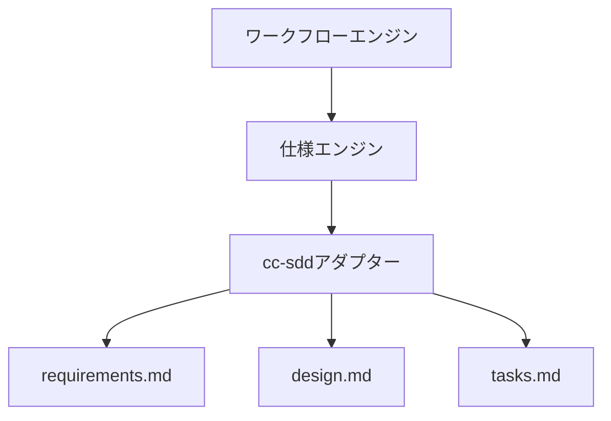

# 仕様駆動ワークフロー

## 概要

仕様駆動開発（SDD）はAutonomous Engineerの基盤となる方法論です。

コードから始めるのではなく、すべての機能は構造化された仕様アーティファクト（要件、設計、タスク）から始まり、実装が書かれる前に確立されます。

このアプローチはAIの推論品質を向上させ、ハルシネーションを削減し、構造化されたレビューループを可能にし、開発プロセスを決定論的で監査可能なものにします。

システムは当初、[cc-sdd](https://github.com/gotalab/cc-sdd)フレームワークを介してSDDを統合します。将来のバージョンでは、OpenSpecやSpecKitなど追加のSDDフレームワークのサポートも予定しています。各フレームワークの詳細は[SDDフレームワーク](../frameworks/)を参照してください。

---

## なぜ仕様駆動開発か

仕様のないAI生成コードは予測不可能です。

SDDなしの一般的な問題：

- スコープが不明確なため、過剰エンジニアリングや要件の見落としが発生する
- 設計フェーズがないため、不適切なアーキテクチャ決定が行われる
- AIがプロジェクトの慣習に反する仮定で曖昧さを補完する
- 比較対象となる仕様がないため、レビューが主観的になる

SDDはこれらの問題を、実装開始前に意図の構造化された、レビュー可能な記録を作成することで解決します。

---

## ワークフローフェーズ

ワークフローフェーズは、統合するSDDフレームワークによって異なります。各フレームワークは独自のフェーズ構造、コマンド、アーティファクト仕様を定義しており、統合前にそれらを丁寧にドキュメント化・設計する必要があります。

以下は、**cc-sdd** をベースSDDフレームワークとして使用する **orchestrator-ts** 実装のフェーズ例です。オーケストレーターはcc-sddのベースフェーズ構造を、人間の承認ゲートなしに自動実行されるLLM支援ステップで拡張しています。

<!--@include: ../../_partials/workflow-core-flow.md-->

1. spec-init *(llm slash command)*
2. 人間によるインタラクション *(ユーザー入力)*
3. 前提条件の検証 *(llm prompt)*
4. 要件定義 *(llm slash command)*
5. 要件の検証 *(llm prompt)*
6. 既存情報への振り返り *(llm prompt)*
7. ギャップ検証 *(llm slash command: オプション)*
8. **`/clear` slash command** — 設計フェーズ前にコンテキストをリセット
9. 設計 *(llm slash command)*
10. 設計の検証 *(llm slash command: オプション)*
11. 既存情報への振り返り *(llm prompt)*
12. **`/clear` slash command** — タスク生成前にコンテキストをリセット
13. タスク生成 *(llm slash command)*
14. タスクの検証 *(llm prompt)*
15. **`/clear` slash command** — 実装前にコンテキストをリセット
16. 実装ループ *(タスクグループごとに繰り返す)*：
    - spec-impl *(llm slash command)*
    - validate-impl *(llm prompt)*
    - コミット *(git command)*
    - **`/clear` slash command** — 次のタスクグループ前にコンテキストをリセット
17. プルリクエスト作成 *(git command)*

各フェーズは次のフェーズを導く構造化されたアーティファクトを生成します。`(llm prompt)` と注記されたステップは人間の承認ゲートなしにオーケストレーター内で自動実行されます。`(llm slash command: ...)` と注記されたステップはCLI経由で呼び出されます。`(user input ...)` と注記されたステップはユーザーによる手動入力が必要です。`optional` と注記されたステップはスキップ可能です。`CLEAR_CONTEXT` ステップはフェーズ境界でのトークン蓄積と推論品質の低下を防ぐために LLM のコンテキストウィンドウをリセットします。

> **フェーズ間の `/clear` は必須です。** 各フェーズで蓄積されたコンテキストをそのまま引き継ぐと、トークン消費が増大し推論品質が低下します。フェーズ境界で `/clear` を実行することで、現在のフェーズに必要な情報だけにコンテキストを絞り込みます。

> **注意**: 新しいSDDフレームワーク（例: OpenSpec、SpecKit）を統合する場合は、そのフェーズ構造、コマンド、アーティファクト形式を実装開始前に完全にドキュメント化する必要があります。

---

## フェーズ1: 仕様初期化

**コマンド**: `spec-init "description"`

仕様初期化フェーズは、新しい機能のための仕様ディレクトリと初期コンテキストを作成します。

入力：
- 機能または変更の短い説明

出力：
- `.kiro/specs/<feature-name>/` ディレクトリ
- メタデータ（名前、言語、作成日）を含む初期 `spec.json`

このフェーズはすべての後続フェーズのスコープ境界を確立します。

---

## フェーズ2: 要件定義

**コマンド**: `spec-requirements <feature>`

要件定義フェーズはシステムが何をしなければならないかを定義します。

入力：
- フェーズ1からの仕様説明
- ユーザーが提供する追加コンテキスト

出力：
- `requirements.md` — チェックボックス付きのEARSフォーマットの構造化要件
  - 機能要件（システムが何をしなければならないか）
  - 非機能要件（パフォーマンス、安全性、拡張性）
  - 明示的なスコープ外項目

要件はチェックボックスを使用して受け入れを追跡します：

```markdown
- [ ] システムは...すべきです
- [ ] Xが発生したとき、システムは...すべきです
```

設計に進む前に人間のレビューが必要です。

---

## 既存情報への振り返り (llm)

要件後と設計後に自動実行されるLLM支援の振り返りステップです。直前のフェーズを完了した同一LLMへのフォローアッププロンプトとして実装されます。

プロンプトパターン：

> 「前のタスクを完了するにあたって困難はありましたか？どのような情報があればより完了しやすかったですか？このフィードバックをもとに、関連するドキュメントを更新してください。」

LLMは直前のフェーズでの自身の経験を振り返り、不足または不明確と判断したエージェントリソースを直接更新します：

- ステアリングドキュメント（`.kiro/steering/`）
- ルール（`.kiro/settings/rules/`、`.claude/rules/`）
- カスタムスラッシュコマンド（`.claude/commands/`）
- スキルとテンプレート

このステップはワークフローをブロックせず、人間の承認ゲートも不要です。手動のキュレーションではなく実際のタスク経験に基づいてエージェントのドキュメントを継続的に改善するための仕組みです。

---

## ギャップ検証（オプション）

**コマンド**: `validate-gap <feature>`

要件が書かれた後に実行できるオプションの分析ステップで、機能が**既存のコードベース**に追加されるときに使用することを意図しています。

実行されるチェック：

- コードベースはすでに要件の一部を部分的に実装しているか？
- 組み込むべき既存のモジュール、パターン、または慣習があるか？
- 最初に解決する必要がある競合する実装があるか？

何がすでに存在し、何が本当に欠けているかを特定するギャップレポートを出力します。

このステップにより、エージェントが既存の機能を複製することが防止され、設計フェーズが現在のコードベースの状態の正確な把握から始まることが確保されます。

---

## フェーズ3: 設計

**コマンド**: `spec-design <feature>`

設計フェーズはシステムが要件をどのように実装するかを定義します。

入力：
- フェーズ2からの `requirements.md`
- 既存のアーキテクチャドキュメント
- リポジトリコンテキスト

出力：
- `design.md` — 以下を含む技術アーキテクチャ：
  - コンポーネント概要
  - データモデルと型定義
  - インターフェースコントラクト
  - システム構造とデータフローのMermaidダイアグラム
  - 既存コンポーネントとの統合ポイント

設計ダイアグラム例：



タスク生成に進む前に人間のレビューが必要です。

---

## フェーズ4: 設計検証（オプション）

**コマンド**: `validate-design <feature>`

タスク生成前に設計をチェックするオプションのレビューパスです。

実行されるチェック：

- 要件と設計の一貫性
- 既存システムとのアーキテクチャ整合性
- 提案されたインターフェースの実現可能性
- 設計における全要件のカバレッジ

合格/不合格状態と改善提案を含む検証レポートを出力します。

このフェーズは複雑な機能や設計が重要なシステム境界に触れる場合に推奨されます。

---

## フェーズ5: タスク生成

**コマンド**: `spec-tasks <feature>`

タスク生成フェーズは設計を実装タスクに分解します。

入力：
- フェーズ2からの `requirements.md`
- フェーズ3からの `design.md`

出力：
- `tasks.md` — 以下を含む順序付きの実装タスクリスト：
  - タスクIDとタイトル
  - 実装しなければならないことの説明
  - 他のタスクへの明示的な依存関係
  - 要件にリンクされた受け入れ基準

タスク構造例：

```markdown
## タスク1: ツールインターフェースの実装

**依存関係**: なし

`Tool<Input, Output>` インターフェースと `ToolContext` 型を実装します。
インターフェースは `name`, `description`, `schema`, `execute` を公開しなければなりません。

**受け入れ基準**:
- [ ] ツールインターフェースが正しいジェネリクスで定義されている
- [ ] ToolContextにworkspaceRoot、permissions、memory、loggerが含まれている
- [ ] ユニットテストがインターフェースコントラクトをカバーしている
```

実装が始まる前に人間のレビューが必要です。

---

## フェーズ6: 実装

**コマンド**: `spec-impl <feature> [task-ids]`

実装フェーズはエージェントループを使用して `tasks.md` のタスクを実行します。

### 外部ループ：タスクグループ単位

`tasks.md` のタスクは階層構造になっています。トップレベルのタスク（例：Task 1、Task 2）はそれぞれサブタスク（例：1.1、1.2、1.3）を持ちます。外部ループはトップレベルの**タスクグループ**ごとに1回反復します：

```text
各タスクグループ（Task 1、Task 2、...）について：

    SPEC_IMPL サブタスクバッチ   ← /kiro:spec-impl を1回以上呼び出す
        ↓
    VALIDATE_IMPL               ← llmプロンプト、タスクグループ全体をレビュー
        ↓
    COMMIT                      ← このタスクグループのgitコミット
        ↓
    CLEAR_CONTEXT               ← /clear で次のグループ前にコンテキストをリセット

    [次のタスクグループへ繰り返す]
        ↓ （全グループ完了後）

PULL_REQUEST
```

グループ内のサブタスクは、小さなコンテキストウィンドウに作業を分割する場合、複数の `spec-impl` 呼び出しにバッチ処理できます。例：

```text
# Task 1 の反復
/kiro:spec-impl spec1-orchestrator-core 1.1,1.2
task 1 の実装を検証（llmプロンプト）
変更をコミット
/clear

# Task 2 の反復
/kiro:spec-impl spec1-orchestrator-core 2.1
/kiro:spec-impl spec1-orchestrator-core 2.2,2.3
task 2 の実装を検証（llmプロンプト）
変更をコミット
/clear

# Task 3 の反復
/kiro:spec-impl spec1-orchestrator-core 3.1
/kiro:spec-impl spec1-orchestrator-core 3.2
task 3 の実装を検証（llmプロンプト）
変更をコミット
/clear
```

### 内部ループ：spec-impl 呼び出し単位

各 `spec-impl` 呼び出しの中で、エージェントは自動レビューサイクルを実行します：

```text
実装
    ↓
レビュー（自動）
    ↓
改善
    ↓
（通過するか再試行閾値に達するまで繰り返す）
```

レビューステップでは以下を確認します：
- タスク記述との整合性
- 設計ドキュメントとの一貫性
- 要件の充足
- コード品質（リント、命名、構造）

再試行閾値を超えた場合、自己修復ループが起動して失敗を分析しルールを更新します。

### タスクグループ間で CLEAR_CONTEXT を行う理由

各タスクグループはかなりのコンテキストを蓄積します。グループごとにクリアすることで、トークンの増加が後続グループの推論品質を低下させることを防ぎ、各グループの実装をそのサブタスクのみに集中させます。

### 実装後のオプション検証

**コマンド**: `validate-impl <feature>`

実装されたコードが `requirements.md` のすべての要件を満たしているかを確認します。

---

## フェーズ7: プルリクエスト

すべてのタスクが実装されコミットされた後、システムは自動的に以下を実行します：

1. フィーチャーブランチをリモートにプッシュ
2. 以下を含むプルリクエストを作成：
   - 仕様名から派生したタイトル
   - 要件と設計決定を要約した本文
   - 仕様ディレクトリへの参照

プルリクエストはマージ前の人間レビューゲートとして機能します。

---

## アーティファクトライフサイクル

```
spec-init       → spec.json
requirements    → requirements.md
design          → design.md
validate-design → validation-report.md（オプション）
tasks           → tasks.md
implementation  → ソースコード + コミット
pull-request    → GitHub PR
```

各アーティファクトは `.kiro/specs/<feature-name>/` に保存され、リポジトリ履歴の一部として残ります。

---

## 人間レビューゲート

ワークフローは3つの重要なポイントでレビューゲートを強制します。

| フェーズ | ゲート | 必要なアクション |
|---|---|---|
| 要件後 | 要件の承認 | `requirements.md` をレビュー、スコープを確認 |
| 設計後 | 設計の承認 | `design.md` をレビュー、アーキテクチャを確認 |
| タスク後 | タスクリストの承認 | `tasks.md` をレビュー、実装計画を確認 |

ゲートは信頼できる高速実行には `-y` でバイパスできますが、人間によるレビューがデフォルトで推奨されるパスです。

---

## 進捗確認: spec-status

**コマンド**: `spec-status <feature>`

ワークフローのどの時点でも実行できるユーティリティコマンドで、仕様の現在の状態を検査します。

出力：

- 現在のフェーズ（例: `DESIGN`, `IMPLEMENTATION`）
- どのアーティファクトが存在し、何が欠けているか
- 実装フェーズにある場合のタスク完了状態（pending / in_progress / completed）
- 全体の進捗パーセンテージ

このコマンドは中断後の作業再開、進行中の仕様の監査、またはプルリクエスト前に何が残っているかを理解するのに役立ちます。

出力例：

```
仕様: tool-system
フェーズ: IMPLEMENTATION
進捗: 7タスク中4完了（57%）

タスク：
  [✓] タスク1: ツールインターフェースの実装
  [✓] タスク2: ツールレジストリの実装
  [✓] タスク3: ツールエグゼキューターの実装
  [✓] タスク4: ファイルシステムツールの実装
  [ ] タスク5: シェルツールの実装
  [ ] タスク6: Gitツールの実装
  [ ] タスク7: 知識ツールの実装
```

---

## ワークフローコマンドリファレンス

| コマンド | フェーズ | 説明 |
|---|---|---|
| `spec-init "description"` | 初期化 | 新しい仕様ディレクトリを作成 |
| `spec-requirements <feature>` | 要件 | requirements.mdを生成 |
| `validate-gap <feature>` | オプション | 既存コードに対して要件をチェック |
| `spec-design <feature>` | 設計 | design.mdを生成 |
| `validate-design <feature>` | オプション | 設計品質を検証 |
| `spec-tasks <feature>` | タスク | tasks.mdを生成 |
| `spec-impl <feature>` | 実装 | 実装ループを実行 |
| `validate-impl <feature>` | オプション | 実装を要件に対して検証 |
| `spec-status <feature>` | いつでも | 現在のフェーズと進捗を表示 |

---

## エージェントとの統合

ワークフローは**ワークフローエンジン**（[architecture](../architecture/architecture.md)参照）によって駆動され、以下を実行します：

- フェーズ状態をステートマシンとして維持
- 各仕様フェーズでcc-sddアダプターを呼び出す
- 各フェーズ境界でLLMコンテキストをリセット
- タスク実行のための実装ループを調整

cc-sddアダプターはワークフローエンジンのコマンドをcc-sdd CLIコールに変換し、下流での使用のために結果のアーティファクトを解析します。

このシステムがどのように実装されるかの完全な仕様の詳細は[仕様計画](../../agent/dev-agent-v1-specs.md)を参照してください。
