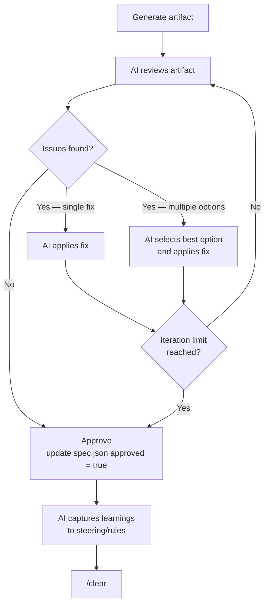
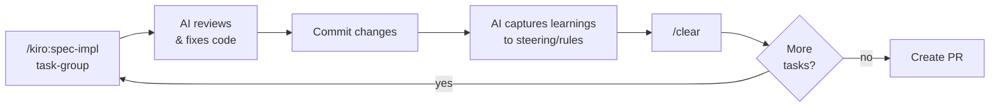

# Automation Workflow

## Overview

This document describes how the Autonomous Engineer system divides responsibilities between the User and the AI-driven automation. The goal is to eliminate routine development work — Users invest effort only at the start and end; the AI handles everything in between.

**User touchpoints**: initial context preparation + final PR review.

**AI-automated**: branch creation, spec generation, review loops, approvals, implementation, commits, and PR creation.

---

## Full Workflow Diagram

```mermaid
flowchart TD
    H1["👤 User: Organize prerequisite docs"] --> H2
    H2["👤 User: /kiro:spec-init + edit Project Description in requirements.md"] --> BRANCH_CHECK

    subgraph AUTO ["🤖 Automated"]
        BRANCH_CHECK{Feature branch\nalready exists?}
        BRANCH_CHECK -->|no| BRANCH_CREATE["Create feature branch\nfeature/spec-{spec-name}"]
        BRANCH_CHECK -->|yes| BRANCH_CONFIRM["Confirm: continue on\nexisting branch? [Y/n]"]
        BRANCH_CREATE --> REQ
        BRANCH_CONFIRM --> REQ

        subgraph SPEC_PHASE ["Spec Phase"]
            REQ["/kiro:spec-requirements"] --> REQ_LOOP
            subgraph REQ_LOOP ["Review Loop (max N iterations)"]
                REQ_R["AI reviews requirements.md"] --> REQ_F["AI fixes issues"]
                REQ_F --> REQ_R
            end
            REQ_LOOP --> REQ_OK["Approve: spec.json\nrequirements.approved = true"]
            REQ_OK --> REQ_KNOW["AI captures learnings\nto steering/rules"]
            REQ_KNOW --> REQ_CLR["/clear"]

            REQ_CLR --> VAL_GAP["/kiro:validate-gap\n(optional)"] --> DESIGN["/kiro:spec-design"] --> VAL_D["/kiro:validate-design"] --> DESIGN_LOOP
            subgraph DESIGN_LOOP ["Review Loop (max N iterations)"]
                DESIGN_R["AI reviews design.md"] --> DESIGN_F["AI fixes issues"]
                DESIGN_F --> DESIGN_R
            end
            DESIGN_LOOP --> DESIGN_OK["Approve: spec.json\ndesign.approved = true"]
            DESIGN_OK --> DESIGN_KNOW["AI captures learnings\nto steering/rules"]
            DESIGN_KNOW --> DESIGN_CLR["/clear"]

            DESIGN_CLR --> TASKS["/kiro:spec-tasks"] --> TASKS_LOOP
            subgraph TASKS_LOOP ["Review Loop (max N iterations)"]
                TASKS_R["AI reviews tasks.md"] --> TASKS_F["AI fixes issues"]
                TASKS_F --> TASKS_R
            end
            TASKS_LOOP --> TASKS_OK["Approve: spec.json\ntasks.approved = true"]
            TASKS_OK --> TASKS_KNOW["AI captures learnings\nto steering/rules"]
            TASKS_KNOW --> TASKS_CLR["/clear"]
        end

        TASKS_CLR --> COMMIT_SPEC["Commit spec artifacts"]
        COMMIT_SPEC --> COMMIT_CLR["/clear"]

        COMMIT_CLR --> IMPL_LOOP

        subgraph IMPL_LOOP ["Implementation Loop"]
            IMPL["/kiro:spec-impl {task-group}"] --> IMPL_R["AI reviews & fixes code"]
            IMPL_R --> IMPL_C["Commit"]
            IMPL_C --> IMPL_KNOW["AI captures learnings\nto steering/rules"]
            IMPL_KNOW --> IMPL_CLR["/clear"]
            IMPL_CLR --> IMPL_MORE{More tasks?}
            IMPL_MORE -->|yes| IMPL
        end

        IMPL_MORE -->|no| PR["Create Pull Request"]
    end

    PR --> H3["👤 User: Review PR"]
```



---

## User Responsibilities

### Before automation starts

| Step | Action |
| ---- | ------ |
| 1 | Organize prerequisite information in `docs/` |
| 2 | Run `/kiro:spec-init "description"` to create the spec directory |
| 3 | Edit the **Project Description (Input)** section in `requirements.md` with sufficient context for the AI |

The quality of the generated spec depends directly on how well step 3 is filled in. The AI cannot infer intent that isn't written down.

> **Future idea**: Add a pre-design validation step that checks whether `requirements.md` contains sufficient information before proceeding to `/kiro:spec-design`.

### After automation completes

| Step | Action                                              |
| ---- | --------------------------------------------------- |
| 4    | Review the pull request created by the automation   |

All intermediate phases (requirements, design, tasks, implementation) are approved by the AI without User intervention. The PR is the single User review gate.

---

## Branch Naming

Before any spec work begins, the automation creates a dedicated feature branch. The default pattern is:

```text
feature/spec-{spec-name}
```

The branch naming rule is configurable. The automation must:

1. Detect the current branch
2. Refuse to proceed if already on `main` or `master`
3. Check if the target feature branch already exists
4. If the branch exists, interactively confirm with the User before continuing on it
5. Otherwise create and check out the feature branch

---

## Review Loop Pattern

All three spec phases (requirements, design, tasks) use the same review-and-fix loop. Before `/clear`, the AI captures learnings to prevent knowledge loss across context resets:



**Key rules:**

- The AI always resolves to a concrete action — it never just reports problems without fixing them
- When multiple fix options exist, the AI selects the most appropriate one given the system architecture and technology
- The loop has a configurable maximum iteration count (suggested default: 2)
- After the loop, the AI writes `approved: true` to `spec.json` for the corresponding phase
- Before `/clear`, the AI captures accumulated learnings to persistent resources (see [Knowledge Capture](#knowledge-capture-before-context-reset))
- `/clear` is executed after each phase approval to prevent context from carrying over into the next phase

---

## Validate Gap (Optional)

After requirements are approved and before design begins, `/kiro:validate-gap` can be run to analyze the gap between the new feature requirements and the existing codebase:

- **Identifies reusable components** already present in the codebase
- **Detects missing functionality** that must be newly implemented
- **Maps integration points** where the new feature connects to existing modules
- **Flags areas requiring new implementation** so the design phase starts with full context

Typical position in the flow:

```text
spec-requirements → validate-gap (optional) → spec-design → spec-tasks → spec-impl
```

This step is most valuable when working in an existing codebase. It prevents the design from duplicating existing work or missing integration constraints that are only visible from the current code.

---

## Implementation Loop

After all spec artifacts are approved, committed, and context is cleared, the implementation loop begins. For each task group:



1. **`/kiro:spec-impl {task-group}`** — agent implements the specified tasks
2. **AI review & fix** — automated review against design doc and requirements; issues are fixed inline
3. **Commit** — changes are committed with a descriptive message
4. **Knowledge capture** — AI persists accumulated insights before context reset (see [Knowledge Capture](#knowledge-capture-before-context-reset))
5. **`/clear`** — context is cleared to prevent cross-task pollution
6. Repeat until all tasks are complete

---

## Task Batching: (P) Marker

Tasks in `tasks.md` marked with `(P)` are safe to batch into a single `spec-impl` call:

```text
/kiro:spec-impl tool-system 3.1,3.2,3.3
```

See [cc-sdd Parallel Task Analysis](../frameworks/cc-sdd#parallel-task-analysis) for the full rules on when a task qualifies for `(P)`.

---

## Knowledge Capture Before Context Reset

Before every `/clear`, the AI must persist any accumulated insights to prevent knowledge loss across context resets. This is a required step — not optional.

**What to capture:**

- Search queries or investigation paths that took multiple attempts to resolve
- Ambiguous requirements or design decisions where the reasoning matters for future phases
- Reusable patterns, conventions, or gotchas discovered during the phase
- Architectural tradeoffs that influenced implementation choices

**Where to write:**

| Resource | Path | Use for |
| -------- | ---- | ------- |
| Steering docs | `.kiro/steering/` | Project-specific patterns, tech stack insights, architectural decisions |
| Rules | `.claude/rules/` | Workflow rules, code conventions, recurring process fixes |
| Skills | `.claude/commands/` | Reusable prompt patterns that emerged during the phase |

**Key constraint**: only capture insights that are **generalizable across future phases or sessions** — not task-specific state that won't recur.

This mechanism ensures each new context window inherits the accumulated intelligence of all prior phases, counteracting the knowledge loss that `/clear` would otherwise cause.

---

## Approval Mechanism

Phase approvals are written to `spec.json` by the automation — no manual edits required:

```json
{
  "approvals": {
    "requirements": { "generated": true, "approved": true },
    "design":       { "generated": true, "approved": true },
    "tasks":        { "generated": true, "approved": true }
  },
  "ready_for_implementation": true
}
```

The `ready_for_implementation` flag is set to `true` once all three phases are approved, enabling the implementation loop to begin.
