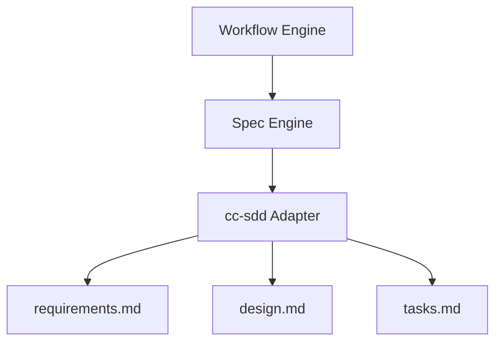

# Spec-Driven Workflow

## Overview

Spec-Driven Development (SDD) is the foundational methodology of Autonomous Engineer.

Rather than starting with code, every feature begins with structured specification artifacts — requirements, design, and tasks — before any implementation is written.

This approach improves AI reasoning quality, reduces hallucination, enables structured review loops, and makes the development process deterministic and auditable.

The system initially integrates SDD via the [cc-sdd](https://github.com/gotalab/cc-sdd) framework. Future versions plan to support additional SDD frameworks, including OpenSpec and SpecKit. See [SDD Frameworks](../frameworks/) for details on each supported framework.

---

## Why Spec-Driven Development

AI-generated code without a specification is unpredictable.

Common problems without SDD:

- unclear scope leads to over-engineering or missed requirements
- no design phase leads to poor architectural decisions
- AI fills ambiguity with assumptions that contradict project conventions
- review becomes subjective without a specification to compare against

SDD solves these problems by creating a structured, reviewable record of intent before implementation begins.

---

## Workflow Phases

The workflow phases depend on the SDD framework being integrated. Each framework defines its own phase structure, commands, and artifact conventions, which must be carefully documented before integration.

The example below shows the phases for the **orchestrator-ts** implementation using **cc-sdd** as the underlying SDD framework. The orchestrator extends the base cc-sdd phase structure with LLM-assisted steps that run automatically without human approval gates.

```
SPEC_INIT (llm slash command: `/kiro:spec-init <spec-name>`)
    ↓
HUMAN_INTERACTION (user input minimum requirements on `requirements.md` manually)
    ↓
VALIDATE_PREREQUISITES (llm prompt)
    ↓
SPEC_REQUIREMENTS (llm slash command: `/kiro:spec-requirements <spec-name>`)
    ↓
VALIDATE_REQUIREMENTS (llm prompt)
    ↓
REFLECT_ON_EXISTING_INFORMATION (llm prompt)
    ↓
VALIDATE_GAP (llm slash command: `/kiro:validate-gap <spec-name>` optional)
    ↓
CLEAR_CONTEXT (llm slash command: `/clear`)
    ↓
SPEC_DESIGN (llm slash command: `/kiro:spec-design -y <spec-name>`)
    ↓
VALIDATE_DESIGN (llm slash command: `/kiro:validate-design <spec-name>` optional)
    ↓
REFLECT_ON_EXISTING_INFORMATION (llm prompt)
    ↓
CLEAR_CONTEXT (llm slash command: `/clear`)
    ↓
SPEC_TASKS (TASK_GENERATION) (llm slash command: `/kiro:spec-tasks -y <spec-name>`)
    ↓
VALIDATE_TASK (llm prompt)
    ↓
CLEAR_CONTEXT (llm slash command: `/clear`)
    ↓
IMPLEMENTATION (llm slash command: `/kiro:spec-impl <spec-name> [task-ids]`)
    ↓
CLEAR_CONTEXT (llm slash command: `/clear`)
    ↓
PULL_REQUEST (git command)
```

1. spec-init *(llm slash command)*
2. human interaction *(user input)*
3. validate prerequisites met *(llm prompt)*
4. requirements *(llm slash command)*
5. validate-requirements *(llm prompt)*
6. reflect on existing information *(llm prompt)*
7. validate-gap *(llm slash command: optional)*
8. **`/clear` slash command** — reset context before design
9. design *(llm slash command)*
10. validate-design *(llm slash command: optional)*
11. reflect on existing information *(llm prompt)*
12. **`/clear` slash command** — reset context before task generation
13. tasks *(llm slash command)*
14. validate-tasks *(llm prompt)*
15. **`/clear` slash command** — reset context before implementation
16. implementation *(llm slash command)*
17. **`/clear` slash command** — reset context before pull request
18. create PR *(git command)*

Each phase produces structured artifacts that guide the next phase. Steps annotated with `(llm prompt)` run automatically within the orchestrator without human approval gates. Steps annotated with `(llm slash command: ...)` are invoked via CLI. Steps annotated with `(user input ...)` require manual input from the user. Steps marked `optional` may be skipped. `CLEAR_CONTEXT` steps reset the LLM context window to prevent token accumulation and reasoning degradation across phase boundaries.

> **`/clear` is required between phases.** Each phase accumulates significant context. Without clearing, token usage grows across phases and degrades reasoning quality. Running `/clear` at each phase boundary keeps the context focused on only what is needed for the current phase.

> **Note**: When integrating a new SDD framework (e.g., OpenSpec, SpecKit), its phase structure, commands, and artifact formats must be fully documented before implementation begins.

---

## Phase 1: Spec Init

**Command**: `spec-init "description"`

The spec-init phase creates the specification directory and initial context for a new feature.

Inputs:
- a short description of the feature or change

Outputs:
- `.kiro/specs/<feature-name>/` directory
- initial `spec.json` with metadata (name, language, created date)

This phase establishes the scope boundary for all subsequent phases.

---

## Phase 2: Requirements

**Command**: `spec-requirements <feature>`

The requirements phase defines what the system must do.

Inputs:
- spec description from phase 1
- any additional context provided by the user

Outputs:
- `requirements.md` — structured requirements in EARS format with checkboxes
  - Functional requirements (what the system must do)
  - Non-functional requirements (performance, safety, extensibility)
  - Explicit out-of-scope items

Requirements use checkboxes to track acceptance:

```markdown
- [ ] The system shall...
- [ ] When X occurs, the system shall...
```

Human review is required before proceeding to design.

---

## Reflect on Existing Information (llm)

An LLM-assisted reflection step that runs automatically after requirements and again after design. It is implemented as a follow-up prompt to the same LLM that just completed the phase.

The prompt pattern is:

> "Did you experience any difficulty completing the previous task? What information would have made it easier to complete? Please update the relevant documentation based on this feedback."

The LLM reflects on its own experience of the just-completed phase and directly updates any agent resources it identifies as insufficient or missing:

- steering documents (`.kiro/steering/`)
- rules (`.kiro/settings/rules/`, `.claude/rules/`)
- custom slash commands (`.claude/commands/`)
- skills and templates

This step does not block the workflow and requires no human approval gate. It is an incremental improvement mechanism — the agent's documentation evolves based on real task experience rather than manual curation.

---

## Validate Gap (optional)

**Command**: `validate-gap <feature>`

An optional analysis step that can be run after requirements are written, intended for use when the feature is being added to an **existing codebase**.

Checks performed:

- does the codebase already partially implement any of the requirements?
- are there existing modules, patterns, or conventions that should be incorporated?
- are there conflicting implementations that need to be resolved first?

Outputs a gap report identifying what is already present and what is genuinely missing.

This step prevents the agent from duplicating existing functionality and ensures the design phase starts with an accurate picture of the current codebase state.

---

## Phase 3: Design

**Command**: `spec-design <feature>`

The design phase defines how the system will implement the requirements.

Inputs:
- `requirements.md` from phase 2
- existing architecture documents
- repository context

Outputs:
- `design.md` — technical architecture with:
  - Component overview
  - Data models and type definitions
  - Interface contracts
  - Mermaid diagrams for system structure and data flow
  - Integration points with existing components

Example design diagram:



Human review is required before proceeding to task generation.

---

## Phase 4: Validate Design (optional)

**Command**: `validate-design <feature>`

An optional review pass that checks the design before task generation.

Checks performed:

- consistency between requirements and design
- architectural alignment with existing system
- feasibility of proposed interfaces
- coverage of all requirements in the design

Outputs a validation report with pass/fail status and improvement suggestions.

This phase is recommended for complex features or when the design touches critical system boundaries.

---

## Phase 5: Task Generation

**Command**: `spec-tasks <feature>`

The task generation phase decomposes the design into implementation tasks.

Inputs:
- `requirements.md` from phase 2
- `design.md` from phase 3

Outputs:
- `tasks.md` — ordered list of implementation tasks with:
  - Task ID and title
  - Description of what must be implemented
  - Explicit dependencies on other tasks
  - Acceptance criteria linked back to requirements

Example task structure:

```markdown
## Task 1: Implement Tool Interface

**Dependencies**: none

Implement the `Tool<Input, Output>` interface and `ToolContext` type.
The interface must expose `name`, `description`, `schema`, and `execute`.

**Acceptance criteria**:
- [ ] Tool interface is defined with correct generics
- [ ] ToolContext includes workspaceRoot, permissions, memory, logger
- [ ] Unit tests cover interface contract
```

Human review is required before implementation begins.

---

## Phase 6: Implementation

**Command**: `spec-impl <feature> [task-ids]`

The implementation phase executes the tasks from `tasks.md` using the agent loop.

For each task section, the agent runs an iterative cycle:

```
Implement
    ↓
Review (automated)
    ↓
Improve
    ↓
Commit
```

The review step checks:
- alignment with the task description
- consistency with the design document
- requirement satisfaction
- code quality (linting, naming, structure)

The cycle repeats until the output passes the review gate or the retry threshold is reached.

If the threshold is exceeded, the self-healing loop activates to analyze the failure and update rules.

Optional validation after implementation:

**Command**: `validate-impl <feature>`

Checks that the implemented code satisfies all requirements from `requirements.md`.

---

## Phase 7: Pull Request

After all tasks are implemented and committed, the system automatically:

1. Pushes the feature branch to the remote
2. Creates a pull request with:
   - Title derived from the spec name
   - Body summarizing requirements and design decisions
   - Reference to the spec directory

The pull request serves as the human review gate before merging.

---

## Artifact Lifecycle

```
spec-init       → spec.json
requirements    → requirements.md
design          → design.md
validate-design → validation-report.md (optional)
tasks           → tasks.md
implementation  → source code + commits
pull-request    → GitHub PR
```

Each artifact is stored under `.kiro/specs/<feature-name>/` and remains part of the repository history.

---

## Human Review Gates

The workflow enforces review gates at three critical points.

| Phase | Gate | Action required |
|---|---|---|
| After Requirements | Approve requirements | Review `requirements.md`, confirm scope |
| After Design | Approve design | Review `design.md`, confirm architecture |
| After Tasks | Approve task list | Review `tasks.md`, confirm implementation plan |

Gates can be bypassed with `-y` for trusted fast-track executions, but human review is the default and recommended path.

---

## Checking Progress: spec-status

**Command**: `spec-status <feature>`

A utility command that can be run at any point in the workflow to inspect the current state of a specification.

Outputs:

- current phase (e.g., `DESIGN`, `IMPLEMENTATION`)
- which artifacts exist and which are missing
- task completion status (pending / in_progress / completed) when in the implementation phase
- overall percentage progress

This command is useful for resuming work after an interruption, auditing a spec mid-flight, or understanding what remains before a pull request.

Example output:

```
Spec: tool-system
Phase: IMPLEMENTATION
Progress: 4 / 7 tasks completed (57%)

Tasks:
  [✓] Task 1: Implement Tool Interface
  [✓] Task 2: Implement Tool Registry
  [✓] Task 3: Implement Tool Executor
  [✓] Task 4: Implement Filesystem Tools
  [ ] Task 5: Implement Shell Tools
  [ ] Task 6: Implement Git Tools
  [ ] Task 7: Implement Knowledge Tools
```

---

## Workflow Commands Reference

| Command | Phase | Description |
|---|---|---|
| `spec-init "description"` | Init | Create new spec directory |
| `spec-requirements <feature>` | Requirements | Generate requirements.md |
| `validate-gap <feature>` | Optional | Check requirements against existing code |
| `spec-design <feature>` | Design | Generate design.md |
| `validate-design <feature>` | Optional | Validate design quality |
| `spec-tasks <feature>` | Tasks | Generate tasks.md |
| `spec-impl <feature>` | Implementation | Execute implementation loop |
| `validate-impl <feature>` | Optional | Validate implementation against requirements |
| `spec-status <feature>` | Any | Show current phase and progress |

---

## Integration with the Agent

The workflow is driven by the **Workflow Engine** (see [architecture](../architecture/architecture.md)), which:

- maintains phase state as a state machine
- invokes the cc-sdd adapter at each spec phase
- resets LLM context at each phase boundary
- coordinates the implementation loop for task execution

The cc-sdd adapter translates workflow engine commands into cc-sdd CLI calls and parses the resulting artifacts for downstream use.

For the complete spec breakdown of how this system is implemented, see [Spec Plan](../agent/dev-agent-v1-specs.md).
