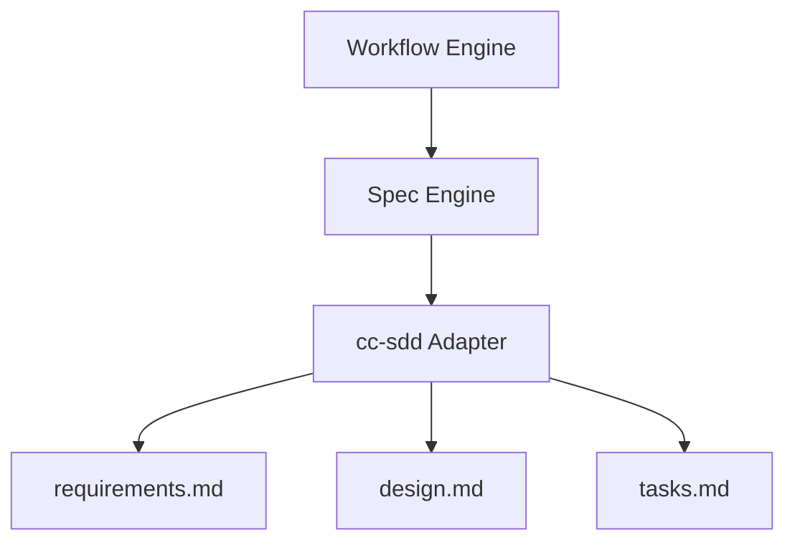

# Spec-Driven Workflow

## Overview

Spec-Driven Development (SDD) is the foundational methodology of Autonomous Engineer.

Rather than starting with code, every feature begins with structured specification artifacts — requirements, design, and tasks — before any implementation is written.

This approach improves AI reasoning quality, reduces hallucination, enables structured review loops, and makes the development process deterministic and auditable.

The system integrates SDD via the [cc-sdd](https://github.com/gotalab/cc-sdd) framework.

---

## Why Spec-Driven Development

AI-generated code without a specification is unpredictable.

Common problems without SDD:

- unclear scope leads to over-engineering or missed requirements
- no design phase leads to poor architectural decisions
- AI fills ambiguity with assumptions that contradict project conventions
- review becomes subjective without a specification to compare against

SDD solves these problems by creating a structured, reviewable record of intent before implementation begins.

---

## Workflow Phases

The spec-driven workflow follows seven sequential phases.

```
SPEC_INIT
    ↓
REQUIREMENTS
    ↓
DESIGN
    ↓
VALIDATE_DESIGN
    ↓
TASK_GENERATION
    ↓
IMPLEMENTATION
    ↓
PULL_REQUEST
```

Each phase produces structured artifacts that guide the next phase.

---

## Phase 1: Spec Init

**Command**: `spec-init "description"`

The spec-init phase creates the specification directory and initial context for a new feature.

Inputs:
- a short description of the feature or change

Outputs:
- `.kiro/specs/<feature-name>/` directory
- initial `spec.json` with metadata (name, language, created date)

This phase establishes the scope boundary for all subsequent phases.

---

## Phase 2: Requirements

**Command**: `spec-requirements <feature>`

The requirements phase defines what the system must do.

Inputs:
- spec description from phase 1
- any additional context provided by the user

Outputs:
- `requirements.md` — structured requirements in EARS format with checkboxes
  - Functional requirements (what the system must do)
  - Non-functional requirements (performance, safety, extensibility)
  - Explicit out-of-scope items

Requirements use checkboxes to track acceptance:

```markdown
- [ ] The system shall...
- [ ] When X occurs, the system shall...
```

Human review is required before proceeding to design.

---

## Phase 3: Design

**Command**: `spec-design <feature>`

The design phase defines how the system will implement the requirements.

Inputs:
- `requirements.md` from phase 2
- existing architecture documents
- repository context

Outputs:
- `design.md` — technical architecture with:
  - Component overview
  - Data models and type definitions
  - Interface contracts
  - Mermaid diagrams for system structure and data flow
  - Integration points with existing components

Example design diagram:



Human review is required before proceeding to task generation.

---

## Phase 4: Validate Design (optional)

**Command**: `validate-design <feature>`

An optional review pass that checks the design before task generation.

Checks performed:

- consistency between requirements and design
- architectural alignment with existing system
- feasibility of proposed interfaces
- coverage of all requirements in the design

Outputs a validation report with pass/fail status and improvement suggestions.

This phase is recommended for complex features or when the design touches critical system boundaries.

---

## Phase 5: Task Generation

**Command**: `spec-tasks <feature>`

The task generation phase decomposes the design into implementation tasks.

Inputs:
- `requirements.md` from phase 2
- `design.md` from phase 3

Outputs:
- `tasks.md` — ordered list of implementation tasks with:
  - Task ID and title
  - Description of what must be implemented
  - Explicit dependencies on other tasks
  - Acceptance criteria linked back to requirements

Example task structure:

```markdown
## Task 1: Implement Tool Interface

**Dependencies**: none

Implement the `Tool<Input, Output>` interface and `ToolContext` type.
The interface must expose `name`, `description`, `schema`, and `execute`.

**Acceptance criteria**:
- [ ] Tool interface is defined with correct generics
- [ ] ToolContext includes workspaceRoot, permissions, memory, logger
- [ ] Unit tests cover interface contract
```

Human review is required before implementation begins.

---

## Phase 6: Implementation

**Command**: `spec-impl <feature> [task-ids]`

The implementation phase executes the tasks from `tasks.md` using the agent loop.

For each task section, the agent runs an iterative cycle:

```
Implement
    ↓
Review (automated)
    ↓
Improve
    ↓
Commit
```

The review step checks:
- alignment with the task description
- consistency with the design document
- requirement satisfaction
- code quality (linting, naming, structure)

The cycle repeats until the output passes the review gate or the retry threshold is reached.

If the threshold is exceeded, the self-healing loop activates to analyze the failure and update rules.

Optional validation after implementation:

**Command**: `validate-impl <feature>`

Checks that the implemented code satisfies all requirements from `requirements.md`.

---

## Phase 7: Pull Request

After all tasks are implemented and committed, the system automatically:

1. Pushes the feature branch to the remote
2. Creates a pull request with:
   - Title derived from the spec name
   - Body summarizing requirements and design decisions
   - Reference to the spec directory

The pull request serves as the human review gate before merging.

---

## Artifact Lifecycle

```
spec-init       → spec.json
requirements    → requirements.md
design          → design.md
validate-design → validation-report.md (optional)
tasks           → tasks.md
implementation  → source code + commits
pull-request    → GitHub PR
```

Each artifact is stored under `.kiro/specs/<feature-name>/` and remains part of the repository history.

---

## Human Review Gates

The workflow enforces review gates at three critical points.

| Phase | Gate | Action required |
|---|---|---|
| After Requirements | Approve requirements | Review `requirements.md`, confirm scope |
| After Design | Approve design | Review `design.md`, confirm architecture |
| After Tasks | Approve task list | Review `tasks.md`, confirm implementation plan |

Gates can be bypassed with `-y` for trusted fast-track executions, but human review is the default and recommended path.

---

## Workflow Commands Reference

| Command | Phase | Description |
|---|---|---|
| `spec-init "description"` | Init | Create new spec directory |
| `spec-requirements <feature>` | Requirements | Generate requirements.md |
| `validate-gap <feature>` | Optional | Check requirements against existing code |
| `spec-design <feature>` | Design | Generate design.md |
| `validate-design <feature>` | Optional | Validate design quality |
| `spec-tasks <feature>` | Tasks | Generate tasks.md |
| `spec-impl <feature>` | Implementation | Execute implementation loop |
| `validate-impl <feature>` | Optional | Validate implementation against requirements |
| `spec-status <feature>` | Any | Show current phase and progress |

---

## Integration with the Agent

The workflow is driven by the **Workflow Engine** (see [architecture](../architecture/architecture.md)), which:

- maintains phase state as a state machine
- invokes the cc-sdd adapter at each spec phase
- resets LLM context at each phase boundary
- coordinates the implementation loop for task execution

The cc-sdd adapter translates workflow engine commands into cc-sdd CLI calls and parses the resulting artifacts for downstream use.

For the complete spec breakdown of how this system is implemented, see [Spec Plan](../specs.md).
